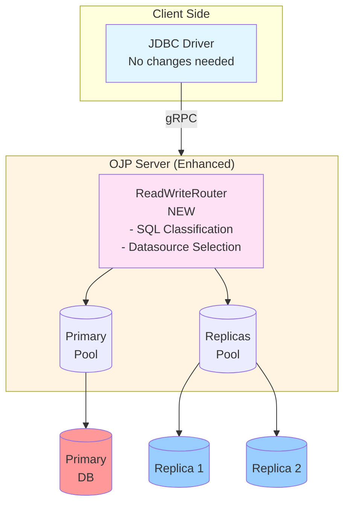

# Read/Write Splitting Analysis - Summary

## 📋 Analysis Complete

This document provides a complete analysis of how to implement read/write traffic splitting in Open J Proxy (OJP). **No code changes have been made** - this is purely an analysis and design phase.

## 📦 Deliverables

### 1. Main Analysis Document (36KB, 1,124 lines)
**File**: `documents/designs/READ_WRITE_SPLITTING_ANALYSIS.md`

Comprehensive analysis covering:
- Current OJP architecture and connection management
- 4 implementation approaches with detailed pros/cons analysis
- Recommended approach: SQL Parsing and Automatic Routing
- Complete technical design with code examples
- Component specifications (ReadWriteRouter, SqlClassifier, ReplicaSelector)
- Implementation challenges and mitigation strategies
- 8-10 week migration strategy with 5 phases
- Future enhancements roadmap

### 2. Sequence Diagrams (27KB, 310 lines)
**File**: `documents/designs/read-write-splitting-sequence-diagram.md`

Visual documentation of runtime behavior:
- Simple read query routing to replica
- Write query routing with sticky session
- Transaction pinning to primary
- Replica failover scenarios
- SELECT FOR UPDATE detection
- Router decision flow diagram

### 3. Configuration Templates (18KB, 440 lines)
**File**: `documents/designs/read-write-splitting-configuration-templates.md`

Ready-to-use configuration examples:
- 6 complete templates for different database setups
- PostgreSQL, MySQL, Oracle, SQL Server examples
- Environment-specific configurations (dev/staging/prod)
- Complete property reference
- Best practices and migration checklist
- Troubleshooting guide

### 4. Documentation Index (9.4KB, 288 lines)
**File**: `documents/designs/READ_WRITE_SPLITTING_README.md`

Central navigation and quick reference:
- Documentation structure overview
- Quick start guides for different roles
- Implementation status tracker
- Key design decisions summary
- Architecture comparison table
- Phase-by-phase implementation plan

## 🎯 Key Findings

### Recommended Solution
**SQL Parsing and Automatic Routing** - This approach provides the best balance of:
- ✅ Transparency (no application changes)
- ✅ Functionality (automatic read/write detection)
- ✅ Performance (minimal overhead)
- ✅ Safety (conservative fallback to primary)
- ✅ Backward compatibility (opt-in feature)

### Architecture Fit
OJP's existing architecture is **well-suited** for this feature:
- Multi-datasource support already exists
- Pluggable connection pool SPI
- Session management infrastructure
- Circuit breaker patterns in place

### Implementation Complexity
**Moderate complexity** - Main challenges:
1. SQL classification across database dialects
2. Transaction boundary detection
3. Connection identity management
4. Replication lag handling (future)

**Estimated effort**: 8-10 weeks for complete implementation

## 🏗️ Architecture Overview



## 📊 Implementation Breakdown

### Phase 1: Foundation ✅ COMPLETE (1 week)
- ✅ Architecture analysis
- ✅ Design documentation
- ✅ Configuration schema
- ✅ Sequence diagrams

### Phase 2: Core Implementation ⏳ NOT STARTED (2-3 weeks)
- SqlClassifier with regex patterns
- ReadWriteRouter with datasource selection
- ReplicaSelector (round-robin)
- ReadWriteDataSourceRegistry
- Unit tests

### Phase 3: Integration ⏳ NOT STARTED (2 weeks)
- ConnectAction modifications
- StatementServiceImpl integration
- Transaction detection
- Configuration parsing
- Integration tests

### Phase 4: Configuration ⏳ NOT STARTED (1 week)
- Property validation
- Error handling
- User documentation
- Migration guide

### Phase 5: Advanced Features ⏳ NOT STARTED (2-3 weeks)
- Hint-based overrides
- Health monitoring
- Metrics
- Additional selection strategies

## 💡 Key Design Components

### 1. SqlClassifier
```java
public interface SqlClassifier {
    SqlType classify(String sql);
}

enum SqlType { READ, WRITE, UNKNOWN }
```
- Regex-based pattern matching
- Detects SELECT, INSERT, UPDATE, DELETE, DDL
- Handles SELECT FOR UPDATE
- Unknown queries → route to primary (safe)

### 2. ReadWriteRouter
```java
public interface ReadWriteRouter {
    DataSource selectDataSource(
        SessionContext session,
        String sql,
        DataSource primary,
        List<DataSource> replicas
    );
}
```
- Transaction awareness (in transaction → primary)
- Sticky session support (after write → primary for N seconds)
- SQL classification
- Replica selection with failover

### 3. ReplicaSelector
```java
public interface ReplicaSelector {
    DataSource selectReplica(List<DataSource> replicas);
}
```
- Round-robin strategy (default)
- Random strategy
- Least-connections (future)

### 4. SessionContext Enhancement
```java
public class SessionContext {
    boolean isInTransaction();
    void beginTransaction();
    void endTransaction();
    void markWriteOccurred();
    boolean isInStickySession();
}
```
- Track transaction state
- Track last write timestamp
- Configurable sticky session duration

## 📝 Configuration Example

### Simple Setup
```properties
# Primary
primary.ojp.readwrite.enabled=true
primary.ojp.readwrite.role=primary
primary.ojp.connection.pool.maximumPoolSize=50

# Replica 1
replica1.ojp.readwrite.role=replica
replica1.ojp.readwrite.primary=primary
replica1.ojp.connection.url=jdbc:postgresql://replica1.example.com/db
replica1.ojp.connection.pool.maximumPoolSize=30

# Replica 2
replica2.ojp.readwrite.role=replica
replica2.ojp.readwrite.primary=primary
replica2.ojp.connection.url=jdbc:postgresql://replica2.example.com/db
replica2.ojp.connection.pool.maximumPoolSize=30
```

### Application Code (Unchanged!)
```java
String url = "jdbc:ojp[localhost:1059(primary)]_postgresql://primary.example.com/db";
Connection conn = DriverManager.getConnection(url, "user", "pass");

// Automatically routed to replica
stmt.executeQuery("SELECT * FROM users");

// Automatically routed to primary
stmt.executeUpdate("UPDATE users SET ...");
```

## 🎓 Key Behaviors

### Transaction Handling
- `setAutoCommit(false)` → marks auto-commit disabled
- First SQL after `setAutoCommit(false)` → starts transaction, all queries use primary
- `BEGIN` / `START TRANSACTION` → pin to primary
- `COMMIT` / `ROLLBACK` → release pin
- **Important**: Transactions start **lazily** on first SQL execution (standard JDBC behavior)

### Sticky Session (Read-Your-Writes)
- Write occurs → mark timestamp
- Next read within N seconds → use primary
- After N seconds → resume replica routing
- Configurable: `primary.ojp.readwrite.stickySessionSeconds=5`

### Failover
- Replica unavailable → try next replica in rotation
- All replicas unavailable → fallback to primary as last resort
- Circuit breaker prevents repeated failures
- Health checks via HikariCP

### SQL Classification
- `SELECT` → READ (route to replica)
- `SELECT FOR UPDATE` → WRITE (route to primary)
- `INSERT|UPDATE|DELETE|CREATE|ALTER|DROP` → WRITE
- Unknown/uncertain → WRITE (safe default)

## 🔍 Edge Cases Handled

1. **Multi-statement queries**: Route to primary (conservative)
2. **Stored procedures**: Route to primary (may contain writes)
3. **Database-specific syntax**: Extensible classification rules
4. **Connection-scoped state**: Document limitations
5. **Replication lag**: Sticky session provides read-your-writes

## 📈 Expected Benefits

### Performance
- **Read distribution**: Spread read load across replicas
- **Primary offloading**: Reduce load on primary database
- **Horizontal scaling**: Add replicas without increasing primary load

### Operational
- **Resource optimization**: Different pool sizes for read vs write
- **Cost reduction**: Smaller primary, larger replica capacity
- **Better isolation**: Isolate read-heavy workloads

### Scalability
- **Elastic reads**: Scale read capacity independently
- **Write protection**: Primary handles only writes + critical reads
- **Graceful degradation**: Failover to primary if replicas down

## ⚠️ Limitations and Considerations

1. **Replication Lag**: Reads may see stale data (mitigated by sticky session)
2. **Connection Identity**: Different connections for read vs write
3. **SQL Parsing Overhead**: Minimal (mitigated by caching)
4. **Configuration Complexity**: Multiple datasources to manage
5. **Monitoring Required**: Track replica health and lag

## 🚀 Next Steps

### Immediate
1. **Review** this analysis with stakeholders
2. **Approve** the recommended approach
3. **Prioritize** implementation phases

### Short Term (Phase 2)
1. Implement core routing components
2. Create comprehensive test suite
3. Validate SQL classification accuracy

### Medium Term (Phases 3-4)
1. Integrate with OJP server
2. Add configuration parsing
3. Write user documentation

### Long Term (Phase 5)
1. Add advanced features
2. Implement monitoring
3. Optimize performance

## 📚 Documentation Files

All documentation is located in `documents/designs/`:

1. **READ_WRITE_SPLITTING_README.md** - Start here (documentation index)
2. **READ_WRITE_SPLITTING_ANALYSIS.md** - Complete technical analysis
3. **read-write-splitting-sequence-diagram.md** - Visual diagrams
4. **read-write-splitting-configuration-templates.md** - Configuration examples

## ✅ Analysis Checklist

- [x] Current architecture documented
- [x] Implementation approaches evaluated
- [x] Recommended approach selected with rationale
- [x] Technical design specified with code examples
- [x] Component interfaces defined
- [x] Integration points identified
- [x] Configuration schema designed
- [x] Edge cases and challenges documented
- [x] Migration strategy with timeline
- [x] Sequence diagrams created
- [x] Configuration templates provided
- [x] Best practices documented
- [x] Troubleshooting guide included
- [x] Future enhancements outlined

## 🎯 Success Criteria

The implementation will be successful when:

1. **Transparency**: Applications work without code changes
2. **Correctness**: Writes always go to primary, reads distribute to replicas
3. **Consistency**: Transactions use single datasource, sticky session works
4. **Performance**: No significant latency overhead
5. **Reliability**: Automatic failover to primary when replicas down
6. **Backward Compatibility**: Existing configurations continue to work
7. **Documentation**: Clear examples for all major databases
8. **Testing**: Comprehensive test coverage for routing logic

## 📞 Contact

For questions about this analysis:
- Review the detailed documentation in the files listed above
- Open a GitHub issue with the `enhancement` label
- Tag `@rrobetti` or `@petruki` for architecture questions

---

**Analysis Status**: ✅ Complete  
**Implementation Status**: ⏳ Pending Approval  
**Estimated Timeline**: 8-10 weeks from Phase 2 start  
**Documentation Size**: 2,162 lines across 4 files

---

This analysis provides a solid foundation for implementing read/write splitting in OJP. The design is architecturally sound, backward compatible, and leverages OJP's existing infrastructure. Ready for stakeholder review and implementation prioritization.
