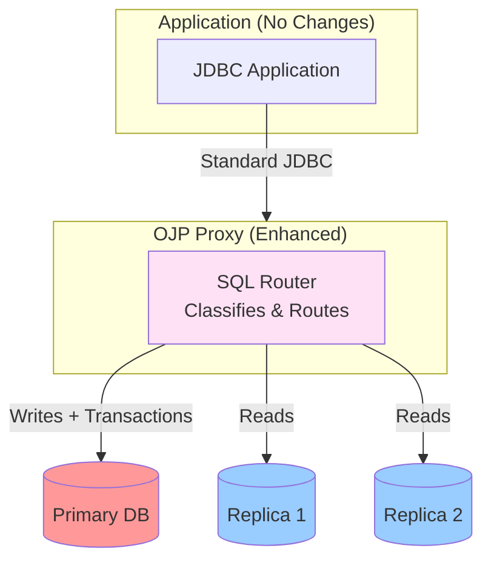

# Read/Write Traffic Splitting in OJP - Executive Summary

> **Status**: ✅ Analysis Complete | ⏳ Implementation Pending  
> **Last Updated**: April 2026

## What is Read/Write Splitting?

Read/write splitting is a database architecture pattern that routes:
- **Write operations** (INSERT, UPDATE, DELETE) → Primary database
- **Read operations** (SELECT) → Read replicas

This improves scalability, performance, and resource utilization by distributing read load across multiple database servers.

## Why Implement in OJP?

Open J Proxy is uniquely positioned to provide **transparent read/write splitting**:

✅ **No Application Changes Required** - Applications use standard JDBC, unaware of routing  
✅ **Centralized Management** - One place to configure all database routing  
✅ **Automatic Routing** - SQL classification happens at the proxy layer  
✅ **Backward Compatible** - Existing single-database deployments unchanged  
✅ **Leverages Existing Architecture** - Builds on OJP's multi-datasource infrastructure

## High-Level Architecture



## Key Benefits

| Benefit | Description |
|---------|-------------|
| **Scalability** | Distribute read load across multiple replicas |
| **Performance** | Offload reads from primary, reducing contention |
| **High Availability** | Automatic failover to primary if replicas fail |
| **Transparent** | Zero application code changes required |
| **Flexible** | Configure per environment (dev uses single DB, prod uses replicas) |

## How It Works

1. **Application sends SQL** → OJP proxy via standard JDBC
2. **OJP classifies SQL** → Read (SELECT) or Write (INSERT/UPDATE/DELETE)
3. **OJP routes request**:
   - Reads → Round-robin across healthy replicas
   - Writes → Always to primary
   - Transactions → All operations to primary
4. **Automatic failover** → If replica fails, try next replica or fallback to primary
5. **Consistency guarantees** → Optional "sticky session" keeps reads on primary after writes

## Implementation Status

### ✅ Phase 1: Analysis & Design (COMPLETE)

**Deliverables:**
- [Technical Analysis Document](documents/designs/READ_WRITE_SPLITTING_ANALYSIS.md) - Complete architecture and implementation plan
- [Sequence Diagrams](documents/designs/read-write-splitting-sequence-diagram.md) - Runtime behavior visualization
- [Configuration Templates](documents/designs/read-write-splitting-configuration-templates.md) - Ready-to-use examples

### ⏳ Phase 2-5: Implementation (PENDING)

**Phases organized into Copilot-sized sessions:**
- **Phase 2**: Core Components (3 sessions, 2-3 weeks)
- **Phase 3**: Integration (3 sessions, 2 weeks)
- **Phase 4**: Testing & Documentation (2 sessions, 1 week)
- **Phase 5**: Advanced Features (3 sessions, 2-3 weeks) - Optional

**Total Timeline**: 8-10 weeks

See [detailed implementation plan](documents/designs/READ_WRITE_SPLITTING_ANALYSIS.md#migration-strategy) for session-by-session breakdown.

## Example Configuration

### Development (Single Database)
```properties
# No read/write splitting in dev
primary.ojp.connection.pool.maximumPoolSize=10
primary.ojp.readwrite.enabled=false
```

### Production (Primary + 2 Replicas)
```properties
# Enable read/write splitting
primary.ojp.connection.pool.maximumPoolSize=100
primary.ojp.readwrite.enabled=true
primary.ojp.readwrite.stickySessionSeconds=5

# Replica 1
replica1.ojp.readwrite.role=replica
replica1.ojp.readwrite.primary=primary
replica1.ojp.connection.url=jdbc:postgresql://replica1.prod.example.com/db

# Replica 2
replica2.ojp.readwrite.role=replica
replica2.ojp.readwrite.primary=primary
replica2.ojp.connection.url=jdbc:postgresql://replica2.prod.example.com/db
```

See [configuration templates](documents/designs/read-write-splitting-configuration-templates.md) for more examples.

## Example Usage (No Code Changes!)

```java
// Existing application code works unchanged
Connection conn = DriverManager.getConnection(
    "jdbc:ojp[localhost:1059(primary)]_postgresql://primary.example.com/db",
    "user", "password"
);

// SELECT automatically routes to replica
ResultSet rs = stmt.executeQuery("SELECT * FROM users");

// UPDATE automatically routes to primary
stmt.executeUpdate("UPDATE users SET email = 'new@example.com'");

// Transactions automatically pin to primary
conn.setAutoCommit(false);
stmt.executeQuery("SELECT * FROM accounts FOR UPDATE");  // → Primary
stmt.executeUpdate("UPDATE accounts SET balance = 100"); // → Primary
conn.commit();
```

## Key Features

### 🎯 Smart Routing
- **SELECT** → Replicas (round-robin)
- **INSERT/UPDATE/DELETE** → Primary
- **Transactions** → All operations to primary
- **SELECT FOR UPDATE** → Primary (requires locks)

### 🔄 Automatic Failover
1. Try selected replica
2. If fails, try next replica in rotation
3. If all replicas fail, fallback to primary
4. Circuit breaker prevents repeated failures

### ⚡ Read-Your-Writes Consistency
- After write, optionally keep reads on primary for N seconds
- Prevents reading stale data from lagging replicas
- Configurable via `stickySessionSeconds`

### 🛡️ Safe Defaults
- Unknown SQL → Routes to primary (conservative)
- Transaction in progress → Always primary
- Replica unavailable → Automatic fallback to primary

## Documentation

| Document | Purpose | Audience |
|----------|---------|----------|
| [README](documents/designs/READ_WRITE_SPLITTING_README.md) | Documentation index | Everyone |
| [ANALYSIS](documents/designs/READ_WRITE_SPLITTING_ANALYSIS.md) | Technical design | Architects, Developers |
| [Sequence Diagrams](documents/designs/read-write-splitting-sequence-diagram.md) | Runtime behavior | Developers |
| [Configuration Templates](documents/designs/read-write-splitting-configuration-templates.md) | Setup guides | DevOps, DBAs |

## Next Steps

1. **Stakeholder Review** - Approve approach and timeline
2. **Start Phase 2** - Begin implementation with [Session 2.1: SqlClassifier](documents/designs/READ_WRITE_SPLITTING_ANALYSIS.md#phase-2-core-implementation)
3. **Iterative Development** - Complete one session at a time with validation

---

**Questions?** See the [detailed analysis](documents/designs/READ_WRITE_SPLITTING_ANALYSIS.md) or [configuration guide](documents/designs/read-write-splitting-configuration-templates.md).
