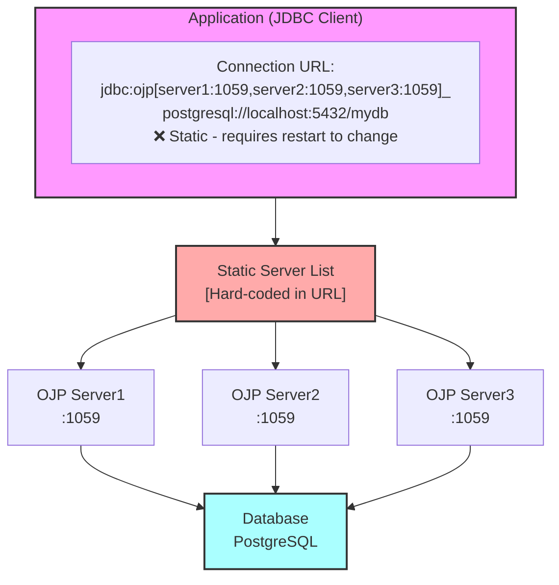
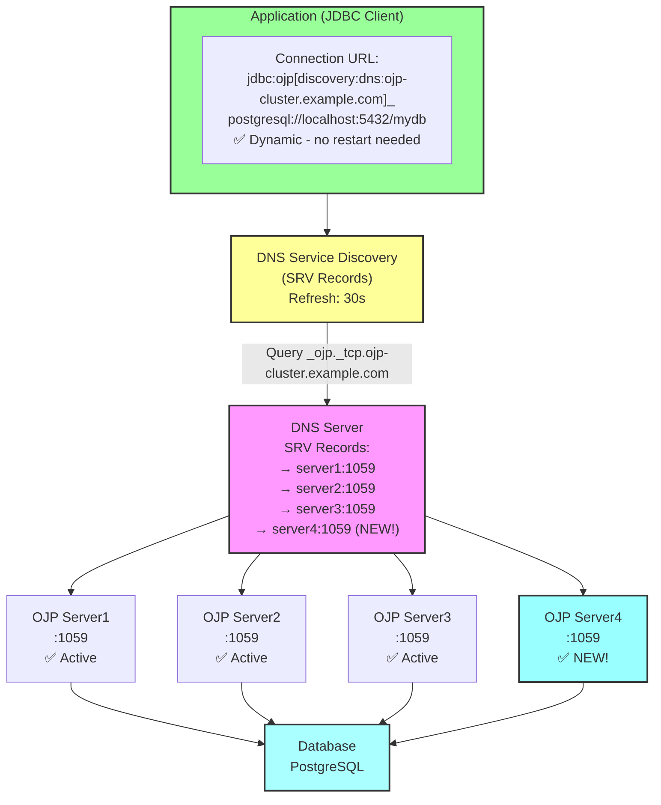
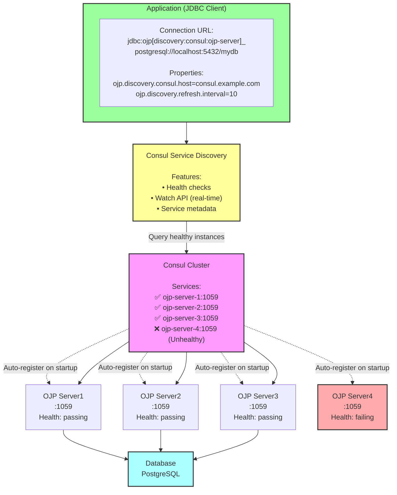
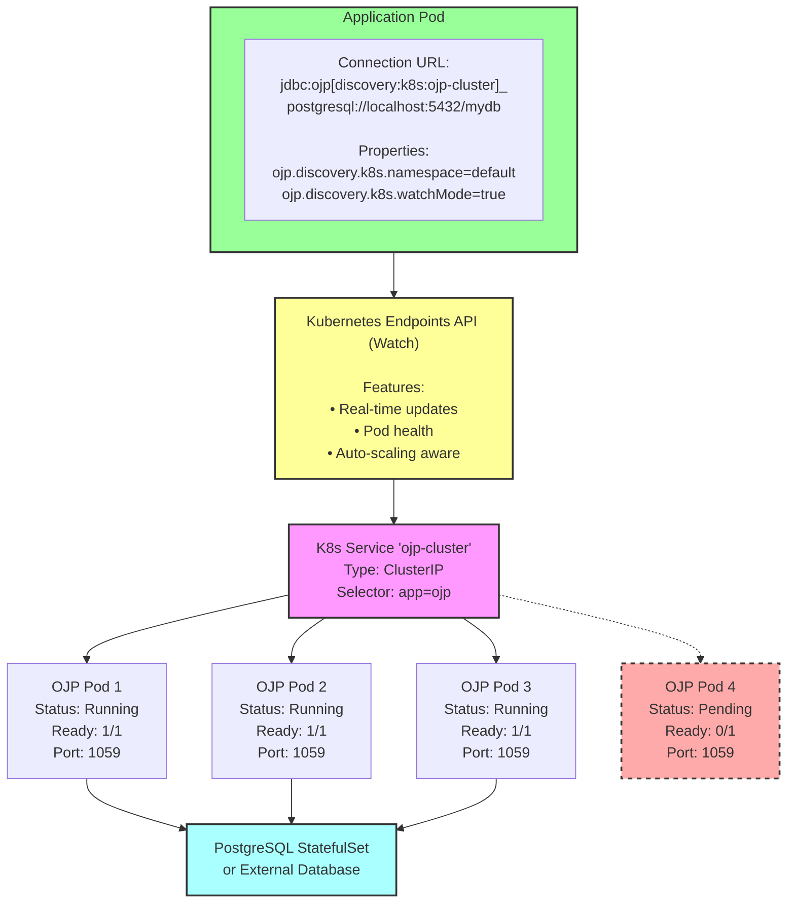
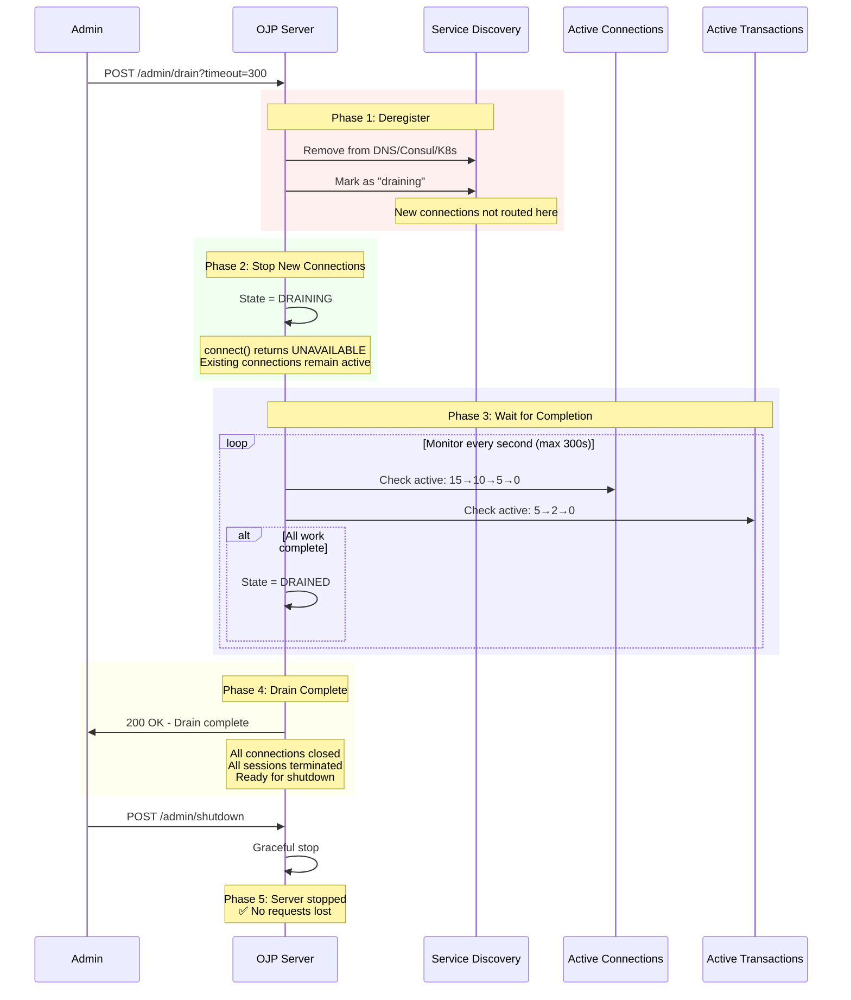
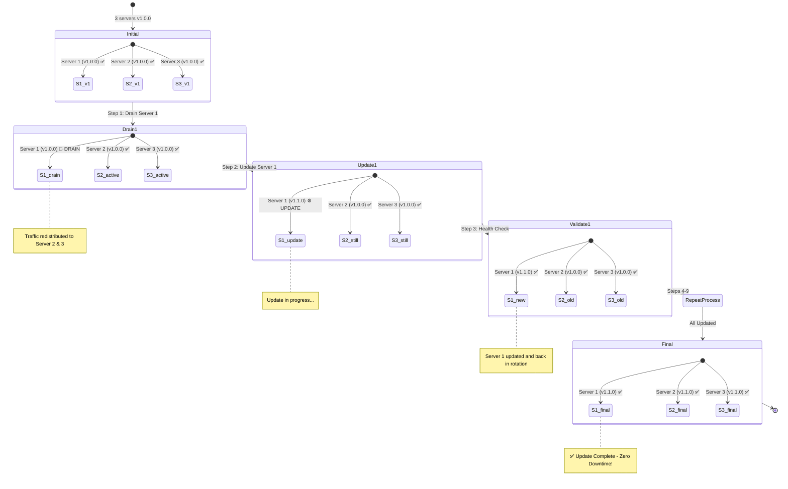
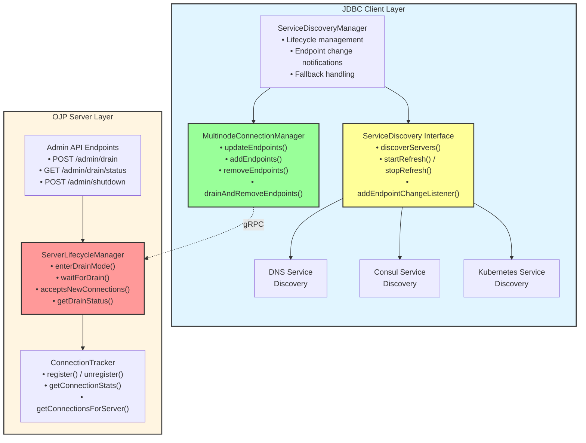
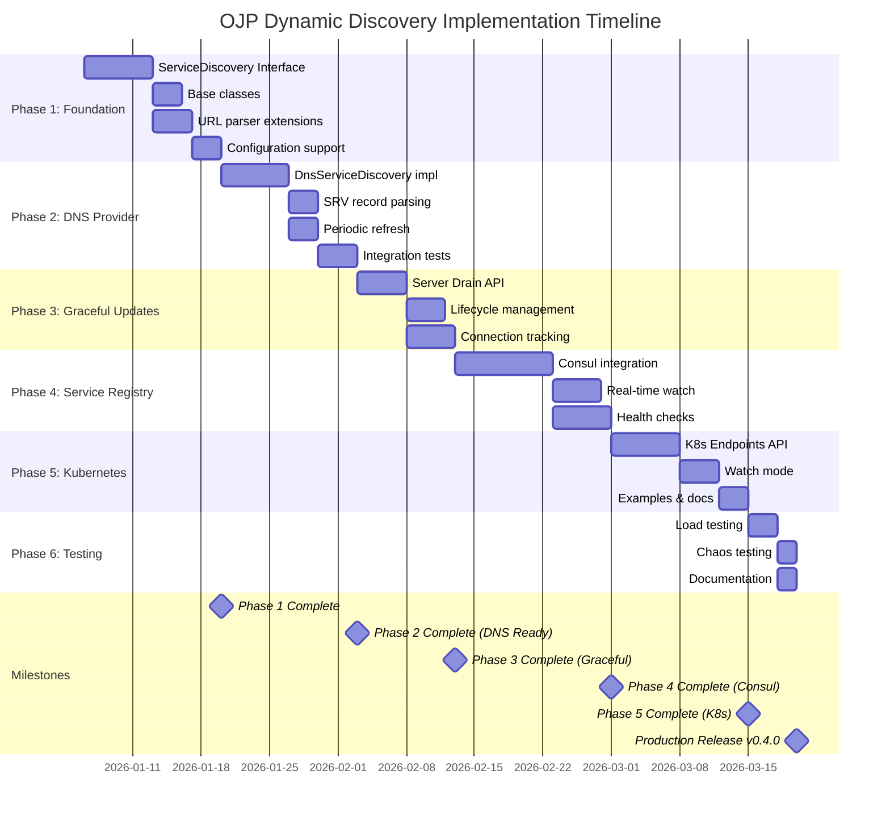

# Dynamic OJP Server Discovery - Visual Architecture

## Current Architecture (Static Configuration)



## Proposed Architecture (Dynamic Discovery)

### Option 1: DNS-Based Discovery



**Benefits:**
- ✅ Automatic discovery of new servers
- ✅ No application restart required
- ✅ Low operational overhead
- ✅ Works with existing DNS infrastructure

### Option 2: Consul Service Discovery



**Benefits:**
- ✅ Real-time updates via Watch API
- ✅ Built-in health checking
- ✅ Service metadata support
- ✅ Fast propagation of changes

### Option 3: Kubernetes Service Discovery



**Benefits:**
- ✅ Native K8s integration
- ✅ Works with HPA (Horizontal Pod Autoscaler)
- ✅ No additional service registry
- ✅ Automatic pod health tracking

## Graceful Shutdown Flow



**Timeline:**
```mermaid
gantt
    title Graceful Shutdown Timeline
    dateFormat ss
    axisFormat %Ss
    
    section Drain Process
    Drain initiated           :milestone, m1, 00, 0s
    Deregister from discovery :active, t1, 00, 5s
    Active conns: 15→10       :active, t2, 05, 25s
    Active conns: 10→5        :active, t3, 30, 30s
    Active conns: 5→2         :active, t4, 60, 30s
    Active conns: 2→0         :active, t5, 90, 30s
    Drain complete            :milestone, m2, 120, 0s
    
    section Shutdown
    Shutdown initiated        :crit, s1, 125, 5s
    Server stopped            :milestone, m3, 130, 0s
```

## Rolling Update Strategy



**Configuration:**
- `maxConcurrentUpdates: 1` (one at a time)
- `drainTimeout: 300 seconds`
- `healthCheckTimeout: 60 seconds`
- `batchDelay: 30 seconds` (wait between servers)

## Component Architecture



## Timeline and Milestones



---

*This document provides visual representations of the dynamic discovery architecture and safe update strategies proposed for OJP. See detailed analysis documents for complete specifications.*
