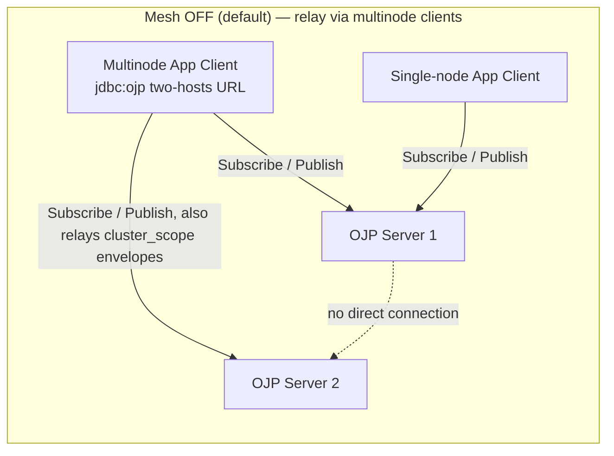
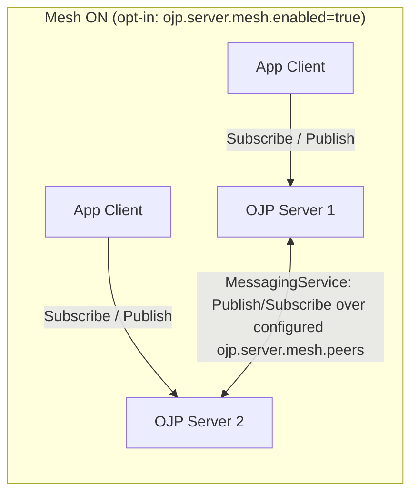
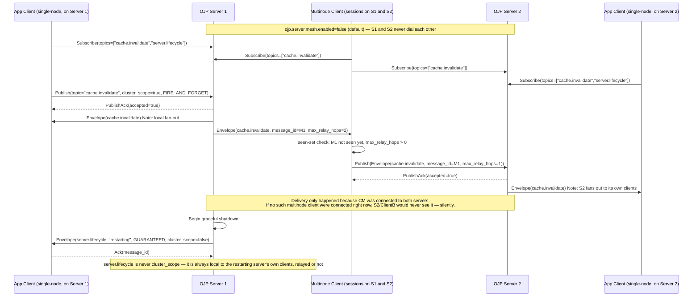
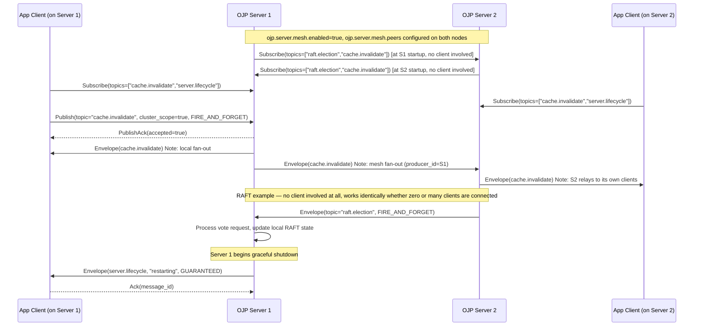

# OJP Generic Messaging Protocol — Analysis

## Question

OJP needs a generic-purpose way to exchange messages:

1. Between OJP servers (e.g. RAFT-style leader-election consensus messages).
2. From OJP servers to OJP servers (e.g. cache-invalidation broadcasts).
3. From an OJP server to the JDBC clients connected to it (e.g. "this server is
   restarting, please fail over").

**Hard constraint:** the transport must reuse the existing `ojp-jdbc-driver`
(and the gRPC channel/session machinery it already implements). OJP servers
are **not** allowed to open a new, separate connection directly to each other
(no raw sockets, no second gRPC server-to-server link, no new listening port
purely for inter-server chat). Whatever moves bytes between two OJP processes
must travel through the same code path a normal JDBC application already uses.

This document is a **design-only analysis**. It does not implement RAFT, a
cache-invalidation feature, or a restart-notification feature — it defines the
messaging substrate those features (and future ones) could be built on, and
records the options considered, with pros/cons of each, and my own opinions,
concerns and open questions.

---

## 1. Use Cases (context, not the object of this analysis)

| # | Use case | Direction | Fan-out | Rough reliability need |
|---|---|---|---|---|
| 1 | RAFT leader-election / consensus messages | server ↔ server | 1-to-N (cluster) | Fire-and-forget (RAFT is designed to tolerate loss/duplication; it re-tries at the protocol level) |
| 2 | Cache invalidation broadcast | server → servers | 1-to-N (cluster) | Fire-and-forget, best-effort, idempotent |
| 3 | "Server is restarting" notice | server → clients | 1-to-N (all sessions attached to that server) | Best-effort but **should be attempted with an ack/retry** because clients act on it to avoid failed in-flight work |

These three are **examples used to validate the design**, not requirements to
special-case in the protocol itself. The protocol described below is generic:
topic + payload + delivery-mode, so any future use case (metrics gossip,
config propagation, distributed lock notifications, admission-control
back-pressure signals, etc.) can reuse it without a protocol change.

---

## 2. What already exists that we can build on

Understanding today's transport is essential, because the constraint forces
us to reuse it rather than invent something parallel to it.

- **`ojp-grpc-commons`** defines the wire contract (`StatementService.proto`).
  Today it exposes only JDBC-shaped RPCs: `executeQuery` (server-streaming),
  `createLob`/`readLob` (bidi/streaming), and various unary statement calls.
  There is **no existing server→client push channel** and **no existing
  server→server channel** at all.
- **`ConnectionDetails`** (sent by the driver on connect) already carries
  `repeated string serverEndpoints` and a `clusterHealth` string. This is the
  seed of cluster awareness: the driver already tells a server about its
  peers, and a server already reports back a health summary. This is a strong
  hint that some cluster-topology plumbing is already anticipated, just not a
  generic messaging layer.
- **Multinode driver** (`ojp-jdbc-driver`) already implements: a JDBC URL that
  addresses multiple OJP servers (`jdbc:ojp[host1:port1,host2:port2]_url`),
  load-aware server selection, health-checked failover, and retry/backoff.
  This is exactly the kind of resilient client machinery a messaging layer
  would otherwise have to reinvent.
- **Circuit breaker** on the driver side (60s default timeout) already exists
  to protect the driver from a wedged server.

**Conclusion:** the driver is already a general-purpose "resilient RPC client
to one-or-more OJP servers." That is precisely the building block the
constraint asks us to reuse: *the driver is not just a JDBC feature, it is
OJP's client-side RPC and failover library.* We should lean on it rather than
duplicate its retry/failover/health logic in a second, parallel component.

---

## 3. Requirements

### 3.1 Functional

- Publish a message to a **topic** (free-form string, e.g. `raft.election`,
  `cache.invalidate`, `server.lifecycle`), with an opaque `byte[]` payload.
- Subscribe to a topic and receive messages as they are published.
- Support **broadcast** (all servers in the cluster / all sessions on a
  server) and, later, **point-to-point** (a specific server or client) —
  the analysis should not preclude point-to-point even though the 3 examples
  are all broadcast-shaped.
- Two delivery modes, selectable per publish call:
  - **Fire-and-forget**: best-effort, at-most-once, no retry, no ack.
  - **Guaranteed delivery**: at-least-once, with ack + retry + de-duplication
    on the receiving side.

### 3.2 Non-functional

- Must not require clients or servers to open any new network endpoint.
- Must not require a third-party broker (Kafka/RabbitMQ/NATS) as a hard
  dependency, to keep OJP's "single jar, no extra infra" deployment model
  intact — see Option D below for why this was rejected as the *default*.
- Low latency is important for RAFT (election timeouts are usually
  150–300ms); the protocol must not add its own buffering/batching delay for
  that topic class.
- Must survive individual server restarts without becoming a single point of
  failure (i.e., messaging must not depend on one "coordinator" server that,
  if down, blocks messaging for everyone).
- Security/auth must reuse whatever the driver already does to authenticate
  to a server (this analysis assumes credentials configured for
  server-to-server publishing, see §8 Open Questions).

---

## 4. Options Considered

### Option A — Piggyback on existing `StatementService` RPCs

Encode messages as SQL-shaped calls, e.g. `driver.execute("CALL
ojp_internal_publish(topic, payload)")`, using the JDBC driver exactly as an
application would, no new proto messages needed.

**Pros**
- Zero new wire protocol; ships immediately.
- Reuses 100% of the existing driver code path (auth, pooling, failover).

**Cons**
- Abuses SQL semantics for a non-SQL concern; every server/database
  dialect quirk (statement parsing, prepared-statement caching, the SQL
  enhancer, slow-query segregation) sits in the way of a message that has
  nothing to do with SQL. High risk of accidental interaction with unrelated
  features (e.g. slow-query classification would "learn" about a fake SQL
  statement).
- No server-streaming push to clients (a client would have to poll).
- Feels like a hack that will be confusing to future maintainers reading
  `StatementService`.

**Verdict:** rejected as the general mechanism, but the "pretend it's a
statement" trick is a reasonable *emergency fallback* for a single unary
control message if we ever need one without waiting for a proto change.

### Option B — Extend `ConnectionDetails`/handshake fields only

Keep growing ad-hoc fields like `clusterHealth` for whatever cluster
information is needed (e.g. add a `pendingLeaderVotes` field, a
`restartScheduled` bool, etc.).

**Pros**
- Simplest possible change for a single, rarely-changing piece of state.
- Already precedented in the codebase (`clusterHealth`).

**Cons**
- Not a messaging system — it is a snapshot exchanged only at connect time
  (and maybe re-sent on later requests). No push, no topics, no ordering,
  no ack. Does not scale to "N kinds of messages"; every new use case adds
  another ad-hoc field forever, which is precisely the "not generic" outcome
  we're trying to avoid.

**Verdict:** rejected as the primary mechanism; fine as a narrow special case
for *coarse, low-frequency, last-value-wins* state (see §7, where I suggest
keeping `clusterHealth` for that purpose and not routing it through the new
messaging layer).

### Option C — New dedicated `MessagingService` gRPC contract, transported by reusing the driver's client library code, not a JDBC `Connection`

Add a new proto service (e.g. `MessagingService`) in `ojp-grpc-commons`:

```proto
service MessagingService {
  rpc Publish (PublishRequest) returns (PublishAck);
  rpc Subscribe (SubscribeRequest) returns (stream Envelope);
}
```

Any process that needs to send a message — including an OJP server acting on
behalf of RAFT or cache invalidation — does so **by reusing the same
low-level client-side building blocks the driver is made of** (gRPC channel
management, retries, circuit breaker, multinode/health awareness), just
invoking `Publish`/`Subscribe` instead of `executeQuery`. A subscribing side
(client or peer server) opens the `Subscribe` stream once and keeps it open;
the server pushes `Envelope` messages on it as they are published. Because
`Subscribe` is a **server-streaming RPC initiated by the subscriber**, no
participant ever needs to accept an inbound connection it doesn't already
accept — it's the same call shape already used by `executeQuery`.

#### What "embedding the driver" concretely means (clarifying feedback on the first draft)

The first draft of this analysis said an OJP server would hold "a small
internal pool of driver client instances pointed at its peers," which was
too vague and reads as messier than intended. To be concrete:

- **It does *not* mean an OJP server calls `DriverManager.getConnection("jdbc:ojp[...]_...")`
  or otherwise goes through `java.sql.*` / `ojp-jdbc-driver`'s public
  `java.sql.Driver` entry point.** That entry point is for applications; it
  parses JDBC URLs, wraps a `java.sql.Connection`, etc. — machinery an OJP
  server has no reason to instantiate just to send a gRPC message to a peer.
- **What it does mean:** the driver's *internal* gRPC-plumbing classes —
  concretely, things like `GrpcChannelFactory` (already in
  `ojp-grpc-commons`, so already shared/available to both driver and server
  today), the retry/circuit-breaker logic, and the multinode
  connect/health-check bookkeeping in `MultinodeConnectionManager` — are
  reused as a **plain internal library dependency**, the same way
  `StatementServiceGrpcClient` reuses `GrpcChannelFactory` today. A new,
  small `MessagingServiceGrpcClient` class (living in `ojp-grpc-commons` or a
  new thin shared module) would wrap a `MessagingServiceGrpc` stub using
  that same channel-management code, and `ojp-server` would depend on that
  class the way it already depends on other `ojp-grpc-commons` classes. This
  keeps the "no bespoke second wire protocol" property without literally
  spinning up a JDBC `Connection` object inside the server process.
- Practically, per configured peer this is: **one long-lived `ManagedChannel`
  + one `MessagingServiceGrpc` stub + one open `Subscribe` stream**, held by
  a small, purpose-built component inside `ojp-server` (e.g. a
  `PeerMessagingClient`), not a `java.sql.Connection`, not a connection
  pool in the HikariCP sense, and not the JDBC driver's public API surface.
  "Pool" in the original wording was a poor choice of word — there is
  exactly one channel per peer, not a pool of interchangeable connections to
  the same peer.

#### This must be opt-in and off by default

This is a firm requirement, not just a preference: **by default, an OJP
server must not attempt to connect to any other OJP server.** Standalone,
single-server OJP deployments (almost certainly the majority of current
installs) must see zero behavior change — no new outbound connection
attempts, no new config required, no new failure mode from an unreachable
peer that was never supposed to exist.

Concretely:
- A new server setting, e.g. `ojp.server.mesh.enabled` (default `false`),
  gates the entire feature. When `false`, `ojp-server` never constructs a
  `PeerMessagingClient`, never reads a peer list, and the `MessagingService`
  RPC handlers can simply be registered but will have no server-side
  subscribers among peers (irrelevant, since nothing calls out to them).
- The peer list itself (e.g. `ojp.server.mesh.peers=host1:port1,host2:port2`)
  is only read/validated when `ojp.server.mesh.enabled=true`. No peer
  discovery, DNS lookups, or connection attempts happen otherwise.
- This mirrors how other optional OJP server features are already gated —
  e.g. slow-query segregation is `ojp.server.slowQuerySegregation.enabled`,
  defaulting to `false`, with zero behavioral change until explicitly turned
  on (see `documents/designs/SLOW_QUERY_SEGREGATION.md`). The messaging mesh
  should follow the exact same pattern for consistency.
- RAFT/cache-invalidation/restart-notice are themselves all-optional
  features that *depend on* `ojp.server.mesh.enabled=true`; none of them
  should force the flag on implicitly. If a future feature absolutely
  requires the mesh, that should be a clear, explicit validation error at
  startup ("feature X requires ojp.server.mesh.enabled=true"), not an
  automatic silent activation.

For server-to-server messaging: once enabled, each OJP server holds one
`PeerMessagingClient` (one channel + one subscribe stream) per configured
peer, using the `ojp.server.mesh.peers` setting described above (same
`host:port` shape as `serverEndpoints`, but a distinct, server-configured
list — see the correction below for why). From the receiving server's
point of view, a peer server is indistinguishable from any other
`MessagingService` caller — there is no new "server-to-server" concept in
the wire protocol, only "the same client-side gRPC plumbing the driver uses,
linked into the server process and activated only when explicitly
configured."

> **Correction to §6.1/§8.8 of the previous revision:** those sections
> referred to peers being discovered "the same way multinode driver
> instances are discovered today... peer list is exactly `serverEndpoints`."
> On reflection that overstated the reuse and conflicts with "off by
> default": `serverEndpoints` is populated by *clients* today (in
> `ConnectionDetails`, at connect time) to tell a server about its multinode
> siblings for client-failover purposes, and it is only ever populated when
> a client actually connects with a multinode URL — which is exactly the
> "clients might all be off" scenario this thread is about. The mesh peer
> list must instead be **its own explicit, server-side configuration
> setting**, independent of whether/how any client connects. §5.3 and §6.1
> below are corrected accordingly.

**Pros**
- Clean, explicit contract; easy to test and to reason about;
  self-documenting.
- Reuses the driver's proven client-side building blocks (retry, circuit
  breaker, channel management) as an internal library dependency, without
  dragging in the public JDBC API surface that has no purpose here.
- `Subscribe` as a long-lived server-streaming call is the natural gRPC
  pattern for server→client push, and is architecturally identical to what
  `executeQuery` already does (stream of `OpResult`), so it's not a new kind
  of risk for the codebase.
- Supports both delivery modes cleanly (see §5).
- Extensible: new topics require zero protocol changes.
- Fully opt-in: zero impact, zero new connections, for the default
  single-server (or client-failover-only multinode) deployment.

**Cons**
- New proto surface to design well up front (`Envelope` schema, topic
  naming, ack semantics) — mistakes here are expensive to change later
  because of backward-compatibility rules already noted for `.proto` files
  in this repo.
- Every OJP server becomes a client of every other *configured* peer OJP
  server (mesh), which means server count² channels in the worst case when
  enabled; needs sane bounds/validation on peer list size (see §8).
- A new, explicit server-side configuration surface (peer list, enable
  flag) that operators must set up correctly for multi-server features to
  work — this is deliberate (see "opt-in" above) but is still an added
  operational step compared to "it just works."
- Slightly more moving parts than Option A/B for a first cut.

**Verdict: recommended.** It is the only option that is both generic and
compliant with the "reuse the driver" constraint without abusing SQL
semantics, provided the peer mesh piece of it is implemented as an
explicitly opt-in feature. Note this "opt-in" requirement applies
specifically to the **direct peer mesh** described above; the same
`MessagingService` contract also underpins a second, always-on
server-to-server path — **client-relay**, via multinode clients — that
needs no enable flag at all. See §5.3 for the full picture of both.

### Option D — External message broker (Kafka, RabbitMQ, NATS, Redis pub/sub)

**Pros**
- Batteries-included durability, ordering, consumer groups, replay.
- Well-understood operationally at scale.

**Cons**
- Directly contradicts the constraint (this would be "connecting the OJP
  servers to each other" via a third system instead of via the driver) and
  adds a mandatory piece of infrastructure to what is currently a
  zero-dependency proxy deployment (`ojp-server` is meant to be a single
  jar). This would also be a governance/licensing surface to vet.

**Verdict: rejected**, explicitly out of scope per the problem statement.
Mentioned only for completeness/contrast.

### Option E — Direct server-to-server gRPC/TCP link (classic RAFT transport)

This is the "obvious" way most RAFT implementations (etcd, Consul) do it:
each node opens its own RPC/socket to its peers, independent of any client
driver.

**Verdict: explicitly disallowed** by the problem statement. Listed here
only so the rejection is on record and its absence doesn't look like an
oversight: this is the default architecture in virtually every reference
RAFT implementation, and *not* doing it is a deliberate, constraint-driven
deviation with real trade-offs (see §8 concerns).

---

## 5. Recommended Protocol Shape (Option C, detailed)

### 5.1 Envelope

```proto
message Envelope {
  string   message_id      = 1;  // UUID, for de-dup / ack correlation
  string   topic           = 2;  // e.g. "raft.election", "cache.invalidate", "server.lifecycle"
  bytes    payload         = 3;  // opaque; producer/consumer agree on encoding
  string   producer_id     = 4;  // server/client identity, for loop-avoidance and auditing
  int64    produced_at_ms  = 5;
  DeliveryMode delivery_mode = 6;
  int32    ttl_seconds     = 7;  // optional expiry, mainly for guaranteed mode retries
  bool     cluster_scope   = 8;  // true = intended for every server in the cluster, not just the
                                 // one that received the Publish call (see §5.3); false = local to
                                 // this server's own subscribers only (e.g. server.lifecycle)
  int32    max_relay_hops  = 9;  // only meaningful when cluster_scope=true and mesh is disabled
                                 // (client-relay mode, §5.3.1); bounds how many client-mediated
                                 // hops a message may travel before being dropped, to cap fan-out
                                 // in a densely-connected client population
}

enum DeliveryMode {
  FIRE_AND_FORGET = 0;
  GUARANTEED      = 1;
}

message PublishRequest {
  Envelope envelope = 1;
  // target_scope left unset = broadcast to all current subscribers of the topic;
  // set = point-to-point to a single producer_id (future-proofing, not needed by the 3 examples)
  string target_id = 2;
}

message PublishAck {
  string message_id = 1;
  bool   accepted   = 2; // true once durably queued for guaranteed mode, or immediately for fire-and-forget
}

message SubscribeRequest {
  repeated string topics = 1;
  string subscriber_id = 2;
}
```

`Subscribe` returns `stream Envelope`. For `GUARANTEED` messages, the
subscriber sends a small separate unary `Ack(message_id)` call (not modeled
above in full) once it has durably processed the message; the publisher side
retries un-acked messages with backoff until ack or `ttl_seconds` expiry.

### 5.2 Delivery modes

| | Fire-and-forget | Guaranteed delivery |
|---|---|---|
| Semantics | At-most-once | At-least-once |
| Ack required | No | Yes (`Ack(message_id)`) |
| Retry | None | Exponential backoff, bounded by `ttl_seconds` |
| De-duplication | N/A | Consumer keeps a short-lived seen-set of `message_id` (LRU/TTL cache — reuse Caffeine, already an OJP dependency per ADR-008) |
| Ordering | Best-effort, no guarantee | Per-producer, per-topic ordering only (see below); no global total order |
| Where it's used here | RAFT messages, cache invalidation | "server restarting" notice |
| Failure mode if peer is down | Message silently dropped | Buffered/retried up to `ttl_seconds`, then dropped with a log/metric — **not** durable across a publisher restart in the first iteration (see §8) |

**Ordering note:** true total ordering across a cluster requires a
sequencer/consensus mechanism of its own — which is circular for the RAFT
use case (you can't use total order to bootstrap the thing that produces
total order). This protocol therefore only promises **per-(producer,
topic) FIFO ordering** on a single subscribe stream, which is sufficient
for RAFT (each node's own message stream is ordered) and for cache
invalidation (order between different producers' invalidations usually
doesn't matter because invalidation is idempotent).

### 5.3 Server-to-server topology — two modes, not one

Earlier revisions of this analysis treated the direct peer mesh (§5.3.2
below) as *the* server-to-server option and described "mesh off" as simply
"servers don't talk to each other." That was incomplete. There are actually
**two distinct ways** a `Publish` on one server can reach another server,
and both are worth offering rather than presenting the mesh as the only
real mechanism:

| | 5.3.1 Client-relay | 5.3.2 Direct mesh |
|---|---|---|
| Controlled by | Automatic, no server-to-server config needed | `ojp.server.mesh.enabled=true` + `ojp.server.mesh.peers` |
| Default | **Yes — this is what happens today with zero extra config** | No — explicit opt-in |
| Transport | Existing multinode client sessions, used as a relay medium | A dedicated channel per configured peer |
| New server-to-server connection? | **None** | Yes (that's the whole point of enabling it) |
| Works with zero clients connected? | **No** | Yes |

#### 5.3.1 Client-relay mode (the default — no new connections at all)

This is the mechanism that directly answers "use the clients as a means to
communicate with other OJP servers": OJP already has a population of
clients that are simultaneously connected to more than one OJP server —
**multinode clients**, using the existing
`jdbc:ojp[host1:port1,host2:port2]_url` URL format (see
`documents/multinode/README.md`). A multinode client already holds an open
gRPC session to each server in its URL, primarily for load-aware routing
and failover. Nothing new needs to be opened for such a client to also
carry a message from one of "its" servers to another.

Mechanics:
- A multinode driver instance, in addition to its normal query traffic,
  keeps a `Subscribe` stream open on *every* server session it holds (this
  is already true regardless of relay — see §5.4) for whichever topics it
  or the application cares about.
- When the driver receives an `Envelope` with `cluster_scope=true` on one
  session, and has not seen that `message_id` before (a small client-side
  Caffeine-backed seen-set, same de-dup mechanism as guaranteed delivery),
  it re-publishes the same `Envelope` — unchanged, `message_id` preserved —
  on every *other* server session it holds, after decrementing
  `max_relay_hops` (dropping it silently once the count reaches zero, to
  bound propagation).
- From a receiving server's point of view this is indistinguishable from
  any other client `Publish` call — no protocol change, no new RPC. The
  receiving server fans it out locally to its own subscribers exactly as
  in §5.3's local fan-out, and if *that* server also happens to have
  multinode clients connected, the message continues to ripple outward
  through the client population.
- Net effect: the "connectivity graph" of the cluster is formed by
  *currently-connected multinode clients* (servers = nodes, each multinode
  client = an edge between the servers in its URL). A message reaches every
  server reachable from the publisher in that graph. If the graph happens
  to connect the whole cluster, every server eventually gets the message; if
  it doesn't (too few multinode clients, or clients only connected to a
  subset of servers), some servers simply never see it — silently, with no
  error, which is the central trade-off of this mode.

**When this is the right choice:** exactly the scenario in the original
feedback — deployments where opening a direct connection between OJP
servers is difficult, disallowed by network policy, or simply undesirable
(e.g. servers live in network segments that only accept inbound traffic
from application-side clients, not from each other). It is also
zero-configuration: it works as an automatic side-effect of multinode
client connectivity that already exists today, with no new peer list to
maintain.

**When this is *not* the right choice:** anything that must be guaranteed to
work regardless of client population, most importantly RAFT — see §5.3.3
and §6.1 for why.

#### 5.3.2 Direct mesh mode (opt-in, off by default)

- Gated behind `ojp.server.mesh.enabled` (default `false`). When disabled,
  none of this runs: no peer list is read, no channel is opened, no
  outbound connection is attempted. A default, single-server (or
  client-relay-only) OJP deployment sees no change.
- Peers are discovered from a **dedicated, explicit server-side setting**
  (e.g. `ojp.server.mesh.peers=host1:port1,host2:port2`), set independently
  by the operator on each node — this is deliberately *not* the same list as
  `serverEndpoints`. `serverEndpoints` is populated by *clients* at connect
  time (part of `ConnectionDetails`) to tell a server about its multinode
  siblings for client failover; it only exists while/because a client
  connected with a multinode URL, which is the opposite of "must work when
  all clients are off." The mesh's peer list must be known to the server
  independently of any client ever connecting.
- Once enabled, each server holds exactly **one long-lived channel + one
  `Subscribe` stream per configured peer** (mesh: N servers → N-1 outbound
  connections each), managed by a small dedicated component (see §5.2's
  "what embedding the driver means" discussion) — not a connection pool, one
  channel per peer. This is a bounded, small number in realistic OJP
  deployments (tens of nodes at most), so a full mesh is acceptable; if OJP
  ever targets hundreds of nodes, gossip-based fan-out would be needed
  instead (flagged as a non-goal for now, see §9).
- This mode is driven entirely by server-side lifecycle/configuration (peer
  list), not by application client activity: once enabled, a server
  establishes and maintains these peer streams from its own startup
  regardless of whether any JDBC client is currently connected. This is
  what keeps RAFT/cache-invalidation working in serverless deployments
  where application clients scale to zero for long stretches — see §6.1 for
  the detailed reasoning.
- Publishing from a server to "the cluster" is a local fan-out plus a mesh
  fan-out: the local `MessagingService` implementation receives one
  `Publish` call and pushes the `Envelope` to every currently-connected
  `Subscribe` stream (peers and, for client-directed topics, connected
  client sessions) whose subscription matches the topic. When mesh mode is
  active, `cluster_scope=true` envelopes go directly to peers over the mesh
  and do **not** additionally rely on client relay (both mechanisms are
  never needed at once for the same message — see §5.3.3).

#### 5.3.3 Comparison: client-relay vs. direct mesh, and how to choose

| | Client-relay (default) | Direct mesh (opt-in) |
|---|---|---|
| **New connections required** | None — reuses existing multinode client sessions | Yes — one channel per configured peer |
| **Delivery guarantee** | Best-effort; depends entirely on the current multinode client population forming a connected graph across the cluster. No bound on latency or coverage. | Deterministic: every configured peer is reached directly, independent of any client |
| **Works with zero clients connected** | **No** — no clients, no relay medium, no cross-server delivery at all | **Yes** — this is the whole point |
| **Good fit for** | Cache invalidation and other idempotent, self-healing, best-effort broadcasts, *especially* in deployments where a direct server-to-server link is hard, blocked, or undesirable | RAFT consensus and anything else that needs bounded-latency, guaranteed-to-attempt delivery regardless of client traffic (e.g. serverless client tiers, §6.1) |
| **Poor fit for** | RAFT — see below | Deployments where opening any new outbound connection between OJP processes is explicitly disallowed by network policy |
| **New server-side config** | None | Peer list + enable flag, maintained per node |
| **New trust/auth surface** | None beyond what already secures client↔server traffic (a relay hop is just a normal authenticated client `Publish` call) | Yes — needs its own inter-server credential/trust story (§8.3) |
| **Extra idle resource cost** | None when no multinode clients are connected; a small amount of relay bookkeeping (seen-set) on multinode clients that are connected | One idle channel + stream per configured peer, always, once enabled |
| **Puts new responsibility on** | The JDBC driver (an app-embedded library becomes a message relay for cluster-internal traffic — see the concern in §8.9 about whether that is appropriate) | `ojp-server` only (the driver's role doesn't change) |

**My recommendation, stated plainly:** ship both, because they solve
different problems, and default to client-relay because it costs nothing
and requires nothing from operators:

- **Client-relay (default) for `cache.invalidate`** and any other
  idempotent/best-effort cluster-wide topic. It is genuinely the option
  requested in the original feedback for "situations where opening a
  connection between OJP servers is difficult or not possible," and it
  requires zero new infrastructure.
- **Direct mesh, explicitly enabled, for RAFT.** RAFT should not run over
  client-relay for two independent reasons, not just one: (1) coverage is
  probabilistic — an election message that silently fails to reach a
  quorum because too few multinode clients happen to be connected right
  then is a correctness/liveness risk, not just a minor delay; and (2)
  trust — routing consensus-critical server-to-server traffic through
  arbitrary application processes (which the operator may not fully
  control, patch on the same schedule, or even trust to the same degree as
  the OJP servers themselves) is a meaningfully larger attack surface than
  a direct, operator-configured peer link. I'd treat "RAFT requires
  `ojp.server.mesh.enabled=true`" as a hard product rule, not a soft
  recommendation. Confidence: high (85%) on the trust argument, medium
  (65%) on exactly how bad the coverage risk is in practice, since that
  depends on real deployment client-connectivity patterns I don't have data
  on.
- **Direct mesh is also the answer for serverless/idle-client
  deployments** (§6.1) — it's the only one of the two modes that keeps
  working when the client population (and therefore the client-relay
  medium) disappears entirely.

### 5.4 Server-to-client topology

- The driver, after establishing its normal JDBC connection, additionally
  opens (or lazily opens, on first use) a `Subscribe` stream for topics it
  cares about (initially just `server.lifecycle`).
- The server pushes a `server.lifecycle` envelope (e.g. `{"event":
  "restarting", "graceMs": 30000}`) to every subscribed client session when
  a graceful shutdown begins.
- The driver surfaces this to the application as a `SQLWarning` on the
  connection (there is already a documented pattern for propagating server
  conditions to `SQLWarning`, see `SQLWARNING_FULL_TRANSFER.md`) and/or a
  driver-level listener callback for applications that want to react
  programmatically (e.g. stop sending new requests, drain in-flight work).
  Reusing `SQLWarning` avoids inventing a whole new client-facing API for a
  notification that is fundamentally advisory.

### 5.5 Message flow diagrams — Mesh OFF (client-relay) vs. Mesh ON (direct mesh)

The two diagrams below make the difference between the two modes from §5.3
concrete: **Mesh OFF** is the default for every OJP deployment and still
carries cluster-wide messages, via client relay, whenever a multinode
client happens to bridge the servers involved; **Mesh ON** is an explicit
opt-in (`ojp.server.mesh.enabled=true` + a configured peer list) that
removes the dependency on client connectivity entirely, needed for RAFT and
for serverless client tiers (§6.1).

#### Topology comparison





Note both subgraphs use the **same** `MessagingService` contract end to end
— "Mesh ON" does not add a different protocol, it just removes the
dependency on a multinode client being present to carry the message; a
`Publish` call, an `Envelope`, and a `Subscribe` stream look identical to a
server whether the other end is a peer server or a relaying client.

#### Mesh OFF — sequence flow (default behavior, client-relay)

With the mesh disabled, `ojp-server` never reads a peer list and never
dials another server directly. Instead, any client that is connected to
more than one server (a **multinode client**, using the existing
`jdbc:ojp[host1:port1,host2:port2]_url` format) acts as the carrier: it
already holds a `Subscribe` stream open on every server in its URL (§5.4),
and when it receives a `cluster_scope=true` `Envelope` it hasn't seen
before, it re-publishes that same envelope on its other server sessions.



**Implication (worth calling out explicitly):** with the mesh off, cluster
delivery is real but **probabilistic** — it depends on the connectivity
graph formed by whichever multinode clients happen to be connected at that
moment. That is a fundamentally different guarantee from "always reaches
every server," and it is why RAFT should not rely on this mode alone (§5.3.3,
§6.1) even though cache invalidation is a good fit for it.

#### Mesh ON — sequence flow (opt-in)

With the mesh enabled and peers configured, each server also holds a
`PeerMessagingClient` per peer, opened at server startup regardless of
client activity. A `Publish` call now fans out both to the server's own
connected clients *and* directly to its peers — client relay is not needed
and, when a message is already delivered via the mesh, a relaying client
that also happens to see it is a no-op thanks to `message_id` de-dup (the
peer already marks itself as having produced/seen it).



**Loop-avoidance note:** because §5.3.2 already assumes a full mesh (every
server subscribes directly to every other configured peer), a receiving
server only needs to fan a peer-originated `Envelope` out to its *own*
connected clients, never re-publish it back onto the mesh — `producer_id`
lets a receiver recognize and drop an `Envelope` it produced itself (guards
against any accidental echo) but no further re-broadcast logic is needed
given the full-mesh topology. If OJP ever moves to gossip-based fan-out
for larger clusters (§8.1), this would need actual hop-count/seen-set
loop-avoidance — flagged there, not solved here.

---

## 6. Mapping back to the 3 example use cases

| Use case | Topic | Mode | Recommended topology | Notes |
|---|---|---|---|---|
| RAFT consensus | `raft.<cluster-id>.election` (or similar) | Fire-and-forget | **Direct mesh required** (`ojp.server.mesh.enabled=true`) | RAFT already assumes an unreliable network and re-sends `RequestVote`/`AppendEntries` on timeout; making the transport "guaranteed" would add latency (ack round-trip) for no protocol benefit and could even mask real partitions from RAFT's own failure detector. Client-relay's probabilistic coverage (§5.3.3) is not acceptable here — a vote that silently never reaches a quorum because too few multinode clients are connected is a liveness bug, and routing consensus traffic through arbitrary application processes is a bigger trust surface than a direct peer link. |
| Cache invalidation | `cache.invalidate` | Fire-and-forget | **Client-relay (default) is fine**; mesh optional for stronger guarantees | Invalidation is idempotent and self-healing (a missed invalidation just means a slightly stale cache entry until the next write/TTL), which is exactly what client-relay's best-effort coverage tolerates well. Could optionally periodically re-broadcast a checksum/version as a belt-and-suspenders anti-entropy mechanism — not required for this analysis. |
| Server restarting | `server.lifecycle` | Guaranteed (to currently-connected clients only) | Neither — always server-to-its-own-clients, never cluster-wide | This is the one case where "the client acts differently because it got the message" (e.g. stop sending new statements, prepare to fail over), so an ack-and-retry within the shutdown grace period is worth the extra complexity. Note "guaranteed" here can only mean "guaranteed to currently-attached subscribers within the grace period" — a client that is disconnected at the moment of publish cannot be reached by this mechanism, only by the normal failover behavior of the multinode driver, which already exists independently of this new protocol. This topic is never `cluster_scope=true` and is therefore unaffected by mesh on/off. |

---

## 6.1 Serverless / zero-client deployments, and the client-relay vs. mesh choice

This section now covers two related questions raised in review: how does
this design behave when the application client tier is idle or absent, and
— stated bluntly — does that actually matter?

**The mechanism, restated:** §5.3 now offers two ways for a message to
cross servers. **Client-relay** (default, §5.3.1) uses whichever multinode
clients happen to be connected as the carrier — free, but coverage is a
function of current client connectivity. **Direct mesh** (opt-in,
§5.3.2) uses a dedicated peer link per server, driven entirely by server
startup/configuration, independent of any client. Only the mesh is
unaffected by the client population going to zero.

**Recommendation for serverless/idle-client deployments:** enable the mesh.
Client-relay is the right default for typical deployments (it costs
nothing and needs no extra config), but the moment a deployment can have
long stretches with zero connected clients, client-relay's carrier
disappears along with them, and cross-server messaging stops silently
until a client reconnects. If that idle-period gap matters for the use
case (see below), `ojp.server.mesh.enabled=true` is the only one of the two
modes that keeps working through it, because it is driven by server
lifecycle, not client activity.

**Now, the honest answer to "is it actually a problem if OJP servers don't
communicate while no clients are connected?"** — asked directly in review,
and it deserves a direct, un-hedged answer rather than a reflexive "always
enable the mesh":

- **In the fully idle case, on its own, no.** If literally zero clients are
  connected, there is no query traffic, nothing reading the cache, and
  nothing depending on a leader decision *at that instant*. A cluster with
  no application activity has no user-visible correctness or availability
  at stake while it is idle. I would resist treating "servers can't reach
  each other right now" as inherently bad — it's only bad in relation to
  something that needs the result of that communication.
- **The real risk is at the boundary, not during the idle period itself:**
  the moment the *first* client reconnects after a long idle stretch. If
  that first request depends on cluster state that only converges through
  server-to-server messaging (e.g. "who is the current RAFT leader,"
  "is my local cache fresh"), and the messaging carrier (client-relay) only
  starts working once *that same client* becomes multinode-connected, the
  cluster has to bootstrap its coordination state concurrently with serving
  the very first request that depends on it. For self-healing, idempotent
  concerns (stale cache entry served once, RAFT election completing a beat
  late) this is a bounded cold-start cost, not an ongoing bug — likely
  acceptable. For anything where "answer before consensus is reached" is
  actively wrong rather than just outdated (e.g. two servers each
  believing themselves leader long enough to accept conflicting writes — a
  split-brain window), it is a real correctness problem, not just added
  latency, and is worth avoiding entirely rather than tolerating.
- **Applied to the 3 examples:** `server.lifecycle` can never be a problem
  when idle — there is nothing to notify with no clients present. Cache
  invalidation is essentially never a problem — worst case is one avoidable
  stale read at reconnect, self-corrected on the next write/TTL. RAFT is
  the only one of the three where the answer genuinely depends on *what*
  the consensus protects: coordination that's purely advisory/background
  can tolerate the same cold-start gap as cache invalidation; coordination
  that gates a decision that must not be made twice or made incorrectly
  (leader-exclusive writes, distributed locks) cannot, and that is
  precisely the case the direct mesh exists for.
- **My confidence in this framing:** high (80%) on the general shape of the
  argument (idle = no stakes, the risk is at the reconnect boundary, and it
  scales with how "must-not-be-wrong" the protected state is). Lower
  confidence (50%) on how large the cold-start window actually is in
  practice for a specific RAFT implementation, since that depends on
  election-timeout tuning this analysis doesn't specify — worth revisiting
  once RAFT is actually implemented rather than assuming it away here.

**Remaining consequences worth calling out** (mostly unchanged from the
prior revision of this section):

1. **The mesh, when enabled, must be independent of, and outlive, any
   client traffic.** Each server should establish and maintain its peer
   `Subscribe` streams (with reconnect/backoff) as part of its own startup
   and health-check loop, not lazily "when a client first connects." This
   should be stated as an explicit requirement, not an implementation
   detail.
2. **"Client off" doesn't mean "server off."** Serverless here refers to the
   *application* tier scaling to zero; the OJP servers themselves are
   assumed to remain running (they are the proxy/pool layer, not the
   thing being scaled per-request). If OJP servers themselves were expected
   to scale to zero between requests (a true "serverless OJP server"), RAFT
   membership and leadership would need to be re-derived on every cold
   start, which is a much bigger problem than this analysis covers — my
   assumption (70% confidence) is that this is out of scope because OJP
   servers are long-lived connection-pool owners by design (ADR-003), and a
   pool that's destroyed on every scale-to-zero event defeats the purpose of
   OJP. **Question for the team: is there any scenario where the OJP
   *servers* (not just client apps) are expected to scale to zero, e.g. one
   OJP server per Lambda invocation?** If yes, neither mode in this analysis
   covers that case and it would need rework (likely toward a
   stateless/external-coordination model, which starts to look like Option D
   again).
3. **Bootstrap ordering (mesh mode only)**: at cluster cold start (e.g. all
   OJP servers starting together), servers need to discover and connect to
   peers *before* any application client connects, otherwise RAFT can't
   elect a leader in time for the first request. This reinforces point 1:
   the peer mesh must be driven by its own dedicated server-side
   configuration (`ojp.server.mesh.peers`, not `serverEndpoints`, since the
   latter is only populated by connecting clients), not by client activity.
4. **This does not conflict with "client-relay is the default."** A
   deployment that needs RAFT/cache-invalidation to survive a fully idle
   client tier, or that considers even the reconnect-boundary risk above
   unacceptable, must explicitly set `ojp.server.mesh.enabled=true` and
   configure the peer list on every node. Client-relay remains the default
   for everyone else because it requires no extra configuration and no new
   inter-server trust relationship.

**Net effect on the recommendation:** ship both modes (§5.3.3). Client-relay
is the default and directly addresses the original ask — servers exchange
messages via connected clients when opening a direct server-to-server link
is hard or undesirable — while the direct mesh remains the opt-in answer
for RAFT and for any deployment where client presence cannot be assumed.

---

## 7. What NOT to change

- `ConnectionDetails.clusterHealth` should stay as-is: a coarse, last-value
  snapshot exchanged at connection time. It should not be re-implemented on
  top of the new messaging layer; it solves a different problem (a client
  finding out server health when establishing a connection, before any
  subscription exists).
- No change to `executeQuery`/`createLob`/`readLob` semantics.

---

## 8. Concerns and Open Questions (opinions included)

1. **Mesh scaling.** A full N×(N-1) subscribe mesh is fine for the cluster
   sizes I'd expect OJP to run at (a handful to maybe a few dozen servers
   for connection-pool proxying). If there's an intention to run hundreds of
   OJP server instances, this design needs a gossip/fan-out tree instead of
   a full mesh — **question for the team: what cluster sizes are actually
   expected in production?** My default assumption is "small enough that a
   mesh is fine," medium confidence (60%) since I don't have real deployment
   numbers.
2. **Where does the new client-plumbing code/module live?** As clarified in
   §5.2, the server-side mesh does **not** add a compile-time dependency from
   `ojp-server` onto `ojp-jdbc-driver` — it reuses the lower-level gRPC
   channel/retry/circuit-breaker code that already lives in
   `ojp-grpc-commons` (shared by both today) plus a small new
   `MessagingServiceGrpc` client class that should also live in
   `ojp-grpc-commons` (or a new thin shared module) so both the driver and
   the server can depend on it symmetrically, exactly like they already both
   depend on `GrpcChannelFactory`. This avoids the `server → driver`
   dependency the first draft implied, which would have been an odd,
   one-directional coupling for a feature that isn't really about JDBC at
   all. Worth confirming this module placement explicitly as part of any
   implementation ADR, since "which module owns the new client class" is an
   easy thing to get inconsistent across a phased rollout.
3. **Authentication/authorization for server-to-server calls.** Application
   clients authenticate with DB credentials meant for the *target database*.
   A server-to-server messaging call has nothing to do with a database
   credential. We need a distinct, cluster-internal credential/shared-secret
   (or mTLS-based peer identity) so that `Publish`/`Subscribe` for internal
   topics (`raft.*`) can be restricted to known peer servers, and cannot be
   spoofed or eavesdropped by a regular JDBC application that happens to know
   the topic name. **Open question: does OJP already have any
   inter-server trust mechanism to build on (e.g. shared cluster secret,
   mTLS certs), or does this analysis need to also propose one?** I did not
   find one in the codebase; flagging this as a likely next analysis if this
   proceeds.
4. **Guaranteed delivery durability across a publisher crash.** As
   specified above, "guaranteed" only covers retries while the publisher
   process is alive. If the publishing server crashes mid-retry, queued
   guaranteed messages are lost. For the "restart notice" use case, this is
   acceptable (a crashed server can't announce a graceful restart anyway).
   If a future use case needs durability across a publisher crash, that
   requires a WAL/outbox persisted to disk — a meaningfully bigger feature
   than this analysis is scoped for and, in my opinion, would be a strong
   signal that a real broker (rejected in Option D) is actually the right
   tool, constraint notwithstanding. Worth flagging now rather than
   discovering it mid-implementation.
5. **Payload versioning/compatibility.** `payload` is opaque bytes; each
   topic's producers/consumers must agree on encoding (likely another small
   protobuf message per topic) and must handle version skew during rolling
   upgrades (an old server must not crash on a message from a newer one).
   Recommend: every per-topic payload message reserves a `schema_version`
   field from day one.
6. **Should `Subscribe` be one stream per topic-set or one stream total?**
   The proto above allows multiple topics per `Subscribe` call to avoid
   N streams for N topics on a single peer/client connection. I'd default to
   **one multiplexed stream per peer connection, N topics inside it**, to
   minimize the number of long-lived gRPC streams held open — gRPC streams
   are cheap but not free, and a small OJP server shouldn't hold hundreds of
   idle streams open per connected client. Confidence: medium-high (75%),
   based on general gRPC stream-cost guidance rather than OJP-specific
   measurement.
7. **Backpressure.** What happens if a subscriber's stream is slow/blocked
   and the publisher fans out to many subscribers? Recommend a bounded
   per-subscriber outbound queue with drop-oldest for `FIRE_AND_FORGET` and
   a small bounded retry queue with backpressure signaling (reject new
   `Publish` calls, i.e. explicit failure rather than unbounded memory
   growth) for `GUARANTEED`. This needs load testing before being called
   "done," which is out of scope for this analysis but should be an
   explicit acceptance criterion for implementation.
8. **Does "serverless" ever mean the OJP *servers* scale to zero, not just
   the application clients?** As discussed in §6.1, this design assumes OJP
   server processes are long-lived even when application clients are not,
   and the peer mesh is what keeps RAFT/cache-invalidation alive during
   client-less periods. If there's a deployment model where OJP servers
   themselves are ephemeral (spun up per request/invocation), neither mode
   in this design applies and this would need a fundamentally different
   (likely externally-coordinated) approach. Flagging this as a question for
   the team rather than assuming an answer.
9. **Client-relay coverage is probabilistic, not guaranteed, and that is
   invisible to operators unless documented loudly.** A missed relay hop
   produces no error anywhere — the publishing server gets a normal
   `PublishAck`, the message simply never reaches a server that had no
   multinode client bridging to it at that moment. This is an acceptable
   trade-off for cache invalidation but needs a prominent callout in any
   operator-facing docs (something like: "if you need a guarantee that
   cache invalidation reaches every node, enable the mesh"), otherwise an
   operator could reasonably assume "cluster-wide" means "every node,
   always," which client-relay does not promise.
10. **Client-relay puts new responsibility on the driver that is arguably
    outside its job description.** Today the JDBC driver's entire purpose is
    "be a JDBC driver for one application's queries." Client-relay asks it
    to additionally become a piece of cluster-internal transport
    infrastructure — forwarding messages that have nothing to do with the
    application that embeds it, consuming a small amount of the
    application's CPU/memory/network for another tenant's (the OJP cluster's)
    benefit. This is a real, if small, scope-creep concern, and part of why
    I would keep relay strictly limited to `cluster_scope=true`,
    hop-bounded, fire-and-forget topics (never RAFT, never anything latency-
    or trust-sensitive) — the blast radius of "an application's JDBC driver
    is briefly acting as a cluster relay" should stay small and clearly
    bounded. **Open question for the team: should relay be a per-client
    opt-out (e.g. a driver connection property such as
    `relay=false`) for applications that don't want their driver
    participating in cluster transport at all, even for cache invalidation?**
    My default assumption is yes, this should be opt-out-able per
    connection, medium confidence (65%), since some operators will
    reasonably object to any cluster-internal traffic riding through their
    application's process on principle, independent of the actual resource
    cost being small.
11. **RAFT must never be allowed onto client-relay, even accidentally.**
    Because both modes reuse the same `MessagingService` contract (§5.5),
    it would be easy for an implementation to let a `raft.*` topic's
    envelopes leak onto client-relay simply because a multinode client
    happens to be subscribed to it. Recommend the server-side
    implementation hard-codes a topic allowlist for what client-relay is
    permitted to forward (e.g. only `cache.*` by default), independent of
    whatever `max_relay_hops`/`cluster_scope` the publisher set, so a
    misconfigured or malicious client cannot smuggle a RAFT message across
    servers, and a well-meaning bug can't silently make RAFT "sort of work"
    over an unreliable, untrusted path that was never meant for it.

---

## 9. Suggested (high-level) implementation phasing

This is intentionally light — the ask was for analysis, not an implementation
plan — but a phased rollout is worth recording as a suggestion:

1. Add `MessagingService` to `ojp-grpc-commons`, implement server-side
   fan-out for `Subscribe`/`Publish` with `FIRE_AND_FORGET` only, no
   cross-server delivery of any kind yet — validate with the "server
   restarting" use case first since it's purely server-to-its-own-clients
   and carries no cross-server complexity at all.
2. Add **client-relay** (default mode, §5.3.1): driver-side seen-set +
   forwarding logic for `cluster_scope=true` envelopes, gated by a
   hard-coded topic allowlist (Concern 11) and, per Concern 10, an
   opt-out connection property. Exercise it with `cache.invalidate`, since
   client-relay's probabilistic coverage is an acceptable trade-off there.
3. Add the cluster-internal peer identity/credential mechanism (see
   Concern 3) before turning on any direct server-to-server traffic.
4. Add the **direct mesh** (opt-in, §5.3.2:
   `ojp.server.mesh.enabled=true`, servers using the shared client-plumbing
   to reach configured peers) and re-exercise `cache.invalidate` over it to
   confirm both modes agree on the wire format and dedup correctly when
   both happen to be active.
5. Add `GUARANTEED` delivery mode (ack + retry + de-dup) and switch
   "server restarting" to it.
6. RAFT is the most complex and highest-risk consumer (correctness-critical,
   latency-sensitive); build/adopt it last, on top of an already-proven
   messaging substrate, **requiring the direct mesh** (never client-relay,
   per Concern 11), likely evaluating an existing, well-tested Java RAFT
   library rather than writing RAFT from scratch, using this messaging
   layer purely as its transport.

---

## 10. Summary Recommendation

Introduce a new, generic `MessagingService` gRPC contract (topic + opaque
payload + delivery mode), implemented as an addition to `ojp-grpc-commons`,
consumed by application clients through `ojp-jdbc-driver`, with **two
complementary server-to-server topologies** rather than one:

- **Client-relay (default, no config, no new connections):** multinode
  clients — which already hold sessions to more than one OJP server for
  failover purposes — carry `cluster_scope=true` envelopes between the
  servers they're connected to, de-duplicated by `message_id` and bounded by
  `max_relay_hops`. This directly satisfies "use the clients as a means to
  communicate between OJP servers" for deployments where a direct
  server-to-server link is hard, disallowed, or simply not worth the extra
  configuration — at the cost of best-effort, probabilistic coverage that
  depends on current client connectivity.
- **Direct mesh (opt-in via `ojp.server.mesh.enabled`, default `false`):**
  each server reuses the driver's internal client-side gRPC plumbing as a
  plain library dependency — **not** its public JDBC API — to hold one
  channel per configured peer, driven entirely by server startup/config,
  independent of any client. This is required for RAFT and recommended
  whenever client presence cannot be assumed (serverless/idle-client
  deployments, §6.1).

Both modes satisfy the "no direct server-to-server link" constraint by
construction — even the mesh is "just another `MessagingService` client,"
using the same channel/retry/circuit-breaker code the driver already has,
never a bespoke socket. Client-relay requires literally nothing new to be
opened; the mesh stays fully opt-in so a default OJP deployment sees no
behavior change until an operator asks for it. Together they let the three
example use cases pick the topology that matches their actual reliability
need — cache invalidation on the free, best-effort default; RAFT on the
guaranteed, opt-in mesh — rather than forcing every use case through a
single, one-size-fits-all mechanism.

My biggest open concerns, in order: (1) §8.3, inter-server authentication
for the direct mesh, distinct from the JDBC-target-database credentials the
driver was originally built to carry — I'd want that settled before writing
any code that turns the mesh on by default in any environment; and (2)
§8.10/§8.11, keeping client-relay's blast radius small and RAFT strictly off
of it — these are cheap to get right now, in the design, and expensive to
retrofit once client-relay code exists and topics start relying on it
implicitly.
