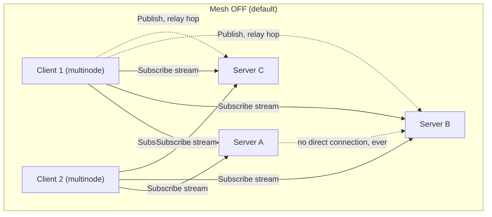
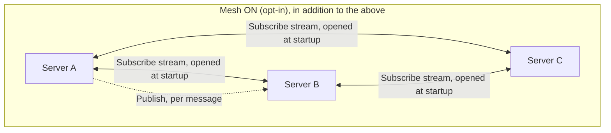
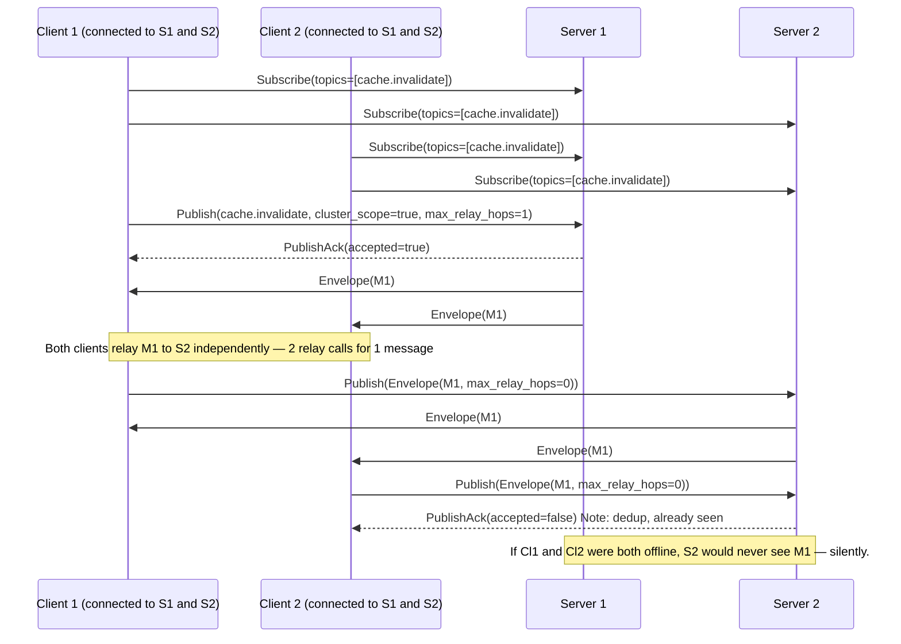
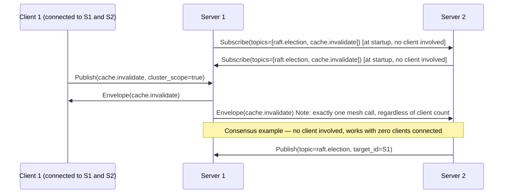

# OJP Generic Messaging Protocol — Analysis

## Question

OJP needs a generic way to exchange messages:

1. Between OJP servers (e.g. RAFT-style leader-election consensus messages).
2. Between OJP servers (e.g. cache-invalidation broadcasts).
3. From an OJP server to the JDBC clients connected to it (e.g. "this server
   is restarting, please fail over").

**Constraint:** transport must reuse the existing `ojp-jdbc-driver` (its
gRPC channel, session, and retry machinery), not a brand-new wire protocol,
and must not connect OJP servers directly to each other **by default**.

- **By default, no new connection exists between OJP servers at all.**
  Client-relay (§5.1) and server→client push (§6) need zero new config and
  zero new sockets.
- **One explicit, opt-in exception exists: the direct mesh (§5.2).** When an
  operator turns it on, servers open a channel directly to each other — but
  that channel is built from the same client-side gRPC plumbing the JDBC
  driver already uses (same proto contract, same channel code), not a raw
  socket or a second wire protocol. It stays off unless an operator asks for
  it.

This document is design-only: it defines the messaging substrate, not RAFT,
cache invalidation, or restart-notification themselves.

---

## 1. Use cases (context, not the object of this analysis)

| # | Use case | Direction | Fan-out | Reliability need |
|---|---|---|---|---|
| 1 | Leader-election / consensus messages | server ↔ server | 1-to-N (cluster) | Fire-and-forget (consensus protocols re-send at their own level) |
| 2 | Cache invalidation broadcast | server → servers | 1-to-N (cluster) | Fire-and-forget, best-effort, idempotent |
| 3 | "Server is restarting" notice | server → clients | 1-to-N (sessions on that server) | Ack/retry — clients act on it |

These are examples used to validate the design, not special cases baked
into the protocol. The protocol is generic: topic + payload + delivery
mode, so any future use case can reuse it without a protocol change.

**"RAFT" is a placeholder name for "leader-election/consensus algorithm,"
not a final decision.** Whether RAFT or a Byzantine-fault-tolerant
alternative is the right choice is analyzed separately in
[OJP_CONSENSUS_ALGORITHM_ANALYSIS.md](./OJP_CONSENSUS_ALGORITHM_ANALYSIS.md).

---

## 2. What already exists to build on

- **`ojp-grpc-commons`** defines `StatementService.proto` — JDBC-shaped RPCs
  only (`executeQuery`, `createLob`/`readLob`, statement calls). No
  server→client push channel and no server→server channel exist today.
- **`ConnectionDetails`** already carries `repeated string serverEndpoints`
  and a `clusterHealth` string, exchanged at connect time.
- **Multinode driver** (`ojp-jdbc-driver`) already implements a JDBC URL
  addressing multiple OJP servers (`jdbc:ojp[host1:port1,host2:port2]_url`),
  load-aware selection, health-checked failover, and retry/backoff.
- **Circuit breaker** on the driver side (60s default) protects it from a
  wedged server.

The driver is already a resilient RPC client to one-or-more OJP servers —
exactly the building block to reuse instead of duplicating it.

---

## 3. Requirements

**Functional**
- Publish to a **topic** (free-form string, e.g. `raft.election`,
  `cache.invalidate`, `server.lifecycle`) with an opaque `byte[]` payload.
- Subscribe to a topic and receive messages as published.
- Support broadcast (all servers / all sessions on a server) and
  point-to-point (a specific server or client).
- Two delivery modes: **fire-and-forget** (at-most-once, no ack) and
  **guaranteed** (at-least-once, ack + retry + dedup).

**Non-functional**
- By default, no new network endpoint for clients or servers (satisfied by
  client-relay and server→client push). The direct mesh is the one
  deliberate, explicit opt-in exception.
- No mandatory third-party broker (Kafka/RabbitMQ/NATS) — OJP ships as a
  single jar with no extra infra.
- Low latency for consensus traffic (election timeouts are typically
  150–300ms); no protocol-level buffering/batching delay for that topic
  class.
- No single-coordinator dependency — one server being down must not block
  messaging for everyone else.
- Reuses whatever auth model the driver already has; server-to-server
  authentication is a separate, currently-unsolved need (§9, item 3).

---

## 4. Options considered

| Option | Idea | Verdict |
|---|---|---|
| A — Piggyback on `StatementService` | Encode messages as fake SQL calls | Rejected: abuses SQL semantics, no push channel, confuses unrelated features (slow-query classification, SQL enhancer) |
| B — Extend `ConnectionDetails` fields | Keep adding ad-hoc fields like `clusterHealth` | Rejected as the general mechanism: no topics, no push, no ack; every new use case needs another field forever. Fine to keep for the one thing it already does well (§7). |
| **C — New `MessagingService` gRPC contract** | Add `Publish`/`Subscribe`, reusing the driver's client-side gRPC plumbing as a library | **Recommended** — see §5 |
| D — External broker (Kafka/RabbitMQ/NATS) | Use a real message broker | Rejected: contradicts the constraint and adds mandatory infrastructure to a single-jar deployment |
| E — Direct server-to-server socket (classic RAFT transport) | Each server opens its own link to peers, independent of any driver | Disallowed by the problem statement — the default architecture in most RAFT implementations, listed here so the rejection is explicit |

---

## 5. Recommended design (Option C)

### 5.1 Service contract and how pub/sub works

```proto
syntax = "proto3";

package org.openjproxy.grpc.messaging;

service MessagingService {
  // Publish one envelope. Returns once the message is locally accepted
  // (queued for retry in GUARANTEED mode, handed off in FIRE_AND_FORGET) —
  // it does not wait for subscribers to receive it.
  rpc Publish (PublishRequest) returns (PublishAck);

  // Server-streaming, initiated by the subscriber (client, or a peer server
  // in mesh mode) and kept open indefinitely — same shape as `executeQuery`
  // streaming results back today.
  rpc Subscribe (SubscribeRequest) returns (stream Envelope);

  // Used only for GUARANTEED mode: the subscriber acks once it has durably
  // processed a message; the publisher stops retrying that message_id.
  rpc Ack (AckRequest) returns (AckResponse);
}

message Envelope {
  string   message_id      = 1;  // UUID, for dedup / ack correlation
  string   topic           = 2;  // e.g. "raft.election", "cache.invalidate"
  bytes    payload         = 3;  // opaque; producer/consumer agree on encoding
  string   producer_id     = 4;  // identity of the ORIGINAL producer; never
                                  // rewritten by a relaying hop
  int64    produced_at_ms  = 5;
  DeliveryMode delivery_mode = 6;
  int32    ttl_seconds     = 7;  // optional expiry, mainly for GUARANTEED retries
  bool     cluster_scope   = 8;  // true = every server in the cluster;
                                  // false = local to this server's own
                                  // subscribers (e.g. server.lifecycle)
  int32    max_relay_hops  = 9;  // only used when cluster_scope=true and the
                                  // mesh is off (client-relay, §5.3); bounds
                                  // how many client hops a message may take.
                                  // Default 1 — every client is already
                                  // connected to every server (§5.3), so one
                                  // hop already reaches everyone.
}

enum DeliveryMode {
  FIRE_AND_FORGET = 0;
  GUARANTEED      = 1;
}

message PublishRequest {
  Envelope envelope = 1;
  string target_id = 2;  // unset = broadcast; set = point-to-point
}

message PublishAck {
  string message_id = 1;
  bool   accepted   = 2;
}

message SubscribeRequest {
  repeated string topics = 1;
  string subscriber_id = 2;  // stable id: client connection id, or peer server id
}

message AckRequest {
  string message_id = 1;
  string subscriber_id = 2;
}

message AckResponse {
  bool acknowledged = 1;
}
```

**How `Subscribe` works:** a subscriber (a JDBC driver instance, or, in mesh
mode, a peer server) opens one `Subscribe` call listing the topics it wants
and keeps the stream open. The server keeps an in-memory registry —
`Map<topic, Set<StreamObserver<Envelope>>>`, no persistence — and removes an
entry automatically when its stream closes. A subscriber that reconnects
re-subscribes from scratch and simply misses anything published while
disconnected (this is why `GUARANTEED` mode exists for `server.lifecycle`).

**How `Publish` works:** on receipt, the server does three things:
1. **Dedup check** — look up `message_id` in a short-lived seen-set
   (Caffeine, TTL-bounded). If already seen, return
   `PublishAck{accepted:false}` and stop. This is what makes it safe for the
   same message to arrive twice (e.g. relayed by two different clients).
2. **Local fan-out** — write the `Envelope` to *every* currently-subscribed
   stream for that topic, never a single arbitrarily-chosen one.
3. **Ack** — return `PublishAck{accepted:true}` once step 2 is handed off
   (this does not wait for a subscriber to actually receive it).

Client-relay, the direct mesh, and server→client push (§5.3–§6) are all this
same three-step mechanism, reused for different populations of subscribers.

**`GUARANTEED` mode and `Ack` apply to every subscriber type the same way** —
an app client, a relaying client (§5.3.1), and a peer server in mesh mode
(§5.3.2) are all just entries in that `Map<topic, Set<StreamObserver>>`
registry. There is nothing that restricts `GUARANTEED`/`Ack` to
server→client delivery: if a relaying client is the subscriber, the
publishing server retries pushing the envelope to it (backoff, bounded by
`ttl_seconds`) exactly as it would for an app client, until that client
sends `Ack(message_id)`. §5.3.1 spells out what the relaying client must do
before it acks.

### 5.2 Delivery modes

| | Fire-and-forget | Guaranteed |
|---|---|---|
| Semantics | At-most-once | At-least-once |
| Ack required | No | Yes (`Ack(message_id)`) |
| Retry | None | Exponential backoff, bounded by `ttl_seconds` |
| Dedup | N/A | Short-lived seen-set of `message_id` (Caffeine) |
| Ordering | Best-effort | Per-(producer, topic) FIFO only — no global order |
| Used by (default choice per §7, either mode works over any topology) | Consensus messages, cache invalidation | "Server restarting" notice |
| If the peer is down | Message dropped silently | Retried up to `ttl_seconds`, then dropped — not durable across a publisher crash (§9) |

A cluster-wide total order would need its own sequencer, which is circular
for consensus (you can't use total order to build the thing that produces
total order). Per-(producer, topic) FIFO is enough for consensus (each
node's own stream is ordered) and for cache invalidation (invalidation is
idempotent, so cross-producer order doesn't matter).

Both modes are available on **any** topology — client-relay, the direct
mesh, and server→client push. "Used by" above lists the modes chosen for
the three example use cases, not a restriction: e.g. cache invalidation
could run `GUARANTEED` over client-relay instead of fire-and-forget if an
operator wants retry/ack on top of the default idempotent, self-healing
behavior.

### 5.3 Server-to-server: two topologies

| | Client-relay | Direct mesh |
|---|---|---|
| Enabled by | Nothing — automatic | `ojp.server.mesh.enabled=true` + `ojp.server.mesh.peers` |
| Default | **Yes** | No — opt-in |
| New connection between servers? | **None** | Yes — one channel per configured peer |
| Works with zero clients connected | **No** | Yes |

#### 5.3.1 Client-relay (default — zero new connections)

OJP already has clients connected to more than one server at once:
**multinode clients**, using `jdbc:ojp[host1:port1,host2:port2]_url`
(`documents/multinode/README.md`). The standard deployment shape is that
**every client is connected to every server** in the cluster (a client only
sees a subset under a network partition or a deliberate single-node URL —
the exception, not the rule).

How it works:
- A multinode client keeps a `Subscribe` stream open on every server it
  holds a session to (§6), for whichever topics it cares about.
- When a server's `Publish` handler does its local fan-out, it writes to
  **every** subscribed client — every client is a potential relay to
  whichever other servers it also connects to.
- A client that receives a `cluster_scope=true` envelope it hasn't seen
  re-publishes it, unchanged, on every *other* server session it holds,
  decrementing `max_relay_hops`.
- `max_relay_hops` defaults to **1**: since every client already connects to
  every server, one relay hop from the publishing server already reaches
  every other server directly. A second hop would only make already-covered
  servers relay it again — pure waste, not more reach.

**A simple example of the cost:** publish one `cache.invalidate` message on
server S with 200 connected clients and 5 servers total. Every one of those
200 clients independently relays the message to the other 4 servers — up to
200 × 4 = 800 relay calls for one broadcast. Each redundant copy is cheap to
reject (a single dedup lookup), so it doesn't cause a second wave of
fan-out, but it is still 800 real network calls. For an occasional
broadcast (writes trigger invalidation) this is a tolerable burst. For a
consensus heartbeat firing every 50–150ms, the same math repeats every
heartbeat — that's the concrete cost problem, not a hypothetical one (see
§5.3.3).

**Good fit:** cache invalidation and similar idempotent, best-effort,
low-frequency broadcasts — especially where opening a direct link between
OJP servers is hard or not allowed.

**Poor fit:** anything that must work with zero clients connected. In
`FIRE_AND_FORGET` mode (no retry), also a poor fit for anything published
frequently where an occasional missed hop matters — see §5.3.3 for how
consensus handles this when the mesh is off (`GUARANTEED` mode + encrypted
envelopes, not plain fire-and-forget).

**Using `GUARANTEED` mode over client-relay.** The example above is
fire-and-forget. `GUARANTEED` mode works over client-relay too — it is not
restricted to server→client delivery — using the same ack/retry loop from
§5.1, chained one hop at a time:
1. Server S (the original publisher) treats each subscribed relaying client
   exactly like any other `GUARANTEED` subscriber: it retries pushing the
   envelope to that client (backoff, bounded by `ttl_seconds`) until the
   client sends `Ack(message_id)`.
2. The relaying client, on receiving the envelope, calls `Publish` on every
   other server it holds a session to and only sends `Ack(message_id)` back
   to S once every one of those `Publish` calls returned
   `PublishAck{accepted:true}` (or `max_relay_hops` reached zero with no
   targets left). If a target server is unreachable, the client does not
   ack yet — S keeps retrying delivery to that client, and the client keeps
   retrying its own relay attempt, until it succeeds or `ttl_seconds`
   expires.
3. Each receiving server (e.g. server B) runs the same three-step `Publish`
   logic from §5.1 for its own subscribers, independently retried/acked if
   *its* subscribers also want `GUARANTEED` mode.

This gives a real retry/ack loop at every hop, not a silent best-effort
drop. The honest limitation is narrower: each hop's guarantee is local (S ⇄
relaying client, then relaying client ⇄ B), not one signed receipt chained
end-to-end back to S confirming B's subscribers actually got it — and no
amount of retrying helps if, at the moment of publish, literally zero
currently-connected clients hold a session to both S and B (there is no
path to retry over). §9 item 8 has
the full discussion of that residual limitation.

#### 5.3.2 Direct mesh (opt-in)

- Gated by `ojp.server.mesh.enabled` (default `false`). When off: no peer
  list is read, no channel opened, no behavior change from today.
- Peers come from a dedicated server-side setting,
  `ojp.server.mesh.peers=host1:port1,host2:port2`, set independently on each
  node — **not** the same list as `serverEndpoints`, which is populated by
  connecting clients and is empty exactly when clients are all off.
- Once enabled, each server holds one long-lived channel + one `Subscribe`
  stream per configured peer (N servers → N-1 outbound channels each). This
  is driven entirely by server startup/config — no client involved — which
  is what keeps it working when the client population is at zero.
- A full mesh is fine at the cluster sizes OJP expects (a handful to a few
  dozen servers). Hundreds of servers would need gossip-based fan-out
  instead (flagged as future work, not needed now).
- Building it reuses the driver's internal gRPC plumbing (`GrpcChannelFactory`,
  retry/circuit-breaker logic, already shared in `ojp-grpc-commons`) as a
  plain library dependency, plus a small new `MessagingServiceGrpcClient`
  class in the same module. This is **not** the driver's public JDBC API —
  no `DriverManager`, no `java.sql.Connection` — just the same underlying
  channel-management code, used the same way `StatementServiceGrpcClient`
  already uses it. Concretely: one `ManagedChannel` + one gRPC stub + one
  open `Subscribe` stream per peer, held by a small component inside
  `ojp-server`.

#### 5.3.3 Choosing between them

| | Client-relay | Direct mesh |
|---|---|---|
| Delivery guarantee (`FIRE_AND_FORGET`) | Best-effort; a missed hop is silently dropped | Best-effort; a missed send is silently dropped |
| Delivery guarantee (`GUARANTEED`) | Ack + retry at every hop (§5.3.1); no path exists if zero clients bridge two given servers at publish time | Ack + retry directly to every configured peer; the channel always exists once the mesh is enabled |
| Cost per broadcast | `O(clients × servers)` | `O(servers)` |
| New server config | None | Peer list + enable flag |
| New trust surface | None beyond normal client auth | Needs its own inter-server credential story (§9, item 3) |
| Good for | All topics, including consensus, when the mesh is off (consensus needs `GUARANTEED` mode + encrypted envelopes, see below) | All topics, including consensus, when the mesh is on; required for any deployment where client presence can't be assumed (serverless) |

**One setting governs every topic — mesh ON or mesh OFF, not a per-topic
choice.** When the mesh is on, consensus (like everything else) runs on the
direct mesh: it reaches every configured peer directly and its cost doesn't
grow with the number of connected clients, fitting a tight heartbeat budget
without extra tuning.

**When the mesh is off, encrypted client-relay is the approach for
consensus** — not an alternative to something else, this is what "mesh
off" means for consensus. It needs two things beyond what client-relay
gives cache invalidation by default:
1. **Encrypted, authenticated envelopes** (AEAD, one shared cluster key)
   so a relaying client cannot forge or alter a message.
2. **A widened election timeout**, because relay latency depends on
   app-process scheduling, not tuned for a 50–150ms heartbeat budget.

[OJP_CONSENSUS_ALGORITHM_ANALYSIS.md §5](./OJP_CONSENSUS_ALGORITHM_ANALYSIS.md#5-can-client-relay-carry-consensus-messages-reliably)
has the full breakdown, including concrete settings and the honest
remaining limitations of this approach.

### 5.4 Connections at a glance





Both diagrams use the same `MessagingService` contract — "Mesh ON" only
removes the dependency on a client being present, it does not change the
protocol.

**Broadcast to all servers:** publisher's local fan-out to its own clients
happens either way; mesh off relies on those clients relaying onward (cost
`O(clients × servers)`); mesh on adds one direct `Publish` per peer (cost
`O(servers)`).

**Point-to-point to one specific server** (`PublishRequest.target_id`;
needed by consensus RPCs like `RequestVote`, not required by cache
invalidation): mesh off relies on some client holding sessions to both
servers — in `GUARANTEED` mode this retries (§5.3.1) until such a client is
available or `ttl_seconds` expires, not just an instantaneous check. Mesh
on is a direct, deterministic call with no dependency on client topology at
all. This is the sharpest illustration of the trade-off between the two
topologies for point-to-point traffic like consensus: mesh on trades a new
inter-server connection for a deterministic path; mesh off trades that
connection away for a path that depends on client topology, made reliable
in `GUARANTEED` mode by retry/ack rather than by guaranteeing a client is
always there.

**Broadcast to all clients of one server** (`server.lifecycle`): never
touches another server, mesh on or off — pure local fan-out to every
subscribed client of that one server, always all of them, never a single
arbitrarily-chosen client.

#### Example flow — Mesh OFF



#### Example flow — Mesh ON



### 5.5 What the diagrams show

Local fan-out always goes to every subscribed client, never one. Relaying
stops after one hop in the standard topology (§5.3.1), so it never
cascades. A receiving server recognizes and drops its own `producer_id` to
avoid echo loops; a full mesh needs no further loop-avoidance beyond that.

---

## 6. Server-to-client topology

- The driver, after its normal JDBC connection, opens a `Subscribe` stream
  for topics it cares about (initially just `server.lifecycle`).
- The server pushes an envelope (e.g. `{"event": "restarting", "graceMs":
  30000}`) to every subscribed client when a graceful shutdown begins.
- The driver surfaces this as a `SQLWarning` (an existing pattern, see
  `SQLWARNING_FULL_TRANSFER.md`) and/or a listener callback for applications
  that want to react programmatically.

---

## 7. Mapping back to the 3 example use cases

| Use case | Topic | Mode | Topology | Notes |
|---|---|---|---|---|
| Consensus (algorithm TBD — see [OJP_CONSENSUS_ALGORITHM_ANALYSIS.md](./OJP_CONSENSUS_ALGORITHM_ANALYSIS.md)) | `raft.<cluster-id>.election` | Fire-and-forget | Whichever the deployment has configured — direct mesh if ON, encrypted client-relay if OFF | See §5.3.3 and the consensus analysis §5 |
| Cache invalidation | `cache.invalidate` | Fire-and-forget | Whichever the deployment has configured — client-relay or direct mesh, unencrypted either way | Idempotent and self-healing — a missed invalidation just means a stale entry until the next write/TTL |
| Server restarting | `server.lifecycle` | Guaranteed, to currently-connected clients only | Neither — always local to that server's own clients | Never `cluster_scope=true`; a disconnected client is reached only by the driver's normal failover, not by this mechanism |

---

## 8. Serverless / zero-client deployments

Client-relay's carrier (a connected client) can disappear entirely if the
application tier scales to zero. The direct mesh doesn't depend on any
client, so it keeps working through idle periods — **enable the mesh for
any deployment that can have long zero-client stretches.**

Is it actually a problem if servers can't reach each other while no client
is connected? Mostly no — with zero query traffic, nothing depends on
cluster state at that instant. The real risk is at the moment the first
client reconnects: if that request depends on cluster state that only
converges through server-to-server messaging (e.g. "who is the current
leader"), the cluster is bootstrapping coordination at the same time as
serving that first request. For idempotent, self-healing state (a stale
cache entry, a slightly late leader election) this is a bounded, acceptable
cold-start cost. For state that must never be wrong at that moment — e.g.
two servers both briefly believing they are leader — it's a real
correctness problem, which is exactly what the direct mesh exists to avoid.

This assumes the OJP *server* processes themselves stay running even when
application clients are idle (they own long-lived connection pools by
design). If OJP servers themselves are expected to scale to zero between
requests, neither topology in this document covers that case — **question
for the team: is that a real deployment target?**

---

## 9. Open questions and concerns

1. **Cluster size.** A full mesh (N×(N-1) channels) is fine for the small
   cluster sizes expected today. Hundreds of servers would need
   gossip-based fan-out instead. What sizes are actually expected in
   production?
2. **Module placement.** The mesh's client plumbing (`GrpcChannelFactory`,
   the new `MessagingServiceGrpcClient`) should live in `ojp-grpc-commons`
   (or a new thin shared module) so both the driver and `ojp-server` depend
   on it symmetrically — not a `ojp-server → ojp-jdbc-driver` dependency.
3. **Inter-server authentication does not exist today.** Application
   clients authenticate with database credentials, which have nothing to do
   with a server-to-server messaging call. **Recommended: mTLS** for the
   direct mesh channels. Reasoning, kept simple:
   - Each OJP server already terminates gRPC (HTTP/2); mTLS is a
     configuration addition to the existing channel, not a new protocol —
     both sides present a certificate, both verify the other's, no extra
     wire format.
   - It gives each peer a *distinct, verifiable identity* (its certificate),
     unlike a shared secret, so a compromised or misconfigured peer can be
     revoked individually (pull its certificate) without rotating a secret
     shared by the whole cluster.
   - It reuses infrastructure operators already run for securing gRPC/HTTPS
     endpoints (a private CA or existing cert-management tooling), rather
     than inventing a new OJP-specific credential type.
   - **Alternative considered: a shared secret token** (a static string,
     compared on every mesh call). Simpler to configure (one value, no
     certificates) but every peer holds the same secret — leaking it from
     one server compromises the whole mesh, with no way to revoke a single
     peer. Consistent with §5.1 of the consensus analysis, which recommends
     exactly this simpler shared-secret model for message-level
     authenticity over client-relay, where the goal is "prove this envelope
     came from an OJP server" rather than authenticating a live network
     connection with per-peer revocation — a lower bar than the direct
     mesh's channel security, where mTLS is worth the extra setup.
   - **Recommendation: mTLS for the direct mesh's server-to-server
     channels; the shared-secret/AEAD model stays the right choice only for
     message-level authenticity over client-relay** (§5.1 of the consensus
     analysis), since the two solve different problems (who's on the other
     end of this channel vs. did an OJP server produce this specific
     envelope).
   This still needs its own design (certificate provisioning/rotation
   process, whether to require client certs on `Subscribe` too) before the
   mesh carries anything real.
4. **Guaranteed-delivery limitations — documented, not a future fix.**
   "Guaranteed" (at-least-once) only covers retries while the publisher
   process is alive; a publisher crash mid-retry loses any message still
   queued for retry, undelivered and unrecoverable. This is a permanent
   property of this design, not a gap to be closed later:
   - **Fine for `server.lifecycle`** (the current use of `GUARANTEED`
     mode): a crashed server can't announce its own graceful restart
     anyway, so losing in-flight retries on crash changes nothing.
   - **Not fine for any future use case that needs delivery to survive a
     publisher crash** (e.g. a durable audit trail). That requires a
     persisted outbox — a materially bigger feature (disk-backed queue,
     replay on restart) — and is a signal that a real broker (Option D,
     rejected above for the general case) is the better tool for that
     specific need, not an extension of this design.
   - Operator-facing docs for `GUARANTEED` mode must state this limitation
     plainly: *"Guaranteed delivery survives subscriber unavailability, not
     publisher crashes. If the publishing OJP server crashes while a
     message is still being retried, that message is lost."*
5. **Payload versioning.** Each topic's producers/consumers must agree on
   payload encoding and handle version skew across rolling upgrades — every
   per-topic payload message should reserve a `schema_version` field.
6. **One `Subscribe` stream per peer, multiplexing all topics** — not one
   stream per topic — to avoid holding many idle gRPC streams open per
   connection.
7. **Backpressure.** A slow/blocked subscriber needs a bounded outbound
   queue: drop-oldest for fire-and-forget, explicit-reject-new-publishes for
   guaranteed (never unbounded memory growth). Needs load testing before
   this is considered production-ready.
8. **Client-relay's guarantee, in either mode, is capped by client
   topology coverage — documented, not a future fix.** Both delivery modes
   work over client-relay (§5.3.1): `FIRE_AND_FORGET` gives no ack/retry at
   all (a missed hop is silently dropped, exactly as it would be on the
   direct mesh); `GUARANTEED` gives a real ack/retry loop at every hop, so a
   *slow* or *temporarily unreachable* bridging client does not lose the
   message — S keeps retrying until that client acks. What no amount of
   retrying fixes: if, at the moment of publish, there is no
   currently-connected client holding a session to both the source and
   target servers, there is no path to retry over, and the message never
   arrives — this is a topology gap, not a bug in the retry logic. Neither
   mode gives one signed end-to-end receipt chained all the way back to the
   original publisher confirming a remote server's own subscribers actually
   received it; each hop's ack only confirms that hop. Operator-facing docs
   for client-relay (`cache.*` and any other topic on the relay allowlist,
   §9 item 10) must state plainly:
   *"Client-relay, in `GUARANTEED` mode, retries and acks each hop and
   survives a slow or briefly-disconnected bridging client. It does not
   survive having zero clients connected to both the source and target
   server at publish time — there is no cluster-wide delivery guarantee
   independent of client topology. For that, use the direct mesh."*
   This is why cache invalidation (self-healing via TTL/next-write, and
   fine with either mode) is a good default fit, and why anything that must
   work with zero clients connected needs the direct mesh instead,
   regardless of delivery mode.
9. **Client-relay should be opt-out per connection** (e.g. a `relay=false`
   driver property) for applications that don't want their driver
   participating in cluster-internal transport at all, even for cache
   invalidation.
10. **Consensus over client-relay is opt-in, not automatic.** Since both
    topologies share one `MessagingService` contract, the server-side
    implementation should gate which topics client-relay is permitted to
    forward with an explicit allowlist (default: `cache.*` only). Enabling
    `raft.*` on that allowlist is a deliberate operator choice, made only
    together with the encrypted-envelope + widened-timeout setup described
    in [OJP_CONSENSUS_ALGORITHM_ANALYSIS.md §5](./OJP_CONSENSUS_ALGORITHM_ANALYSIS.md#5-can-client-relay-carry-consensus-messages-reliably) —
    never by default, and never by a client simply publishing to that topic
    unannounced.

---

## 10. Suggested implementation phasing

1. Add `MessagingService` to `ojp-grpc-commons`; implement server-side
   fan-out for `Subscribe`/`Publish`, fire-and-forget only, no cross-server
   delivery yet. Validate with `server.lifecycle` first (purely
   server-to-its-own-clients, no cross-server complexity).
2. Add client-relay (§5.3.1): driver-side seen-set + forwarding for
   `cluster_scope=true`, gated by the topic allowlist (§9, item 10) and an
   opt-out property (§9, item 9). Exercise with `cache.invalidate`.
3. Add the inter-server credential mechanism (§9, item 3) before any direct
   server-to-server traffic.
4. Add the direct mesh (§5.3.2) and re-exercise `cache.invalidate` over it
   to confirm both topologies agree on wire format and dedup correctly.
5. Add `GUARANTEED` mode (ack + retry + dedup); switch `server.lifecycle`
   to it.
6. Add consensus last, on top of an already-proven substrate. It runs over
   whichever topology the deployment already has configured: the direct
   mesh when mesh is ON, encrypted client-relay (§9, item 10) when mesh is
   OFF — same choice as every other topic, per
   [OJP_CONSENSUS_ALGORITHM_ANALYSIS.md](./OJP_CONSENSUS_ALGORITHM_ANALYSIS.md)
   §5–§6. Pick the algorithm itself from the same document (currently
   recommends RAFT via Apache Ratis) before starting this phase.

---

## 11. Summary

Add a generic `MessagingService` gRPC contract (topic + opaque payload +
delivery mode) to `ojp-grpc-commons`, consumed through `ojp-jdbc-driver`,
with two server-to-server topologies:

- **Client-relay (default, no config, no new connections):** multinode
  clients carry `cluster_scope=true` envelopes between the servers they're
  connected to, in either delivery mode — zero-cost, the right default for
  cache invalidation. Its guarantee, even in `GUARANTEED` mode, is capped by
  whether a bridging client is connected at publish time (§9, item 8).
- **Direct mesh (opt-in, `ojp.server.mesh.enabled`):** one channel per
  configured peer, driven by server config, independent of any client.
  One setting governs every topic: when the mesh is ON, everything —
  including consensus — runs over it, required for deployments where
  client presence can't be assumed (serverless). When the mesh is OFF,
  consensus runs over encrypted client-relay instead (that is the
  approach, not a fallback) — see
  [OJP_CONSENSUS_ALGORITHM_ANALYSIS.md §5](./OJP_CONSENSUS_ALGORITHM_ANALYSIS.md#5-can-client-relay-carry-consensus-messages-reliably).

Biggest open items, in order: (1) inter-server authentication doesn't exist
yet — recommended: mTLS, for revocable per-peer identity (§9, item 3); (2)
client-relay's `GUARANTEED` mode retries/acks each hop but has no path if
zero clients bridge two servers at publish time — keep its blast radius
small by default (topic allowlist, per-connection opt-out) and document
this topology-coverage limit plainly (§9, items 8–10); (3) `GUARANTEED`
mode is documented as not surviving a publisher crash — acceptable for
`server.lifecycle`, not a substitute for a real broker if crash-durable
delivery is ever needed (§9, item 4).
