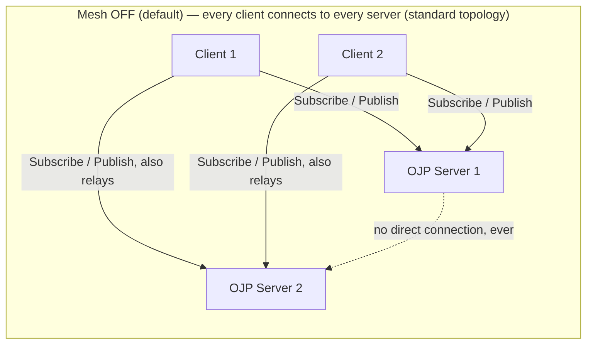
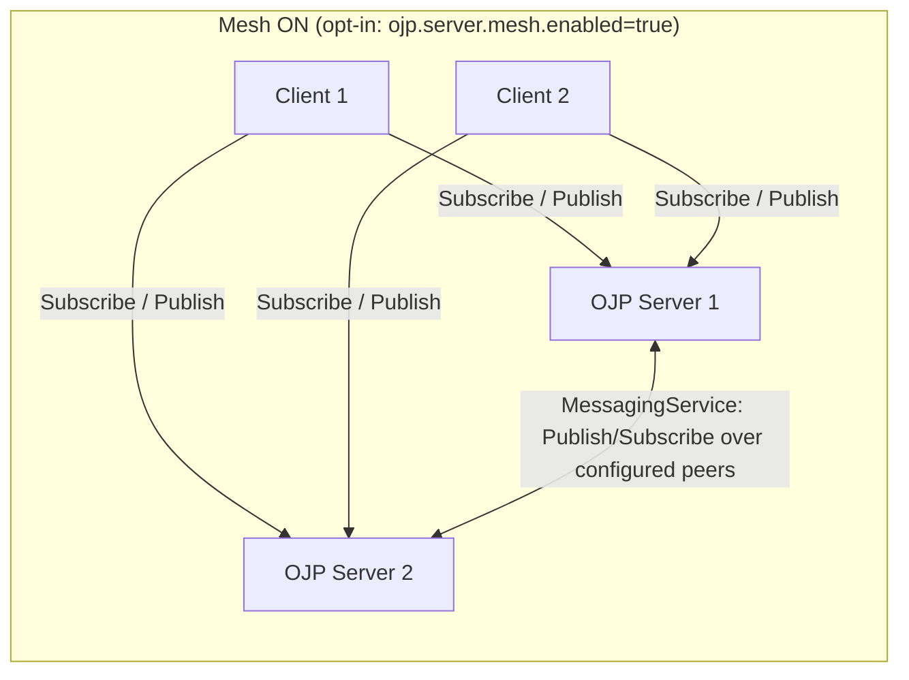

# OJP Generic Messaging Protocol — Executive Summary

## Question

How should OJP servers exchange messages with each other (e.g. RAFT
leader-election, cache-invalidation broadcasts) and with connected JDBC
clients (e.g. "this server is restarting")? **Constraint, revised through
review (see the full analysis's Question section for the complete
reasoning):** by default, zero new connections between OJP servers may ever
be opened — this is satisfied unconditionally by reusing the existing
`ojp-jdbc-driver` sessions as a relay medium. The one deliberate, opt-in
exception is a direct server-to-server link (`ojp.server.mesh.enabled`),
needed for RAFT and for serverless/idle-client deployments — but even that
link must be built by reusing the driver's client-side gRPC plumbing as a
library, never a bespoke socket or second wire protocol.

## Quick Answer

Add a new, generic `MessagingService` gRPC contract (`Publish`, `Subscribe`,
and `Ack` RPCs; topic + opaque payload + delivery mode: fire-and-forget or
guaranteed) to `ojp-grpc-commons`. `Subscribe` is a long-lived
server-streaming call the subscriber initiates and keeps open; `Publish` is
a small unary call that does a de-dup check, then a local fan-out to *every*
currently-subscribed stream for that topic (never a single arbitrarily
chosen one), then acks. See §5.1 of the full analysis for the complete
service definition and the mechanics of both RPCs.
Application clients reach it through `ojp-jdbc-driver`, the same way they use
any other RPC today. **Two complementary topologies get a message from one
OJP server to another:**

- **Client-relay (default, always on, no config):** in the **standard OJP
  topology, every client is multinode-connected to every server** (using the
  existing `jdbc:ojp[host1:port1,host2:port2]_url` format) — a client
  connected to a single server is the exception (partition/misconfiguration),
  not the rule. Each such client already holds a `Subscribe` stream on every
  server; it forwards cluster-wide envelopes it receives from one server onto
  the others it's connected to. This directly is "use the clients as a means
  to communicate between OJP servers," requires zero new connections, and is
  the right default whenever opening a direct server-to-server link is hard,
  disallowed, or just not worth the config. Its trade-offs: (1) coverage
  depends entirely on which multinode clients happen to be connected right
  now — with zero clients connected, zero cross-server delivery happens,
  silently; (2) because *every* connected client independently relays,
  broadcasting one message costs up to `C × (N-1)` redundant relay RPCs (C =
  connected clients, N = servers) — cheap to reject via dedup, but real
  network/CPU cost that scales with client population. See §5.3.1/§5.3.4 of
  the full analysis for the complete math and worked examples.
- **Direct mesh (opt-in, `ojp.server.mesh.enabled=false` by default):** each
  server reuses the driver's *internal* client-side gRPC plumbing (channel
  management, retries, circuit breaker — already shared via
  `ojp-grpc-commons`) as a plain library dependency — **not** the public
  JDBC `Connection` API, **not** a new kind of socket — to hold one channel
  per configured peer, driven by server startup/config rather than client
  activity. This is required for RAFT and recommended whenever client
  presence can't be assumed (e.g. serverless deployments).

## Key Design Points

- **Envelope:** `message_id`, `topic`, opaque `payload` bytes, `producer_id`,
  timestamp, `delivery_mode`, optional `ttl_seconds`, plus `cluster_scope`
  (is this meant for the whole cluster, or just this server's own clients?)
  and `max_relay_hops` (bounds client-relay fan-out). Generic on purpose —
  no hardcoded knowledge of RAFT/cache/lifecycle in the protocol itself.
- **Two delivery modes:**
  - **Fire-and-forget** (at-most-once, no ack, no retry) — recommended for
    RAFT consensus messages and cache invalidation, both of which already
    tolerate loss/duplication at the application level.
  - **Guaranteed delivery** (at-least-once, ack + retry + TTL + dedup via a
    Caffeine-backed seen-set) — recommended for the "server restarting"
    notice, since a client should durably receive that particular signal.
- **Ordering:** only per-(producer, topic) FIFO is promised, not a global
  total order — sufficient for all three example use cases, and honest
  about the limits of the design.
- **Push to clients:** implemented as a server-streaming `Subscribe` RPC that
  the driver opens (client-initiated, same shape as today's `executeQuery`
  streaming), so the server never has to dial the client — it just writes to
  a stream the client already opened. Surfaced to applications via
  `SQLWarning` (an existing pattern in this codebase) and/or an optional
  listener callback.
- **Direct mesh (opt-in, off by default):** once
  `ojp.server.mesh.enabled=true`, each server opens exactly one channel +
  one `Subscribe` stream per peer listed in a dedicated
  `ojp.server.mesh.peers` setting (deliberately *not* the client-populated
  `serverEndpoints` list, since that only exists while a client is
  connected). This forms a full mesh, which is acceptable at expected OJP
  cluster sizes; would need a gossip/tree topology if OJP ever targets
  hundreds of nodes (flagged as an open question, not solved here).

## Mesh OFF (client-relay) vs. Mesh ON (direct) at a Glance

Both diagrams show each client connected to **both** servers, since that's
the standard topology — a client pinned to a single server is the exception,
not the rule (see §5.3.1/§5.5 for why this distinction matters for
coverage and amplification). Local fan-out on either server always targets
**every** currently-subscribed client, never a single one.

Full sequence diagrams for both modes — including the cascading-relay
amplification (2 clients independently relaying the same message) and a
point-to-point RAFT example via `PublishRequest.target_id` — are in §5.5 of
the full analysis.

## Client-relay vs. Direct Mesh — Pros and Cons

| | Client-relay (default) | Direct mesh (opt-in) |
|---|---|---|
| New connections needed | None | One channel per configured peer |
| Delivery guarantee | Best-effort, probabilistic (depends on current client connectivity) | Deterministic, independent of clients |
| Cost of a broadcast | `O(clients × servers)` — every connected client relays independently | `O(servers)` — one call per peer, regardless of client count |
| Works with zero clients connected | No | Yes |
| Good fit | Cache invalidation and other idempotent, best-effort, low-frequency cluster-wide topics | RAFT; anything needing bounded-latency, guaranteed-to-attempt delivery, or a tight timing budget |
| New trust surface | None on the wire, but consensus traffic would travel through untrusted application processes if allowed onto it (never allowed for RAFT — see below) | Yes — needs its own inter-server credential story, but keeps the trust perimeter to just the N configured servers |
| Recommendation | **Default**, and the right choice when a direct server-to-server link is hard, disallowed, or not worth configuring | **Required for RAFT**; recommended whenever client presence can't be assumed (e.g. serverless) |

See §5.3.3 of the full analysis for the complete comparison and reasoning.

**A note before diving into the RAFT-specific argument below: RAFT is used
throughout this document as a running example, not a final decision.**
Whether RAFT (crash-fault-tolerant) or a Byzantine-fault-tolerant alternative
(PBFT, HotStuff, Tendermint, BFT-SMaRt) is the right choice for Mesh ON, and
whether any of them changes the "never over client-relay" rule for Mesh OFF,
is analyzed separately in
[OJP_CONSENSUS_ALGORITHM_ANALYSIS.md](./OJP_CONSENSUS_ALGORITHM_ANALYSIS.md).
Short version of that analysis's answer: no BFT algorithm fixes client-relay's
trust-perimeter problem as things are designed today, so the mesh-required
verdict below holds regardless of final algorithm choice.

### Why RAFT specifically requires the direct mesh (not just "less reliable")

This was previously stated as a soft, hedged rule; review correctly pushed
back that "less secure, less reliable" isn't a real argument, since RAFT is
explicitly designed to tolerate arbitrary message loss, delay, duplication,
and reordering — a dropped or duplicated relay hop, on its own, is not a
problem RAFT needs help with. The full analysis (§5.3.5) now gives the
actual, honest argument, and it rests on two different points, not one:

1. **Trust perimeter, not reliability.** RAFT is a crash-fault-tolerant
   protocol, explicitly *not* Byzantine-fault-tolerant (per the original Raft
   paper) — it assumes every message a node acts on genuinely came from one
   of the fixed, known cluster members. Client-relay routes `raft.*`
   envelopes through application JDBC processes that were never part of the
   RAFT membership — typically the operator's own applications, not
   strangers, but trusted for a narrower purpose (querying a database) than
   the one being asked of them here (cluster leader election); see
   [OJP_CONSENSUS_ALGORITHM_ANALYSIS.md §6](./OJP_CONSENSUS_ALGORITHM_ANALYSIS.md#6-does-it-matter-that-clients-are-applications-not-strangers)
   for why that distinction doesn't close the gap. This silently widens
   RAFT's trust perimeter from "the N configured servers" to "the N servers
   plus every connected application." That's a safety concern (a forged or
   replayed vote), not a liveness one.
2. **Amplification defeats RAFT's timing model.** RAFT's liveness depends on
   `broadcastTime << electionTimeout` (heartbeats every ~50–150ms). Client
   relay's `C × (N-1)` redundant-RPC cost per broadcast (see the table above)
   turns a deliberately small, predictable protocol into a load that scales
   with application traffic — a concrete, arithmetic problem, not a vague one.

Confidence: high (85%) on the trust-perimeter argument, high (80%) on the
amplification argument (both follow from documented RAFT properties and
arithmetic already in the full analysis), lower (55%) on exactly how severe
an exploit of the trust gap would be in practice, since that depends on
OJP's not-yet-designed inter-server/client credential model (§8.3).

## Options Considered (see full analysis for pros/cons)

| Option | Verdict |
|---|---|
| A. Piggyback messages on `StatementService` as fake SQL calls | Rejected as primary mechanism (abuses SQL semantics); acceptable only as an emergency single-message fallback |
| B. Keep growing ad-hoc `ConnectionDetails` fields (like `clusterHealth`) | Rejected as a general mechanism (not pub/sub, no push, no ordering); kept for its original narrow purpose |
| C. New dedicated `MessagingService`, transported via the JDBC driver, in either topology above | **Recommended** |
| D. External broker (Kafka/RabbitMQ/NATS) | Rejected — contradicts the "no new infra / reuse driver" constraint |
| E. Direct server-to-server socket/gRPC link (classic RAFT transport) | Explicitly disallowed by the problem statement |

## Biggest Open Concerns

1. Inter-server messaging (direct mesh) needs its own authentication story —
   the driver was built to carry *database* credentials, not cluster-internal
   trust. This should be settled (shared cluster secret? mTLS peer identity?)
   before any implementation starts; the codebase does not appear to have
   this today.
2. Client-relay puts new, non-JDBC responsibility on the driver (forwarding
   cluster-internal traffic on behalf of the server cluster, not the
   embedding application) — keep its scope strictly bounded (topic
   allowlist, hop limit, RAFT never eligible) and consider a per-connection
   opt-out.

## Other Notable Risks / Questions Raised

- Expected cluster size (affects whether a full server mesh is acceptable or
  a gossip topology is needed).
- "Guaranteed delivery" as designed here only survives while the publishing
  process is alive — it is not a durable, crash-surviving outbox. If a future
  use case needs that, it's a signal to revisit the "no broker" constraint
  rather than bolt a WAL onto this design.
- Backpressure/queue-bounding for slow subscribers needs explicit acceptance
  criteria before implementation, not just "add a queue."
- Client-relay coverage is invisible when it fails — a missed hop produces no
  error anywhere. This needs a loud operator-facing callout so nobody assumes
  "cluster-wide" means "guaranteed to reach every node" under the default
  mode.
- Client-relay's amplification cost (`C × (N-1)` redundant relay attempts per
  broadcast) is a real, quantified operational limit, not just a theoretical
  concern — e.g. ~800 redundant RPCs every 50–150ms at 200 clients / 5
  servers if something were published on a RAFT-heartbeat-like frequency.
  This is the concrete reason client-relay should be restricted to
  low-frequency, idempotent topics and should carry a documented rate
  ceiling in operator guidance.

## Suggested Phasing

1. `MessagingService` + fire-and-forget only, validated with the restart
   notice first (pure server-to-its-own-clients, no cross-server complexity).
2. Client-relay (default mode), validated with cache invalidation.
3. Inter-server credential/trust mechanism.
4. Direct mesh (opt-in), re-validated with cache invalidation to confirm both
   modes agree on wire format and dedup.
5. Add guaranteed delivery; switch the restart notice to it.
6. RAFT last, on top of the proven substrate, **requiring the direct mesh**
   (never client-relay) — likely adopting an existing Java RAFT library
   rather than writing RAFT from scratch.

## Serverless / Zero-Client Deployments, and "Is It Actually a Problem?"

A reviewer asked how this works when application clients scale to zero for
long stretches, and — more pointedly — whether it's actually a problem if
OJP servers simply don't communicate during that idle window.

**Short answer:** while genuinely idle (zero clients, zero query traffic),
no — there's nothing user-visible at stake. The real risk is at the
*boundary*: the moment the first client reconnects, if it needs a decision
that depends on cluster state that only converges through server-to-server
messaging. For idempotent, self-healing concerns (a stale cache entry, a
RAFT election finishing a beat late) that's a bounded, likely-acceptable
cold-start cost. For coordination where "wrong answer before consensus"
is an actual correctness bug rather than a stale-but-harmless one (e.g. two
servers both briefly believing themselves leader), it's a real problem worth
avoiding outright — and that's exactly the case the direct mesh exists for,
since it's the only one of the two modes unaffected by the client population
going to zero. See §6.1 of the full analysis for the complete reasoning and
confidence levels.

The mesh remains opt-in even for serverless deployments — enabling it is
the explicit choice an operator makes to get this guarantee, not a default.
One open question remains: is there any deployment model where the **OJP
servers themselves** (not just client apps) scale to zero between requests?
If so, neither mode here covers that case and it would need a different,
likely externally-coordinated approach. See §6.1/§8.8 of the full analysis.

## Full Analysis

See [OJP_MESSAGING_PROTOCOL_ANALYSIS.md](./OJP_MESSAGING_PROTOCOL_ANALYSIS.md)
for the detailed proto sketch, delivery-mode comparison table, per-use-case
mapping, and the full list of concerns and open questions.

## Related Analysis: Which Consensus Algorithm?

See [OJP_CONSENSUS_ALGORITHM_ANALYSIS.md](./OJP_CONSENSUS_ALGORITHM_ANALYSIS.md)
for the dedicated comparison of RAFT against Byzantine-fault-tolerant
alternatives (PBFT, HotStuff, Tendermint, BFT-SMaRt) for Mesh ON vs. Mesh OFF
— this document never assumes RAFT is the final choice, only a convenient,
well-documented example.
