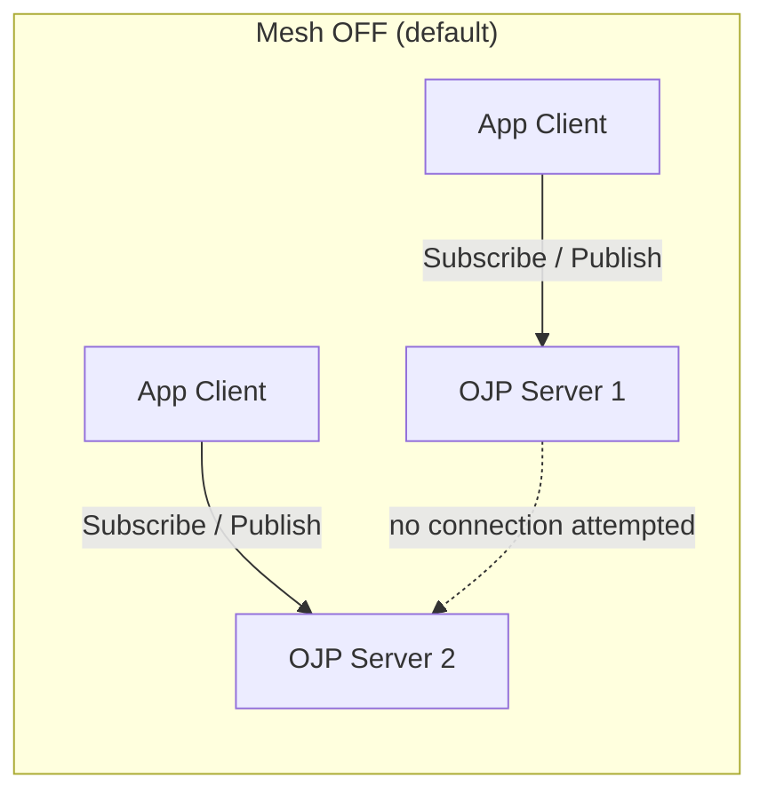
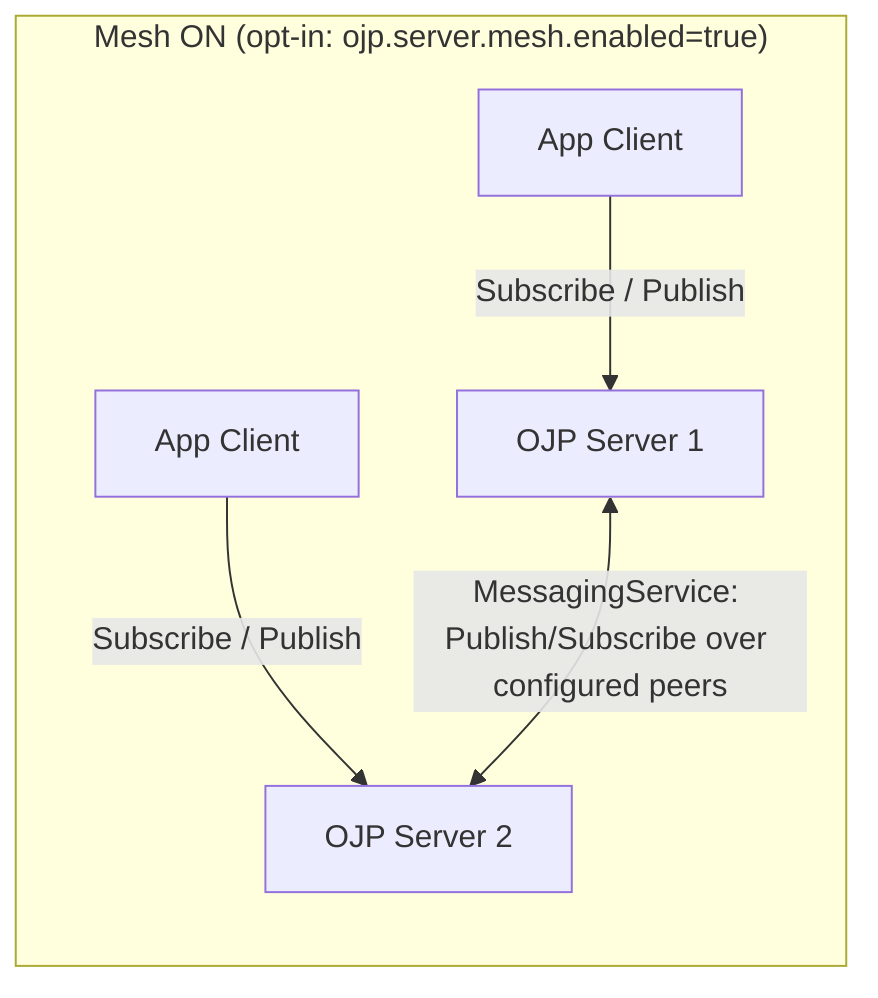

# OJP Generic Messaging Protocol — Executive Summary

## Question

How should OJP servers exchange messages with each other (e.g. RAFT
leader-election, cache-invalidation broadcasts) and with connected JDBC
clients (e.g. "this server is restarting"), given a hard constraint that OJP
servers must **not** connect directly to each other — all communication must
reuse the existing `ojp-jdbc-driver`?

## Quick Answer

Add a new, generic `MessagingService` gRPC contract (topic + opaque payload +
delivery mode: fire-and-forget or guaranteed) to `ojp-grpc-commons`.
Application clients reach it through `ojp-jdbc-driver`, the same way they use
any other RPC today. OJP servers reach their peers by reusing the driver's
*internal* client-side gRPC plumbing (channel management, retries, circuit
breaker — already shared via `ojp-grpc-commons`) as a plain library
dependency, **not** by going through the public JDBC `Connection` API and
**not** by opening any new kind of socket. This server-to-server path is
**opt-in and disabled by default** (`ojp.server.mesh.enabled=false`) — a
default OJP deployment makes zero new outbound connections; an operator must
explicitly enable it and configure a peer list to use RAFT/cache-invalidation
across servers.

## Key Design Points

- **Envelope:** `message_id`, `topic`, opaque `payload` bytes, `producer_id`,
  timestamp, `delivery_mode`, optional `ttl_seconds`. Generic on purpose —
  no hardcoded knowledge of RAFT/cache/lifecycle in the protocol itself.
- **Two delivery modes:**
  - **Fire-and-forget** (at-most-once, no ack, no retry) — recommended for
    RAFT consensus messages and cache invalidation, both of which already
    tolerate loss/duplication at the application level.
  - **Guaranteed delivery** (at-least-once, ack + retry + TTL + dedup via a
    Caffeine-backed seen-set) — recommended for the "server restarting"
    notice, since a client should durably receive that particular signal.
- **Ordering:** only per-(producer, topic) FIFO is promised, not a global
  total order — sufficient for all three example use cases, and honest
  about the limits of the design.
- **Push to clients:** implemented as a server-streaming `Subscribe` RPC that
  the driver opens (client-initiated, same shape as today's `executeQuery`
  streaming), so the server never has to dial the client — it just writes to
  a stream the client already opened. Surfaced to applications via
  `SQLWarning` (an existing pattern in this codebase) and/or an optional
  listener callback.
- **Server-to-server (opt-in, off by default):** once
  `ojp.server.mesh.enabled=true`, each server opens exactly one channel +
  one `Subscribe` stream per peer listed in a dedicated
  `ojp.server.mesh.peers` setting (deliberately *not* the client-populated
  `serverEndpoints` list, since that only exists while a client is
  connected). This forms a full mesh, which is acceptable at expected OJP
  cluster sizes; would need a gossip/tree topology if OJP ever targets
  hundreds of nodes (flagged as an open question, not solved here).

## Mesh OFF vs. Mesh ON at a Glance

Full sequence diagrams for both modes, including the cache-invalidation and
RAFT-vote message flows, are in §5.5 of the full analysis.

## Options Considered (see full analysis for pros/cons)

| Option | Verdict |
|---|---|
| A. Piggyback messages on `StatementService` as fake SQL calls | Rejected as primary mechanism (abuses SQL semantics); acceptable only as an emergency single-message fallback |
| B. Keep growing ad-hoc `ConnectionDetails` fields (like `clusterHealth`) | Rejected as a general mechanism (not pub/sub, no push, no ordering); kept for its original narrow purpose |
| C. New dedicated `MessagingService`, transported via the JDBC driver | **Recommended** |
| D. External broker (Kafka/RabbitMQ/NATS) | Rejected — contradicts the "no new infra / reuse driver" constraint |
| E. Direct server-to-server socket/gRPC link (classic RAFT transport) | Explicitly disallowed by the problem statement |

## Biggest Open Concern

Inter-server messaging needs its own authentication story — the driver was
built to carry *database* credentials, not cluster-internal trust. This
should be settled (shared cluster secret? mTLS peer identity?) before any
implementation starts; the codebase does not appear to have this today.

## Other Notable Risks / Questions Raised

- Expected cluster size (affects whether a full server mesh is acceptable or
  a gossip topology is needed).
- "Guaranteed delivery" as designed here only survives while the publishing
  process is alive — it is not a durable, crash-surviving outbox. If a future
  use case needs that, it's a signal to revisit the "no broker" constraint
  rather than bolt a WAL onto this design.
- Backpressure/queue-bounding for slow subscribers needs explicit acceptance
  criteria before implementation, not just "add a queue."

## Suggested Phasing

1. `MessagingService` + fire-and-forget only, validated with cache
   invalidation and the restart notice (lower risk than RAFT).
2. Inter-server credential/trust mechanism.
3. Turn on the server-to-server mesh.
4. Add guaranteed delivery; switch the restart notice to it.
5. RAFT last, on top of the proven substrate — likely adopting an existing
   Java RAFT library rather than writing RAFT from scratch.

## Serverless / Zero-Client Deployments

A reviewer asked how this works when application clients scale to zero for
long stretches (serverless-style deployments), since RAFT/cache-invalidation
must keep working with no client traffic. **Answer: this already works, and
that's exactly what the (opt-in) server-to-server mesh in the full analysis
is** — each OJP server reuses the driver's internal client-side gRPC
plumbing as a library dependency and connects directly to its peers'
`MessagingService`, driven by server config/lifecycle, not by application
client activity. No client needs to be connected for this path to function,
but the mesh must be explicitly enabled — it stays off by default even in
this scenario; enabling it is the point. The one open question this raises:
is there any deployment model where the **OJP servers themselves** (not just
client apps) scale to zero between requests? If so, this mesh design
doesn't cover that case and would need a different approach. See
§6.1/§8.8 of the full analysis.

## Full Analysis

See [OJP_MESSAGING_PROTOCOL_ANALYSIS.md](./OJP_MESSAGING_PROTOCOL_ANALYSIS.md)
for the detailed proto sketch, delivery-mode comparison table, per-use-case
mapping, and the full list of concerns and open questions.
