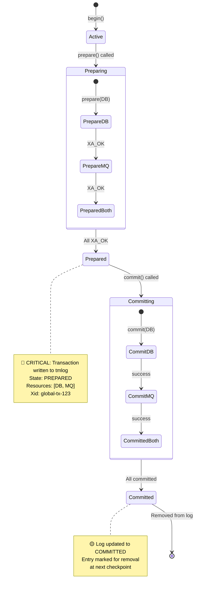
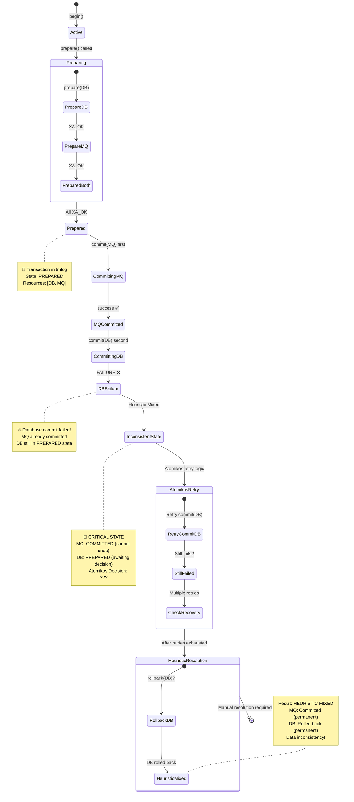
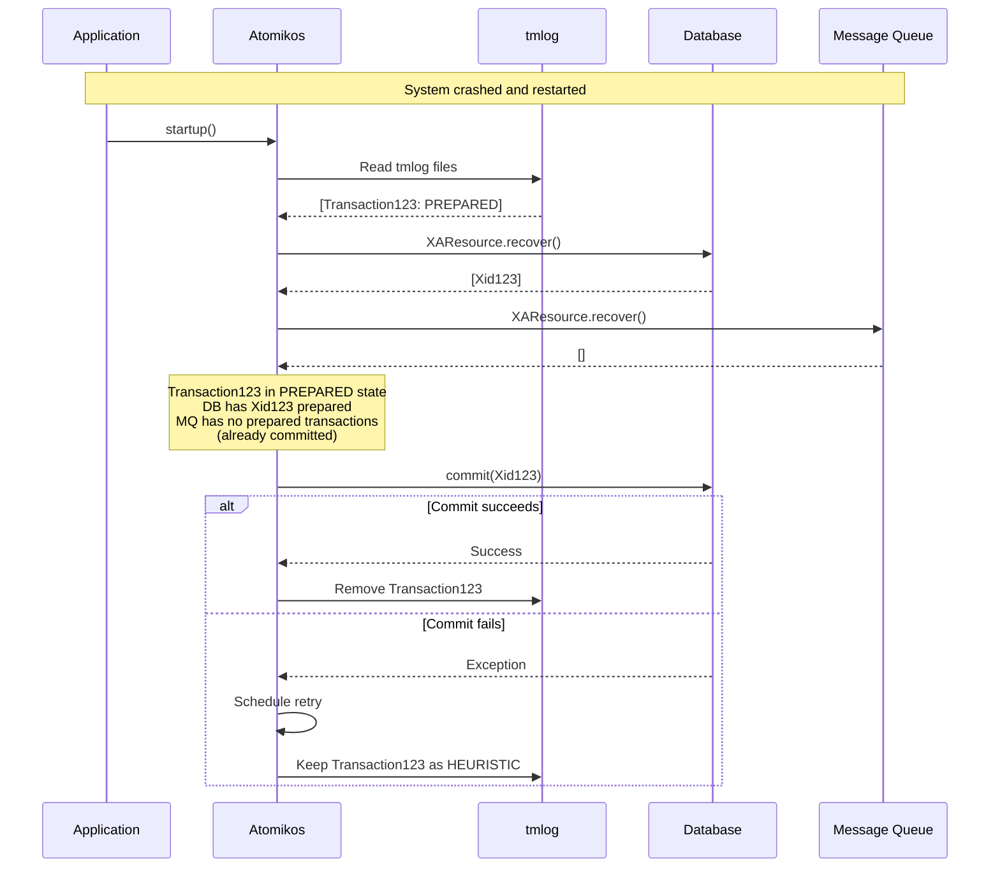

# Atomikos Transaction Logging (tmlog) Research

**Date:** 2026-01-23  
**Author:** GitHub Copilot Research  
**Related:** XA_TRANSACTION_FLOW_DIAGRAMS.md, DATABASE_XA_POOL_LIBRARIES_COMPARISON.md

## Executive Summary

This document provides comprehensive research on how Atomikos uses its transaction log (tmlog) file to manage distributed XA transactions. It covers:

1. **Transaction Logging Mechanism**: When and what Atomikos writes to the tmlog
2. **Transaction State Management**: Complete lifecycle of transactions in the log
3. **Recovery and Cleanup**: When transactions are removed from the log
4. **Failure Scenarios**: Behavior during various failure conditions including the critical scenario where prepare succeeds but commit fails on one resource
5. **Mermaid Diagrams**: Visual representation of transaction states and transitions

## Table of Contents

1. [Overview](#overview)
2. [tmlog File Purpose and Structure](#tmlog-file-purpose-and-structure)
3. [When Atomikos Stores Transactions](#when-atomikos-stores-transactions)
4. [When Atomikos Removes Transactions](#when-atomikos-removes-transactions)
5. [Transaction States in tmlog](#transaction-states-in-tmlog)
6. [Successful Transaction Flow](#successful-transaction-flow)
7. [Failed Transaction Scenario](#failed-transaction-scenario)
8. [Rollback After Prepare Question](#rollback-after-prepare-question)
9. [Recovery Process](#recovery-process)
10. [Configuration](#configuration)
11. [References](#references)

---

## Overview

Atomikos is a popular open-source transaction manager that implements the JTA (Java Transaction API) and provides support for distributed XA transactions across multiple resources (databases, message queues, etc.). The transaction log (tmlog file) is critical for ensuring ACID properties and recovery in case of failures.

### Key Concepts

- **Two-Phase Commit (2PC)**: Protocol for coordinating distributed transactions across multiple resources
- **XA Protocol**: Industry-standard protocol for distributed transaction processing
- **Transaction Manager (TM)**: Atomikos acts as the coordinator of distributed transactions
- **Resource Manager (RM)**: Individual databases or message queues participating in transactions
- **Transaction Log**: Persistent storage of transaction states for recovery purposes

---

## tmlog File Purpose and Structure

### Purpose

The tmlog file serves several critical functions:

1. **Durability**: Ensures transaction decisions survive system crashes
2. **Recovery**: Enables resolution of in-doubt transactions after restart
3. **Consistency**: Maintains distributed transaction atomicity across failures
4. **Audit Trail**: Provides record of transaction decisions for debugging

### File Structure

- **Location**: Configured via `com.atomikos.icatch.log_base_dir` property (default: current working directory)
- **Naming**: Files are named with incrementing numbers (e.g., `tmlog1.log`, `tmlog2.log`)
- **Format**: Binary format containing serialized transaction state information
- **Checkpointing**: New log files are created periodically, old ones are archived/deleted

### What Gets Logged

The tmlog contains:
- Transaction ID (Xid)
- List of participating resources
- Transaction state (prepared, committed, aborted)
- Timestamp information
- Resource-specific recovery information

---

## When Atomikos Stores Transactions

Atomikos writes to the transaction log at critical points in the transaction lifecycle:

### 1. Not Logged During Active Phase

**When**: Transaction is started and operations are executing  
**Logged**: ❌ No  
**Reason**: Active transactions don't need persistence yet; they can be safely aborted on crash

### 2. Logged During Prepare Phase

**When**: Transaction enters the PREPARED state (first phase of 2PC)  
**Logged**: ✅ YES - This is the critical logging point  
**Reason**: After prepare succeeds on all resources, the transaction is "in-doubt" and MUST be recovered

**Details:**
- When `prepare()` is called on all XA resources
- If all resources vote "YES" (XA_OK), transaction state is written to log
- Log entry includes all participating resources and their recovery information
- This write is synchronous and blocks until confirmed on disk

### 3. Logged During Commit/Rollback Phase

**When**: Final decision (commit or rollback) is being executed  
**Logged**: ✅ YES - Updated state  
**Reason**: To record the final outcome for recovery purposes

**Details:**
- Transaction state is updated to COMMITTED or ABORTED
- This may be a log update rather than a new entry
- Ensures recovery knows the final decision

### 4. Not Logged After Completion

**When**: All resources have acknowledged commit/rollback  
**Logged**: ❌ No (entry is marked for removal)  
**Reason**: Transaction is fully resolved; no recovery needed

---

## When Atomikos Removes Transactions

Atomikos removes transaction log entries through a process called **checkpointing**:

### Immediate Marking for Removal

**When**: Transaction reaches a terminal state (fully committed or fully rolled back)  
**Action**: Entry is marked as "resolved" and eligible for removal  
**Note**: Not immediately deleted from disk

### Checkpointing Process

**When**: 
- Periodically based on configuration
- When log file reaches certain size
- During clean shutdown

**Process**:
1. Create new log file with incremented number
2. Write only unresolved (in-doubt) transactions to new file
3. Mark old log file for archival/deletion
4. Delete/archive old log files containing only resolved transactions

### Configuration Parameters

```properties
# Enable/disable transaction logging (should always be true in production)
com.atomikos.icatch.enable_logging=true

# Directory for transaction logs
com.atomikos.icatch.log_base_dir=./atomikos-logs

# Number of transactions before checkpoint
com.atomikos.icatch.checkpoint_interval=500

# Maximum number of transaction log files to keep
com.atomikos.icatch.max_actives=50
```

### Why Not Immediate Deletion?

- **Performance**: Disk I/O for each transaction completion would be expensive
- **Batching**: Checkpointing allows batch cleanup of many resolved transactions
- **Consistency**: Ensures log is always in a consistent state for recovery

---

## Transaction States in tmlog

Atomikos transactions in the tmlog file can be in the following states:

### Normal States

1. **PREPARED (IN-DOUBT)**
   - All resources have voted YES to commit
   - Transaction is persistent in log
   - Coordinator hasn't sent final decision yet
   - **This is the only state that MUST survive crashes**

2. **COMMITTED**
   - Coordinator decided to commit
   - Commit decision has been logged
   - Resources may still be processing commit

3. **ABORTED (ROLLED BACK)**
   - Transaction was rolled back
   - Decision has been logged
   - Resources may still be processing rollback

### Heuristic States

When resources make independent decisions (due to timeouts or failures), transactions can enter heuristic states:

4. **HEURISTIC COMMIT**
   - Resource committed when coordinator wanted rollback
   - Indicates potential inconsistency
   - Requires manual intervention

5. **HEURISTIC ROLLBACK**
   - Resource rolled back when coordinator wanted commit
   - Indicates potential inconsistency
   - Requires manual intervention

6. **HEURISTIC MIXED**
   - Some resources committed, others rolled back
   - **Most serious inconsistency**
   - Requires immediate manual resolution

7. **HEURISTIC HAZARD**
   - Outcome unknown for some resources
   - Temporary state during investigation
   - May resolve to other heuristic states

### State Transition Rules

```
ACTIVE → PREPARED → COMMITTED → REMOVED
         ↓
         ABORTED → REMOVED

PREPARED → HEURISTIC_* (on resource failure/timeout)
```

---

## Successful Transaction Flow

### Scenario: Two-Phase Commit Success

A transaction successfully commits across two resources (Database + Message Queue).



### Transaction Log Timeline

| Time | Event | tmlog Action | Log State |
|------|-------|--------------|-----------|
| T0 | `begin()` | ❌ No write | Empty |
| T1 | Application executes SQL/MQ operations | ❌ No write | Empty |
| T2 | `prepare()` called on Database | ❌ Not yet | Empty |
| T3 | Database returns XA_OK | ❌ Not yet | Empty |
| T4 | `prepare()` called on Message Queue | ❌ Not yet | Empty |
| T5 | Message Queue returns XA_OK | ✅ **WRITE TO LOG** | **PREPARED** |
| T6 | `commit()` decision made | 🟡 Update log | COMMITTED |
| T7 | `commit()` called on Database | ❌ No change | COMMITTED |
| T8 | Database commit succeeds | ❌ No change | COMMITTED |
| T9 | `commit()` called on Message Queue | ❌ No change | COMMITTED |
| T10 | Message Queue commit succeeds | 🟢 Mark for removal | Ready for checkpoint |
| T11+ | Next checkpoint | ❌ Remove from log | Empty |

### Key Observations

1. **Single Critical Write**: Only one mandatory write to tmlog (at PREPARED state)
2. **Synchronous Prepare**: The prepare phase blocks until log write completes
3. **Asynchronous Removal**: Cleanup happens during periodic checkpointing
4. **Recovery Window**: Between T5 and T11, transaction can be recovered after crash

---

## Failed Transaction Scenario

### Scenario: Prepare Succeeds, Commit Fails on Database

This is a critical failure scenario where:
1. Both resources (Database and Message Queue) successfully prepare
2. Commit is sent to Message Queue → succeeds
3. Commit is sent to Database → **FAILS**



### Transaction Log Timeline (Failure Scenario)

| Time | Event | tmlog Action | Log State | Critical Notes |
|------|-------|--------------|-----------|----------------|
| T0 | `begin()` | ❌ No write | Empty | |
| T1 | Operations on DB and MQ | ❌ No write | Empty | |
| T2-T4 | `prepare()` succeeds on both | ✅ **WRITE** | **PREPARED** | Both resources ready |
| T5 | Decide to commit | 🟡 Update | COMMITTING | Decision made |
| T6 | `commit(MQ)` called | ❌ No change | COMMITTING | MQ processing |
| T7 | MQ commit succeeds ✅ | ❌ No change | COMMITTING | MQ now permanent |
| T8 | `commit(DB)` called | ❌ No change | COMMITTING | DB attempting |
| T9 | **DB commit FAILS** ❌ | 🟡 Update | **PREPARED (DB only)** | Critical failure |
| T10 | Atomikos retry #1 | ❌ No change | PREPARED | Auto-retry |
| T11 | Atomikos retry #2 | ❌ No change | PREPARED | Auto-retry |
| T12 | Atomikos retry #3 | ❌ No change | PREPARED | Auto-retry |
| T13 | All retries exhausted | 🔴 Update | **HEURISTIC_MIXED** | Inconsistency! |
| T14+ | Manual intervention needed | 🟡 Update | HEURISTIC_MIXED | Permanent log entry |

### What Happens in Detail

#### Phase 1: Both Resources Prepared (Success)
- Database: PREPARED state in its own transaction log
- Message Queue: PREPARED state in its own transaction log
- Atomikos: Writes PREPARED to tmlog with both resources listed

#### Phase 2: Message Queue Commits (Success)
- Message Queue: Processes commit, moves to COMMITTED state, removes from its log
- Message Queue changes are now **permanent and cannot be undone**
- Atomikos: Waits for Database commit to complete

#### Phase 3: Database Commit Fails (Critical Point)
Possible reasons for database commit failure:
- Network timeout
- Database crash
- Disk full
- Constraint violation (shouldn't happen after prepare, but possible)
- Deadlock (rare but possible)

#### Phase 4: Atomikos Response

**IMPORTANT**: Atomikos will NOT send a rollback to the database after prepare succeeded!

Instead, Atomikos will:

1. **Retry Commit Multiple Times**
   - Atomikos attempts to re-send the commit command to the database
   - Configured by `com.atomikos.icatch.max_retries` (default: 5)
   - Delay between retries configured by `com.atomikos.icatch.retry_delay`

2. **Keep Transaction in PREPARED State**
   - Database transaction remains in PREPARED state
   - Atomikos tmlog keeps the entry as PREPARED
   - Transaction is considered "in-doubt"

3. **Log Heuristic Exception**
   - If retries are exhausted and DB still hasn't committed
   - Atomikos logs a heuristic exception
   - Transaction state becomes HEURISTIC_MIXED in tmlog

4. **Recovery Process**
   - On next restart, Atomikos reads tmlog
   - Finds transaction with HEURISTIC_MIXED state
   - Continues retry attempts to commit the database
   - May require manual intervention

---

## Rollback After Prepare Question

### Question

> In the scenario where prepare succeeded on both resources, commit was sent to the queue manager and succeeded, but the database could not commit - is there any possibility that Atomikos will send a rollback for the database resource after prepare succeeded and commit failed?

### Answer: NO - Atomikos Will NOT Rollback After Prepare

**Key Principle**: Once a resource has successfully prepared (voted YES in 2PC), the transaction manager is **committed to committing the transaction**. Rollback is no longer an option.

#### Why No Rollback After Prepare?

This behavior is mandated by the **XA specification and 2PC protocol**:

1. **Prepare Vote is a Promise**
   - When a resource returns XA_OK to prepare(), it **promises** it can commit
   - The resource must hold locks and persist changes durably
   - The resource **must** be able to commit or rollback on coordinator's command
   - Rolling back would violate the atomicity guarantee

2. **Atomicity Requirement**
   - If one resource commits, ALL must commit (or all must rollback)
   - Message Queue already committed (permanent changes)
   - Database MUST also commit to maintain atomicity
   - Rollback would create inconsistent state

3. **XA State Machine Constraint**
   - In XA protocol, after PREPARED state, only valid transitions are:
     - PREPARED → COMMITTED (commit success)
     - PREPARED → HEURISTIC_* (failure/timeout)
   - PREPARED → ABORTED is **not allowed** after global commit decision

#### What Atomikos Will Do Instead

1. **Persistent Retry Strategy**
   ```
   PREPARED → RETRY_COMMIT → RETRY_COMMIT → ... → HEURISTIC_MIXED
   ```

2. **Never Sends Rollback**
   - Atomikos will keep trying to commit the database
   - Retries continue across application restarts (via tmlog)
   - Only manual intervention can resolve (by completing the commit or accepting inconsistency)

3. **Heuristic Exception**
   - If database absolutely cannot commit, administrator must:
     - Manually inspect database's prepared transactions (`XA RECOVER`)
     - Either manually commit the transaction or force rollback
     - Accept data inconsistency if rollback is chosen
     - Update application-level compensation logic

#### Technical Reasons for This Behavior

```java
// Simplified Atomikos logic (conceptual)
void commit(Xid xid) {
    // Phase 1: Prepare all resources
    boolean allPrepared = prepareAllResources(xid);
    
    if (!allPrepared) {
        // Prepare failed - ROLLBACK is OK here
        rollbackAllResources(xid);
        return;
    }
    
    // Phase 2: Commit all resources
    // CRITICAL: After this point, ROLLBACK is not an option!
    writeToTmlog(xid, PREPARED); // Persistent decision
    
    for (Resource r : resources) {
        boolean committed = false;
        int retries = 0;
        
        while (!committed && retries < MAX_RETRIES) {
            try {
                r.commit(xid);
                committed = true;
            } catch (Exception e) {
                // NEVER call r.rollback() here!
                // Only retry commit!
                retries++;
                sleep(RETRY_DELAY);
            }
        }
        
        if (!committed) {
            // Log as heuristic, keep retrying on recovery
            logHeuristicException(xid, r);
        }
    }
}
```

#### Real-World Implications

**Scenario**: Message Queue committed, Database cannot commit

- **MQ State**: Messages delivered/consumed by downstream systems
- **DB State**: Transaction stuck in PREPARED state
- **Result**: Potential duplicate processing or data loss

**Resolution Options**:

1. **Fix Database and Complete Commit** (Preferred)
   - Resolve underlying issue (disk space, network, etc.)
   - Manually commit the prepared transaction
   - Restore consistency

2. **Force Database Rollback** (Accept Inconsistency)
   - Manually rollback database's prepared transaction
   - Implement application-level compensation
   - E.g., send "undo" message to queue or log discrepancy

3. **Wait for Atomikos Recovery**
   - Let Atomikos keep retrying indefinitely
   - Database will eventually commit when issue resolves
   - Transaction holds locks (blocks other work)

#### Configuration to Minimize Risk

```properties
# Increase retry attempts
com.atomikos.icatch.max_retries=10

# Longer retry delay (milliseconds)
com.atomikos.icatch.retry_delay=10000

# Transaction timeout (milliseconds) - time before giving up
com.atomikos.icatch.default_jta_timeout=300000

# Enable detailed logging
com.atomikos.icatch.log_base_name=tmlog
com.atomikos.icatch.enable_logging=true
```

### Summary Answer

**No, Atomikos will NEVER send a rollback to the database after prepare has succeeded and commit has failed.** Instead, it will:

1. ✅ Retry commit multiple times
2. ✅ Persist the PREPARED state across restarts
3. ✅ Log heuristic exceptions if retries fail
4. ✅ Continue retry attempts after recovery
5. ❌ **Never** send rollback command
6. ❌ **Never** automatically accept inconsistency

This behavior is **by design** and is required by the XA specification to maintain the promise of transaction atomicity.

---

## Recovery Process

### When Atomikos Restarts

1. **Read tmlog Files**
   - Load all transaction entries from tmlog
   - Identify transactions in PREPARED or HEURISTIC_* states

2. **Query Resources**
   - Call `XAResource.recover()` on each resource
   - Get list of prepared transactions from each resource
   - Match against tmlog entries

3. **Resolve In-Doubt Transactions**
   - For PREPARED transactions: Retry commit or rollback based on logged decision
   - For HEURISTIC transactions: Log errors, may require manual intervention
   - For orphaned transactions (in resource but not in tmlog): Usually rollback

4. **Clean Up**
   - Remove resolved transactions from tmlog
   - Checkpoint to new log file

### Recovery Flow Diagram



---

## Configuration

### Essential Atomikos Properties

```properties
# === Transaction Logging ===
# Enable transaction logging (MUST be true in production)
com.atomikos.icatch.enable_logging=true

# Directory for transaction logs
com.atomikos.icatch.log_base_dir=./atomikos-logs

# Log file base name
com.atomikos.icatch.log_base_name=tmlog

# === Checkpointing ===
# Number of transactions between checkpoints
com.atomikos.icatch.checkpoint_interval=500

# Maximum number of active transaction logs
com.atomikos.icatch.max_actives=50

# === Timeouts ===
# Default transaction timeout (milliseconds)
com.atomikos.icatch.default_jta_timeout=300000

# Maximum transaction timeout (milliseconds)
com.atomikos.icatch.max_timeout=600000

# === Recovery ===
# Maximum retry attempts for commit/rollback
com.atomikos.icatch.max_retries=5

# Delay between retries (milliseconds)
com.atomikos.icatch.retry_delay=10000

# === Performance ===
# Number of threads for parallel recovery
com.atomikos.icatch.recovery_delay=10000

# Thread pool size for transaction management
com.atomikos.icatch.thread_pool_size=10
```

### Best Practices

1. **Always Enable Logging in Production**
   ```properties
   com.atomikos.icatch.enable_logging=true
   ```
   - Disabling logging risks data loss and inconsistency
   - Only disable for read-only or testing scenarios

2. **Use Dedicated Log Directory**
   ```properties
   com.atomikos.icatch.log_base_dir=/var/atomikos/logs
   ```
   - Separate from application logs
   - Ensure disk space monitoring
   - Regular backups recommended

3. **Tune Checkpoint Interval**
   - Lower values: More frequent cleanup, higher I/O
   - Higher values: Less I/O, larger log files
   - Typical range: 100-1000 transactions

4. **Adjust Timeouts for Your Environment**
   - Longer timeouts: More reliable but slower failure detection
   - Shorter timeouts: Faster detection but risk premature rollback
   - Consider network latency and database performance

5. **Monitor Log Directory**
   - Set up alerts for disk space
   - Check for growing log files (indicates unresolved transactions)
   - Archive old logs regularly

---

## References

### Official Documentation

1. **Atomikos Transaction Logging**
   - https://www.atomikos.com/Documentation/TransactionLogging
   - Official guide on transaction logging mechanism

2. **Atomikos JTA Properties**
   - https://www.atomikos.com/Documentation/JtaProperties
   - Complete property reference

3. **Atomikos Heuristic Exceptions**
   - https://www.atomikos.com/Documentation/HeuristicExceptions
   - Understanding heuristic outcomes

4. **Atomikos Concurrency Model**
   - https://www.atomikos.com/Documentation/ConcurrencyModel
   - Threading and transaction coordination

### Technical Resources

5. **XA Specification**
   - X/Open CAE Specification (1991)
   - Defines XA protocol and state machine

6. **Two-Phase Commit Protocol**
   - https://en.wikipedia.org/wiki/Two-phase_commit_protocol
   - Academic explanation of 2PC

7. **Stack Overflow Discussions**
   - "What are atomikos transaction logs used for?"
   - "Atomikos silently rollback transaction without any Exception"

### Related OJP Documentation

8. **XA_TRANSACTION_FLOW_DIAGRAMS.md**
   - OJP-specific XA transaction flows

9. **DATABASE_XA_POOL_LIBRARIES_COMPARISON.md**
   - Comparison of XA connection pool implementations

10. **XA_MANAGEMENT.md**
    - Multinode XA transaction management in OJP

---

## Conclusion

Atomikos' tmlog file is a critical component for ensuring distributed transaction integrity. Key takeaways:

1. **tmlog is Essential**: Never disable logging in production
2. **Critical Logging Point**: PREPARED state is when transactions MUST be logged
3. **No Rollback After Prepare**: Once prepared, only commit or heuristic resolution is possible
4. **Recovery is Automatic**: Atomikos automatically recovers in-doubt transactions on restart
5. **Heuristics Require Intervention**: Some failure scenarios need manual resolution
6. **Monitor the Logs**: Growing log files indicate unresolved transactions

Understanding this mechanism is crucial for:
- Designing reliable distributed systems
- Troubleshooting transaction failures
- Implementing proper error handling and compensation
- Configuring appropriate timeouts and retry policies

For OJP-specific XA transaction management, refer to the related documentation in this directory.
