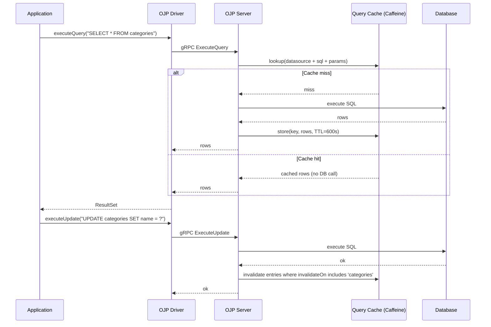

# Query Result Caching in OJP

There is a category of database query that every production system has in abundance: the question you already know the answer to. "What are the available product categories?" "What currency code does this country use?" "What are the feature flags for this tenant?" The data behind these queries barely changes. The queries themselves run constantly. And every single one burns a connection pool slot, a network round trip, and database CPU to produce a result that was exactly the same five seconds ago.

OJP 0.5.0-beta introduces server-side query result caching to address exactly this class of problem. The cache sits inside the OJP server and intercepts SELECT results before they are sent back to the driver. On a cache hit, no query ever reaches the database — the result is served directly from memory. On a cache miss, the query executes normally and the result is stored for future requests.

This article explains how that works, how to configure it, and what to watch out for.

---

## Why Put the Cache in the Control Plane

The natural instinct when adding caching to an application is to put it in the application itself — an in-memory map, a framework annotation, a local Caffeine instance. That approach has two problems.

The first is consistency: each application instance only knows about writes that it made. When instance A updates a product and instance B reads it, instance B's local cache still has the old data, and will until the TTL expires.

The second is memory efficiency: with ten application nodes each running their own cache, your effective cache memory is multiplied across all of them. Query A's result cached on node 3 provides no benefit when node 7 receives the same query — node 7 still goes to the database and stores its own copy. Ten nodes with a 100 MB cache budget each are not one 100 MB cache; they are ten isolated 100 MB caches, all potentially storing the same rows.

The OJP server does not have either problem. Because all SQL traffic from every application instance flows through the server, it has global visibility over every write. When any application instance executes an UPDATE against the products table, the OJP server can immediately invalidate the cached results for all queries that depend on that table — regardless of which instance originally cached them. The write is seen exactly once, and the invalidation fires exactly once. And the cache is a single shared instance, so all application nodes benefit from the same warmed-up entries.

This is the architectural advantage of control-plane-level caching. You get the latency savings of in-memory results without trading away consistency across your application cluster, and without multiplying your memory budget by the number of application nodes.

The server-side cache is backed by [Caffeine](https://github.com/ben-manes/caffeine), a high-performance Java caching library that uses the Window TinyLFU eviction algorithm to maintain near-optimal hit rates within a bounded memory budget. The choice is deliberate: Caffeine offers sub-millisecond lookups, built-in OpenTelemetry metrics integration, and proven production stability in projects like Spring Boot and Hibernate.

---

## How a Query Flows Through the Cache

The sequence is straightforward. When the server receives a SELECT query, it checks whether any of the cache rules configured for that datasource match the SQL. If a rule matches, the server looks up the normalized SQL plus its parameter values in the Caffeine cache. On a hit, it returns the stored rows immediately. On a miss, it executes the query against the database, stores the result, and then returns it.

Write operations follow a separate path. After an INSERT, UPDATE, or DELETE is executed against the database, the server uses JSqlParser to extract the target table name from the SQL. It then scans the cache for any entries whose `invalidateOn` configuration includes that table and evicts them. The next request for those queries will be a cache miss and will fetch fresh data.



The cache key combines the datasource name, the full normalized SQL statement, and the bound parameter values. This means `SELECT * FROM products WHERE id = ?` with parameter value `42` and the same query with parameter value `99` produce separate cache entries — each is cached independently. Two queries that differ only in whitespace or formatting are treated as different queries, which matches how most databases and ORMs already handle them.

---

## Configuration

Cache rules are expressed in the same `ojp.properties` file that already holds your connection pool configuration. Caching is disabled by default; you opt in per datasource.

Each rule specifies a Java regular expression to match against incoming SQL, a TTL, and an optional list of tables whose modification should trigger invalidation. Rules are evaluated in order — the first matching rule wins. If no rule matches, the query is not cached.

```properties
# Enable caching for the datasource named 'mydb'
mydb.ojp.cache.enabled=true

# Rule 1: cache all category queries for 10 minutes; invalidate when the categories table changes
mydb.ojp.cache.queries.1.pattern=SELECT .* FROM categories.*
mydb.ojp.cache.queries.1.ttl=600s
mydb.ojp.cache.queries.1.invalidateOn=categories

# Rule 2: cache user profile lookups for 5 minutes; invalidate on users or user_roles writes
mydb.ojp.cache.queries.2.pattern=SELECT .* FROM users WHERE id = \?
mydb.ojp.cache.queries.2.ttl=300s
mydb.ojp.cache.queries.2.invalidateOn=users,user_roles

# Rule 3: cache a rarely-changing reference table for 1 hour; TTL-only expiry, no invalidation
mydb.ojp.cache.queries.3.pattern=SELECT .* FROM country_codes.*
mydb.ojp.cache.queries.3.ttl=3600s
mydb.ojp.cache.queries.3.invalidateOn=
```

TTL values accept seconds (`600s`), minutes (`10m`), or hours (`2h`). The minimum meaningful TTL is around 10 seconds; shorter than that and the cache overhead starts to outweigh the benefit.

One detail worth knowing: if `invalidateOn` is present but empty (as in rule 3 above), the entry will not be invalidated by any write — it relies purely on TTL expiry. If `invalidateOn` is omitted entirely, the behaviour is the same: the entry expires only on TTL. If `invalidateOn` lists specific tables, the entry is evicted whenever any of those tables is modified.

---

## What the Cache Stores — and What It Rejects

The cache is bounded. The server maintains a maximum entry count (default 10,000 entries) and a maximum total size in bytes (default 100 MB per datasource). Caffeine manages eviction automatically within those bounds, preferring to evict entries that have been accessed least recently relative to their frequency of access.

When a query result would push the cache over its byte budget, the result is silently rejected: it is not stored in the cache, but it is still returned to the application normally. The rejection is recorded in the `ojp.cache.rejections` metric so you can see if it is happening regularly. If a single result is larger than the entire byte budget, it is always rejected regardless of the current fill level.

This behaviour prevents a single unexpectedly large query — a reporting query that returns ten thousand rows, for instance — from evicting all the small, frequently-used lookups that benefit most from caching. The large result flows through normally and the cache stays populated with useful entries.

---

## Choosing What to Cache

Not every query benefits from caching. The right candidates are queries that run frequently, return the same or slowly-changing results, and where a small window of staleness is acceptable to the application.

Good candidates: country and currency lookups; navigation category trees; product catalog browsing by category; tenant configuration and feature flags; reference data of any kind. These queries often represent a disproportionate share of total database traffic while touching data that changes at most a few times per day.

Poor candidates: queries that include a timestamp or sequence number in the predicate; real-time inventory or pricing queries where staleness is immediately visible; queries against tables with continuous write activity, where invalidation fires so frequently that the cache hit rate stays near zero; result sets that run into tens of megabytes.

The right TTL depends on how quickly the underlying data changes and how much staleness your application can tolerate. For most business reference data in a single-server OJP deployment, a TTL between five and thirty minutes is a reasonable starting point. For data that changes hourly but where minute-level staleness is fine, an hour is appropriate. For truly static data — ISO country codes, currency symbols — a TTL of several hours is safe.

There is one important caveat for teams running OJP in a multi-server configuration.

---

## Multi-Server Deployments: Use Shorter TTLs

In OJP 0.5.0-beta, each server node maintains its own independent local cache. When instance A executes an UPDATE and invalidates its own cache, instances B and C do not learn about it. Their entries remain valid until TTL expiry.

This matters in a multi-node OJP deployment. OJP implements client-side load balancing in the JDBC driver — the driver distributes requests across server nodes using the multinode URL format, with no external load balancer involved. After a write lands on server A and invalidates A's cache, requests that the driver routes to servers B or C will continue to see the old cached data until their TTLs expire.

The practical mitigation is to use shorter TTLs — 30 to 60 seconds — in multi-node deployments. This limits the staleness window to a narrow, tolerable interval for most applications while still providing meaningful cache benefit for high-traffic queries.

Apply caching only to data where that level of eventual consistency is acceptable: reference data, configuration settings, and slowly changing lookups. Avoid caching data where different application instances returning different values simultaneously would cause visible inconsistencies or correctness problems.

Distributed cache invalidation across OJP server nodes is under discussion for a future release. When it ships, it will remove this constraint.

---

## OpenTelemetry Metrics

Cache behaviour is fully observable through OpenTelemetry. All instruments are labelled with a `datasource` attribute so you can view them per datasource in Grafana or any other OTel-compatible backend.

| Metric | Type | What it tells you |
|---|---|---|
| `ojp.cache.hits` | Counter | Queries answered from the cache |
| `ojp.cache.misses` | Counter | Queries that required a database round trip |
| `ojp.cache.evictions` | Counter | Entries removed by size limit or TTL expiry |
| `ojp.cache.invalidations` | Counter | Entries explicitly evicted by a write operation, labelled by table |
| `ojp.cache.rejections` | Counter | Result sets that were too large to store |
| `ojp.cache.size.entries` | Gauge | Current entry count |
| `ojp.cache.size.bytes` | Gauge | Current memory footprint in bytes |
| `ojp.query.execution.time` | Histogram | Query latency, split by `source=cache` vs `source=database` |
| `ojp.cache.rejection.size` | Histogram | Byte size of rejected entries |

The `ojp.query.execution.time` histogram is particularly useful because it directly shows the latency difference between cached and uncached queries — you do not need any application-side instrumentation to see the savings. Cache hits typically register under one millisecond; database queries reflect actual network and execution latency.

A healthy cache should maintain a hit rate above 60% for the queries it covers. If the hit rate is persistently low, the most common causes are patterns that do not match the actual SQL being executed, TTLs so short that entries expire before they are reused, or high invalidation rates from frequently written tables. The `ojp.cache.invalidations` counter, labelled by table, makes it straightforward to spot the latter.

---

## Enabling Caching — No Server Restart Required

Cache configuration lives entirely on the client side in `ojp.properties`. Adding or changing cache rules requires restarting the application that reads the properties file, not the OJP server. The server creates the cache and loads the rules the first time a client connects with caching enabled, and the cache is per-datasource, so enabling it for one datasource has no effect on others.

The complete configuration reference, including size budget properties and advanced pattern examples for ORMs like Hibernate and Spring Data JPA, is in [documents/guides/CACHE_USER_GUIDE.md](../guides/CACHE_USER_GUIDE.md).

For the full OpenTelemetry setup including Prometheus scraping and Grafana dashboards, see [documents/telemetry/README.md](../telemetry/README.md).
