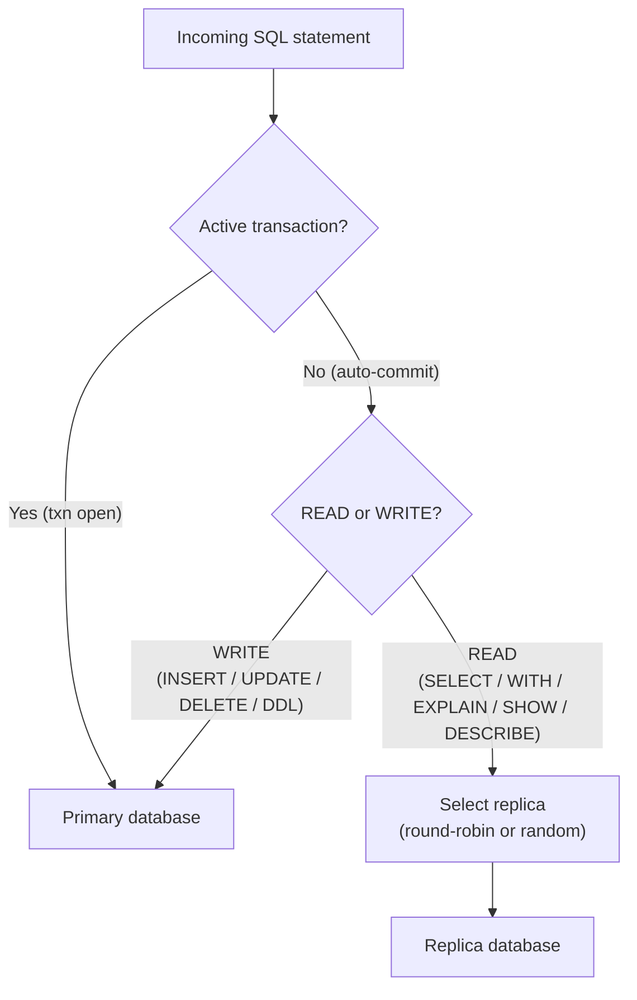

# Read/Write Splitting in OJP

Every database write has a cost. It touches the write-ahead log, acquires row-level locks, waits for replication acknowledgement, and eventually releases those locks so other operations can proceed. Reads, even demanding ones, are structurally cheaper — they can be satisfied by any replica without touching the primary at all. Yet without an explicit mechanism to exploit this asymmetry, every query from every application instance lands on the same primary database, whether it needs to or not.

OJP 0.5.0-beta introduces server-side read/write splitting. The OJP server inspects every SQL statement that passes through it and routes reads to one of your configured replicas while reserving the primary for writes and transactions. No application code changes are required. The JDBC driver, the connection string, and the application's SQL all stay exactly as they are.

This article explains how that routing works, how to configure it, and what the edge cases are.

---

## Why Route at the Control Plane

The traditional approach to read/write splitting is to configure it in the application — either explicitly, through two distinct `DataSource` beans, or implicitly, through a framework that inspects `@Transactional(readOnly=true)` annotations. Both approaches work, but they couple the routing decision to application code, which means every service team has to wire it up independently, and any framework that does not support it falls back to the primary for everything.

Routing at the control plane decouples that concern from the application completely. One configuration change in `ojp.properties` activates read/write splitting for all clients connected to that datasource, regardless of the framework they use, the language they are written in, or whether they are aware the feature exists. The server handles the routing transparently.

There is a second advantage: because the OJP server is the single point through which all SQL traffic flows, it knows the exact state of every active transaction. It does not have to infer transaction state from annotations or method signatures — it simply tracks whether a `BEGIN` has been issued and not yet committed or rolled back. This makes the transaction-safety guarantee exact rather than approximate.

---

## How Routing Decisions Are Made

The routing logic has two layers: SQL classification and transaction state.

### SQL Classification

The server classifies every incoming SQL statement as either a read or a write using a keyword-based classifier. The following statement types are treated as reads and are eligible for routing to a replica:

- `SELECT`
- `WITH` (Common Table Expressions)
- `EXPLAIN`
- `SHOW`
- `DESCRIBE` / `DESC`

Everything else — `INSERT`, `UPDATE`, `DELETE`, `MERGE`, all DDL statements, stored procedure calls — is treated as a write and always goes to the primary. When SQL is null or blank, the server treats it as a write.

The classifier matches on the leading keyword of the statement, not on a substring, so a stored procedure named `DESCRIBE_USERS` is not misclassified as a `DESCRIBE` statement. Only the full keyword at the start of the statement, followed by whitespace or punctuation, triggers read routing.

### Transaction State

SQL classification alone is not sufficient. A `SELECT` inside an explicit transaction is a perfectly valid read, but routing it to a replica would break read-your-writes consistency: if the session just inserted a row on the primary and now queries for it, the replica may not have replicated the write yet.

The OJP server solves this by tracking explicit transaction boundaries. Any statement executed inside an active transaction — meaning after `BEGIN` or after `setAutoCommit(false)`, and before `COMMIT` or `ROLLBACK` — is always routed to the primary, regardless of its type. The routing rule is simple: if a transaction is open, the primary handles it.

Auto-commit reads — `SELECT` statements executed outside any explicit transaction — are routed to replicas normally.



---

## Replica Selection

When a read is routed to a replica, the server picks which replica to use according to the configured selection strategy. Two strategies are available in 0.5.0-beta:

**ROUND_ROBIN** distributes reads evenly across replicas in order. If you have three replicas, the first read goes to replica 1, the second to replica 2, the third to replica 3, and the fourth back to replica 1. This is the default and the right choice for most deployments where replicas have similar capacity and latency.

**RANDOM** picks a replica uniformly at random on each request. This avoids strict ordering and can be useful in deployments where replicas are behind a load balancer that already handles distribution.

A third strategy, **LEAST_CONNECTIONS**, is accepted in configuration but currently falls back to round-robin. Metrics-based routing that accounts for in-flight connection counts is under development for a future release.

When all configured replicas are unavailable, the server falls back to the primary by default. This behaviour is controlled by `replicaFailoverToPrimary` and defaults to `true`. With failover enabled, a complete replica outage degrades gracefully — your application continues to serve reads from the primary until replicas recover. With failover disabled, read requests fail when no replica is reachable, which may be preferable if correctness is more important than availability.

---

## Configuration

Read/write splitting is configured entirely on the client side, in the same `ojp.properties` file you use to configure connection pools. No changes are needed on the OJP server itself — the server reads the routing configuration from the connection details it receives from the driver on the first connection.

Each datasource has a role: `primary` or `replica`. Replicas declare which primary they belong to using the `primary` property. The primary declares the selection strategy and sticky-session settings.

```properties
# ── Primary: the datasource the application normally connects to ──

mydb.ojp.readwrite.role=primary
mydb.ojp.readwrite.enabled=true
mydb.ojp.readwrite.replicaSelectionStrategy=ROUND_ROBIN
mydb.ojp.readwrite.stickySessionSeconds=0
mydb.ojp.readwrite.replicaFailoverToPrimary=true

# (primary connection settings are configured as normal)
mydb.ojp.connection.url=jdbc:postgresql://primary-host:5432/mydb
mydb.ojp.connection.user=app
mydb.ojp.connection.pass=<your-primary-pass>
mydb.ojp.pool.maxPoolSize=20

# ── Replica 1 ──

replica1.ojp.readwrite.role=replica
replica1.ojp.readwrite.primary=mydb
replica1.ojp.connection.url=jdbc:postgresql://replica1-host:5432/mydb
replica1.ojp.connection.user=app_ro
replica1.ojp.connection.pass=<your-replica-pass>
replica1.ojp.pool.maxPoolSize=15
replica1.ojp.pool.minIdle=2

# ── Replica 2 ──

replica2.ojp.readwrite.role=replica
replica2.ojp.readwrite.primary=mydb
replica2.ojp.connection.url=jdbc:postgresql://replica2-host:5432/mydb
replica2.ojp.connection.user=app_ro
replica2.ojp.connection.pass=<your-replica-pass>
replica2.ojp.pool.maxPoolSize=15
replica2.ojp.pool.minIdle=2
```

Each replica maintains its own independent connection pool in the OJP server. The pool size, idle connection count, and timeout settings are configured per replica using the same `pool.*` properties you use for the primary. Replicas typically need smaller pools than the primary because they only handle reads; a `maxPoolSize` of 10–15 is a reasonable starting point for most workloads.

No server restart is required. The server creates the replica pools the first time a client connects with read/write splitting enabled. Subsequent clients that connect with the same primary datasource name reuse the already-configured setup.

---

## Sticky Sessions

There is a common pattern in applications that causes read/write splitting to produce surprising results: write a row, then immediately read it back outside of a transaction. The write lands on the primary. The read is classified as safe to route to a replica. But if the replica is a few milliseconds behind in replication, the read returns nothing — the row is not there yet.

This is the read-after-write problem, and it is one of the fundamental tradeoffs of any system with asynchronous replication. The correct solution, when the ordering matters, is to wrap the write and the subsequent read in a single transaction. Inside a transaction, both operations go to the primary, and consistency is guaranteed.

For cases where wrapping in a transaction is not practical — background jobs that issue writes and then poll for state without explicit transaction management, for instance — OJP provides sticky sessions as an opt-in fallback. When `stickySessionSeconds` is set to a positive value, every write operation starts a sticky window. For the duration of that window, all reads from the same client are routed to the primary rather than to replicas.

The default value is `0`, which disables sticky sessions. Do not enable it unless you have a concrete need. Sticky sessions reduce the effectiveness of read distribution — every write causes a burst of primary reads during the window — and they hide the underlying problem rather than fixing it. If you find yourself enabling sticky sessions with a long window for a busy write path, the better fix is usually to identify the read-after-write patterns and wrap them in explicit transactions.

---

## What Gets Routed Where: A Quick Reference

| Statement type | In transaction | Routed to |
|---|---|---|
| `SELECT` | No (auto-commit) | Replica |
| `SELECT` | Yes | Primary |
| `WITH` (CTE) | No (auto-commit) | Replica |
| `WITH` (CTE) | Yes | Primary |
| `EXPLAIN` | No | Replica |
| `EXPLAIN` | Yes | Primary |
| `SHOW` / `DESCRIBE` / `DESC` | No | Replica |
| `SHOW` / `DESCRIBE` / `DESC` | Yes | Primary |
| `INSERT` | Any | Primary |
| `UPDATE` | Any | Primary |
| `DELETE` | Any | Primary |
| `MERGE` | Any | Primary |
| All DDL (`CREATE`, `ALTER`, `DROP`, ...) | Any | Primary |
| Null or blank SQL | Any | Primary |
| Sticky window active (after write) | No | Primary |

---

## Interaction with Query Result Caching

Read/write splitting and query result caching are independent features that compose naturally. When both are enabled for the same datasource, the cache is checked before routing takes place. If the cache has a hit, the result is returned immediately without touching any database — neither primary nor replica. Cache misses follow the normal routing path: auto-commit reads go to replicas, writes go to the primary.

The cache invalidation mechanism is also routing-aware. When a write executes against the primary, the server inspects the SQL for table names and evicts any cache entries whose `invalidateOn` configuration includes those tables. This happens regardless of whether the write was inside a transaction, and regardless of which replica might otherwise have served a subsequent read for the same data.

---

## Enabling Read/Write Splitting — No Server Restart Required

Configuration changes live entirely in `ojp.properties` on the client side. Adding read/write splitting to an existing deployment means adding the `readwrite.*` keys for the primary and the connection settings for each replica, then restarting the application (not the OJP server). The server picks up the new configuration on the next client connection.

The full configuration reference, including pool tuning properties for replicas and the complete list of `readwrite.*` keys, is in [documents/configuration/ojp-jdbc-configuration.md](../configuration/ojp-jdbc-configuration.md).

For questions about topology — how many replicas to run, how to size replica pools, how to combine read/write splitting with OJP's multinode deployment mode — the Discord server ([discord.gg/J5DdHpaUzu](https://discord.gg/J5DdHpaUzu)) is the best place to ask.
