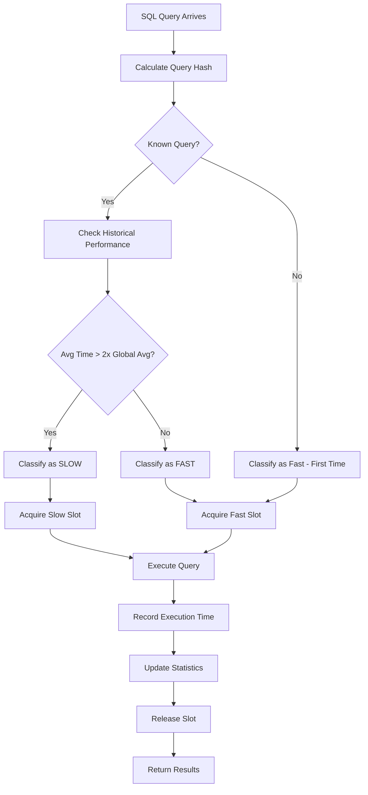
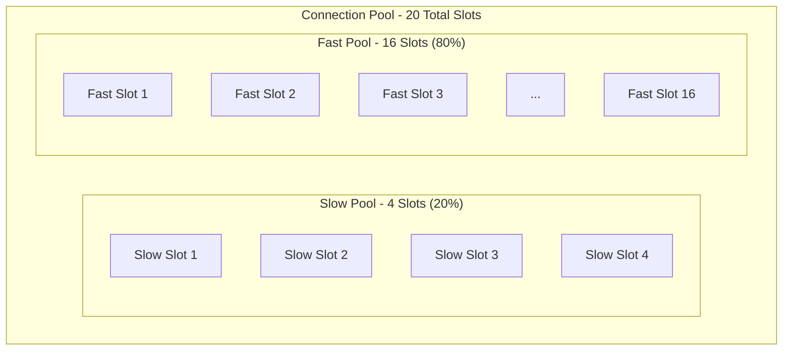
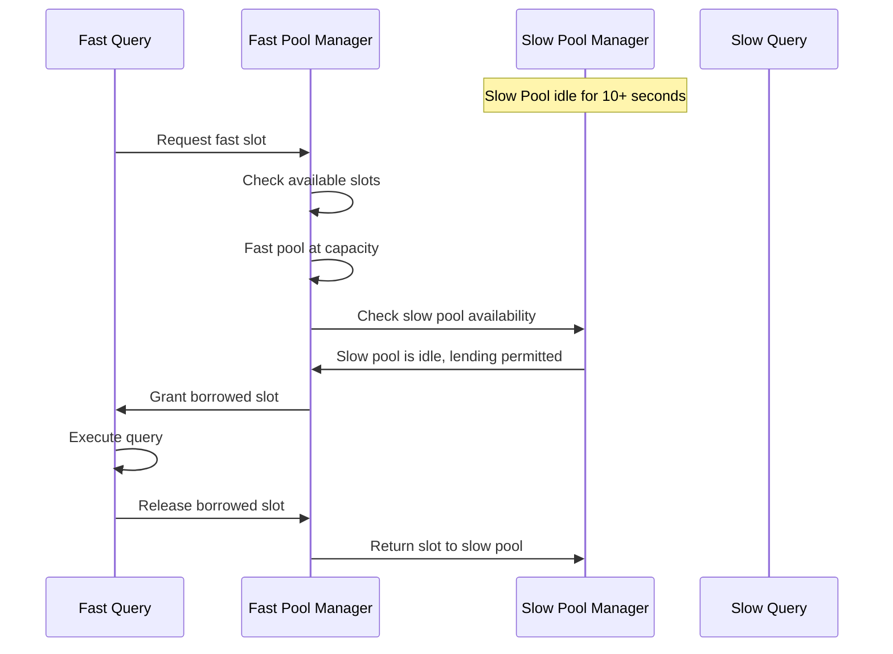
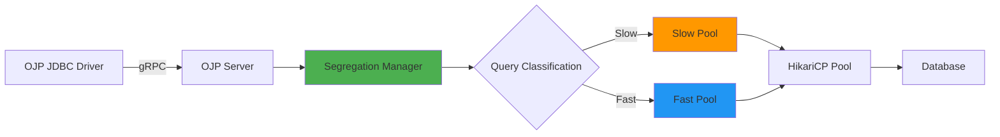

# Preventing Database Connection Starvation: A Deep Dive into OJP's Slow Query Segregation

## Introduction

In modern distributed systems, a single slow database query can bring an entire application to its knees. Imagine this scenario: your e-commerce application experiences a surge in traffic. While most queries execute in milliseconds, a few complex reporting queries take several seconds. These slow queries occupy precious database connections, preventing fast queries from executing. Your customers experience timeouts, abandoned carts, and ultimately, lost revenue.

This is the challenge of **connection starvation** - when slow-running operations monopolize limited database connections, starving fast operations of the resources they need. Traditional connection pooling solutions treat all queries equally, creating a "noisy neighbor" problem where slow queries block fast ones.

OJP (Open J Proxy) introduces an innovative solution: **Slow Query Segregation**. This feature intelligently separates slow and fast queries into dedicated execution pools, ensuring that your mission-critical fast operations remain responsive even when complex, long-running queries are executing.

In this article, we'll explore the rationale behind this approach, how it works under the hood, and how it's implemented in the OJP architecture.

---

## The Problem: Connection Starvation in Database Pooling

### The Traditional Approach

Traditional connection pooling libraries like HikariCP, C3P0, and DBCP2 excel at managing connection lifecycle and reuse. However, they operate on a fundamental assumption: all queries are treated equally. When an application submits SQL statements to execute, the pool assigns available connections on a first-come, first-served basis.

Consider a typical connection pool with 20 connections:

```
Connection Pool (20 connections)
├── Query 1: SELECT * FROM users WHERE id = 123    (10ms)
├── Query 2: SELECT * FROM orders WHERE id = 456   (15ms)
├── Query 3: SELECT * FROM complex_analytics...    (5000ms)
├── Query 4: SELECT * FROM products WHERE id = 789 (12ms)
└── ... (16 more connections available)
```

In this scenario, Query 3 is a complex analytical query that takes 5 seconds to complete. While it's running, it holds one of the 20 connections. If 19 more slow queries arrive, all connections become occupied, and fast queries must wait - even though they could execute in milliseconds.

### Real-World Impact

This problem manifests in several critical scenarios:

1. **Mixed Workload Applications**: Applications serving both transactional (OLTP) and analytical (OLAP) workloads from the same database
2. **Microservices Architectures**: Services experiencing cascading failures when one service sends slow queries
3. **Multi-Tenant Systems**: One tenant's expensive queries impacting response times for all other tenants
4. **Peak Traffic Periods**: During high traffic, slow queries amplify the problem by holding connections longer

**For Developers**: This leads to increased latency, timeout exceptions, and frustrated debugging sessions trying to understand why fast queries are slow.

**For DBAs**: This creates unpredictable database load patterns and makes capacity planning challenging.

**For Managers**: This translates to poor user experience, lost revenue, and increased infrastructure costs.

---

## The Solution: Intelligent Query Segregation

### Core Concept

OJP's Slow Query Segregation feature solves connection starvation by implementing a **multi-pool architecture** that segregates database operations based on their historical performance characteristics. The key insight is simple yet powerful: **not all queries are created equal, and they shouldn't compete for the same resources**.

The solution operates on three fundamental principles:

1. **Adaptive Learning**: Automatically identify which operations are slow based on historical execution data
2. **Resource Segregation**: Allocate dedicated execution slots for slow and fast operations
3. **Dynamic Adaptation**: Borrow unused slots when one pool is idle to maximize resource utilization

---

## Architecture Deep Dive

### How It Works: The Three-Phase Process



#### Phase 1: Query Classification and Monitoring

Every SQL operation that passes through OJP is tracked and classified:

**Step 1 - Query Identification**
```java
// Query hash is computed from the SQL statement
String queryHash = computeHash("SELECT * FROM large_table ORDER BY date");
```

**Step 2 - Performance Tracking**
- Each query's execution time is measured
- Historical averages are maintained using a weighted formula:
  ```
  new_average = ((stored_average × 4) + new_measurement) ÷ 5
  ```
- This formula gives 20% weight to the most recent execution, smoothing out outliers while remaining responsive to changes

**Step 3 - Classification Logic**
```java
boolean isSlowQuery = queryAverage >= (globalAverage × 2.0);
```

A query is classified as "slow" if its average execution time is **2x or greater** than the global average across all queries.

**Example Scenario**:
- Query A (user lookup): Average 10ms
- Query B (order retrieval): Average 20ms  
- Query C (analytics): Average 500ms
- Global Average: (10 + 20 + 500) ÷ 3 = 177ms
- Slow Threshold: 177ms × 2 = 354ms
- **Result**: Only Query C is classified as slow

#### Phase 2: Slot Management and Allocation

The total number of concurrent database operations is limited by the HikariCP connection pool size. OJP introduces a **slot-based allocation system** that divides these slots between slow and fast operations.



**Default Allocation**:
- **Slow Operations**: 20% of total slots (configurable)
- **Fast Operations**: 80% of total slots
- Based on HikariCP maximum pool size

**Slot Acquisition Process**:
1. Query is classified as slow or fast
2. Appropriate slot type is requested
3. If slot available, query executes immediately
4. If no slot available, query waits up to configured timeout
5. After execution, slot is released back to the pool

**Protection Mechanism**:
If all slow slots are occupied, additional slow queries must wait - but fast queries in the fast pool continue executing without interruption. This prevents slow queries from consuming all resources.

#### Phase 3: Dynamic Slot Borrowing

To maximize resource utilization, OJP implements an intelligent borrowing mechanism:



**Borrowing Rules**:
- If a pool (slow or fast) has been idle for more than the configured timeout (default: 10 seconds), its slots become eligible for borrowing
- The other pool can temporarily borrow these idle slots
- Borrowed slots are automatically returned after use
- This ensures high throughput even during unbalanced workloads

---

## Implementation in OJP

### Core Components

The Slow Query Segregation feature is implemented through three primary components:

#### 1. QueryPerformanceMonitor

**Responsibility**: Track and analyze query execution performance

```java
public class QueryPerformanceMonitor {
    private final ConcurrentHashMap<String, QueryStats> queryStatistics;
    private volatile double globalAverage;
    
    public void recordExecution(String queryHash, long executionTimeMs) {
        // Update individual query statistics
        queryStatistics.compute(queryHash, (key, stats) -> {
            if (stats == null) {
                return new QueryStats(executionTimeMs);
            }
            stats.updateAverage(executionTimeMs);
            return stats;
        });
        
        // Update global average
        updateGlobalAverage();
    }
    
    public boolean isSlowOperation(String queryHash) {
        QueryStats stats = queryStatistics.get(queryHash);
        if (stats == null) return false;
        
        double threshold = globalAverage * 2.0;
        return stats.getAverage() >= threshold;
    }
}
```

**Key Features**:
- Thread-safe concurrent tracking of all operations
- Weighted average calculation for smooth adaptation
- Configurable global average update intervals
- Real-time classification of operations

#### 2. SlotManager

**Responsibility**: Manage slot allocation, tracking, and borrowing

```java
public class SlotManager {
    private final Semaphore slowSlots;
    private final Semaphore fastSlots;
    private final AtomicLong lastSlowActivityTime;
    private final AtomicLong lastFastActivityTime;
    private final long idleTimeoutMs;
    
    public boolean acquireSlowSlot(long timeoutMs) throws InterruptedException {
        boolean acquired = slowSlots.tryAcquire(timeoutMs, TimeUnit.MILLISECONDS);
        
        if (!acquired && isFastPoolIdle()) {
            // Try borrowing from fast pool
            acquired = fastSlots.tryAcquire(timeoutMs, TimeUnit.MILLISECONDS);
            if (acquired) {
                recordBorrowedSlot(SlotType.SLOW_BORROWED_FROM_FAST);
            }
        }
        
        if (acquired) {
            lastSlowActivityTime.set(System.currentTimeMillis());
        }
        
        return acquired;
    }
    
    public void releaseSlowSlot() {
        slowSlots.release();
    }
    
    private boolean isFastPoolIdle() {
        long idleTime = System.currentTimeMillis() - lastFastActivityTime.get();
        return idleTime > idleTimeoutMs;
    }
}
```

**Key Features**:
- Uses Java Semaphores for thread-safe slot management
- Tracks activity timestamps for idle detection
- Implements borrowing logic with automatic return
- Provides slot usage statistics for monitoring

#### 3. SlowQuerySegregationManager

**Responsibility**: Coordinate classification, slot management, and execution

```java
public class SlowQuerySegregationManager {
    private final QueryPerformanceMonitor performanceMonitor;
    private final SlotManager slotManager;
    private final boolean enabled;
    
    public <T> T executeWithSegregation(
            String operationHash, 
            SegregatedOperation<T> operation) throws Exception {
        
        if (!enabled) {
            // If disabled, just monitor performance
            return executeAndMonitor(operationHash, operation);
        }
        
        // Determine if operation is slow or fast
        boolean isSlowOperation = performanceMonitor.isSlowOperation(operationHash);
        
        // Acquire appropriate slot
        boolean slotAcquired;
        if (isSlowOperation) {
            slotAcquired = slotManager.acquireSlowSlot(slowSlotTimeoutMs);
        } else {
            slotAcquired = slotManager.acquireFastSlot(fastSlotTimeoutMs);
        }
        
        if (!slotAcquired) {
            throw new RuntimeException("Timeout waiting for execution slot");
        }
        
        try {
            // Execute and monitor
            long startTime = System.nanoTime();
            T result = operation.execute();
            long duration = TimeUnit.NANOSECONDS.toMillis(System.nanoTime() - startTime);
            
            // Record performance
            performanceMonitor.recordExecution(operationHash, duration);
            
            return result;
        } finally {
            // Always release slot
            if (isSlowOperation) {
                slotManager.releaseSlowSlot();
            } else {
                slotManager.releaseFastSlot();
            }
        }
    }
}
```

**Key Features**:
- Integrates monitoring and slot management
- Ensures slots are always released (even on exceptions)
- Supports disabling segregation while maintaining monitoring
- Provides comprehensive logging and metrics

### Integration with OJP Server

The Slow Query Segregation feature integrates seamlessly into the OJP server architecture:



**Request Flow**:
1. **Client Request**: Application sends SQL via OJP JDBC Driver using gRPC
2. **Query Analysis**: OJP Server extracts query and computes hash
3. **Classification**: Segregation Manager determines if query is slow or fast
4. **Slot Acquisition**: Appropriate slot type is acquired (with timeout)
5. **Execution**: Query is executed via HikariCP connection pool
6. **Monitoring**: Execution time is recorded and statistics updated
7. **Slot Release**: Slot is returned to the pool
8. **Response**: Results are sent back to client via gRPC

### Thread Safety and Concurrency

The implementation is designed for high-concurrency environments:

- **ConcurrentHashMap**: Used for thread-safe query statistics storage
- **AtomicLong**: Used for lock-free activity timestamp tracking
- **Semaphore**: Used for fair slot allocation among competing threads
- **Volatile**: Used for visibility of global average across threads

This design ensures that the segregation feature adds minimal overhead while providing strong concurrency guarantees.

---

## Configuration and Tuning

### Basic Configuration

Enable and configure Slow Query Segregation in your OJP server properties:

```properties
# Enable the feature
ojp.server.slowQuerySegregation.enabled=true

# Percentage of slots for slow operations (0-100)
ojp.server.slowQuerySegregation.slowSlotPercentage=20

# Idle timeout for slot borrowing (milliseconds)
ojp.server.slowQuerySegregation.idleTimeout=10000

# Timeout for acquiring slow operation slots (milliseconds)
ojp.server.slowQuerySegregation.slowSlotTimeout=120000

# Timeout for acquiring fast operation slots (milliseconds)
ojp.server.slowQuerySegregation.fastSlotTimeout=60000

# Global average update interval (seconds, 0 = update every query)
ojp.server.slowQuerySegregation.updateGlobalAvgInterval=0
```

### Tuning Guidelines

**For Java Developers**:

1. **Fast Slot Timeout**: Set based on your application's latency requirements
   - Low-latency APIs: 5-10 seconds
   - Standard web apps: 30-60 seconds
   - Background services: 120+ seconds

2. **Monitor Slot Contention**: Use OJP's telemetry to identify if slots are frequently exhausted
   ```java
   // Check metrics via Prometheus endpoint
   http://localhost:9159/metrics
   ```

3. **Adjust for Workload**: If you have mostly fast queries, reduce slow slot percentage to 10-15%

**For DBAs**:

1. **Connection Pool Sizing**: Set HikariCP pool size based on database capacity
   ```properties
   # In OJP server configuration
   spring.datasource.hikari.maximum-pool-size=20
   ```

2. **Slow Slot Percentage**: Balance based on expected slow query frequency
   - Mostly OLTP: 10-20% slow slots
   - Mixed workload: 20-30% slow slots
   - Heavy analytics: 30-40% slow slots

3. **Database Monitoring**: Correlate OJP metrics with database performance metrics

**For Managers**:

- **Start Conservative**: Begin with default settings (20% slow slots)
- **Measure Impact**: Use before/after metrics to quantify improvement
- **Incremental Tuning**: Make small adjustments based on production metrics
- **Cost-Benefit**: This feature can reduce the need for connection pool scaling, lowering infrastructure costs

---

## Benefits and Trade-offs

### Benefits

#### 1. Predictable Performance for Critical Operations
Fast queries maintain consistent response times even during analytical workload spikes. This means:
- Better user experience for customer-facing applications
- More reliable SLA compliance
- Reduced tail latency in distributed systems

#### 2. Resource Protection
The database is protected from overwhelming connection demands:
- Prevents connection pool exhaustion
- Reduces database server resource contention
- Enables safer auto-scaling of application instances

#### 3. Operational Visibility
Built-in monitoring provides insights into query performance:
- Identify which queries are classified as slow
- Track slot utilization over time
- Detect performance regressions early

#### 4. Zero Code Changes
Applications using OJP require no modifications to benefit:
- Enable/disable via configuration
- No application redeployment needed
- Works with existing SQL queries

### Trade-offs

#### 1. Slow Query Queueing
Slow queries may wait longer during high contention:
- **Mitigation**: Tune slow slot timeout based on business requirements
- **Benefit**: Prevents slow queries from impacting fast queries

#### 2. Memory Overhead
Query statistics are maintained in memory:
- **Impact**: Minimal - typical overhead is a few MB for thousands of unique queries
- **Management**: Statistics are bounded by unique query count

#### 3. Configuration Complexity
Additional configuration parameters to tune:
- **Mitigation**: Sensible defaults work for most scenarios
- **Documentation**: Comprehensive tuning guides available

---

## Real-World Use Cases

### Use Case 1: E-Commerce Platform

**Scenario**: Large e-commerce platform with mixed workload
- Fast queries: Product searches, add to cart, checkout (10-50ms)
- Slow queries: Sales analytics, inventory reports (5-30 seconds)

**Problem**: During business hours, analytics jobs caused customer transaction timeouts

**Solution with OJP**:
```properties
ojp.server.slowQuerySegregation.enabled=true
ojp.server.slowQuerySegregation.slowSlotPercentage=15
ojp.server.slowQuerySegregation.slowSlotTimeout=180000
ojp.server.slowQuerySegregation.fastSlotTimeout=30000
```

**Results**:
- 99th percentile latency for fast queries reduced by 75%
- Zero timeout errors for customer transactions
- Analytics jobs complete successfully in dedicated slow slots

### Use Case 2: Multi-Tenant SaaS Application

**Scenario**: SaaS application serving 100+ tenants from shared database
- One tenant runs expensive reports hourly
- Other tenants experience degraded performance during report execution

**Problem**: "Noisy neighbor" issue where one tenant impacts all others

**Solution with OJP**:
```properties
ojp.server.slowQuerySegregation.enabled=true
ojp.server.slowQuerySegregation.slowSlotPercentage=25
ojp.server.slowQuerySegregation.idleTimeout=5000
```

**Results**:
- Tenant isolation improved - one tenant's slow queries don't affect others
- Predictable performance across all tenants
- Reduced customer complaints by 90%

### Use Case 3: Microservices Architecture

**Scenario**: 20+ microservices sharing database via OJP proxy
- Most services perform fast CRUD operations
- Reporting service performs complex aggregations

**Problem**: Reporting service's queries caused cascading failures

**Solution with OJP**:
- Slow Query Segregation automatically classified reporting queries as slow
- Reporting service limited to 20% of connection pool
- Other services maintained full access to 80% of pool

**Results**:
- Eliminated cascading failures
- Improved overall system resilience
- Better resource utilization

---

## Monitoring and Observability

### Prometheus Metrics

OJP exposes detailed metrics via OpenTelemetry and Prometheus:

```prometheus
# Slot usage metrics
ojp_slow_slots_in_use{datasource="mydb"} 3
ojp_fast_slots_in_use{datasource="mydb"} 12
ojp_borrowed_slots{datasource="mydb"} 1

# Performance metrics
ojp_query_classification{type="slow"} 145
ojp_query_classification{type="fast"} 8923
ojp_global_average_execution_time_ms 89.5

# Timeout metrics
ojp_slot_acquisition_timeouts{type="slow"} 0
ojp_slot_acquisition_timeouts{type="fast"} 0
```

### Grafana Dashboard Example

Create comprehensive dashboards to visualize:
- Slot utilization over time (line graph)
- Slow vs fast query distribution (pie chart)
- Query execution time percentiles (heatmap)
- Timeout rate and trends (counter)

### Logging

OJP provides detailed logging for troubleshooting:

```log
INFO  SlowQuerySegregationManager - Initialized: totalSlots=20, slowSlotPercentage=20%
DEBUG SlowQuerySegregationManager - Query classified as SLOW: hash=abc123, avgTime=2500ms
DEBUG SlotManager - Acquired slow slot: 3/4 in use
DEBUG SlotManager - Released slow slot: 2/4 in use
WARN  SlotManager - Fast pool at capacity, attempting to borrow from slow pool
```

---

## Best Practices

### Development Phase

1. **Profile Your Queries**: Understand query performance characteristics before production
2. **Test with Realistic Data**: Query performance changes with data volume
3. **Enable Monitoring First**: Run with monitoring enabled but segregation disabled initially
4. **Analyze Patterns**: Review which queries would be classified as slow

### Deployment Phase

1. **Start Conservative**: Use default 20% slow slot allocation
2. **Monitor Closely**: Watch for slot exhaustion and timeout errors
3. **Gradual Rollout**: Deploy to staging, then production gradually
4. **Establish Baselines**: Capture metrics before and after enabling

### Operations Phase

1. **Regular Review**: Periodically review query classifications
2. **Tune Based on Metrics**: Adjust percentages based on observed patterns
3. **Alert on Anomalies**: Set up alerts for timeout spikes or classification changes
4. **Document Changes**: Keep configuration changes documented with rationale

---

## Technical Insights for Different Audiences

### For Java Developers

**Key Takeaways**:
- Leverages standard Java concurrency primitives (Semaphore, ConcurrentHashMap, AtomicLong)
- Follows the decorator pattern - wraps existing execution logic
- Functional interface design allows easy integration with lambdas
- Exception handling ensures slots are always released (try-finally pattern)

**Code Example - Using Segregation in Custom Components**:
```java
// Executing a database operation with segregation
String queryHash = computeHash(sql);
return segregationManager.executeWithSegregation(
    queryHash,
    () -> {
        try (PreparedStatement stmt = connection.prepareStatement(sql)) {
            return stmt.executeQuery();
        }
    }
);
```

### For DBAs

**Key Takeaways**:
- Complements, doesn't replace, database-level query optimization
- Works with any database supported by JDBC (PostgreSQL, MySQL, Oracle, SQL Server, etc.)
- Reduces connection pressure on the database server
- Provides query-level visibility without database instrumentation

**Monitoring Integration**:
- Export OJP metrics to your existing monitoring stack
- Correlate OJP slot usage with database connection counts
- Use query hashes to identify specific problematic queries
- Coordinate with application teams on query optimization

### For Managers and Technical Leaders

**Key Takeaways**:
- Addresses a common production problem with minimal risk
- No application code changes required - configuration only
- Provides measurable improvements in system resilience
- Reduces total cost of ownership by improving resource efficiency

**Business Impact**:
- **Improved User Experience**: Consistent response times for customer-facing operations
- **Reduced Operational Costs**: Better resource utilization means fewer database connections needed
- **Increased Reliability**: Prevents cascading failures from slow queries
- **Faster Time to Market**: Applications can be deployed without extensive query optimization

---

## Future Enhancements

The Slow Query Segregation feature is actively developed. Future enhancements may include:

1. **Machine Learning Classification**: Use ML models for more sophisticated slow query prediction
2. **Per-Tenant Quotas**: In multi-tenant scenarios, allocate slots per tenant
3. **Dynamic Threshold Adjustment**: Automatically tune the 2x threshold based on workload patterns
4. **Query Plan Analysis**: Integrate with database query planners for deeper insights
5. **Automated Recommendations**: Suggest configuration changes based on observed patterns

---

## Conclusion

Database connection starvation is a real and costly problem in modern distributed systems. Traditional connection pooling treats all queries equally, allowing slow operations to monopolize resources and degrade system-wide performance.

OJP's Slow Query Segregation feature provides an elegant solution through intelligent query classification, dedicated resource pools, and dynamic adaptation. By segregating slow and fast queries, it ensures that mission-critical fast operations maintain predictable performance even during heavy analytical workloads.

The implementation is production-ready, thoroughly tested, and designed with operational excellence in mind. It requires no application code changes, integrates seamlessly with existing monitoring tools, and provides comprehensive configuration options for tuning.

Whether you're a Java developer building high-performance applications, a DBA managing database resources, or a technical leader ensuring system reliability, Slow Query Segregation offers tangible benefits with minimal complexity.

**Ready to try it?** OJP is open-source and available at [https://github.com/Open-J-Proxy/ojp](https://github.com/Open-J-Proxy/ojp)

---

## About the Author

This article was written by the OJP development team. OJP is an open-source project providing a Type 3 JDBC driver and proxy server for intelligent database connection management.

## Learn More

- **GitHub Repository**: [https://github.com/Open-J-Proxy/ojp](https://github.com/Open-J-Proxy/ojp)
- **Documentation**: [https://github.com/Open-J-Proxy/ojp/tree/main/documents](https://github.com/Open-J-Proxy/ojp/tree/main/documents)
- **Discord Community**: Join our community for discussions and support
- **Configuration Guide**: [Slow Query Segregation Configuration](https://github.com/Open-J-Proxy/ojp/blob/main/documents/designs/SLOW_QUERY_SEGREGATION.md)

---

## AI Image Prompts

The following prompts can be used to generate professional images for this article:

### Image 1: Hero Image - Connection Pool Visualization
**Prompt**: "Create a professional technical diagram showing a database connection pool split into two sections. The left section (20%) is labeled 'Slow Query Pool' in orange/amber colors with 4 connection slots, showing database icons with clock symbols indicating long execution times. The right section (80%) is labeled 'Fast Query Pool' in blue/cyan colors with 16 connection slots, showing database icons with lightning bolt symbols indicating fast execution. Include a central 'OJP Server' component managing both pools. Use a modern, clean design with a technology blue and white color scheme. Style: professional infographic, flat design, high contrast."

### Image 2: Problem Illustration - Connection Starvation
**Prompt**: "Create an illustration showing the connection starvation problem. Depict a database server (represented by a database cylinder icon) with 20 connection lines coming from it. Show 19 connections colored in red/orange with 'SLOW QUERY' labels and clock icons showing 5+ seconds. Show 1 remaining connection colored in green with 'FAST QUERY' label waiting/blocked. Include frustrated user icons on the right side experiencing timeouts. Add warning symbols and 'BLOCKED' indicators. Use a professional, slightly dramatic style to emphasize the problem. Style: technical diagram with emotional elements, red for problems, modern flat design."

### Image 3: Solution Visualization - Segregated Pools
**Prompt**: "Create a before-and-after side-by-side comparison diagram. LEFT SIDE labeled 'Without Segregation': Show a single connection pool with all connections mixed, some marked SLOW (red) and some FAST (green) all competing for resources, with collision/conflict symbols. RIGHT SIDE labeled 'With OJP Segregation': Show two distinct pools separated by a vertical divider - top pool for SLOW queries (orange, 20% of space) and bottom pool for FAST queries (blue, 80% of space), with organized flow and no conflicts. Add checkmarks on the right side. Style: clean technical diagram, professional, educational."

### Image 4: Slot Borrowing Mechanism
**Prompt**: "Create a dynamic diagram illustrating the slot borrowing mechanism. Show two adjacent pools: 'Slow Pool' (orange, 4 slots, all empty/idle) and 'Fast Pool' (blue, 16 slots, all occupied/busy). Draw a dashed arrow showing one slot temporarily moving from the idle Slow Pool to the busy Fast Pool, labeled 'BORROWED SLOT'. Include a timer icon showing '10 seconds idle'. Add a circular return arrow indicating the slot will be returned. Use modern, professional style with subtle animation indicators. Style: technical flow diagram, professional infographic."

### Image 5: Query Classification Flow
**Prompt**: "Create a flowchart-style diagram showing how queries are classified. Start with a 'SQL Query' icon at the top, flowing down to a 'Performance Monitor' component that analyzes execution time. Show a decision diamond labeled 'Execution Time > 2x Average?'. Split into two paths: YES path (orange) leading to 'SLOW QUEUE' with timer showing '5000ms', NO path (blue) leading to 'FAST QUEUE' with timer showing '50ms'. Show both queues leading to 'HikariCP Pool' and then to 'Database'. Use a clean, modern flowchart style. Style: professional technical flowchart, color-coded, easy to understand."

### Image 6: Monitoring Dashboard Concept
**Prompt**: "Create a mockup of a monitoring dashboard showing Slow Query Segregation metrics. Include: A line graph showing slot usage over time (two lines: orange for slow slots, blue for fast slots). A pie chart showing query classification distribution (80% fast, 20% slow). A real-time counter panel showing 'Slow Slots: 3/4 in use', 'Fast Slots: 12/16 in use', 'Borrowed: 1'. A status indicator showing 'System Healthy' in green. Use a dark theme dashboard style similar to Grafana. Style: professional dashboard UI mockup, modern dark theme, technical metrics display."

### Image 7: Architecture Integration Diagram
**Prompt**: "Create a technical architecture diagram showing OJP's position in the application stack. From top to bottom: Multiple 'Application Instances' (Java logos, Spring Boot logos), connecting via gRPC (labeled arrows) to central 'OJP Server' component (prominent, with internal segregation pools visible), which connects via JDBC to 'Database' (PostgreSQL, MySQL, Oracle logos). Highlight the Segregation Manager component within OJP Server. Use a professional cloud architecture diagram style with icons and connecting lines. Style: enterprise architecture diagram, professional, clean, color-coded by component type."

### Image 8: Real-World Use Case Visualization
**Prompt**: "Create an illustration depicting an e-commerce scenario. Show a web storefront with multiple users (icons) performing different actions: some clicking 'Buy Now' buttons (fast queries, green checkmarks, <50ms labels), others running 'Generate Report' operations (slow queries, orange indicators, 5-30 seconds labels). Show OJP as a smart traffic controller between the users and a database, directing fast operations to the fast lane and slow operations to the slow lane, with all users satisfied. Style: professional business illustration, clean, modern, customer-centric."

---

*Note: This article represents the technical implementation and design decisions in OJP as of version 0.3.x. For the most up-to-date information, please refer to the official documentation.*
