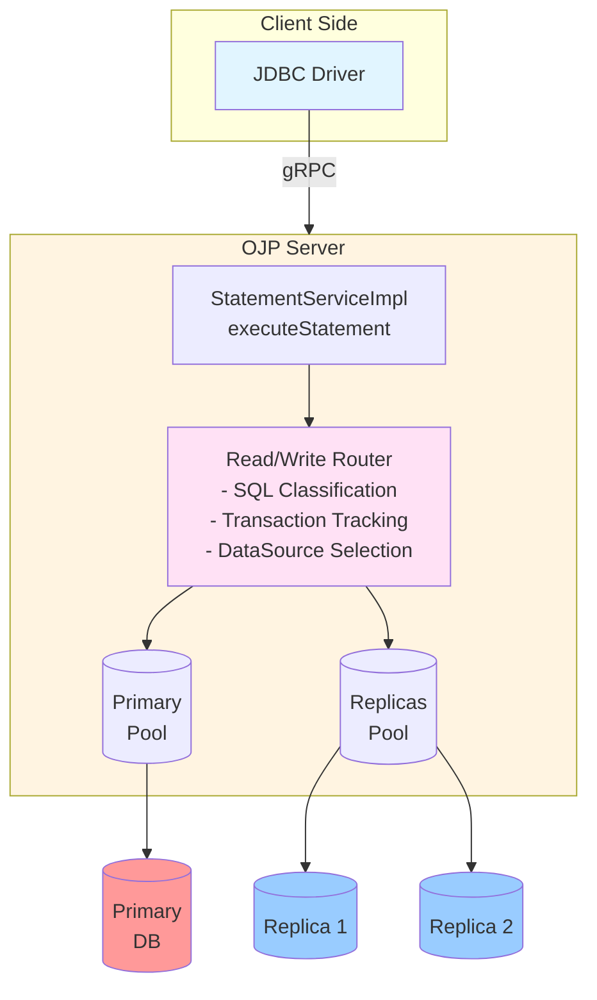

# Read/Write Traffic Splitting Analysis for OJP

## Executive Summary

This document provides a comprehensive analysis of how to implement read/write traffic splitting in Open J Proxy (OJP). The goal is to support database replication architectures where write operations and transactions are directed to a primary database, while read-only operations can be distributed across one or more read replicas for improved scalability and performance.

**Status**: Analysis Complete - Implementation Pending  
**Date**: February 2026  
**Author**: OJP Development Team

---

## Table of Contents

1. [Current Architecture Overview](#current-architecture-overview)
2. [Requirements and Goals](#requirements-and-goals)
3. [Implementation Approaches](#implementation-approaches)
4. [Recommended Approach](#recommended-approach)
5. [Technical Design](#technical-design)
6. [Configuration Examples](#configuration-examples)
7. [Implementation Challenges](#implementation-challenges)
8. [Migration Strategy](#migration-strategy)
9. [Future Enhancements](#future-enhancements)

---

## Current Architecture Overview

### Connection Management

OJP currently implements a **single datasource per connection** architecture:

```
JDBC Driver → gRPC → OJP Server → Single DataSource → Database
```

**Key Components:**

1. **Connection Pooling**: Managed via SPI-based `ConnectionPoolProvider` interface
   - Default: HikariCP (priority 100)
   - Alternative: Apache DBCP2
   - Pluggable architecture supports custom implementations

2. **DataSource Registry**: `Map<String, DataSource> datasourceMap` in `StatementServiceImpl`
   - Key: Connection hash (based on URL + credentials)
   - Value: DataSource instance (HikariCP by default)

3. **Statement Execution**: All queries route through `StatementServiceImpl.executeStatement()`
   - No SQL parsing or routing logic
   - No distinction between read and write operations
   - Single connection pool handles all traffic

4. **Configuration Management**: 
   - Client properties transmitted via gRPC `ConnectionDetails`
   - Server-side `DataSourceConfigurationManager` parses pool settings
   - Multi-datasource support already exists for different connection strings

### Existing Multi-DataSource Support

OJP already supports multiple named datasources with different pool configurations:

```java
// Example: Different pool sizes for different use cases
String mainUrl = "jdbc:ojp[localhost:1059(mainApp)]_postgresql://localhost/db";
String reportUrl = "jdbc:ojp[localhost:1059(reporting)]_postgresql://localhost/db";
```

**Properties:**
```properties
mainApp.ojp.connection.pool.maximumPoolSize=50
reporting.ojp.connection.pool.maximumPoolSize=8
```

This foundation can be leveraged for read/write splitting.

---

## Requirements and Goals

### Functional Requirements

1. **Write Routing**: All write operations (INSERT, UPDATE, DELETE, DDL) must route to primary database
2. **Read Routing**: Read operations (SELECT) should route to read replicas
3. **Transaction Support**: All operations within a transaction must use the same connection
4. **Session Affinity**: Support session-bound operations (temp tables, session variables)
5. **Failover**: Automatic failover to primary if replicas are unavailable
6. **Consistency**: Configurable consistency guarantees (read-your-writes)

### Non-Functional Requirements

1. **Transparency**: Minimal changes to client applications
2. **Performance**: No significant latency overhead
3. **Backward Compatibility**: Existing configurations continue to work
4. **Configuration Flexibility**: Support multiple replica configurations
5. **Monitoring**: Metrics for read/write distribution

### Out of Scope (Initial Implementation)

1. Load balancing algorithms (beyond round-robin)
2. Replica lag detection and routing
3. Geographic routing
4. Dynamic replica discovery

---

## Implementation Approaches

### Approach 1: URL-Based Explicit Routing

**Description**: Application explicitly specifies read vs. write datasources in JDBC URLs.

**Pros:**
- Simple to implement
- No SQL parsing required
- Explicit control for developers
- Minimal OJP changes

**Cons:**
- Not transparent - requires application changes
- Developers must manage routing logic
- Transaction management complexity shifts to application

**Example:**
```java
// Application explicitly chooses datasource
Connection writeConn = DriverManager.getConnection(
    "jdbc:ojp[localhost:1059(primary)]_postgresql://localhost/db", "user", "pass");

Connection readConn = DriverManager.getConnection(
    "jdbc:ojp[localhost:1059(replica)]_postgresql://localhost/db", "user", "pass");
```

**Verdict**: ❌ Rejected - Violates transparency requirement

---

### Approach 2: SQL Parsing and Automatic Routing

**Description**: OJP automatically parses SQL statements and routes based on query type.

**Architecture:**
```
StatementRequest → SQL Parser → Route Decision → Select DataSource → Execute
```

**Components Required:**

1. **SQL Parser/Classifier**:
   - Determine if query is read-only (SELECT) or write (INSERT/UPDATE/DELETE/DDL)
   - Handle transaction context (active transaction = always primary)
   - Detect session affinity requirements

2. **Routing Layer**:
   - Maintain primary + replica datasource registry
   - Implement replica selection strategy (round-robin, random, least-busy)
   - Handle failover to primary if replica unavailable

3. **Transaction State Management**:
   - Track transaction boundaries (BEGIN/COMMIT/ROLLBACK)
   - Pin connection to primary for entire transaction
   - Support savepoints

**Pros:**
- Fully transparent to applications
- Optimal read distribution
- Centralized routing logic
- Consistent behavior across all clients

**Cons:**
- Complex implementation
- SQL parsing overhead (mitigated by caching)
- Edge cases with multi-statement operations
- Must handle database-specific syntax

**Verdict**: ✅ Recommended - Best balance of transparency and functionality

---

### Approach 3: Hint-Based Routing

**Description**: Applications provide routing hints via connection properties or SQL comments.

**Example:**
```sql
-- /*+ READ_REPLICA */ 
SELECT * FROM users WHERE id = 1;

-- /*+ PRIMARY */
SELECT * FROM users WHERE id = 1 FOR UPDATE;
```

**Pros:**
- Flexible - application can override automatic routing
- Less complex than full SQL parsing
- Explicit control when needed

**Cons:**
- Requires application changes for hints
- Not fully transparent
- Mixed approach complexity

**Verdict**: 🔶 Possible Enhancement - Could complement Approach 2

---

### Approach 4: Connection Property-Based Routing

**Description**: JDBC connection property specifies read-only intent.

**Example:**
```java
Connection conn = DriverManager.getConnection(url, props);
conn.setReadOnly(true); // Routes to replica
```

**Pros:**
- Standard JDBC API
- Simple implementation
- Clear intent from application

**Cons:**
- Application must explicitly set read-only
- Cannot mix read/write on same connection
- Not truly transparent

**Verdict**: 🔶 Possible Enhancement - Could work alongside Approach 2

---

## Recommended Approach

**Selected: Approach 2 - SQL Parsing and Automatic Routing**

### Architecture Overview



### Key Design Decisions

1. **SQL Classification Strategy**:
   - Lightweight pattern matching for common operations
   - Regex-based classification: `SELECT` → Read, `INSERT|UPDATE|DELETE|CREATE|ALTER|DROP` → Write
   - Whitelist approach for safety (unknown → route to primary)

2. **Transaction Handling**:
   - Track transaction state per session
   - Once transaction begins, pin to primary datasource
   - Reset on COMMIT/ROLLBACK

3. **Session Affinity Detection**:
   - Detect temporary table creation → pin to primary
   - Session variable usage → configurable (pin or allow replica)
   - Prepared statement caching → per datasource

4. **Failover Strategy**:
   - If replica unavailable → try next replica in rotation
   - If all replicas unavailable → fallback to primary as last resort
   - Circuit breaker pattern for unhealthy replicas
   - Health checks on replica pools

5. **Read-Your-Writes Consistency**:
   - Optional sticky session: after write, subsequent reads go to primary for N seconds
   - Configurable via `ojp.readwrite.stickySessionSeconds` (default: 0 = disabled)

---

## Technical Design

### 1. Configuration Model

**New Configuration Properties:**

```properties
# Primary datasource configuration (existing format)
primary.ojp.connection.pool.maximumPoolSize=50
primary.ojp.connection.pool.minimumIdle=10
primary.ojp.readwrite.role=primary

# Read replica configurations
replica1.ojp.connection.pool.maximumPoolSize=30
replica1.ojp.connection.pool.minimumIdle=5
replica1.ojp.readwrite.role=replica
replica1.ojp.readwrite.primary=primary

replica2.ojp.connection.pool.maximumPoolSize=30
replica2.ojp.connection.pool.minimumIdle=5
replica2.ojp.readwrite.role=replica
replica2.ojp.readwrite.primary=primary

# Read/Write splitting behavior
primary.ojp.readwrite.enabled=true
primary.ojp.readwrite.replicaSelectionStrategy=ROUND_ROBIN
primary.ojp.readwrite.stickySessionSeconds=5
primary.ojp.readwrite.replicaFailoverToPrimary=true
```

**JDBC URL Format (No Change):**

```java
// Application continues to use primary datasource URL
String url = "jdbc:ojp[localhost:1059(primary)]_postgresql://localhost/mydb";
Connection conn = DriverManager.getConnection(url, "user", "password");

// OJP server handles routing based on SQL type
stmt.executeQuery("SELECT * FROM users"); // → Routed to replica
stmt.executeUpdate("UPDATE users SET ..."); // → Routed to primary
```

### 2. New Components

#### A. `ReadWriteRouter`

**Responsibility**: Determine which datasource to use for a given statement.

**Interface:**
```java
public interface ReadWriteRouter {
    /**
     * Select the appropriate datasource for the given SQL statement.
     * 
     * @param session Current session context
     * @param sql SQL statement to execute
     * @param primaryDataSource Primary datasource
     * @param replicaDataSources Available replica datasources
     * @return Selected datasource (primary or replica)
     */
    DataSource selectDataSource(
        SessionContext session,
        String sql,
        DataSource primaryDataSource,
        List<DataSource> replicaDataSources
    );
}
```

**Implementation:**
```java
public class DefaultReadWriteRouter implements ReadWriteRouter {
    
    private final SqlClassifier sqlClassifier;
    private final ReplicaSelector replicaSelector;
    private final ReadWriteConfig config;
    
    @Override
    public DataSource selectDataSource(
        SessionContext session,
        String sql,
        DataSource primaryDataSource,
        List<DataSource> replicaDataSources
    ) {
        // 1. Check if in transaction → always use primary
        if (session.isInTransaction()) {
            return primaryDataSource;
        }
        
        // 2. Check sticky session after write
        if (session.isInStickySession()) {
            return primaryDataSource;
        }
        
        // 3. Classify SQL statement
        SqlType sqlType = sqlClassifier.classify(sql);
        
        // 4. Route based on SQL type
        if (sqlType == SqlType.READ) {
            // Try to get a healthy replica (attempts all replicas in rotation)
            DataSource replica = replicaSelector.selectHealthyReplica(replicaDataSources);
            if (replica != null) {
                return replica;
            }
            // Fallback to primary only if all replicas are unavailable
            log.warn("All replicas unavailable, falling back to primary");
        }
        
        // 5. For writes or unknown, mark sticky session and use primary
        if (sqlType == SqlType.WRITE) {
            session.markWriteOccurred();
        }
        
        return primaryDataSource;
    }
}
```

#### B. `SqlClassifier`

**Responsibility**: Determine if SQL statement is read or write.

```java
public enum SqlType {
    READ,
    WRITE,
    UNKNOWN
}

public interface SqlClassifier {
    SqlType classify(String sql);
}

public class RegexSqlClassifier implements SqlClassifier {
    
    private static final Pattern READ_PATTERN = 
        Pattern.compile("^\\s*SELECT\\s+", Pattern.CASE_INSENSITIVE);
    
    private static final Pattern WRITE_PATTERN = 
        Pattern.compile("^\\s*(INSERT|UPDATE|DELETE|CREATE|ALTER|DROP|TRUNCATE|MERGE)\\s+", 
            Pattern.CASE_INSENSITIVE);
    
    private static final Pattern FOR_UPDATE_PATTERN = 
        Pattern.compile("\\sFOR\\s+UPDATE", Pattern.CASE_INSENSITIVE);
    
    @Override
    public SqlType classify(String sql) {
        if (sql == null || sql.trim().isEmpty()) {
            return SqlType.UNKNOWN;
        }
        
        String trimmedSql = sql.trim();
        
        // Check for SELECT FOR UPDATE → write (needs lock)
        if (READ_PATTERN.matcher(trimmedSql).find()) {
            if (FOR_UPDATE_PATTERN.matcher(trimmedSql).find()) {
                return SqlType.WRITE;
            }
            return SqlType.READ;
        }
        
        // Check for write operations
        if (WRITE_PATTERN.matcher(trimmedSql).find()) {
            return SqlType.WRITE;
        }
        
        // Unknown → route to primary for safety
        return SqlType.UNKNOWN;
    }
}
```

#### C. `ReplicaSelector`

**Responsibility**: Select which replica to use for read operations.

```java
public enum ReplicaSelectionStrategy {
    ROUND_ROBIN,
    RANDOM,
    LEAST_CONNECTIONS
}

public interface ReplicaSelector {
    /**
     * Select a healthy replica from the available replicas.
     * Attempts to find a working replica by trying multiple candidates.
     * Returns null only if all replicas are unavailable.
     */
    DataSource selectHealthyReplica(List<DataSource> replicas);
}

public class RoundRobinReplicaSelector implements ReplicaSelector {
    
    private final AtomicLong counter = new AtomicLong(0);
    
    @Override
    public DataSource selectHealthyReplica(List<DataSource> replicas) {
        if (replicas == null || replicas.isEmpty()) {
            return null;
        }
        
        int attempts = replicas.size(); // Try all replicas once
        for (int i = 0; i < attempts; i++) {
            int index = (int) (counter.getAndIncrement() % replicas.size());
            DataSource candidate = replicas.get(index);
            
            // Test connection health (simplified)
            try {
                // Could add connection validation logic here
                return candidate;
            } catch (Exception e) {
                // Try next replica
                log.warn("Replica {} unavailable, trying next", index);
            }
        }
        
        return null; // All replicas failed
    }
}
```

#### D. `SessionContext` Enhancement

**Add transaction and sticky session tracking:**

```java
public class SessionContext {
    private final String sessionId;
    private boolean inTransaction;
    private long lastWriteTimestamp;
    private int stickySessionDurationSeconds;
    
    public boolean isInTransaction() {
        return inTransaction;
    }
    
    public void beginTransaction() {
        this.inTransaction = true;
    }
    
    public void endTransaction() {
        this.inTransaction = false;
    }
    
    public void markWriteOccurred() {
        this.lastWriteTimestamp = System.currentTimeMillis();
    }
    
    public boolean isInStickySession() {
        if (stickySessionDurationSeconds <= 0) {
            return false;
        }
        
        long elapsedSeconds = (System.currentTimeMillis() - lastWriteTimestamp) / 1000;
        return elapsedSeconds < stickySessionDurationSeconds;
    }
}
```

#### E. `ReadWriteDataSourceRegistry`

**Responsibility**: Manage primary and replica datasource mappings.

```java
public class ReadWriteDataSourceRegistry {
    
    // Map of primary datasource name → replica list
    private final Map<String, List<DataSource>> replicaMap = new ConcurrentHashMap<>();
    
    // Map of connection hash → primary datasource name
    private final Map<String, String> primaryMappings = new ConcurrentHashMap<>();
    
    public void registerPrimary(String primaryName, DataSource primaryDataSource) {
        // Store primary datasource (already in StatementServiceImpl.datasourceMap)
    }
    
    public void registerReplica(String primaryName, DataSource replicaDataSource) {
        replicaMap.computeIfAbsent(primaryName, k -> new ArrayList<>())
                  .add(replicaDataSource);
    }
    
    public List<DataSource> getReplicas(String primaryName) {
        return replicaMap.getOrDefault(primaryName, Collections.emptyList());
    }
    
    public boolean hasReplicas(String primaryName) {
        List<DataSource> replicas = replicaMap.get(primaryName);
        return replicas != null && !replicas.isEmpty();
    }
}
```

### 3. Integration Points

#### Modify `ConnectAction`

**Current Flow:**
1. Parse connection details
2. Create single DataSource for connection hash
3. Store in `datasourceMap`

**Enhanced Flow:**
1. Parse connection details
2. Check if read/write splitting enabled for this datasource
3. If enabled:
   - Create primary DataSource
   - Create replica DataSources (from configuration)
   - Register all in `ReadWriteDataSourceRegistry`
4. If not enabled:
   - Create single DataSource (existing behavior)

**Code Location**: `ojp-server/src/main/java/org/openjproxy/grpc/server/action/connection/ConnectAction.java`

#### Modify `StatementServiceImpl.executeStatement()`

**Current Flow:**
1. Get session from `SessionManager`
2. Get connection from session
3. Create statement
4. Execute SQL
5. Return results

**Enhanced Flow:**
1. Get session from `SessionManager`
2. **NEW**: Use `ReadWriteRouter` to select datasource (primary or replica)
3. **NEW**: Get connection from selected datasource
4. Create statement
5. **NEW**: Track transaction state if BEGIN/COMMIT/ROLLBACK
6. Execute SQL
7. Return results

**Code Location**: `ojp-server/src/main/java/org/openjproxy/grpc/server/StatementServiceImpl.java`

#### Transaction Management

**Track transaction boundaries:**
- `BEGIN` / `START TRANSACTION` → Mark session as "will start transaction on next SQL"
- First SQL execution after `setAutoCommit(false)` → `session.beginTransaction()`
- `COMMIT` → `session.endTransaction()`
- `ROLLBACK` → `session.endTransaction()`
- `setAutoCommit(false)` → Mark auto-commit disabled (transaction starts lazily on first SQL)
- `setAutoCommit(true)` → `session.endTransaction()` if transaction active

**Important**: Transaction start is **lazy** - `setAutoCommit(false)` does not immediately start a transaction. The transaction begins when the first SQL statement is executed after setting auto-commit to false. This matches standard JDBC and database behavior.

**Implementation**: Intercept in `StatementServiceImpl` before routing.

### 4. Backward Compatibility

**Existing configurations continue to work:**

```properties
# Single datasource (no read/write splitting)
mydb.ojp.connection.pool.maximumPoolSize=20
```

**No breaking changes:**
- If `ojp.readwrite.enabled` is not set or false → use existing single datasource behavior
- Existing JDBC URLs work unchanged
- No client library changes required

---

## Configuration Examples

### Example 1: Single Primary with Two Replicas

**Configuration File (`ojp.properties`):**

```properties
# Primary database (PostgreSQL)
primary.ojp.connection.pool.maximumPoolSize=50
primary.ojp.connection.pool.minimumIdle=10
primary.ojp.connection.pool.connectionTimeout=30000
primary.ojp.readwrite.role=primary
primary.ojp.readwrite.enabled=true
primary.ojp.readwrite.replicaSelectionStrategy=ROUND_ROBIN
primary.ojp.readwrite.stickySessionSeconds=5

# Read Replica 1
replica1.ojp.connection.pool.maximumPoolSize=30
replica1.ojp.connection.pool.minimumIdle=5
replica1.ojp.readwrite.role=replica
replica1.ojp.readwrite.primary=primary
replica1.ojp.connection.url=jdbc:postgresql://replica1.example.com:5432/mydb

# Read Replica 2
replica2.ojp.connection.pool.maximumPoolSize=30
replica2.ojp.connection.pool.minimumIdle=5
replica2.ojp.readwrite.role=replica
replica2.ojp.readwrite.primary=primary
replica2.ojp.connection.url=jdbc:postgresql://replica2.example.com:5432/mydb
```

**Application Code (No Changes):**

```java
// Existing code works unchanged
String url = "jdbc:ojp[localhost:1059(primary)]_postgresql://primary.example.com:5432/mydb";
Connection conn = DriverManager.getConnection(url, "user", "password");

// Read queries automatically routed to replicas
ResultSet rs = stmt.executeQuery("SELECT * FROM users WHERE id = 1");

// Write queries automatically routed to primary
int rows = stmt.executeUpdate("UPDATE users SET email = 'new@example.com' WHERE id = 1");
```

### Example 2: Environment-Specific Configuration

**Development (`ojp-dev.properties`):**

```properties
# Dev: No replicas, single database
primary.ojp.connection.pool.maximumPoolSize=10
primary.ojp.readwrite.enabled=false
```

**Production (`ojp-prod.properties`):**

```properties
# Prod: Primary + 3 replicas with read/write splitting
primary.ojp.connection.pool.maximumPoolSize=100
primary.ojp.readwrite.enabled=true
primary.ojp.readwrite.replicaSelectionStrategy=ROUND_ROBIN
primary.ojp.readwrite.stickySessionSeconds=10

replica1.ojp.readwrite.role=replica
replica1.ojp.readwrite.primary=primary
replica1.ojp.connection.url=jdbc:postgresql://prod-replica1.example.com:5432/mydb

replica2.ojp.readwrite.role=replica
replica2.ojp.readwrite.primary=primary
replica2.ojp.connection.url=jdbc:postgresql://prod-replica2.example.com:5432/mydb

replica3.ojp.readwrite.role=replica
replica3.ojp.readwrite.primary=primary
replica3.ojp.connection.url=jdbc:postgresql://prod-replica3.example.com:5432/mydb
```

### Example 3: Mixed Read/Write Scenarios

**Scenario 1: Read within Transaction**
```java
conn.setAutoCommit(false); // Begin transaction → pins to primary
ResultSet rs = stmt.executeQuery("SELECT * FROM users WHERE id = 1"); // → PRIMARY
stmt.executeUpdate("UPDATE users SET last_login = NOW()"); // → PRIMARY
conn.commit(); // End transaction
```

**Scenario 2: Read-Your-Writes with Sticky Session**
```java
// Write operation
stmt.executeUpdate("INSERT INTO users (name) VALUES ('John')"); // → PRIMARY

// Subsequent reads within 5 seconds → PRIMARY (sticky session)
ResultSet rs1 = stmt.executeQuery("SELECT * FROM users WHERE name = 'John'"); // → PRIMARY

Thread.sleep(6000); // Wait for sticky session to expire

// Subsequent reads after 5 seconds → REPLICA
ResultSet rs2 = stmt.executeQuery("SELECT * FROM users"); // → REPLICA
```

**Scenario 3: SELECT FOR UPDATE**
```java
// SELECT FOR UPDATE requires lock → routed to PRIMARY
ResultSet rs = stmt.executeQuery(
    "SELECT * FROM accounts WHERE id = 1 FOR UPDATE"
); // → PRIMARY
```

---

## Implementation Challenges

### 1. SQL Parsing Complexity

**Challenge**: Accurately classifying SQL statements across different database dialects.

**Edge Cases:**
- Stored procedure calls (may contain writes)
- Multi-statement queries (mixed read/write)
- Database-specific syntax (e.g., PostgreSQL `RETURNING`, MySQL `ON DUPLICATE KEY UPDATE`)
- Comments and whitespace variations

**Mitigation:**
- Start with conservative approach (unknown → primary)
- Use existing `SqlEnhancerEngine` infrastructure (Apache Calcite) as optional enhancement
- Provide configuration to force specific statements to primary
- Whitelist known read-only operations
- Add metrics to identify misclassified queries

### 2. Connection Identity and Pooling

**Challenge**: OJP's current architecture assumes one connection per session.

**Issues:**
- Session may need connections from both primary and replica
- PreparedStatement caching is per-connection
- Connection-scoped state (transaction isolation, session variables)

**Mitigation:**
- Maintain separate connections for primary and replica per session
- Clear strategy: Connection returned to pool after statement execution (existing behavior)
- Lazy connection creation: Only create replica connection when needed
- Document limitations: Connection.setReadOnly() may not switch datasources mid-session

### 3. Transaction Boundary Detection

**Challenge**: Detecting transaction start/end across different databases.

**Variations:**
- PostgreSQL: `BEGIN`, `START TRANSACTION`, `COMMIT`, `ROLLBACK`
- MySQL: `START TRANSACTION`, `COMMIT`, `ROLLBACK`
- Oracle: Implicit transactions, explicit `COMMIT`/`ROLLBACK`
- SQL Server: `BEGIN TRANSACTION`, `COMMIT`, `ROLLBACK`

**Mitigation:**
- Track `autoCommit` state via JDBC API
- Detect explicit transaction keywords in SQL
- Database-specific transaction detection rules
- Fallback: If uncertain, use primary

### 4. Replication Lag

**Challenge**: Read replicas may lag behind primary, causing stale reads.

**Scenarios:**
- User updates profile → immediately reads profile → sees old data
- Write to primary → read from replica before replication completes

**Mitigation:**
- Sticky session feature (read from primary for N seconds after write)
- Configuration option: `ojp.readwrite.stickySessionSeconds`
- Future enhancement: Replica lag monitoring and routing

### 5. Replica Health and Failover

**Challenge**: Replicas may become unavailable or unhealthy.

**Requirements:**
- Detect unhealthy replicas
- Automatic failover to primary
- Circuit breaker to avoid repeated failures
- Health check mechanism

**Mitigation:**
- Use existing OJP circuit breaker pattern
- Health checks on replica connection pools (HikariCP built-in)
- Remove unhealthy replicas from rotation
- Log and metric unhealthy replica events

### 6. Configuration Complexity

**Challenge**: Managing multiple datasource configurations can become complex.

**Issues:**
- Multiple replica URLs, credentials, pool settings
- Environment-specific configurations (dev vs. prod)
- Synchronizing primary and replica configurations

**Mitigation:**
- Leverage existing multi-datasource configuration model
- Clear naming conventions (primary, replica1, replica2, etc.)
- Environment-specific property files (ojp-dev.properties, ojp-prod.properties)
- Validation on startup: Warn if replica references non-existent primary
- Configuration examples in documentation

---

## Migration Strategy

### Phase 1: Foundation (No Code Changes Yet)

**Goal**: Design and document the approach.

**Deliverables**:
- ✅ This analysis document
- Architecture diagrams
- Configuration schema
- API design for new components

**Timeline**: 1 week

### Phase 2: Core Implementation

**Goal**: Implement SQL classification and routing infrastructure.

**Tasks**:
1. Implement `SqlClassifier` with regex-based classification
2. Implement `ReadWriteRouter` with primary/replica selection
3. Implement `ReplicaSelector` (round-robin strategy)
4. Add `ReadWriteDataSourceRegistry` to manage datasources
5. Enhance `SessionContext` with transaction and sticky session tracking
6. Unit tests for all new components

**Timeline**: 2-3 weeks

### Phase 3: Integration

**Goal**: Integrate routing logic into OJP server.

**Tasks**:
1. Modify `ConnectAction` to create primary and replica datasources
2. Modify `StatementServiceImpl.executeStatement()` to use router
3. Add transaction boundary detection
4. Implement configuration parsing for read/write settings
5. Integration tests with H2, PostgreSQL

**Timeline**: 2 weeks

### Phase 4: Configuration and Documentation

**Goal**: Make feature configurable and document usage.

**Tasks**:
1. Configuration property definitions
2. Validation and error handling
3. User documentation with examples
4. Migration guide for existing users
5. Performance benchmarks

**Timeline**: 1 week

### Phase 5: Advanced Features

**Goal**: Add optional enhancements.

**Tasks**:
1. Hint-based routing override
2. Connection.setReadOnly() support
3. Replica health monitoring
4. Metrics and observability (read/write split ratio)
5. Alternative replica selection strategies (LEAST_CONNECTIONS)

**Timeline**: 2-3 weeks

### Total Estimated Timeline: 8-10 weeks

---

## Future Enhancements

### 1. Advanced Load Balancing

**Description**: More sophisticated replica selection strategies.

**Options**:
- Least connections: Route to replica with fewest active connections
- Weighted round-robin: Assign weights to replicas based on capacity
- Geographic routing: Route to nearest replica by latency
- Replica capacity awareness: Consider CPU/memory when routing

### 2. Replica Lag Detection

**Description**: Monitor replication lag and route accordingly.

**Features**:
- Query replica lag from database (e.g., PostgreSQL `pg_stat_replication`)
- Set maximum acceptable lag threshold
- Remove lagging replicas from rotation
- Automatic re-addition when lag decreases

### 3. Query Cost-Based Routing

**Description**: Route expensive queries to dedicated replicas.

**Features**:
- Estimate query cost (using EXPLAIN)
- Route expensive queries to separate replica pool
- Prevent heavy queries from impacting primary
- Integration with slow query segregation feature

### 4. Dynamic Replica Discovery

**Description**: Automatically discover replicas from database or service registry.

**Options**:
- PostgreSQL: Query `pg_stat_replication` for active replicas
- MySQL: Query `SHOW SLAVE HOSTS`
- Kubernetes: Service discovery for replica pods
- Consul/Eureka integration

### 5. Read-After-Write Consistency Options

**Description**: Guarantee consistency for specific use cases.

**Options**:
- Session-level consistency: Always read from primary in a session
- User-level consistency: Track last write per user, route to primary until replicated
- Causality tracking: Use replication position to ensure reads are up-to-date

### 6. SQL Hint Extensions

**Description**: Allow applications to override routing via SQL comments.

**Examples**:
```sql
-- Force read from primary
/*+ OJP:PRIMARY */ SELECT * FROM users WHERE id = 1;

-- Force read from replica
/*+ OJP:REPLICA */ SELECT * FROM large_table;

-- Force specific replica
/*+ OJP:REPLICA(replica2) */ SELECT * FROM reports;
```

### 7. Integration with Existing SQL Enhancer

**Description**: Use Apache Calcite (existing `SqlEnhancerEngine`) for more accurate classification.

**Benefits**:
- Parse SQL into AST for precise classification
- Detect sub-queries with writes
- Handle complex stored procedure calls
- Better support for database-specific syntax

**Considerations**:
- SQL enhancer currently experimental and disabled by default
- Would require enabling and validating enhancer
- May add latency to query execution

---

## Appendix: Related OJP Features

### A. Multinode Coordination

OJP already supports multinode deployments where connection pool sizes are divided across multiple OJP server instances. This feature is complementary to read/write splitting:

```properties
# Multinode example (existing feature)
primary.ojp.connection.pool.maximumPoolSize=100  # Split across 4 servers = 25 each
```

**Interaction with Read/Write Splitting**:
- Each OJP node can have its own primary + replica pools
- Pool division applies to both primary and replica datasources
- Configuration: `ojp.multinode.servers=server1:1059,server2:1059,server3:1059`

### B. Slow Query Segregation

OJP has a slow query segregation feature that prevents slow queries from starving fast queries. This is independent of read/write splitting:

```properties
# Slow query segregation (existing feature)
primary.ojp.slowquery.enabled=true
primary.ojp.slowquery.thresholdMs=5000
```

**Interaction with Read/Write Splitting**:
- Slow query segregation applies to both primary and replica pools
- Slow reads can be segregated on replica pools
- Slow writes always go to primary (with segregation if enabled)

### C. XA Transactions

OJP supports XA (distributed) transactions. Read/write splitting must respect XA boundaries:

**Behavior**:
- All operations within an XA transaction use primary datasource
- XA branches always pinned to primary
- Read replicas never participate in XA transactions

---

## Summary and Recommendations

### Key Takeaways

1. **Recommended Approach**: SQL Parsing and Automatic Routing (Approach 2)
   - Most transparent for applications
   - Leverages OJP's existing multi-datasource architecture
   - Backward compatible with existing configurations

2. **Implementation Complexity**: Moderate
   - Core routing logic is straightforward
   - Main challenges: SQL classification, transaction tracking, configuration
   - Estimated timeline: 8-10 weeks for full implementation

3. **Architecture Fit**: Excellent
   - OJP already has pluggable datasource architecture
   - Multi-datasource support exists
   - Connection pooling SPI makes it easy to add replica pools

4. **Configuration Model**: Extends existing patterns
   - Uses existing named datasource configuration
   - Backward compatible (no changes for single-datasource users)
   - Environment-specific properties already supported

### Recommendations

1. **Start with Phase 1-2**: Implement core routing logic
   - Focus on regex-based SQL classification
   - Simple round-robin replica selection
   - Transaction and sticky session support

2. **Defer Advanced Features**: Keep initial implementation simple
   - Skip replica lag detection in v1
   - Skip advanced load balancing in v1
   - Add as separate features later

3. **Leverage Existing Infrastructure**:
   - Use `SqlEnhancerEngine` for future enhanced classification
   - Use existing circuit breaker for replica health
   - Use existing metrics infrastructure for read/write distribution

4. **Provide Clear Migration Path**:
   - Document configuration examples
   - Provide templates for common scenarios
   - Include performance benchmarks

5. **Maintain Backward Compatibility**:
   - Feature must be opt-in
   - Existing single-datasource configurations continue to work
   - No breaking changes to JDBC driver

---

## Conclusion

Implementing read/write traffic splitting in OJP is **feasible and architecturally sound**. The recommended approach (SQL Parsing and Automatic Routing) provides the best balance of transparency, functionality, and implementation complexity.

OJP's existing architecture—particularly its multi-datasource support, SPI-based connection pooling, and session management—provides a strong foundation for this feature. The main implementation work involves:

1. SQL classification logic
2. Routing layer with replica selection
3. Transaction state tracking
4. Configuration parsing and validation

With an estimated 8-10 weeks of development time, this feature can significantly enhance OJP's value proposition for applications using database replication architectures, enabling:

- **Improved scalability**: Distribute read load across replicas
- **Better performance**: Reduce load on primary database
- **Operational flexibility**: Different pool sizes for primary vs. replicas
- **Cost optimization**: Use smaller primary, larger replica pools

The feature will be fully backward compatible, opt-in, and require no changes to existing client applications—maintaining OJP's core value of being a transparent, drop-in solution for database connection management.

---

**Next Steps**: Proceed with Phase 2 (Core Implementation) after stakeholder review and approval of this analysis.
