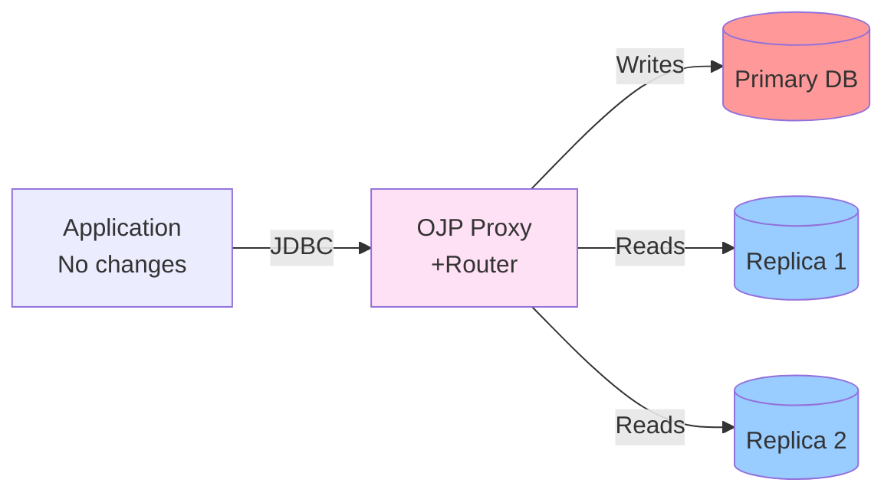

# Read/Write Traffic Splitting in OJP - Documentation Index

This directory contains comprehensive analysis and design documentation for implementing read/write traffic splitting in Open J Proxy (OJP).

## 📋 Quick Links

| Document | Purpose | Who Should Read |
|----------|---------|-----------------|
| [**Executive Summary**](../../READ_WRITE_SPLITTING_SUMMARY.md) | High-level overview | Stakeholders, Decision Makers |
| [**Technical Analysis**](./READ_WRITE_SPLITTING_ANALYSIS.md) | Detailed design & implementation plan | Architects, Developers |
| [**Sequence Diagrams**](./read-write-splitting-sequence-diagram.md) | Runtime behavior visualization | Developers |
| [**Configuration Templates**](./read-write-splitting-configuration-templates.md) | Setup examples | DevOps, DBAs |

## 🎯 What is Read/Write Splitting?

Read/write splitting routes database operations based on type:
- **Writes** (INSERT/UPDATE/DELETE) → Primary database
- **Reads** (SELECT) → Read replicas (distributed)
- **Transactions** → Primary database (all operations)

**Benefits**: Better scalability, performance, and resource utilization.

## 🚀 Quick Start by Role

### For Decision Makers
Start with the [Executive Summary](../../READ_WRITE_SPLITTING_SUMMARY.md) to understand:
- What the feature does
- Why implement it in OJP
- Implementation timeline (8-10 weeks)
- Business benefits

### For Architects
Read the [Technical Analysis](./READ_WRITE_SPLITTING_ANALYSIS.md) to understand:
- Implementation approaches evaluated (4 options)
- Recommended solution: SQL Parsing with Automatic Routing
- Architecture and component design
- Integration with existing OJP infrastructure
- Implementation strategy broken down into Copilot sessions

### For Developers
1. Review [Technical Analysis](./READ_WRITE_SPLITTING_ANALYSIS.md) - Component design section
2. Study [Sequence Diagrams](./read-write-splitting-sequence-diagram.md) - Runtime behavior
3. Check implementation phases - organized as Copilot sessions

### For DevOps/DBAs
Jump directly to [Configuration Templates](./read-write-splitting-configuration-templates.md) for:
- PostgreSQL, MySQL, Oracle, SQL Server examples
- Environment-specific configurations (dev/staging/prod)
- Best practices and migration checklist
- Troubleshooting guide

## 📚 Documentation Structure

### 1. Executive Summary (Root Directory)
**File**: `READ_WRITE_SPLITTING_SUMMARY.md`

Quick overview with:
- Feature description
- High-level architecture diagram
- Key benefits
- Implementation status
- Example usage

### 2. Technical Analysis (This Directory)
**File**: `READ_WRITE_SPLITTING_ANALYSIS.md`

Complete technical documentation:
- Current OJP architecture overview
- Requirements and goals
- 4 implementation approaches with pros/cons
- **Recommended approach**: SQL Parsing and Automatic Routing
- Detailed component design with code examples
- Implementation challenges and solutions
- **Migration strategy**: Organized into Copilot-sized sessions (11 sessions total)
- Future enhancements roadmap

### 3. Sequence Diagrams (This Directory)
**File**: `read-write-splitting-sequence-diagram.md`

Visual documentation with Mermaid diagrams:
1. Simple read query routing to replica
2. Write query routing with sticky session
3. Transaction pinning to primary
4. Replica failover scenarios
5. SELECT FOR UPDATE detection
6. Router decision flow

### 4. Configuration Templates (This Directory)
**File**: `read-write-splitting-configuration-templates.md`

Ready-to-use configurations:
- 6 complete templates for different scenarios
- Database-specific examples (PostgreSQL, MySQL, Oracle, SQL Server)
- Environment-specific configs (dev/staging/prod)
- Complete property reference
- Best practices
- Migration checklist
- Troubleshooting guide

## 🔧 Implementation Status

### ✅ Phase 1: Foundation (COMPLETE)
- Analysis and design complete
- All documentation written
- Architecture validated

### ⏳ Phase 2-5: Implementation (PENDING)
See [detailed implementation plan](./READ_WRITE_SPLITTING_ANALYSIS.md#implementation-strategy---copilot-sessions) for:
- **Phase 2**: Core Components (3 Copilot sessions)
- **Phase 3**: Integration (3 Copilot sessions)
- **Phase 4**: Testing & Documentation (2 Copilot sessions)
- **Phase 5**: Advanced Features (3 Copilot sessions, optional)

Each session is designed for completion in a single Copilot interaction (~1-2 hours).

**Total Timeline**: 8-10 weeks

## 🎨 Architecture Overview



## 💡 Key Features

| Feature | Description |
|---------|-------------|
| **Transparent** | No application code changes required |
| **Automatic** | SQL classification at proxy layer |
| **Safe** | Conservative fallback to primary for unknowns |
| **Smart Failover** | Tries all replicas before primary |
| **Read-Your-Writes** | Optional sticky session after writes |
| **Backward Compatible** | Existing deployments unchanged |

## 📖 Example Usage

### Configuration (Properties File)
```properties
# Enable read/write splitting
primary.ojp.readwrite.enabled=true
primary.ojp.readwrite.stickySessionSeconds=5

# Define replicas
replica1.ojp.readwrite.role=replica
replica1.ojp.readwrite.primary=primary
replica1.ojp.connection.url=jdbc:postgresql://replica1.example.com/db
```

### Application Code (No Changes!)
```java
// Existing code works unchanged
Connection conn = DriverManager.getConnection(ojpUrl, user, password);

// SELECT → Automatically routes to replica
ResultSet rs = stmt.executeQuery("SELECT * FROM users");

// UPDATE → Automatically routes to primary
stmt.executeUpdate("UPDATE users SET email = 'new@example.com'");

// Transactions → Automatically pin to primary
conn.setAutoCommit(false);
stmt.executeQuery("SELECT * FOR UPDATE");  // → Primary
stmt.executeUpdate("UPDATE ...");          // → Primary
conn.commit();
```

## 🔍 Next Steps

1. **Review Documentation**: Start with the [Executive Summary](../../READ_WRITE_SPLITTING_SUMMARY.md)
2. **Understand Design**: Read the [Technical Analysis](./READ_WRITE_SPLITTING_ANALYSIS.md)
3. **Plan Implementation**: Follow the [session-by-session implementation plan](./READ_WRITE_SPLITTING_ANALYSIS.md#implementation-strategy---copilot-sessions)
4. **Begin Coding**: Start with Session 2.1 (SqlClassifier implementation)

---

**Questions or Feedback?** Open an issue in the repository.
