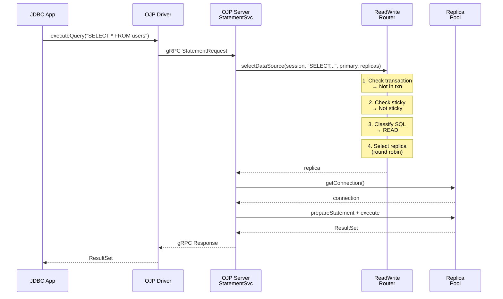
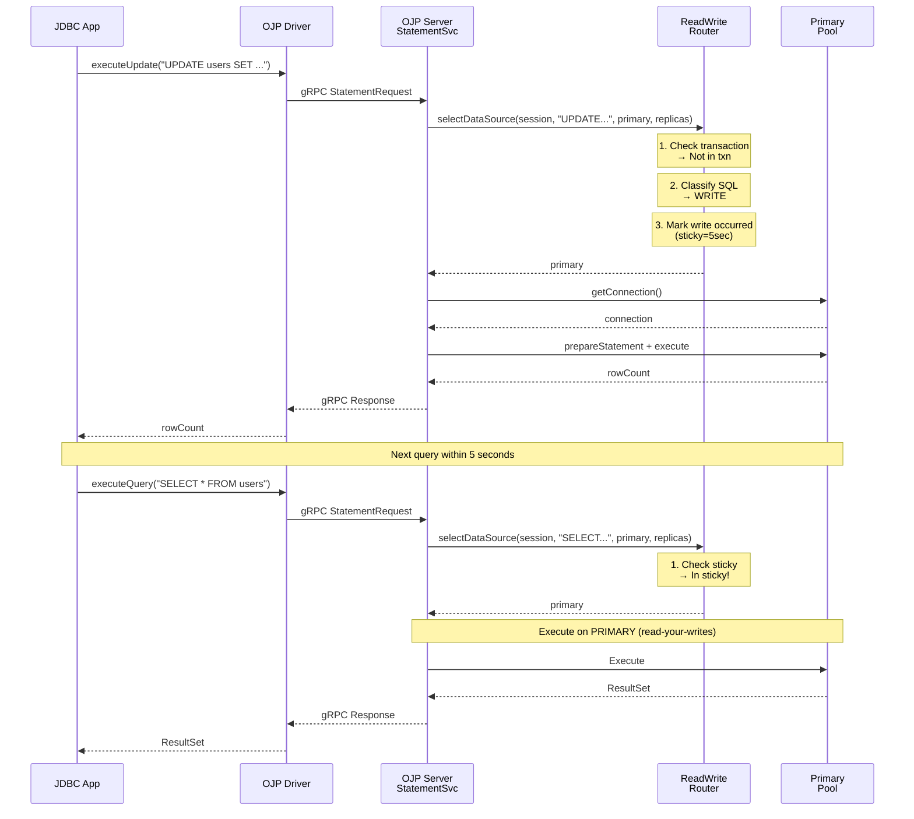
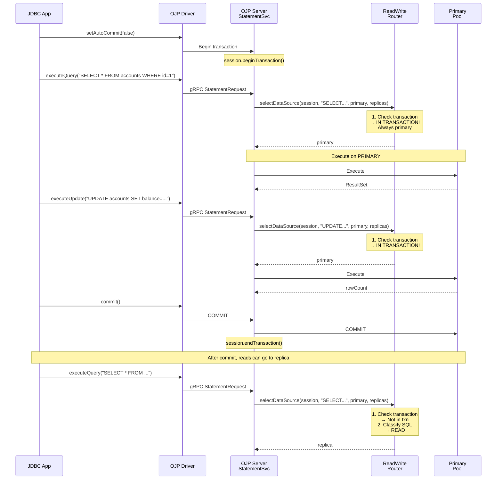
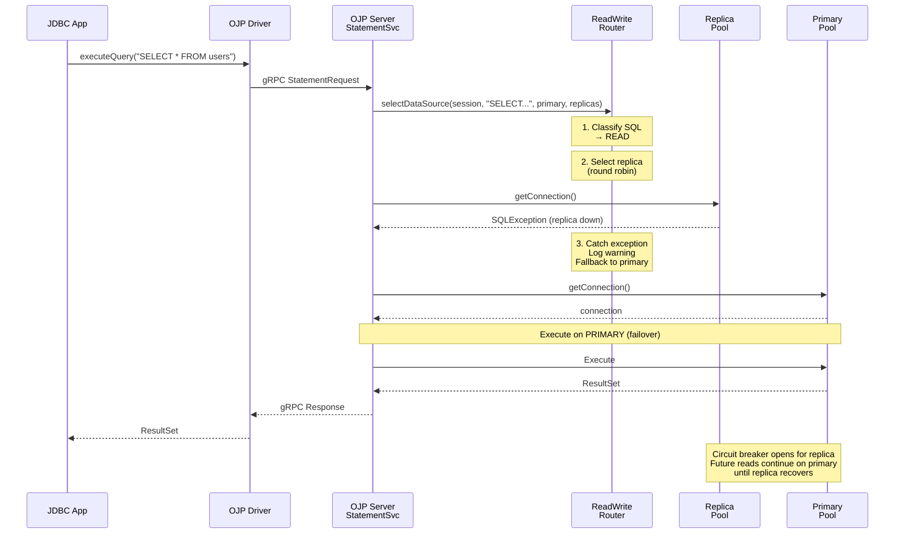
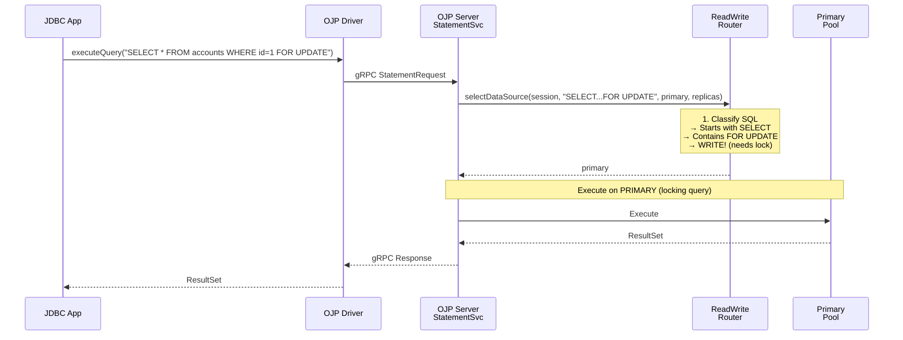
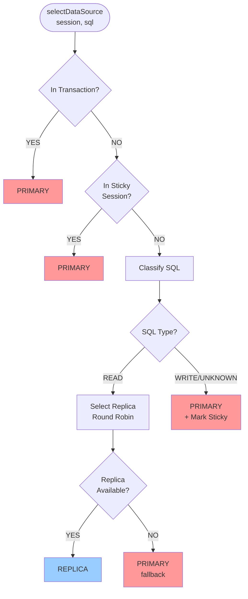

# Read/Write Splitting - Sequence Diagrams

This document provides sequence diagrams illustrating how read/write splitting works in various scenarios.

## Scenario 1: Simple Read Query Routing to Replica

## Scenario 2: Write Query Routing to Primary with Sticky Session

## Scenario 3: Transaction Pinning to Primary

## Scenario 4: Replica Failover to Primary

## Scenario 5: SELECT FOR UPDATE - Detected as Write

## Key Decision Points in Router Logic

## Summary

These sequence diagrams illustrate the key behaviors of the read/write splitting feature:

1. **Read Routing**: Normal SELECT queries go to replicas using round-robin selection
2. **Write Routing**: All writes go to primary and trigger sticky session
3. **Transaction Handling**: All queries within a transaction use the primary datasource
4. **Failover**: Replica failures automatically fall back to primary
5. **Lock Detection**: SELECT FOR UPDATE and similar locking queries route to primary

The routing logic ensures:
- **Consistency**: Writes always go to primary
- **Performance**: Reads distributed across replicas
- **Safety**: Unknown queries and failures default to primary
- **Transaction Integrity**: All transaction operations use single datasource
