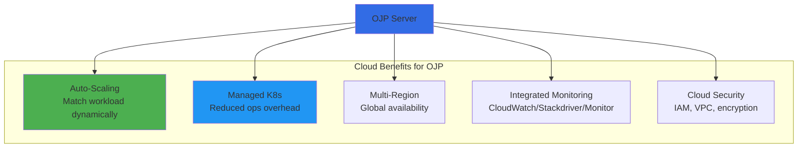
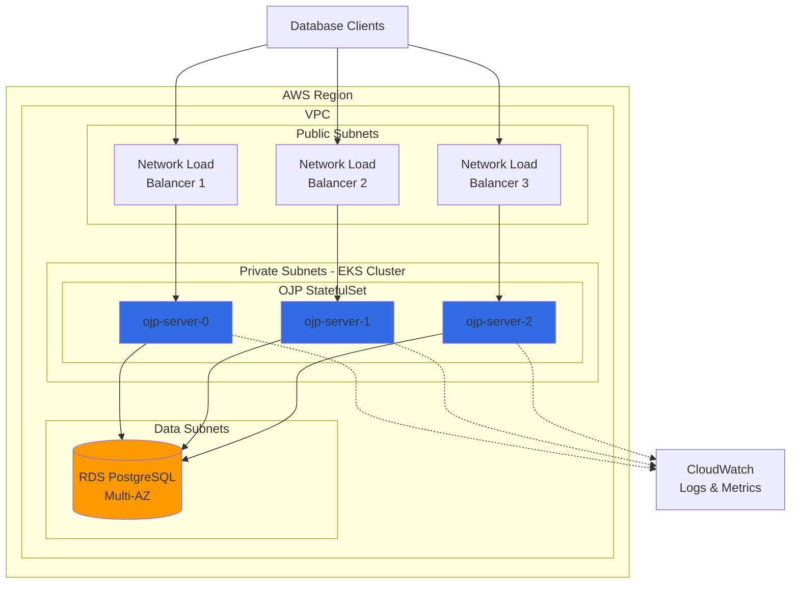
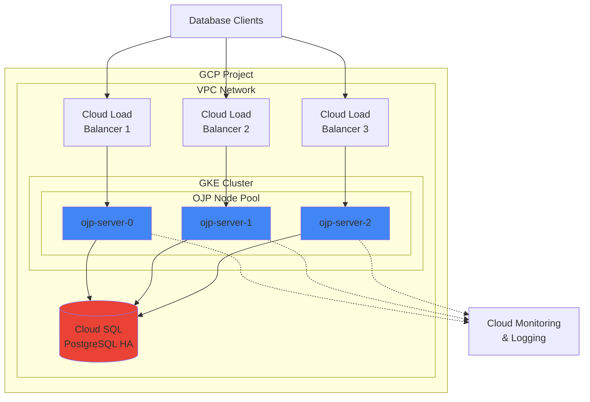
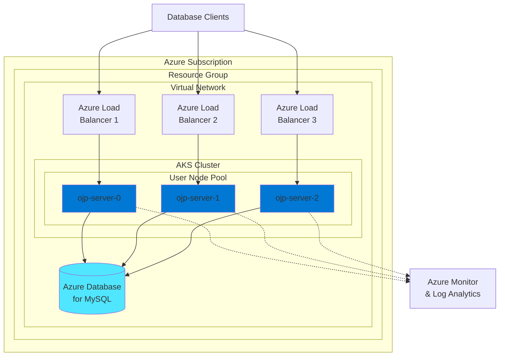
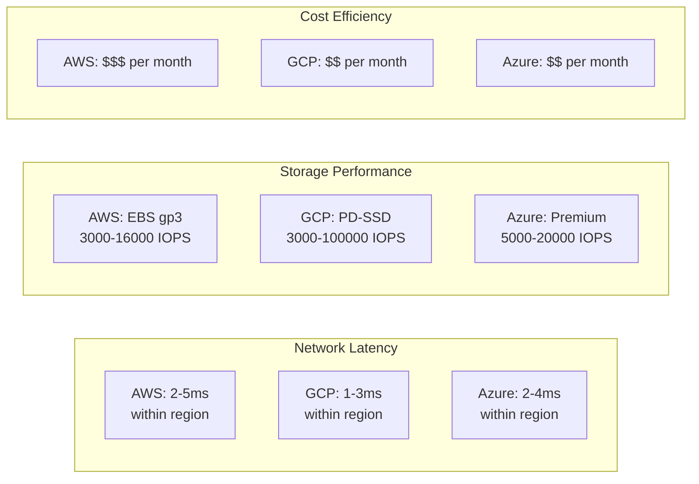

# Chapter 3b: Cloud Provider Deployment and Operations

> **Chapter Overview**: Deploy and operate OJP Server on major cloud platforms including AWS, Google Cloud Platform (GCP), and Microsoft Azure. This chapter provides comprehensive, cloud-specific guidance for production deployments, covering managed Kubernetes services, networking, security, cost optimization, and operational best practices.

> **✅ Cloud-Native Architecture**: OJP's StatefulSet-based architecture with per-pod LoadBalancer services is ideally suited for cloud environments. Each cloud provider offers unique features and optimizations that enhance OJP's reliability, performance, and operational efficiency.

---

## 3b.1 Cloud Deployment Overview

Before diving into provider-specific instructions, let's understand the common patterns and considerations for deploying OJP across cloud platforms.

### Why Deploy OJP in the Cloud?

**[IMAGE PROMPT 1]**: Create an infographic showing benefits of cloud deployment:
- Elastic scaling with cloud-native auto-scaling
- Managed Kubernetes services (reduce operational overhead)
- Global availability with multi-region deployment
- Integrated monitoring and logging
- Built-in security and compliance
Professional cloud architecture style with provider logos



### Common Cloud Deployment Patterns

All three major cloud providers support OJP deployment through their managed Kubernetes offerings:

| Cloud Provider | Managed Kubernetes | Best For |
|---------------|-------------------|----------|
| **AWS** | EKS (Elastic Kubernetes Service) | Deep AWS service integration, broad feature set |
| **GCP** | GKE (Google Kubernetes Engine) | Kubernetes-native features, cost optimization |
| **Azure** | AKS (Azure Kubernetes Service) | Microsoft ecosystem integration, hybrid cloud |

### Shared Prerequisites

Before deploying to any cloud provider, ensure you have:

1. **Cloud Account**: Active account with appropriate billing configured
2. **CLI Tools**: Provider-specific CLI installed and configured
3. **Permissions**: IAM/RBAC permissions to create Kubernetes clusters and networking resources
4. **Helm 3.x**: Installed and configured (see Chapter 3a)
5. **kubectl**: Installed and configured

---

## 3b.2 Amazon Web Services (AWS) Deployment

Deploy OJP Server on AWS using Amazon Elastic Kubernetes Service (EKS), taking advantage of AWS's robust infrastructure and deep service integration.

**[IMAGE PROMPT 2]**: Create a diagram showing OJP deployment on AWS EKS:
- VPC with public/private subnets across multiple AZs
- EKS control plane
- Worker nodes with OJP StatefulSets
- Network Load Balancers for each OJP pod
- RDS database backend
- CloudWatch monitoring integration
AWS architectural diagram style with service icons



### 3b.2.1 Prerequisites and Setup

Before deploying OJP on AWS EKS, prepare your environment with the necessary tools and permissions.

#### Install AWS CLI

```bash
# Install AWS CLI v2 on Linux
curl "https://awscli.amazonaws.com/awscli-exe-linux-x86_64.zip" -o "awscliv2.zip"
unzip awscliv2.zip
sudo ./aws/install

# Verify installation
aws --version  # Should show aws-cli/2.x.x

# Configure AWS credentials
aws configure
# AWS Access Key ID: [Enter your key]
# AWS Secret Access Key: [Enter your secret]
# Default region name: us-east-1
# Default output format: json
```

For other operating systems:

```bash
# macOS with Homebrew
brew install awscli

# Windows with chocolatey
choco install awscli
```

#### Install eksctl

`eksctl` is the official CLI tool for EKS cluster management:

```bash
# Linux/macOS
curl --silent --location "https://github.com/weaveworks/eksctl/releases/latest/download/eksctl_$(uname -s)_amd64.tar.gz" | tar xz -C /tmp
sudo mv /tmp/eksctl /usr/local/bin

# Verify installation
eksctl version  # Should show 0.x.x or higher

# Windows with chocolatey
choco install eksctl
```

#### Install kubectl for AWS

```bash
# Download kubectl binary for AWS
curl -LO "https://dl.k8s.io/release/$(curl -L -s https://dl.k8s.io/release/stable.txt)/bin/linux/amd64/kubectl"

# Install and verify
sudo install -o root -g root -m 0755 kubectl /usr/local/bin/kubectl
kubectl version --client
```

#### IAM Permissions

Your AWS user or role needs these permissions for EKS deployment:

```json
{
  "Version": "2012-10-17",
  "Statement": [
    {
      "Effect": "Allow",
      "Action": [
        "eks:*",
        "ec2:*",
        "elasticloadbalancing:*",
        "iam:CreateServiceLinkedRole",
        "iam:AttachRolePolicy",
        "iam:PutRolePolicy",
        "cloudformation:*",
        "autoscaling:*"
      ],
      "Resource": "*"
    }
  ]
}
```

💡 **Pro Tip**: For production, create a dedicated IAM role with specific resource constraints rather than using wildcard permissions.

### 3b.2.2 EKS Cluster Creation

Create a production-ready EKS cluster optimized for OJP workloads.

#### Cluster Configuration with eksctl

Create a cluster configuration file:

```yaml
# eks-ojp-cluster.yaml
apiVersion: eksctl.io/v1alpha5
kind: ClusterConfig

metadata:
  name: ojp-production
  region: us-east-1
  version: "1.28"  # Use latest stable version

# VPC configuration
vpc:
  cidr: 10.0.0.0/16
  nat:
    gateway: HighlyAvailable  # NAT gateway in each AZ

# Enable control plane logging
cloudWatch:
  clusterLogging:
    enableTypes: ["api", "audit", "authenticator", "controllerManager", "scheduler"]

# Managed node groups
managedNodeGroups:
  - name: ojp-nodegroup-1
    instanceType: m5.xlarge  # 4 vCPU, 16 GB RAM
    desiredCapacity: 3
    minSize: 3
    maxSize: 10
    volumeSize: 100  # GB
    volumeType: gp3
    volumeIOPS: 3000
    volumeThroughput: 125
    
    labels:
      role: ojp-server
      environment: production
    
    tags:
      k8s.io/cluster-autoscaler/enabled: "true"
      k8s.io/cluster-autoscaler/ojp-production: "owned"
    
    iam:
      withAddonPolicies:
        autoScaler: true
        cloudWatch: true
        albIngress: true
        ebs: true
    
    # Spread across availability zones
    availabilityZones: ["us-east-1a", "us-east-1b", "us-east-1c"]
    
    # Enable SSH access for troubleshooting
    ssh:
      allow: true
      publicKeyName: ojp-eks-key

# Add-ons
addons:
  - name: vpc-cni
    version: latest
  - name: coredns
    version: latest
  - name: kube-proxy
    version: latest
  - name: aws-ebs-csi-driver
    version: latest
```

#### Create the Cluster

```bash
# Create the cluster (takes 15-20 minutes)
eksctl create cluster -f eks-ojp-cluster.yaml

# Monitor creation progress
eksctl utils describe-stacks --region=us-east-1 --cluster=ojp-production

# Once complete, verify cluster access
kubectl cluster-info
kubectl get nodes

# Expected output:
# NAME                             STATUS   ROLES    AGE   VERSION
# ip-10-0-1-123.ec2.internal      Ready    <none>   5m    v1.28.x
# ip-10-0-2-124.ec2.internal      Ready    <none>   5m    v1.28.x
# ip-10-0-3-125.ec2.internal      Ready    <none>   5m    v1.28.x
```

#### Install AWS Load Balancer Controller

OJP requires the AWS Load Balancer Controller for Network Load Balancer provisioning:

```bash
# Create IAM policy for the load balancer controller
curl -o iam-policy.json https://raw.githubusercontent.com/kubernetes-sigs/aws-load-balancer-controller/main/docs/install/iam_policy.json

aws iam create-policy \
    --policy-name AWSLoadBalancerControllerIAMPolicy \
    --policy-document file://iam-policy.json

# Create IAM service account
eksctl create iamserviceaccount \
  --cluster=ojp-production \
  --namespace=kube-system \
  --name=aws-load-balancer-controller \
  --attach-policy-arn=arn:aws:iam::<YOUR_ACCOUNT_ID>:policy/AWSLoadBalancerControllerIAMPolicy \
  --override-existing-serviceaccounts \
  --approve

# Install the controller using Helm
helm repo add eks https://aws.github.io/eks-charts
helm repo update

helm install aws-load-balancer-controller eks/aws-load-balancer-controller \
  -n kube-system \
  --set clusterName=ojp-production \
  --set serviceAccount.create=false \
  --set serviceAccount.name=aws-load-balancer-controller

# Verify installation
kubectl get deployment -n kube-system aws-load-balancer-controller
```

### 3b.2.3 OJP Installation on EKS

Now install OJP Server on your EKS cluster with AWS-specific optimizations.

#### Prepare AWS-Specific Values

Create an AWS-optimized Helm values file:

```yaml
# ojp-eks-values.yaml
replicaCount: 3

image:
  repository: your-ecr-repo.dkr.ecr.us-east-1.amazonaws.com/ojp-server
  tag: "1.0.0"
  pullPolicy: IfNotPresent

# Resource allocation for m5.xlarge nodes
resources:
  requests:
    memory: "4Gi"
    cpu: "2000m"
  limits:
    memory: "8Gi"
    cpu: "3000m"

# Pod topology for multi-AZ distribution
topologySpreadConstraints:
  - maxSkew: 1
    topologyKey: topology.kubernetes.io/zone
    whenUnsatisfiable: DoNotSchedule
    labelSelector:
      matchLabels:
        app: ojp-server

# AWS-specific affinity rules
affinity:
  podAntiAffinity:
    requiredDuringSchedulingIgnoredDuringExecution:
      - labelSelector:
          matchExpressions:
            - key: app
              operator: In
              values:
                - ojp-server
        topologyKey: kubernetes.io/hostname

# Service configuration for AWS NLB
service:
  type: LoadBalancer
  annotations:
    service.beta.kubernetes.io/aws-load-balancer-type: "nlb"
    service.beta.kubernetes.io/aws-load-balancer-cross-zone-load-balancing-enabled: "true"
    service.beta.kubernetes.io/aws-load-balancer-backend-protocol: "tcp"
    service.beta.kubernetes.io/aws-load-balancer-healthcheck-protocol: "tcp"
    service.beta.kubernetes.io/aws-load-balancer-healthcheck-interval: "10"
    # Enable connection draining
    service.beta.kubernetes.io/aws-load-balancer-connection-draining-enabled: "true"
    service.beta.kubernetes.io/aws-load-balancer-connection-draining-timeout: "60"
  ports:
    - name: jdbc
      port: 3306
      targetPort: 3306
      protocol: TCP

# Persistent storage using EBS
persistence:
  enabled: true
  storageClass: gp3  # High-performance EBS
  size: 50Gi
  accessMode: ReadWriteOnce

# OJP configuration for AWS RDS backend
config:
  database:
    # RDS endpoint
    host: "ojp-db.cluster-xxxxx.us-east-1.rds.amazonaws.com"
    port: 3306
    username: "ojp_admin"
    # Use AWS Secrets Manager for password
    passwordSecretName: "ojp-db-credentials"
    passwordSecretKey: "password"
  
  pooling:
    minPoolSize: 10
    maxPoolSize: 100
    connectionTimeout: 30000
  
  # Enable CloudWatch metrics
  metrics:
    enabled: true
    provider: cloudwatch

# Health checks
livenessProbe:
  tcpSocket:
    port: 3306
  initialDelaySeconds: 30
  periodSeconds: 10
  timeoutSeconds: 5
  failureThreshold: 3

readinessProbe:
  tcpSocket:
    port: 3306
  initialDelaySeconds: 10
  periodSeconds: 5
  timeoutSeconds: 3
  failureThreshold: 3

# Monitoring integration
monitoring:
  enabled: true
  serviceMonitor:
    enabled: true
    interval: 30s

# CloudWatch Fluent Bit for logs
logging:
  enabled: true
  driver: fluentbit
  fluentbit:
    region: us-east-1
    logGroup: /aws/eks/ojp-production/application
    autoCreateGroup: true
```

#### Deploy OJP to EKS

```bash
# Add OJP Helm repository (adjust based on your setup)
helm repo add ojp https://your-helm-repo.example.com
helm repo update

# Create namespace
kubectl create namespace ojp

# Create secret for database credentials
kubectl create secret generic ojp-db-credentials \
  --from-literal=password='your-secure-password' \
  -n ojp

# Install OJP
helm install ojp-server ojp/ojp-server \
  -f ojp-eks-values.yaml \
  -n ojp

# Watch deployment progress
kubectl get pods -n ojp -w

# Expected output after a few minutes:
# NAME            READY   STATUS    RESTARTS   AGE
# ojp-server-0    1/1     Running   0          2m
# ojp-server-1    1/1     Running   0          3m
# ojp-server-2    1/1     Running   0          4m
```

#### Verify Load Balancers

```bash
# Check services and their AWS NLB endpoints
kubectl get svc -n ojp

# Expected output:
# NAME                TYPE           EXTERNAL-IP                                    PORT(S)
# ojp-server-0        LoadBalancer   abc123-nlb.us-east-1.elb.amazonaws.com        3306:31234/TCP
# ojp-server-1        LoadBalancer   def456-nlb.us-east-1.elb.amazonaws.com        3306:31235/TCP
# ojp-server-2        LoadBalancer   ghi789-nlb.us-east-1.elb.amazonaws.com        3306:31236/TCP

# Test connectivity to each load balancer
for svc in $(kubectl get svc -n ojp -o jsonpath='{.items[*].status.loadBalancer.ingress[0].hostname}'); do
  echo "Testing $svc..."
  nc -zv $svc 3306
done
```

### 3b.2.4 Networking and Security

Configure AWS networking features to secure OJP deployments.

#### VPC Security Groups

Configure security groups to control traffic:

```bash
# Get the security group ID for worker nodes
NODE_SG=$(aws eks describe-cluster \
  --name ojp-production \
  --query 'cluster.resourcesVpcConfig.clusterSecurityGroupId' \
  --output text)

# Allow inbound JDBC traffic from application VPC (10.1.0.0/16)
aws ec2 authorize-security-group-ingress \
  --group-id $NODE_SG \
  --protocol tcp \
  --port 3306 \
  --cidr 10.1.0.0/16 \
  --description "Allow JDBC from application VPC"

# Allow health checks from NLB
aws ec2 authorize-security-group-ingress \
  --group-id $NODE_SG \
  --protocol tcp \
  --port 3306 \
  --source-group $NODE_SG \
  --description "Allow NLB health checks"
```

#### Network Policies

Apply Kubernetes Network Policies for pod-level security:

```yaml
# ojp-network-policy.yaml
apiVersion: networking.k8s.io/v1
kind: NetworkPolicy
metadata:
  name: ojp-server-policy
  namespace: ojp
spec:
  podSelector:
    matchLabels:
      app: ojp-server
  
  policyTypes:
    - Ingress
    - Egress
  
  ingress:
    # Allow JDBC traffic from NLB
    - from:
        - namespaceSelector: {}
      ports:
        - protocol: TCP
          port: 3306
    
    # Allow metrics scraping from Prometheus
    - from:
        - namespaceSelector:
            matchLabels:
              name: monitoring
      ports:
        - protocol: TCP
          port: 9090
  
  egress:
    # Allow DNS queries
    - to:
        - namespaceSelector:
            matchLabels:
              name: kube-system
      ports:
        - protocol: UDP
          port: 53
    
    # Allow connections to RDS (adjust CIDR for your RDS subnet)
    - to:
        - ipBlock:
            cidr: 10.0.128.0/20  # RDS subnet range
      ports:
        - protocol: TCP
          port: 3306
    
    # Allow CloudWatch metrics
    - to:
        - ipBlock:
            cidr: 0.0.0.0/0
      ports:
        - protocol: TCP
          port: 443
```

Apply the network policy:

```bash
kubectl apply -f ojp-network-policy.yaml
```

#### AWS PrivateLink for RDS

For enhanced security, use AWS PrivateLink to connect to RDS without exposing traffic to the internet:

```bash
# Create VPC endpoint for RDS
aws ec2 create-vpc-endpoint \
  --vpc-id vpc-xxxxx \
  --vpc-endpoint-type Interface \
  --service-name com.amazonaws.us-east-1.rds \
  --subnet-ids subnet-xxxxx subnet-yyyyy subnet-zzzzz \
  --security-group-ids sg-xxxxx

# Update OJP configuration to use private endpoint
kubectl edit configmap ojp-config -n ojp
# Update database.host to the PrivateLink endpoint
```

#### IAM Roles for Service Accounts (IRSA)

Use IRSA for secure AWS service access without credentials:

```bash
# Create IAM policy for OJP (CloudWatch, Secrets Manager access)
cat > ojp-iam-policy.json <<EOF
{
  "Version": "2012-10-17",
  "Statement": [
    {
      "Effect": "Allow",
      "Action": [
        "cloudwatch:PutMetricData",
        "cloudwatch:GetMetricData",
        "cloudwatch:ListMetrics"
      ],
      "Resource": "*"
    },
    {
      "Effect": "Allow",
      "Action": [
        "secretsmanager:GetSecretValue"
      ],
      "Resource": "arn:aws:secretsmanager:us-east-1:*:secret:ojp/*"
    },
    {
      "Effect": "Allow",
      "Action": [
        "logs:CreateLogGroup",
        "logs:CreateLogStream",
        "logs:PutLogEvents"
      ],
      "Resource": "arn:aws:logs:us-east-1:*:log-group:/aws/eks/ojp-production/*"
    }
  ]
}
EOF

# Create the policy
aws iam create-policy \
  --policy-name OJPServerPolicy \
  --policy-document file://ojp-iam-policy.json

# Associate with service account
eksctl create iamserviceaccount \
  --name ojp-server \
  --namespace ojp \
  --cluster ojp-production \
  --attach-policy-arn arn:aws:iam::<ACCOUNT_ID>:policy/OJPServerPolicy \
  --approve

# Update OJP deployment to use service account
kubectl patch statefulset ojp-server -n ojp \
  -p '{"spec":{"template":{"spec":{"serviceAccountName":"ojp-server"}}}}'
```

### 3b.2.5 Storage and Persistence

Configure persistent storage for OJP state and logs.

#### EBS Storage Class

Create a high-performance storage class using EBS gp3 volumes:

```yaml
# ebs-gp3-storageclass.yaml
apiVersion: storage.k8s.io/v1
kind: StorageClass
metadata:
  name: ebs-gp3-encrypted
provisioner: ebs.csi.aws.com
parameters:
  type: gp3
  iops: "3000"
  throughput: "125"
  encrypted: "true"
  kmsKeyId: "arn:aws:kms:us-east-1:xxxxx:key/xxxxx"
volumeBindingMode: WaitForFirstConsumer
allowVolumeExpansion: true
reclaimPolicy: Retain
```

Apply the storage class:

```bash
kubectl apply -f ebs-gp3-storageclass.yaml

# Verify
kubectl get storageclass
```

#### Volume Snapshots for Backup

Configure automated EBS snapshots:

```yaml
# ojp-snapshot-class.yaml
apiVersion: snapshot.storage.k8s.io/v1
kind: VolumeSnapshotClass
metadata:
  name: ojp-snapshot-class
driver: ebs.csi.aws.com
deletionPolicy: Retain
parameters:
  tagSpecification_1: "Name=OJP Snapshot"
  tagSpecification_2: "Environment=Production"
---
apiVersion: snapshot.storage.k8s.io/v1
kind: VolumeSnapshot
metadata:
  name: ojp-server-snapshot
  namespace: ojp
spec:
  volumeSnapshotClassName: ojp-snapshot-class
  source:
    persistentVolumeClaimName: data-ojp-server-0
```

Create scheduled snapshots with a CronJob:

```yaml
# ojp-snapshot-cronjob.yaml
apiVersion: batch/v1
kind: CronJob
metadata:
  name: ojp-snapshot-backup
  namespace: ojp
spec:
  schedule: "0 2 * * *"  # Daily at 2 AM
  jobTemplate:
    spec:
      template:
        spec:
          serviceAccountName: ojp-backup
          containers:
          - name: snapshot-creator
            image: amazon/aws-cli:latest
            command:
            - /bin/bash
            - -c
            - |
              # Get volume IDs from PVCs
              kubectl get pvc -n ojp -l app=ojp-server -o json | \
                jq -r '.items[].spec.volumeName' | \
                while read pv; do
                  VOLUME_ID=$(kubectl get pv $pv -o jsonpath='{.spec.csi.volumeHandle}')
                  aws ec2 create-snapshot \
                    --volume-id $VOLUME_ID \
                    --description "OJP automated backup $(date +%Y-%m-%d)" \
                    --tag-specifications "ResourceType=snapshot,Tags=[{Key=Name,Value=ojp-backup},{Key=Timestamp,Value=$(date +%s)}]"
                done
          restartPolicy: OnFailure
```

#### EFS for Shared Storage (Optional)

For shared configuration or log aggregation:

```bash
# Create EFS file system
EFS_ID=$(aws efs create-file-system \
  --region us-east-1 \
  --performance-mode generalPurpose \
  --throughput-mode bursting \
  --encrypted \
  --tags Key=Name,Value=ojp-shared-storage \
  --query 'FileSystemId' \
  --output text)

# Create mount targets in each subnet
for subnet in subnet-xxxxx subnet-yyyyy subnet-zzzzz; do
  aws efs create-mount-target \
    --file-system-id $EFS_ID \
    --subnet-id $subnet \
    --security-groups sg-xxxxx
done

# Install EFS CSI driver
helm repo add aws-efs-csi-driver https://kubernetes-sigs.github.io/aws-efs-csi-driver/
helm install aws-efs-csi-driver aws-efs-csi-driver/aws-efs-csi-driver \
  --namespace kube-system

# Create storage class
cat <<EOF | kubectl apply -f -
apiVersion: storage.k8s.io/v1
kind: StorageClass
metadata:
  name: efs-sc
provisioner: efs.csi.aws.com
parameters:
  provisioningMode: efs-ap
  fileSystemId: $EFS_ID
  directoryPerms: "700"
EOF
```

### 3b.2.6 Monitoring and Observability

Integrate OJP with AWS monitoring services.

#### CloudWatch Container Insights

Enable Container Insights for comprehensive cluster monitoring:

```bash
# Install CloudWatch agent
kubectl apply -f https://raw.githubusercontent.com/aws-samples/amazon-cloudwatch-container-insights/latest/k8s-deployment-manifest-templates/deployment-mode/daemonset/container-insights-monitoring/quickstart/cwagent-fluentd-quickstart.yaml

# Verify installation
kubectl get pods -n amazon-cloudwatch

# Create CloudWatch dashboard for OJP
aws cloudwatch put-dashboard \
  --dashboard-name OJP-Production \
  --dashboard-body file://ojp-dashboard.json
```

Sample CloudWatch dashboard configuration:

```json
{
  "widgets": [
    {
      "type": "metric",
      "properties": {
        "metrics": [
          ["ContainerInsights", "pod_cpu_utilization", {"stat": "Average"}],
          [".", "pod_memory_utilization", {"stat": "Average"}]
        ],
        "period": 300,
        "stat": "Average",
        "region": "us-east-1",
        "title": "OJP Resource Utilization",
        "yAxis": {
          "left": {
            "min": 0,
            "max": 100
          }
        }
      }
    },
    {
      "type": "metric",
      "properties": {
        "metrics": [
          ["AWS/NetworkELB", "HealthyHostCount", {"stat": "Average"}],
          [".", "UnHealthyHostCount", {"stat": "Average"}]
        ],
        "period": 60,
        "stat": "Average",
        "region": "us-east-1",
        "title": "OJP Pod Health"
      }
    }
  ]
}
```

#### Application Metrics with Prometheus

Deploy Prometheus on EKS for detailed application metrics:

```bash
# Add Prometheus community Helm repo
helm repo add prometheus-community https://prometheus-community.github.io/helm-charts
helm repo update

# Install kube-prometheus-stack
helm install prometheus prometheus-community/kube-prometheus-stack \
  --namespace monitoring \
  --create-namespace \
  --set prometheus.prometheusSpec.serviceMonitorSelectorNilUsesHelmValues=false \
  --set grafana.enabled=true \
  --set grafana.adminPassword='secure-password'

# Create ServiceMonitor for OJP
cat <<EOF | kubectl apply -f -
apiVersion: monitoring.coreos.com/v1
kind: ServiceMonitor
metadata:
  name: ojp-server
  namespace: ojp
  labels:
    app: ojp-server
spec:
  selector:
    matchLabels:
      app: ojp-server
  endpoints:
  - port: metrics
    interval: 30s
    path: /metrics
EOF
```

#### CloudWatch Logs Integration

Configure Fluent Bit to ship logs to CloudWatch:

```yaml
# fluent-bit-config.yaml
apiVersion: v1
kind: ConfigMap
metadata:
  name: fluent-bit-config
  namespace: ojp
data:
  fluent-bit.conf: |
    [SERVICE]
        Flush         5
        Log_Level     info
        Daemon        off
        Parsers_File  parsers.conf

    [INPUT]
        Name              tail
        Path              /var/log/containers/ojp-server*.log
        Parser            docker
        Tag               ojp.*
        Refresh_Interval  5

    [OUTPUT]
        Name                cloudwatch_logs
        Match               ojp.*
        region              us-east-1
        log_group_name      /aws/eks/ojp-production/application
        log_stream_prefix   ojp-
        auto_create_group   true
```

#### Distributed Tracing with X-Ray

Enable AWS X-Ray for request tracing:

```bash
# Install X-Ray daemon
kubectl apply -f https://raw.githubusercontent.com/aws/aws-xray-daemon/master/kubernetes/xray-k8s-daemonset.yaml

# Update OJP deployment to use X-Ray
kubectl set env statefulset/ojp-server \
  -n ojp \
  AWS_XRAY_DAEMON_ADDRESS=xray-service.default:2000 \
  AWS_XRAY_TRACING_NAME=ojp-server
```

### 3b.2.7 Cost Optimization

Optimize AWS costs while maintaining performance.

#### Right-Sizing Instances

Analyze and adjust instance types:

```bash
# Install AWS Compute Optimizer CLI
aws compute-optimizer get-ec2-instance-recommendations \
  --instance-arns $(aws ec2 describe-instances \
    --filters "Name=tag:eks:cluster-name,Values=ojp-production" \
    --query 'Reservations[].Instances[].InstanceId' \
    --output text | xargs -I {} echo "arn:aws:ec2:us-east-1:*:instance/{}")

# Review recommendations and update node group
eksctl scale nodegroup \
  --cluster=ojp-production \
  --name=ojp-nodegroup-1 \
  --nodes=3 \
  --nodes-min=2 \
  --nodes-max=8
```

#### Spot Instances for Non-Critical Workloads

Add a spot instance node group for cost savings:

```yaml
# spot-nodegroup.yaml
apiVersion: eksctl.io/v1alpha5
kind: ClusterConfig

metadata:
  name: ojp-production
  region: us-east-1

managedNodeGroups:
  - name: ojp-spot-nodegroup
    instanceTypes: ["m5.xlarge", "m5a.xlarge", "m5n.xlarge"]
    spot: true
    desiredCapacity: 2
    minSize: 0
    maxSize: 5
    
    labels:
      lifecycle: spot
      role: ojp-server
    
    taints:
      - key: spot
        value: "true"
        effect: NoSchedule
```

Create spot-tolerant workload:

```yaml
# Update OJP deployment for spot tolerance
tolerations:
  - key: spot
    operator: Equal
    value: "true"
    effect: NoSchedule

nodeSelector:
  lifecycle: spot
```

#### Auto-Scaling Configuration

Implement Cluster Autoscaler:

```bash
# Deploy Cluster Autoscaler
kubectl apply -f https://raw.githubusercontent.com/kubernetes/autoscaler/master/cluster-autoscaler/cloudprovider/aws/examples/cluster-autoscaler-autodiscover.yaml

# Update deployment with cluster name
kubectl set image deployment/cluster-autoscaler \
  -n kube-system \
  cluster-autoscaler=k8s.gcr.io/autoscaling/cluster-autoscaler:v1.28.0

kubectl set env deployment/cluster-autoscaler \
  -n kube-system \
  AWS_REGION=us-east-1

# Configure scale-down parameters
kubectl patch deployment cluster-autoscaler \
  -n kube-system \
  -p '{"spec":{"template":{"spec":{"containers":[{"name":"cluster-autoscaler","command":["./cluster-autoscaler","--v=4","--stderrthreshold=info","--cloud-provider=aws","--skip-nodes-with-local-storage=false","--expander=least-waste","--node-group-auto-discovery=asg:tag=k8s.io/cluster-autoscaler/enabled,k8s.io/cluster-autoscaler/ojp-production","--balance-similar-node-groups","--skip-nodes-with-system-pods=false","--scale-down-delay-after-add=5m","--scale-down-unneeded-time=5m"]}]}}}}'
```

#### Cost Monitoring

Set up cost alerts:

```bash
# Create budget for EKS cluster
aws budgets create-budget \
  --account-id $(aws sts get-caller-identity --query Account --output text) \
  --budget file://eks-budget.json \
  --notifications-with-subscribers file://budget-notifications.json
```

Budget configuration:

```json
{
  "BudgetName": "OJP-EKS-Monthly-Budget",
  "BudgetLimit": {
    "Amount": "1000",
    "Unit": "USD"
  },
  "TimeUnit": "MONTHLY",
  "BudgetType": "COST",
  "CostFilters": {
    "TagKeyValue": ["user:Project$OJP"]
  }
}
```

### 3b.2.8 Disaster Recovery

Implement comprehensive disaster recovery for AWS deployments.

#### Multi-Region Setup

Deploy OJP in multiple AWS regions for disaster recovery:

```bash
# Create cluster in secondary region (us-west-2)
eksctl create cluster -f eks-ojp-cluster-dr.yaml --region us-west-2

# Set up cross-region replication for EBS snapshots
aws ec2 enable-fast-snapshot-restores \
  --availability-zones us-west-2a us-west-2b us-west-2c \
  --source-snapshot-ids snap-xxxxx

# Copy snapshots to DR region
aws ec2 copy-snapshot \
  --source-region us-east-1 \
  --source-snapshot-id snap-xxxxx \
  --destination-region us-west-2 \
  --description "DR snapshot for OJP"
```

#### Automated Backup Strategy

Create a comprehensive backup solution:

```yaml
# velero-backup.yaml
apiVersion: velero.io/v1
kind: Schedule
metadata:
  name: ojp-daily-backup
  namespace: velero
spec:
  schedule: "0 1 * * *"  # Daily at 1 AM
  template:
    includedNamespaces:
    - ojp
    includedResources:
    - "*"
    snapshotVolumes: true
    ttl: 720h0m0s  # Retain for 30 days
    storageLocation: aws-s3-backup
```

Install and configure Velero:

```bash
# Create S3 bucket for backups
aws s3 mb s3://ojp-velero-backups-$(aws sts get-caller-identity --query Account --output text)

# Install Velero
velero install \
  --provider aws \
  --plugins velero/velero-plugin-for-aws:v1.8.0 \
  --bucket ojp-velero-backups-$(aws sts get-caller-identity --query Account --output text) \
  --backup-location-config region=us-east-1 \
  --snapshot-location-config region=us-east-1 \
  --secret-file ./credentials-velero

# Create backup schedule
kubectl apply -f velero-backup.yaml

# Verify backups
velero backup get
```

#### RDS Cross-Region Read Replica

Set up RDS read replica in DR region:

```bash
# Create read replica in us-west-2
aws rds create-db-instance-read-replica \
  --db-instance-identifier ojp-db-replica-west \
  --source-db-instance-identifier ojp-db-production \
  --db-instance-class db.r5.xlarge \
  --availability-zone us-west-2a \
  --region us-west-2

# Promote replica in case of disaster (manual failover)
aws rds promote-read-replica \
  --db-instance-identifier ojp-db-replica-west \
  --region us-west-2
```

#### Disaster Recovery Runbook

Create an automated DR failover script:

```bash
#!/bin/bash
# dr-failover.sh - Automate OJP disaster recovery failover

set -e

DR_REGION="us-west-2"
PRIMARY_REGION="us-east-1"
CLUSTER_NAME="ojp-production"

echo "Starting disaster recovery failover to $DR_REGION..."

# 1. Promote RDS read replica
echo "Promoting RDS read replica..."
aws rds promote-read-replica \
  --db-instance-identifier ojp-db-replica-west \
  --region $DR_REGION

# 2. Wait for promotion to complete
echo "Waiting for RDS promotion..."
aws rds wait db-instance-available \
  --db-instance-identifier ojp-db-replica-west \
  --region $DR_REGION

# 3. Switch kubectl context to DR cluster
echo "Switching to DR cluster..."
aws eks update-kubeconfig \
  --name $CLUSTER_NAME \
  --region $DR_REGION

# 4. Restore from latest backup
echo "Restoring OJP from backup..."
LATEST_BACKUP=$(velero backup get --output json | jq -r '.items[0].metadata.name')
velero restore create --from-backup $LATEST_BACKUP --wait

# 5. Update database endpoints
echo "Updating database endpoints..."
NEW_ENDPOINT=$(aws rds describe-db-instances \
  --db-instance-identifier ojp-db-replica-west \
  --region $DR_REGION \
  --query 'DBInstances[0].Endpoint.Address' \
  --output text)

kubectl set env statefulset/ojp-server \
  -n ojp \
  DATABASE_HOST=$NEW_ENDPOINT

# 6. Verify deployment
echo "Verifying deployment..."
kubectl rollout status statefulset/ojp-server -n ojp

# 7. Update DNS (example using Route53)
echo "Updating Route53 DNS records..."
aws route53 change-resource-record-sets \
  --hosted-zone-id Z1234567890ABC \
  --change-batch file://dns-update.json

echo "Disaster recovery failover complete!"
echo "New OJP endpoints:"
kubectl get svc -n ojp -o wide
```

#### Testing DR Procedures

Regularly test your disaster recovery:

```bash
# Schedule DR drill
cat <<EOF | kubectl apply -f -
apiVersion: batch/v1
kind: CronJob
metadata:
  name: dr-drill
  namespace: ojp
spec:
  schedule: "0 0 1 * *"  # Monthly on the 1st
  jobTemplate:
    spec:
      template:
        spec:
          containers:
          - name: dr-test
            image: amazon/aws-cli:latest
            command:
            - /bin/bash
            - -c
            - |
              # Test backup restoration to test namespace
              velero restore create dr-test-\$(date +%Y%m%d) \
                --from-backup ojp-daily-backup-latest \
                --namespace-mappings ojp:ojp-dr-test
              
              # Verify restoration
              kubectl wait --for=condition=ready pod \
                -l app=ojp-server \
                -n ojp-dr-test \
                --timeout=300s
              
              # Clean up test namespace
              kubectl delete namespace ojp-dr-test
          restartPolicy: OnFailure
EOF
```

---

## 3b.3 Google Cloud Platform (GCP) Deployment

Deploy OJP Server on Google Kubernetes Engine (GKE), leveraging GCP's advanced Kubernetes capabilities and cost-effective infrastructure.

**[IMAGE PROMPT 3]**: Create a diagram showing OJP deployment on GKE:
- VPC with subnet across multiple zones
- GKE control plane (managed by Google)
- Node pools with OJP StatefulSets
- Cloud Load Balancers for each OJP pod
- Cloud SQL instance backend
- Cloud Monitoring/Logging integration
GCP architectural diagram style with service icons



### 3b.3.1 Prerequisites and Setup

Prepare your GCP environment for OJP deployment.

#### Install Google Cloud SDK

```bash
# Install on Linux
curl https://sdk.cloud.google.com | bash
exec -l $SHELL

# Initialize gcloud
gcloud init

# Authenticate
gcloud auth login

# Set default project
gcloud config set project YOUR_PROJECT_ID

# Set default region and zone
gcloud config set compute/region us-central1
gcloud config set compute/zone us-central1-a

# Verify installation
gcloud version
```

For other platforms:

```bash
# macOS with Homebrew
brew install google-cloud-sdk

# Windows with chocolatey
choco install gcloudsdk
```

#### Install GKE gcloud Components

```bash
# Install kubectl component
gcloud components install kubectl

# Install GKE gcloud auth plugin
gcloud components install gke-gcloud-auth-plugin

# Verify
kubectl version --client
```

#### Enable Required APIs

```bash
# Enable necessary GCP APIs
gcloud services enable container.googleapis.com
gcloud services enable compute.googleapis.com
gcloud services enable sqladmin.googleapis.com
gcloud services enable cloudresourcemanager.googleapis.com
gcloud services enable monitoring.googleapis.com
gcloud services enable logging.googleapis.com
gcloud services enable cloudtrace.googleapis.com

# Verify enabled services
gcloud services list --enabled
```

#### Configure IAM Permissions

Ensure your account has required roles:

```bash
# Grant necessary roles (requires project owner or admin)
gcloud projects add-iam-policy-binding YOUR_PROJECT_ID \
  --member="user:your-email@example.com" \
  --role="roles/container.admin"

gcloud projects add-iam-policy-binding YOUR_PROJECT_ID \
  --member="user:your-email@example.com" \
  --role="roles/compute.admin"

gcloud projects add-iam-policy-binding YOUR_PROJECT_ID \
  --member="user:your-email@example.com" \
  --role="roles/iam.serviceAccountAdmin"

# Verify permissions
gcloud projects get-iam-policy YOUR_PROJECT_ID
```

### 3b.3.2 GKE Cluster Creation

Create a production-grade GKE cluster optimized for OJP workloads.

#### Standard GKE Cluster

Create a regional GKE cluster for high availability:

```bash
# Set variables
PROJECT_ID="your-project-id"
CLUSTER_NAME="ojp-production"
REGION="us-central1"
ZONES="us-central1-a,us-central1-b,us-central1-c"

# Create the cluster
gcloud container clusters create $CLUSTER_NAME \
  --region $REGION \
  --node-locations $ZONES \
  --num-nodes 1 \
  --machine-type n1-standard-4 \
  --disk-type pd-ssd \
  --disk-size 100 \
  --enable-autorepair \
  --enable-autoupgrade \
  --enable-autoscaling \
  --min-nodes 1 \
  --max-nodes 5 \
  --enable-ip-alias \
  --network "default" \
  --subnetwork "default" \
  --enable-stackdriver-kubernetes \
  --enable-cloud-logging \
  --enable-cloud-monitoring \
  --addons HorizontalPodAutoscaling,HttpLoadBalancing,GcePersistentDiskCsiDriver \
  --workload-pool=$PROJECT_ID.svc.id.goog \
  --enable-shielded-nodes \
  --shielded-secure-boot \
  --shielded-integrity-monitoring \
  --release-channel regular \
  --labels environment=production,app=ojp

# Get cluster credentials
gcloud container clusters get-credentials $CLUSTER_NAME --region $REGION

# Verify cluster
kubectl cluster-info
kubectl get nodes
```

#### GKE Autopilot (Alternative)

For simplified management, use GKE Autopilot:

```bash
# Create Autopilot cluster
gcloud container clusters create-auto $CLUSTER_NAME \
  --region $REGION \
  --release-channel regular \
  --enable-autoprovisioning \
  --labels environment=production,app=ojp

# Note: Autopilot manages nodes automatically, no node configuration needed
```

💡 **GKE Autopilot vs Standard**: Autopilot provides fully managed nodes with per-pod billing, while Standard gives more control over node configuration. For OJP, Standard mode is recommended for predictable performance.

#### Configure Workload Identity

Enable Workload Identity for secure service access:

```bash
# Already enabled during cluster creation with --workload-pool flag

# Create Kubernetes service account for OJP
kubectl create namespace ojp
kubectl create serviceaccount ojp-server -n ojp

# Create GCP service account
gcloud iam service-accounts create ojp-gke-sa \
  --display-name="OJP Server Service Account"

# Grant permissions to GCP service account
gcloud projects add-iam-policy-binding $PROJECT_ID \
  --member="serviceAccount:ojp-gke-sa@$PROJECT_ID.iam.gserviceaccount.com" \
  --role="roles/monitoring.metricWriter"

gcloud projects add-iam-policy-binding $PROJECT_ID \
  --member="serviceAccount:ojp-gke-sa@$PROJECT_ID.iam.gserviceaccount.com" \
  --role="roles/logging.logWriter"

gcloud projects add-iam-policy-binding $PROJECT_ID \
  --member="serviceAccount:ojp-gke-sa@$PROJECT_ID.iam.gserviceaccount.com" \
  --role="roles/cloudtrace.agent"

# Bind Kubernetes SA to GCP SA
gcloud iam service-accounts add-iam-policy-binding \
  ojp-gke-sa@$PROJECT_ID.iam.gserviceaccount.com \
  --role roles/iam.workloadIdentityUser \
  --member "serviceAccount:$PROJECT_ID.svc.id.goog[ojp/ojp-server]"

# Annotate Kubernetes service account
kubectl annotate serviceaccount ojp-server \
  -n ojp \
  iam.gke.io/gcp-service-account=ojp-gke-sa@$PROJECT_ID.iam.gserviceaccount.com
```

### 3b.3.3 OJP Installation on GKE

Deploy OJP with GCP-specific optimizations.

#### Prepare GCP-Optimized Values

Create Helm values for GKE:

```yaml
# ojp-gke-values.yaml
replicaCount: 3

image:
  repository: gcr.io/YOUR_PROJECT_ID/ojp-server
  tag: "1.0.0"
  pullPolicy: IfNotPresent

# Resource allocation for n1-standard-4 nodes
resources:
  requests:
    memory: "4Gi"
    cpu: "2000m"
  limits:
    memory: "8Gi"
    cpu: "3000m"

# Multi-zone distribution
topologySpreadConstraints:
  - maxSkew: 1
    topologyKey: topology.kubernetes.io/zone
    whenUnsatisfiable: DoNotSchedule
    labelSelector:
      matchLabels:
        app: ojp-server

# Pod anti-affinity
affinity:
  podAntiAffinity:
    requiredDuringSchedulingIgnoredDuringExecution:
      - labelSelector:
          matchExpressions:
            - key: app
              operator: In
              values:
                - ojp-server
        topologyKey: kubernetes.io/hostname

# Service configuration for GCP Load Balancer
service:
  type: LoadBalancer
  annotations:
    cloud.google.com/load-balancer-type: "External"
    networking.gke.io/load-balancer-type: "Internal"  # or External for public access
    # Enable connection draining
    cloud.google.com/backend-config: "ojp-backend-config"
  ports:
    - name: jdbc
      port: 3306
      targetPort: 3306
      protocol: TCP

# Persistent storage using Persistent Disk
persistence:
  enabled: true
  storageClass: pd-ssd  # SSD for better performance
  size: 50Gi
  accessMode: ReadWriteOnce

# OJP configuration for Cloud SQL
config:
  database:
    # Cloud SQL connection via private IP
    host: "10.x.x.x"  # Private IP of Cloud SQL instance
    port: 3306
    username: "ojp_admin"
    # Use Secret Manager for password
    passwordSecretName: "ojp-db-credentials"
    passwordSecretKey: "password"
  
  pooling:
    minPoolSize: 10
    maxPoolSize: 100
    connectionTimeout: 30000
  
  # Enable Cloud Monitoring metrics
  metrics:
    enabled: true
    provider: stackdriver

# Health checks
livenessProbe:
  tcpSocket:
    port: 3306
  initialDelaySeconds: 30
  periodSeconds: 10
  timeoutSeconds: 5
  failureThreshold: 3

readinessProbe:
  tcpSocket:
    port: 3306
  initialDelaySeconds: 10
  periodSeconds: 5
  timeoutSeconds: 3
  failureThreshold: 3

# Use Workload Identity
serviceAccount:
  create: false
  name: ojp-server

# Cloud Logging integration
logging:
  enabled: true
  driver: json-file  # GKE captures stdout/stderr automatically

# Monitoring
monitoring:
  enabled: true
  serviceMonitor:
    enabled: true
    interval: 30s
```

#### Create BackendConfig for Load Balancer

```yaml
# ojp-backend-config.yaml
apiVersion: cloud.google.com/v1
kind: BackendConfig
metadata:
  name: ojp-backend-config
  namespace: ojp
spec:
  connectionDraining:
    drainingTimeoutSec: 60
  healthCheck:
    checkIntervalSec: 10
    timeoutSec: 5
    healthyThreshold: 2
    unhealthyThreshold: 3
    type: TCP
    port: 3306
  sessionAffinity:
    affinityType: "CLIENT_IP"
    affinityCookieTtlSec: 3600
  timeoutSec: 3600
```

Apply backend config:

```bash
kubectl apply -f ojp-backend-config.yaml
```

#### Push Image to Google Container Registry

```bash
# Build and tag image
docker build -t gcr.io/$PROJECT_ID/ojp-server:1.0.0 .

# Configure Docker authentication
gcloud auth configure-docker

# Push image
docker push gcr.io/$PROJECT_ID/ojp-server:1.0.0

# Verify
gcloud container images list --repository=gcr.io/$PROJECT_ID
```

#### Deploy OJP to GKE

```bash
# Add OJP Helm repository
helm repo add ojp https://your-helm-repo.example.com
helm repo update

# Create secret for database credentials (or use Secret Manager)
kubectl create secret generic ojp-db-credentials \
  --from-literal=password='your-secure-password' \
  -n ojp

# Install OJP
helm install ojp-server ojp/ojp-server \
  -f ojp-gke-values.yaml \
  -n ojp

# Watch deployment
kubectl get pods -n ojp -w

# Check services
kubectl get svc -n ojp

# Expected output:
# NAME            TYPE           EXTERNAL-IP      PORT(S)
# ojp-server-0    LoadBalancer   34.123.45.67    3306:31234/TCP
# ojp-server-1    LoadBalancer   34.123.45.68    3306:31235/TCP
# ojp-server-2    LoadBalancer   34.123.45.69    3306:31236/TCP
```

#### Verify Connectivity

```bash
# Test each load balancer endpoint
for ip in $(kubectl get svc -n ojp -o jsonpath='{.items[*].status.loadBalancer.ingress[0].ip}'); do
  echo "Testing $ip..."
  nc -zv $ip 3306
done

# Test database connection through OJP
mysql -h 34.123.45.67 -P 3306 -u your_user -p
```

### 3b.3.4 Networking and Security

Configure GCP networking features for secure OJP deployment.

#### VPC Firewall Rules

Create firewall rules to control traffic:

```bash
# Allow JDBC traffic from application subnet
gcloud compute firewall-rules create allow-ojp-jdbc \
  --network default \
  --action ALLOW \
  --rules tcp:3306 \
  --source-ranges 10.128.0.0/20 \
  --target-tags gke-ojp-production \
  --description "Allow JDBC connections to OJP"

# Allow health checks from Google Cloud health checkers
gcloud compute firewall-rules create allow-health-checks \
  --network default \
  --action ALLOW \
  --rules tcp:3306 \
  --source-ranges 35.191.0.0/16,130.211.0.0/22 \
  --target-tags gke-ojp-production \
  --description "Allow health checks from GCP"

# List firewall rules
gcloud compute firewall-rules list --filter="name~ojp"
```

#### Network Policies

Apply Kubernetes Network Policies:

```yaml
# ojp-network-policy.yaml
apiVersion: networking.k8s.io/v1
kind: NetworkPolicy
metadata:
  name: ojp-server-policy
  namespace: ojp
spec:
  podSelector:
    matchLabels:
      app: ojp-server
  
  policyTypes:
    - Ingress
    - Egress
  
  ingress:
    # Allow JDBC traffic from load balancers
    - from:
        - namespaceSelector: {}
      ports:
        - protocol: TCP
          port: 3306
    
    # Allow metrics scraping
    - from:
        - namespaceSelector:
            matchLabels:
              name: monitoring
      ports:
        - protocol: TCP
          port: 9090
  
  egress:
    # Allow DNS
    - to:
        - namespaceSelector:
            matchLabels:
              name: kube-system
      ports:
        - protocol: UDP
          port: 53
    
    # Allow Cloud SQL connections (adjust for your Cloud SQL IP)
    - to:
        - ipBlock:
            cidr: 10.0.0.0/8  # Private IP range
      ports:
        - protocol: TCP
          port: 3306
    
    # Allow Cloud APIs
    - to:
        - ipBlock:
            cidr: 0.0.0.0/0
            except:
              - 10.0.0.0/8
              - 172.16.0.0/12
              - 192.168.0.0/16
      ports:
        - protocol: TCP
          port: 443
```

Apply the policy:

```bash
kubectl apply -f ojp-network-policy.yaml
```

#### Private GKE Cluster

For enhanced security, use a private cluster:

```bash
# Create private GKE cluster
gcloud container clusters create $CLUSTER_NAME \
  --region $REGION \
  --enable-private-nodes \
  --enable-private-endpoint \
  --master-ipv4-cidr 172.16.0.0/28 \
  --enable-ip-alias \
  --master-authorized-networks 10.0.0.0/8 \
  --enable-stackdriver-kubernetes
```

#### Cloud Armor for DDoS Protection

Add Cloud Armor for load balancer protection:

```bash
# Create security policy
gcloud compute security-policies create ojp-security-policy \
  --description "Security policy for OJP load balancers"

# Add rate limiting rule
gcloud compute security-policies rules create 1000 \
  --security-policy ojp-security-policy \
  --expression "true" \
  --action "rate-based-ban" \
  --rate-limit-threshold-count 100 \
  --rate-limit-threshold-interval-sec 60 \
  --ban-duration-sec 600 \
  --conform-action "allow"

# Apply to load balancer (via BackendService)
gcloud compute backend-services update ojp-backend \
  --security-policy ojp-security-policy \
  --global
```

### 3b.3.5 Storage and Persistence

Configure persistent storage for OJP on GKE.

#### SSD Persistent Disk Storage Class

Create high-performance storage class:

```yaml
# pd-ssd-storageclass.yaml
apiVersion: storage.k8s.io/v1
kind: StorageClass
metadata:
  name: pd-ssd-encrypted
provisioner: pd.csi.storage.gke.io
parameters:
  type: pd-ssd
  replication-type: regional-pd  # Regional for HA
  disk-encryption-kms-key: projects/PROJECT_ID/locations/REGION/keyRings/KEYRING/cryptoKeys/KEY
volumeBindingMode: WaitForFirstConsumer
allowVolumeExpansion: true
reclaimPolicy: Retain
```

Apply the storage class:

```bash
kubectl apply -f pd-ssd-storageclass.yaml
```

#### Volume Snapshots

Configure automated snapshots:

```yaml
# ojp-snapshot-class.yaml
apiVersion: snapshot.storage.k8s.io/v1
kind: VolumeSnapshotClass
metadata:
  name: ojp-snapshot-class
driver: pd.csi.storage.gke.io
deletionPolicy: Retain
parameters:
  storage-locations: us-central1
---
apiVersion: snapshot.storage.k8s.io/v1
kind: VolumeSnapshot
metadata:
  name: ojp-server-snapshot
  namespace: ojp
spec:
  volumeSnapshotClassName: ojp-snapshot-class
  source:
    persistentVolumeClaimName: data-ojp-server-0
```

Automated snapshot schedule:

```yaml
# ojp-snapshot-cronjob.yaml
apiVersion: batch/v1
kind: CronJob
metadata:
  name: ojp-snapshot-backup
  namespace: ojp
spec:
  schedule: "0 2 * * *"
  jobTemplate:
    spec:
      template:
        spec:
          serviceAccountName: ojp-server
          containers:
          - name: snapshot-creator
            image: google/cloud-sdk:alpine
            command:
            - /bin/bash
            - -c
            - |
              # Get disk names from PVCs
              kubectl get pvc -n ojp -l app=ojp-server -o json | \
                jq -r '.items[].spec.volumeName' | \
                while read pv; do
                  DISK_NAME=$(kubectl get pv $pv -o jsonpath='{.spec.csi.volumeHandle}')
                  gcloud compute disks snapshot $DISK_NAME \
                    --zone=us-central1-a \
                    --snapshot-names=ojp-backup-$(date +%Y%m%d-%H%M%S) \
                    --storage-location=us-central1
                done
          restartPolicy: OnFailure
```

#### Filestore for Shared Storage

For shared configuration or logs:

```bash
# Create Filestore instance
gcloud filestore instances create ojp-shared-storage \
  --zone=us-central1-a \
  --tier=BASIC_SSD \
  --file-share=name="ojp_share",capacity=1TB \
  --network=name="default"

# Get IP address
FILESTORE_IP=$(gcloud filestore instances describe ojp-shared-storage \
  --zone=us-central1-a \
  --format="value(networks[0].ipAddresses[0])")

# Create PV and PVC
cat <<EOF | kubectl apply -f -
apiVersion: v1
kind: PersistentVolume
metadata:
  name: ojp-filestore-pv
spec:
  capacity:
    storage: 1Ti
  accessModes:
    - ReadWriteMany
  nfs:
    path: /ojp_share
    server: $FILESTORE_IP
---
apiVersion: v1
kind: PersistentVolumeClaim
metadata:
  name: ojp-filestore-pvc
  namespace: ojp
spec:
  accessModes:
    - ReadWriteMany
  storageClassName: ""
  resources:
    requests:
      storage: 1Ti
  volumeName: ojp-filestore-pv
EOF
```

### 3b.3.6 Monitoring and Observability

Leverage GCP's observability tools for OJP monitoring.

#### Cloud Monitoring Integration

OJP automatically sends metrics to Cloud Monitoring when using Workload Identity:

```bash
# View OJP metrics in Cloud Monitoring
gcloud monitoring dashboards create --config-from-file=ojp-dashboard.json
```

Sample dashboard configuration:

```json
{
  "displayName": "OJP Production Dashboard",
  "mosaicLayout": {
    "columns": 12,
    "tiles": [
      {
        "width": 6,
        "height": 4,
        "widget": {
          "title": "OJP CPU Utilization",
          "xyChart": {
            "dataSets": [{
              "timeSeriesQuery": {
                "timeSeriesFilter": {
                  "filter": "resource.type=\"k8s_container\" resource.label.namespace_name=\"ojp\" metric.type=\"kubernetes.io/container/cpu/core_usage_time\"",
                  "aggregation": {
                    "perSeriesAligner": "ALIGN_RATE"
                  }
                }
              }
            }]
          }
        }
      },
      {
        "width": 6,
        "height": 4,
        "widget": {
          "title": "OJP Memory Usage",
          "xyChart": {
            "dataSets": [{
              "timeSeriesQuery": {
                "timeSeriesFilter": {
                  "filter": "resource.type=\"k8s_container\" resource.label.namespace_name=\"ojp\" metric.type=\"kubernetes.io/container/memory/used_bytes\"",
                  "aggregation": {
                    "perSeriesAligner": "ALIGN_MEAN"
                  }
                }
              }
            }]
          }
        }
      }
    ]
  }
}
```

#### Cloud Logging

View and query OJP logs:

```bash
# View recent logs
gcloud logging read "resource.type=k8s_container AND resource.labels.namespace_name=ojp" \
  --limit 50 \
  --format json

# Create log-based metric for error tracking
gcloud logging metrics create ojp_errors \
  --description="Count of OJP errors" \
  --log-filter='resource.type="k8s_container"
    resource.labels.namespace_name="ojp"
    severity>=ERROR'

# Create alert policy
gcloud alpha monitoring policies create \
  --notification-channels=CHANNEL_ID \
  --display-name="OJP Error Rate Alert" \
  --condition-display-name="High error rate" \
  --condition-threshold-value=10 \
  --condition-threshold-duration=300s \
  --condition-filter='metric.type="logging.googleapis.com/user/ojp_errors" AND resource.type="k8s_container"'
```

#### Cloud Trace Integration

Enable distributed tracing:

```bash
# OJP application needs to use Cloud Trace SDK
# Add to OJP configuration
kubectl set env statefulset/ojp-server \
  -n ojp \
  GOOGLE_CLOUD_PROJECT=$PROJECT_ID \
  ENABLE_CLOUD_TRACE=true
```

#### Prometheus on GKE

Deploy Prometheus for detailed metrics:

```bash
# Install Prometheus using Google Cloud Marketplace or Helm
helm repo add prometheus-community https://prometheus-community.github.io/helm-charts
helm repo update

helm install prometheus prometheus-community/kube-prometheus-stack \
  --namespace monitoring \
  --create-namespace \
  --set prometheus.prometheusSpec.serviceMonitorSelectorNilUsesHelmValues=false

# Create ServiceMonitor for OJP
kubectl apply -f - <<EOF
apiVersion: monitoring.coreos.com/v1
kind: ServiceMonitor
metadata:
  name: ojp-server
  namespace: ojp
spec:
  selector:
    matchLabels:
      app: ojp-server
  endpoints:
  - port: metrics
    interval: 30s
EOF
```

### 3b.3.7 Cost Optimization

Optimize GCP costs while maintaining performance.

#### Committed Use Discounts

Purchase committed use discounts for predictable workloads:

```bash
# View recommendations
gcloud recommender recommendations list \
  --project=$PROJECT_ID \
  --recommender=google.compute.commitment.UsageCommitmentRecommender \
  --location=us-central1

# Purchase 1-year commitment (example)
gcloud compute commitments create ojp-commitment \
  --region=us-central1 \
  --resources=vcpu=12,memory=48GB \
  --plan=12-month
```

#### Preemptible Nodes

Add preemptible node pool for cost savings:

```bash
# Create preemptible node pool
gcloud container node-pools create ojp-preemptible-pool \
  --cluster=$CLUSTER_NAME \
  --region=$REGION \
  --machine-type=n1-standard-4 \
  --preemptible \
  --num-nodes=1 \
  --enable-autoscaling \
  --min-nodes=0 \
  --max-nodes=3 \
  --node-labels=workload=preemptible

# Update deployment to tolerate preemptible nodes
kubectl patch statefulset ojp-server -n ojp --type=json \
  -p='[{"op": "add", "path": "/spec/template/spec/tolerations/-", "value": {"key": "cloud.google.com/gke-preemptible", "operator": "Equal", "value": "true", "effect": "NoSchedule"}}]'
```

#### Cluster Autoscaling

Enable and configure cluster autoscaler:

```bash
# Update cluster autoscaling settings
gcloud container clusters update $CLUSTER_NAME \
  --region=$REGION \
  --enable-autoscaling \
  --min-nodes=3 \
  --max-nodes=10 \
  --autoscaling-profile=optimize-utilization

# Configure scale-down parameters
gcloud container clusters update $CLUSTER_NAME \
  --region=$REGION \
  --autoscaling-profile=optimize-utilization \
  --enable-vertical-pod-autoscaling
```

#### Vertical Pod Autoscaling

Use VPA for right-sizing:

```bash
# VPA is enabled with --enable-vertical-pod-autoscaling flag

# Create VPA for OJP
kubectl apply -f - <<EOF
apiVersion: autoscaling.k8s.io/v1
kind: VerticalPodAutoscaler
metadata:
  name: ojp-server-vpa
  namespace: ojp
spec:
  targetRef:
    apiVersion: apps/v1
    kind: StatefulSet
    name: ojp-server
  updatePolicy:
    updateMode: "Auto"
  resourcePolicy:
    containerPolicies:
    - containerName: ojp-server
      minAllowed:
        cpu: 1000m
        memory: 2Gi
      maxAllowed:
        cpu: 4000m
        memory: 16Gi
EOF
```

#### Cost Monitoring

Set up budget alerts:

```bash
# Create budget
gcloud billing budgets create \
  --billing-account=BILLING_ACCOUNT_ID \
  --display-name="OJP Monthly Budget" \
  --budget-amount=1000USD \
  --threshold-rule=percent=50 \
  --threshold-rule=percent=90 \
  --threshold-rule=percent=100

# Export billing data to BigQuery for analysis
gcloud billing accounts describe BILLING_ACCOUNT_ID
# Enable billing export in Cloud Console
```

### 3b.3.8 Disaster Recovery

Implement comprehensive DR for GCP deployments.

#### Multi-Regional Setup

Deploy OJP in multiple regions:

```bash
# Create cluster in secondary region (us-west1)
gcloud container clusters create ojp-production-dr \
  --region us-west1 \
  --num-nodes 1 \
  --machine-type n1-standard-4 \
  --enable-autoscaling \
  --min-nodes 1 \
  --max-nodes 5

# Set up cross-region disk snapshots
gcloud compute snapshots create ojp-dr-snapshot \
  --source-disk=SOURCE_DISK \
  --storage-location=us
```

#### Backup and Restore with Velero

Install Velero for GKE:

```bash
# Create GCS bucket for backups
gsutil mb -l us-central1 gs://ojp-velero-backups-$PROJECT_ID/

# Create service account for Velero
gcloud iam service-accounts create velero \
  --display-name "Velero service account"

# Grant permissions
gcloud projects add-iam-policy-binding $PROJECT_ID \
  --member=serviceAccount:velero@$PROJECT_ID.iam.gserviceaccount.com \
  --role=roles/compute.storageAdmin

gsutil iam ch serviceAccount:velero@$PROJECT_ID.iam.gserviceaccount.com:objectAdmin \
  gs://ojp-velero-backups-$PROJECT_ID

# Download service account key
gcloud iam service-accounts keys create velero-credentials.json \
  --iam-account=velero@$PROJECT_ID.iam.gserviceaccount.com

# Install Velero
velero install \
  --provider gcp \
  --plugins velero/velero-plugin-for-gcp:v1.8.0 \
  --bucket ojp-velero-backups-$PROJECT_ID \
  --secret-file ./velero-credentials.json

# Create backup schedule
velero schedule create ojp-daily \
  --schedule="0 2 * * *" \
  --include-namespaces ojp \
  --ttl 720h

# Test backup
velero backup create ojp-test --include-namespaces ojp
velero backup describe ojp-test
```

#### Cloud SQL High Availability

Configure Cloud SQL for HA:

```bash
# Create HA Cloud SQL instance
gcloud sql instances create ojp-db-production \
  --database-version=MYSQL_8_0 \
  --tier=db-n1-standard-4 \
  --region=us-central1 \
  --availability-type=REGIONAL \
  --backup-start-time=02:00 \
  --enable-bin-log \
  --retained-backups-count=30 \
  --transaction-log-retention-days=7

# Create read replica in DR region
gcloud sql instances create ojp-db-replica \
  --master-instance-name=ojp-db-production \
  --region=us-west1 \
  --tier=db-n1-standard-4

# Promote replica for failover (manual)
gcloud sql instances promote-replica ojp-db-replica
```

#### Disaster Recovery Runbook

Create GCP DR failover script:

```bash
#!/bin/bash
# gcp-dr-failover.sh

set -e

DR_REGION="us-west1"
PRIMARY_REGION="us-central1"
CLUSTER_NAME="ojp-production"
PROJECT_ID="your-project-id"

echo "Starting GCP disaster recovery failover..."

# 1. Promote Cloud SQL replica
echo "Promoting Cloud SQL replica..."
gcloud sql instances promote-replica ojp-db-replica

# 2. Wait for promotion
echo "Waiting for promotion..."
gcloud sql operations wait $(gcloud sql operations list \
  --instance=ojp-db-replica \
  --limit=1 \
  --format="value(name)") \
  --project=$PROJECT_ID

# 3. Switch to DR cluster
echo "Switching to DR cluster..."
gcloud container clusters get-credentials ojp-production-dr \
  --region $DR_REGION \
  --project $PROJECT_ID

# 4. Restore from backup
echo "Restoring from latest backup..."
LATEST_BACKUP=$(velero backup get --output json | jq -r '.items[0].metadata.name')
velero restore create dr-restore-$(date +%Y%m%d) \
  --from-backup $LATEST_BACKUP \
  --wait

# 5. Update Cloud SQL endpoint
echo "Updating database endpoint..."
NEW_IP=$(gcloud sql instances describe ojp-db-replica \
  --format="value(ipAddresses[0].ipAddress)")

kubectl set env statefulset/ojp-server \
  -n ojp \
  DATABASE_HOST=$NEW_IP

# 6. Verify deployment
echo "Verifying deployment..."
kubectl rollout status statefulset/ojp-server -n ojp --timeout=5m

# 7. Update Cloud DNS
echo "Updating Cloud DNS..."
gcloud dns record-sets transaction start --zone=ojp-zone
gcloud dns record-sets transaction remove \
  --name=ojp.example.com. \
  --type=A \
  --ttl=300 \
  --zone=ojp-zone \
  OLD_IP
gcloud dns record-sets transaction add \
  --name=ojp.example.com. \
  --type=A \
  --ttl=300 \
  --zone=ojp-zone \
  $NEW_IP
gcloud dns record-sets transaction execute --zone=ojp-zone

echo "DR failover complete!"
kubectl get svc -n ojp
```

---

## 3b.4 Microsoft Azure Deployment

Deploy OJP Server on Azure Kubernetes Service (AKS), leveraging Azure's enterprise-grade infrastructure and Microsoft ecosystem integration.

**[IMAGE PROMPT 4]**: Create a diagram showing OJP deployment on AKS:
- Virtual Network with subnets across availability zones
- AKS cluster with system and user node pools
- OJP StatefulSets on user node pool
- Azure Load Balancers for each OJP pod
- Azure Database for MySQL backend
- Azure Monitor integration
Azure architectural diagram style with service icons



### 3b.4.1 Prerequisites and Setup

Prepare your Azure environment for OJP deployment.

#### Install Azure CLI

```bash
# Install on Linux
curl -sL https://aka.ms/InstallAzureCLIDeb | sudo bash

# Verify installation
az --version

# Login to Azure
az login

# Set default subscription
az account set --subscription "YOUR_SUBSCRIPTION_ID"

# Verify
az account show
```

For other platforms:

```bash
# macOS with Homebrew
brew install azure-cli

# Windows with MSI installer
# Download from https://aka.ms/installazurecliwindows
```

#### Install kubectl

```bash
# Install kubectl via Azure CLI
az aks install-cli

# Verify
kubectl version --client
```

#### Register Resource Providers

```bash
# Register required providers
az provider register --namespace Microsoft.ContainerService
az provider register --namespace Microsoft.Compute
az provider register --namespace Microsoft.Network
az provider register --namespace Microsoft.Storage
az provider register --namespace Microsoft.DBforMySQL

# Verify registration status
az provider show --namespace Microsoft.ContainerService --query "registrationState"
```

#### Configure RBAC Permissions

Ensure you have required permissions:

```bash
# Assign contributor role to your user
az role assignment create \
  --assignee your-email@example.com \
  --role Contributor \
  --scope /subscriptions/YOUR_SUBSCRIPTION_ID

# Assign AKS cluster admin role
az role assignment create \
  --assignee your-email@example.com \
  --role "Azure Kubernetes Service Cluster Admin Role" \
  --scope /subscriptions/YOUR_SUBSCRIPTION_ID
```

### 3b.4.2 AKS Cluster Creation

Create a production-ready AKS cluster optimized for OJP.

#### Create Resource Group

```bash
# Set variables
RESOURCE_GROUP="ojp-production-rg"
LOCATION="eastus"
CLUSTER_NAME="ojp-production"

# Create resource group
az group create \
  --name $RESOURCE_GROUP \
  --location $LOCATION
```

#### Create AKS Cluster

```bash
# Create virtual network for AKS
az network vnet create \
  --resource-group $RESOURCE_GROUP \
  --name ojp-vnet \
  --address-prefixes 10.0.0.0/16 \
  --subnet-name aks-subnet \
  --subnet-prefix 10.0.0.0/20

# Get subnet ID
SUBNET_ID=$(az network vnet subnet show \
  --resource-group $RESOURCE_GROUP \
  --vnet-name ojp-vnet \
  --name aks-subnet \
  --query id -o tsv)

# Create AKS cluster with advanced features
az aks create \
  --resource-group $RESOURCE_GROUP \
  --name $CLUSTER_NAME \
  --node-count 3 \
  --node-vm-size Standard_D4s_v3 \
  --node-osdisk-size 100 \
  --node-osdisk-type Managed \
  --network-plugin azure \
  --vnet-subnet-id $SUBNET_ID \
  --service-cidr 10.1.0.0/16 \
  --dns-service-ip 10.1.0.10 \
  --docker-bridge-address 172.17.0.1/16 \
  --load-balancer-sku standard \
  --enable-managed-identity \
  --enable-cluster-autoscaler \
  --min-count 3 \
  --max-count 10 \
  --enable-addons monitoring \
  --workspace-resource-id "/subscriptions/YOUR_SUBSCRIPTION_ID/resourceGroups/$RESOURCE_GROUP/providers/Microsoft.OperationalInsights/workspaces/ojp-logs" \
  --enable-aad \
  --enable-azure-rbac \
  --zones 1 2 3 \
  --tags Environment=Production Application=OJP

# Get credentials
az aks get-credentials \
  --resource-group $RESOURCE_GROUP \
  --name $CLUSTER_NAME \
  --admin

# Verify cluster
kubectl cluster-info
kubectl get nodes
```

#### Configure Azure AD Workload Identity

Enable workload identity for secure access to Azure services:

```bash
# Enable OIDC issuer
az aks update \
  --resource-group $RESOURCE_GROUP \
  --name $CLUSTER_NAME \
  --enable-oidc-issuer \
  --enable-workload-identity

# Get OIDC issuer URL
OIDC_ISSUER=$(az aks show \
  --resource-group $RESOURCE_GROUP \
  --name $CLUSTER_NAME \
  --query "oidcIssuerProfile.issuerUrl" \
  -o tsv)

# Create managed identity for OJP
az identity create \
  --resource-group $RESOURCE_GROUP \
  --name ojp-identity

# Get identity details
IDENTITY_CLIENT_ID=$(az identity show \
  --resource-group $RESOURCE_GROUP \
  --name ojp-identity \
  --query clientId \
  -o tsv)

# Create Kubernetes service account
kubectl create namespace ojp
kubectl create serviceaccount ojp-server -n ojp

# Annotate service account with identity
kubectl annotate serviceaccount ojp-server \
  -n ojp \
  azure.workload.identity/client-id=$IDENTITY_CLIENT_ID

# Create federated identity credential
az identity federated-credential create \
  --name ojp-federated-credential \
  --identity-name ojp-identity \
  --resource-group $RESOURCE_GROUP \
  --issuer $OIDC_ISSUER \
  --subject system:serviceaccount:ojp:ojp-server
```

#### Add User Node Pool

Create dedicated node pool for OJP workloads:

```bash
# Add user node pool
az aks nodepool add \
  --resource-group $RESOURCE_GROUP \
  --cluster-name $CLUSTER_NAME \
  --name ojppool \
  --node-count 3 \
  --node-vm-size Standard_D4s_v3 \
  --node-osdisk-size 100 \
  --enable-cluster-autoscaler \
  --min-count 3 \
  --max-count 10 \
  --zones 1 2 3 \
  --labels app=ojp environment=production \
  --node-taints workload=ojp:NoSchedule

# Verify node pools
az aks nodepool list \
  --resource-group $RESOURCE_GROUP \
  --cluster-name $CLUSTER_NAME \
  -o table
```

### 3b.4.3 OJP Installation on AKS

Deploy OJP with Azure-specific configurations.

#### Prepare Azure-Optimized Values

Create Helm values for AKS:

```yaml
# ojp-aks-values.yaml
replicaCount: 3

image:
  repository: ojpacr.azurecr.io/ojp-server
  tag: "1.0.0"
  pullPolicy: IfNotPresent

# Resource allocation for Standard_D4s_v3 nodes
resources:
  requests:
    memory: "4Gi"
    cpu: "2000m"
  limits:
    memory: "8Gi"
    cpu: "3000m"

# Multi-zone distribution
topologySpreadConstraints:
  - maxSkew: 1
    topologyKey: topology.kubernetes.io/zone
    whenUnsatisfiable: DoNotSchedule
    labelSelector:
      matchLabels:
        app: ojp-server

# Affinity for dedicated node pool
affinity:
  nodeAffinity:
    requiredDuringSchedulingIgnoredDuringExecution:
      nodeSelectorTerms:
      - matchExpressions:
        - key: app
          operator: In
          values:
          - ojp
  podAntiAffinity:
    requiredDuringSchedulingIgnoredDuringExecution:
      - labelSelector:
          matchExpressions:
            - key: app
              operator: In
              values:
                - ojp-server
        topologyKey: kubernetes.io/hostname

# Tolerate dedicated node pool taint
tolerations:
  - key: workload
    operator: Equal
    value: ojp
    effect: NoSchedule

# Service configuration for Azure Load Balancer
service:
  type: LoadBalancer
  annotations:
    service.beta.kubernetes.io/azure-load-balancer-internal: "false"
    service.beta.kubernetes.io/azure-load-balancer-tcp-idle-timeout: "30"
    # Enable connection draining
    service.beta.kubernetes.io/azure-load-balancer-enable-high-availability-ports: "false"
  ports:
    - name: jdbc
      port: 3306
      targetPort: 3306
      protocol: TCP

# Persistent storage using Azure Disk
persistence:
  enabled: true
  storageClass: managed-premium-retain  # Premium SSD
  size: 50Gi
  accessMode: ReadWriteOnce

# OJP configuration for Azure Database for MySQL
config:
  database:
    # Azure Database endpoint
    host: "ojp-db.mysql.database.azure.com"
    port: 3306
    username: "ojp_admin@ojp-db"
    # Use Azure Key Vault for password
    passwordSecretName: "ojp-db-credentials"
    passwordSecretKey: "password"
    # Enable SSL for Azure Database
    sslMode: "REQUIRED"
  
  pooling:
    minPoolSize: 10
    maxPoolSize: 100
    connectionTimeout: 30000
  
  # Enable Azure Monitor metrics
  metrics:
    enabled: true
    provider: azuremonitor

# Health checks
livenessProbe:
  tcpSocket:
    port: 3306
  initialDelaySeconds: 30
  periodSeconds: 10
  timeoutSeconds: 5
  failureThreshold: 3

readinessProbe:
  tcpSocket:
    port: 3306
  initialDelaySeconds: 10
  periodSeconds: 5
  timeoutSeconds: 3
  failureThreshold: 3

# Use workload identity
serviceAccount:
  create: false
  name: ojp-server
  annotations:
    azure.workload.identity/client-id: "YOUR_CLIENT_ID"

# Pod labels for workload identity
podLabels:
  azure.workload.identity/use: "true"

# Logging to Azure Monitor
logging:
  enabled: true
  driver: json-file  # AKS captures stdout/stderr

# Monitoring
monitoring:
  enabled: true
  serviceMonitor:
    enabled: true
    interval: 30s
```

#### Create Azure Container Registry

```bash
# Create ACR
az acr create \
  --resource-group $RESOURCE_GROUP \
  --name ojpacr \
  --sku Premium \
  --location $LOCATION

# Attach ACR to AKS
az aks update \
  --resource-group $RESOURCE_GROUP \
  --name $CLUSTER_NAME \
  --attach-acr ojpacr

# Login to ACR
az acr login --name ojpacr

# Build and push image
docker build -t ojpacr.azurecr.io/ojp-server:1.0.0 .
docker push ojpacr.azurecr.azurecr.io/ojp-server:1.0.0

# Verify
az acr repository list --name ojpacr -o table
```

#### Deploy OJP to AKS

```bash
# Add OJP Helm repository
helm repo add ojp https://your-helm-repo.example.com
helm repo update

# Create secret for database credentials (or use Azure Key Vault)
kubectl create secret generic ojp-db-credentials \
  --from-literal=password='your-secure-password' \
  -n ojp

# Install OJP
helm install ojp-server ojp/ojp-server \
  -f ojp-aks-values.yaml \
  -n ojp

# Watch deployment
kubectl get pods -n ojp -w

# Check services and load balancers
kubectl get svc -n ojp

# Expected output:
# NAME            TYPE           EXTERNAL-IP       PORT(S)
# ojp-server-0    LoadBalancer   20.121.45.67     3306:31234/TCP
# ojp-server-1    LoadBalancer   20.121.45.68     3306:31235/TCP
# ojp-server-2    LoadBalancer   20.121.45.69     3306:31236/TCP
```

#### Verify Connectivity

```bash
# Test load balancer endpoints
for ip in $(kubectl get svc -n ojp -o jsonpath='{.items[*].status.loadBalancer.ingress[0].ip}'); do
  echo "Testing $ip..."
  nc -zv $ip 3306
done

# Test database connection
mysql -h 20.121.45.67 -P 3306 -u your_user -p
```

### 3b.4.4 Networking and Security

Configure Azure networking for secure OJP deployment.

#### Network Security Groups

Configure NSG rules:

```bash
# Get the NSG associated with AKS subnet
NSG_NAME=$(az network nsg list \
  --resource-group $RESOURCE_GROUP \
  --query "[?contains(name, 'aks')].name" \
  -o tsv)

# Allow JDBC traffic from application subnet
az network nsg rule create \
  --resource-group $RESOURCE_GROUP \
  --nsg-name $NSG_NAME \
  --name allow-jdbc \
  --priority 100 \
  --source-address-prefixes 10.2.0.0/16 \
  --destination-port-ranges 3306 \
  --protocol Tcp \
  --access Allow \
  --direction Inbound

# Allow health probes
az network nsg rule create \
  --resource-group $RESOURCE_GROUP \
  --nsg-name $NSG_NAME \
  --name allow-health-probes \
  --priority 110 \
  --source-address-prefixes AzureLoadBalancer \
  --destination-port-ranges 3306 \
  --protocol Tcp \
  --access Allow \
  --direction Inbound

# List rules
az network nsg rule list \
  --resource-group $RESOURCE_GROUP \
  --nsg-name $NSG_NAME \
  -o table
```

#### Kubernetes Network Policies

Apply network policies:

```yaml
# ojp-network-policy.yaml
apiVersion: networking.k8s.io/v1
kind: NetworkPolicy
metadata:
  name: ojp-server-policy
  namespace: ojp
spec:
  podSelector:
    matchLabels:
      app: ojp-server
  
  policyTypes:
    - Ingress
    - Egress
  
  ingress:
    # Allow JDBC traffic
    - from:
        - namespaceSelector: {}
      ports:
        - protocol: TCP
          port: 3306
    
    # Allow metrics scraping
    - from:
        - namespaceSelector:
            matchLabels:
              name: monitoring
      ports:
        - protocol: TCP
          port: 9090
  
  egress:
    # Allow DNS
    - to:
        - namespaceSelector:
            matchLabels:
              name: kube-system
      ports:
        - protocol: UDP
          port: 53
    
    # Allow Azure Database connections
    - to:
        - ipBlock:
            cidr: 0.0.0.0/0
      ports:
        - protocol: TCP
          port: 3306
        - protocol: TCP
          port: 443
```

Apply the policy:

```bash
kubectl apply -f ojp-network-policy.yaml
```

#### Azure Private Link

Connect to Azure Database via Private Endpoint:

```bash
# Create private endpoint for Azure Database
az network private-endpoint create \
  --resource-group $RESOURCE_GROUP \
  --name ojp-db-private-endpoint \
  --vnet-name ojp-vnet \
  --subnet aks-subnet \
  --private-connection-resource-id "/subscriptions/YOUR_SUBSCRIPTION_ID/resourceGroups/$RESOURCE_GROUP/providers/Microsoft.DBforMySQL/servers/ojp-db" \
  --group-id mysqlServer \
  --connection-name ojp-db-connection

# Create private DNS zone
az network private-dns zone create \
  --resource-group $RESOURCE_GROUP \
  --name privatelink.mysql.database.azure.com

# Link DNS zone to VNet
az network private-dns link vnet create \
  --resource-group $RESOURCE_GROUP \
  --zone-name privatelink.mysql.database.azure.com \
  --name ojp-dns-link \
  --virtual-network ojp-vnet \
  --registration-enabled false

# Create DNS record
PRIVATE_IP=$(az network private-endpoint show \
  --name ojp-db-private-endpoint \
  --resource-group $RESOURCE_GROUP \
  --query 'customDnsConfigs[0].ipAddresses[0]' \
  -o tsv)

az network private-dns record-set a create \
  --resource-group $RESOURCE_GROUP \
  --zone-name privatelink.mysql.database.azure.com \
  --name ojp-db

az network private-dns record-set a add-record \
  --resource-group $RESOURCE_GROUP \
  --zone-name privatelink.mysql.database.azure.com \
  --record-set-name ojp-db \
  --ipv4-address $PRIVATE_IP
```

#### Azure Application Gateway

For advanced traffic management:

```bash
# Create Application Gateway subnet
az network vnet subnet create \
  --resource-group $RESOURCE_GROUP \
  --vnet-name ojp-vnet \
  --name appgw-subnet \
  --address-prefixes 10.0.16.0/24

# Create public IP for Application Gateway
az network public-ip create \
  --resource-group $RESOURCE_GROUP \
  --name ojp-appgw-pip \
  --sku Standard \
  --allocation-method Static

# Create Application Gateway
az network application-gateway create \
  --resource-group $RESOURCE_GROUP \
  --name ojp-appgw \
  --vnet-name ojp-vnet \
  --subnet appgw-subnet \
  --public-ip-address ojp-appgw-pip \
  --sku Standard_v2 \
  --capacity 2

# Install AGIC (Application Gateway Ingress Controller)
kubectl apply -f https://raw.githubusercontent.com/Azure/application-gateway-kubernetes-ingress/master/docs/examples/aspnetapp.yaml
```

### 3b.4.5 Storage and Persistence

Configure Azure storage for OJP persistence.

#### Premium SSD Storage Class

Create high-performance storage class:

```yaml
# azure-premium-storageclass.yaml
apiVersion: storage.k8s.io/v1
kind: StorageClass
metadata:
  name: managed-premium-retain
provisioner: disk.csi.azure.com
parameters:
  skuName: Premium_LRS  # Premium SSD
  kind: Managed
  cachingMode: ReadOnly
allowVolumeExpansion: true
reclaimPolicy: Retain
volumeBindingMode: WaitForFirstConsumer
```

Apply the storage class:

```bash
kubectl apply -f azure-premium-storageclass.yaml
```

#### Ultra Disk for High Performance

For extreme performance requirements:

```yaml
# ultra-disk-storageclass.yaml
apiVersion: storage.k8s.io/v1
kind: StorageClass
metadata:
  name: ultra-disk
provisioner: disk.csi.azure.com
parameters:
  skuName: UltraSSD_LRS
  cachingMode: None
  diskIOPSReadWrite: "10000"
  diskMBpsReadWrite: "200"
allowVolumeExpansion: true
reclaimPolicy: Retain
volumeBindingMode: WaitForFirstConsumer
```

#### Azure Disk Snapshots

Configure automated snapshots:

```yaml
# ojp-snapshot-class.yaml
apiVersion: snapshot.storage.k8s.io/v1
kind: VolumeSnapshotClass
metadata:
  name: ojp-snapshot-class
driver: disk.csi.azure.com
deletionPolicy: Retain
parameters:
  incremental: "true"
---
apiVersion: snapshot.storage.k8s.io/v1
kind: VolumeSnapshot
metadata:
  name: ojp-server-snapshot
  namespace: ojp
spec:
  volumeSnapshotClassName: ojp-snapshot-class
  source:
    persistentVolumeClaimName: data-ojp-server-0
```

Automated snapshot CronJob:

```yaml
# ojp-snapshot-cronjob.yaml
apiVersion: batch/v1
kind: CronJob
metadata:
  name: ojp-snapshot-backup
  namespace: ojp
spec:
  schedule: "0 2 * * *"
  jobTemplate:
    spec:
      template:
        spec:
          serviceAccountName: ojp-server
          containers:
          - name: snapshot-creator
            image: mcr.microsoft.com/azure-cli
            command:
            - /bin/bash
            - -c
            - |
              az login --identity
              kubectl get pvc -n ojp -l app=ojp-server -o json | \
                jq -r '.items[].spec.volumeName' | \
                while read pv; do
                  DISK_URI=$(kubectl get pv $pv -o jsonpath='{.spec.csi.volumeHandle}')
                  az snapshot create \
                    --resource-group $RESOURCE_GROUP \
                    --name ojp-backup-$(date +%Y%m%d-%H%M%S) \
                    --source $DISK_URI
                done
          restartPolicy: OnFailure
```

#### Azure Files for Shared Storage

For shared configuration or logs:

```bash
# Create Azure Files storage account
az storage account create \
  --resource-group $RESOURCE_GROUP \
  --name ojpstorage \
  --location $LOCATION \
  --sku Premium_LRS \
  --kind FileStorage

# Create file share
az storage share create \
  --name ojp-shared \
  --account-name ojpstorage \
  --quota 1024

# Get storage key
STORAGE_KEY=$(az storage account keys list \
  --resource-group $RESOURCE_GROUP \
  --account-name ojpstorage \
  --query "[0].value" \
  -o tsv)

# Create secret for storage account
kubectl create secret generic azure-files-secret \
  --from-literal=azurestorageaccountname=ojpstorage \
  --from-literal=azurestorageaccountkey=$STORAGE_KEY \
  -n ojp

# Create storage class
cat <<EOF | kubectl apply -f -
apiVersion: storage.k8s.io/v1
kind: StorageClass
metadata:
  name: azure-files-premium
provisioner: file.csi.azure.com
parameters:
  skuName: Premium_LRS
  secretNamespace: ojp
  secretName: azure-files-secret
mountOptions:
  - dir_mode=0777
  - file_mode=0777
  - uid=0
  - gid=0
  - mfsymlinks
  - cache=strict
allowVolumeExpansion: true
EOF
```

### 3b.4.6 Monitoring and Observability

Integrate OJP with Azure monitoring services.

#### Azure Monitor Container Insights

Container Insights is enabled during cluster creation. View metrics:

```bash
# View container insights
az monitor log-analytics workspace show \
  --resource-group $RESOURCE_GROUP \
  --workspace-name ojp-logs

# Query logs with KQL
az monitor log-analytics query \
  --workspace ojp-logs \
  --analytics-query "ContainerLog | where Namespace == 'ojp' | take 100" \
  --output table
```

#### Application Insights Integration

Configure Application Insights for detailed telemetry:

```bash
# Create Application Insights
az monitor app-insights component create \
  --app ojp-insights \
  --location $LOCATION \
  --resource-group $RESOURCE_GROUP \
  --workspace "/subscriptions/YOUR_SUBSCRIPTION_ID/resourceGroups/$RESOURCE_GROUP/providers/Microsoft.OperationalInsights/workspaces/ojp-logs"

# Get instrumentation key
INSTRUMENTATION_KEY=$(az monitor app-insights component show \
  --app ojp-insights \
  --resource-group $RESOURCE_GROUP \
  --query instrumentationKey \
  -o tsv)

# Configure OJP to use Application Insights
kubectl set env statefulset/ojp-server \
  -n ojp \
  APPLICATIONINSIGHTS_CONNECTION_STRING="InstrumentationKey=$INSTRUMENTATION_KEY"
```

#### Prometheus and Grafana

Deploy Prometheus stack for detailed metrics:

```bash
# Install Prometheus using Helm
helm repo add prometheus-community https://prometheus-community.github.io/helm-charts
helm repo update

helm install prometheus prometheus-community/kube-prometheus-stack \
  --namespace monitoring \
  --create-namespace \
  --set prometheus.prometheusSpec.serviceMonitorSelectorNilUsesHelmValues=false

# Create ServiceMonitor for OJP
kubectl apply -f - <<EOF
apiVersion: monitoring.coreos.com/v1
kind: ServiceMonitor
metadata:
  name: ojp-server
  namespace: ojp
spec:
  selector:
    matchLabels:
      app: ojp-server
  endpoints:
  - port: metrics
    interval: 30s
EOF

# Access Grafana
kubectl port-forward -n monitoring svc/prometheus-grafana 3000:80
```

#### Azure Alerts

Create alert rules:

```bash
# Create metric alert for high CPU
az monitor metrics alert create \
  --name ojp-high-cpu \
  --resource-group $RESOURCE_GROUP \
  --scopes "/subscriptions/YOUR_SUBSCRIPTION_ID/resourceGroups/$RESOURCE_GROUP/providers/Microsoft.ContainerService/managedClusters/$CLUSTER_NAME" \
  --condition "avg Percentage CPU > 80" \
  --window-size 5m \
  --evaluation-frequency 1m \
  --action-group ojp-alerts

# Create log alert for errors
az monitor scheduled-query create \
  --name ojp-error-rate \
  --resource-group $RESOURCE_GROUP \
  --scopes "/subscriptions/YOUR_SUBSCRIPTION_ID/resourceGroups/$RESOURCE_GROUP/providers/Microsoft.OperationalInsights/workspaces/ojp-logs" \
  --condition "count > 10" \
  --condition-query "ContainerLog | where Namespace == 'ojp' and LogEntry contains 'ERROR' | count" \
  --window-size 5m \
  --evaluation-frequency 5m \
  --action-groups ojp-alerts
```

### 3b.4.7 Cost Optimization

Optimize Azure costs for OJP deployment.

#### Azure Reservations

Purchase reserved instances for predictable savings:

```bash
# View reservation recommendations
az consumption reservation recommendation list \
  --resource-type VirtualMachines \
  --scope "/subscriptions/YOUR_SUBSCRIPTION_ID"

# Purchase reservation (via Azure Portal or CLI)
az reservations reservation-order purchase \
  --reservation-order-id ORDER_ID \
  --sku Standard_D4s_v3 \
  --location eastus \
  --reserved-resource-type VirtualMachines \
  --billing-scope "/subscriptions/YOUR_SUBSCRIPTION_ID" \
  --term P1Y \
  --quantity 3
```

#### Spot Node Pools

Add spot instance node pool:

```bash
# Create spot node pool
az aks nodepool add \
  --resource-group $RESOURCE_GROUP \
  --cluster-name $CLUSTER_NAME \
  --name spotpool \
  --priority Spot \
  --eviction-policy Delete \
  --spot-max-price -1 \
  --node-vm-size Standard_D4s_v3 \
  --enable-cluster-autoscaler \
  --min-count 0 \
  --max-count 5 \
  --node-taints kubernetes.azure.com/scalesetpriority=spot:NoSchedule \
  --labels priority=spot

# Update deployment to tolerate spot nodes
kubectl patch statefulset ojp-server -n ojp --type=json \
  -p='[{"op": "add", "path": "/spec/template/spec/tolerations/-", "value": {"key": "kubernetes.azure.com/scalesetpriority", "operator": "Equal", "value": "spot", "effect": "NoSchedule"}}]'
```

#### Auto-Scaling Configuration

Configure cluster autoscaler:

```bash
# Cluster autoscaler is already enabled, adjust parameters
az aks update \
  --resource-group $RESOURCE_GROUP \
  --name $CLUSTER_NAME \
  --cluster-autoscaler-profile \
    scale-down-delay-after-add=5m \
    scale-down-unneeded-time=5m \
    scale-down-utilization-threshold=0.5 \
    max-graceful-termination-sec=600
```

#### Cost Analysis

Monitor and analyze costs:

```bash
# View cost analysis
az consumption usage list \
  --start-date 2024-01-01 \
  --end-date 2024-01-31 \
  --query "[?contains(instanceName, 'ojp')]" \
  -o table

# Create budget
az consumption budget create \
  --resource-group $RESOURCE_GROUP \
  --budget-name ojp-monthly-budget \
  --amount 1000 \
  --time-grain Monthly \
  --start-date 2024-01-01 \
  --end-date 2024-12-31 \
  --notifications \
    amount=500 \
    operator=GreaterThan \
    contact-emails="admin@example.com"
```

### 3b.4.8 Disaster Recovery

Implement comprehensive DR strategy for Azure.

#### Multi-Region Deployment

Deploy OJP in secondary region:

```bash
# Create resources in secondary region (westus2)
DR_REGION="westus2"
DR_RESOURCE_GROUP="ojp-dr-rg"

az group create --name $DR_RESOURCE_GROUP --location $DR_REGION

# Create DR cluster
az aks create \
  --resource-group $DR_RESOURCE_GROUP \
  --name ojp-production-dr \
  --node-count 3 \
  --node-vm-size Standard_D4s_v3 \
  --enable-managed-identity \
  --enable-cluster-autoscaler \
  --min-count 3 \
  --max-count 10 \
  --zones 1 2 3

# Configure geo-replication for ACR
az acr replication create \
  --registry ojpacr \
  --location $DR_REGION
```

#### Backup with Velero

Install Velero for AKS:

```bash
# Create storage account for backups
az storage account create \
  --resource-group $RESOURCE_GROUP \
  --name ojpvelerobackup \
  --sku Standard_GRS \
  --location $LOCATION

# Create blob container
az storage container create \
  --name velero \
  --account-name ojpvelerobackup

# Create service principal for Velero
AZURE_SUBSCRIPTION_ID=$(az account show --query id -o tsv)
AZURE_TENANT_ID=$(az account show --query tenantId -o tsv)

az ad sp create-for-rbac \
  --name "velero-sp" \
  --role="Contributor" \
  --scopes="/subscriptions/$AZURE_SUBSCRIPTION_ID"

# Save credentials (output from previous command)
cat > credentials-velero <<EOF
AZURE_SUBSCRIPTION_ID=$AZURE_SUBSCRIPTION_ID
AZURE_TENANT_ID=$AZURE_TENANT_ID
AZURE_CLIENT_ID=<CLIENT_ID>
AZURE_CLIENT_SECRET=<CLIENT_SECRET>
AZURE_RESOURCE_GROUP=$RESOURCE_GROUP
AZURE_CLOUD_NAME=AzurePublicCloud
EOF

# Install Velero
velero install \
  --provider azure \
  --plugins velero/velero-plugin-for-microsoft-azure:v1.8.0 \
  --bucket velero \
  --secret-file ./credentials-velero \
  --backup-location-config \
    resourceGroup=$RESOURCE_GROUP,storageAccount=ojpvelerobackup \
  --snapshot-location-config \
    apiTimeout=5m,resourceGroup=$RESOURCE_GROUP

# Create backup schedule
velero schedule create ojp-daily \
  --schedule="0 2 * * *" \
  --include-namespaces ojp \
  --ttl 720h

# Test backup
velero backup create ojp-test --include-namespaces ojp
velero backup describe ojp-test
```

#### Azure Database for MySQL HA

Configure HA for Azure Database:

```bash
# Create HA Azure Database for MySQL
az mysql flexible-server create \
  --resource-group $RESOURCE_GROUP \
  --name ojp-db-production \
  --location $LOCATION \
  --admin-user ojpadmin \
  --admin-password 'SecurePassword123!' \
  --sku-name Standard_D4ds_v4 \
  --tier GeneralPurpose \
  --storage-size 128 \
  --high-availability Enabled \
  --zone 1 \
  --standby-zone 2 \
  --backup-retention 30

# Create read replica in DR region
az mysql flexible-server replica create \
  --replica-name ojp-db-replica \
  --resource-group $DR_RESOURCE_GROUP \
  --source-server ojp-db-production \
  --location $DR_REGION

# Promote replica for failover
az mysql flexible-server replica stop-replication \
  --resource-group $DR_RESOURCE_GROUP \
  --name ojp-db-replica
```

#### Traffic Manager for Failover

Configure Azure Traffic Manager for automatic failover:

```bash
# Create Traffic Manager profile
az network traffic-manager profile create \
  --resource-group $RESOURCE_GROUP \
  --name ojp-traffic-manager \
  --routing-method Priority \
  --unique-dns-name ojp-production \
  --ttl 30 \
  --protocol TCP \
  --port 3306 \
  --path /

# Add primary endpoint
PRIMARY_LB_IP=$(kubectl get svc ojp-server-0 -n ojp \
  -o jsonpath='{.status.loadBalancer.ingress[0].ip}')

az network traffic-manager endpoint create \
  --resource-group $RESOURCE_GROUP \
  --profile-name ojp-traffic-manager \
  --name primary-endpoint \
  --type externalEndpoints \
  --target $PRIMARY_LB_IP \
  --priority 1 \
  --endpoint-status Enabled

# Add DR endpoint
az aks get-credentials \
  --resource-group $DR_RESOURCE_GROUP \
  --name ojp-production-dr

DR_LB_IP=$(kubectl get svc ojp-server-0 -n ojp \
  -o jsonpath='{.status.loadBalancer.ingress[0].ip}')

az network traffic-manager endpoint create \
  --resource-group $RESOURCE_GROUP \
  --profile-name ojp-traffic-manager \
  --name dr-endpoint \
  --type externalEndpoints \
  --target $DR_LB_IP \
  --priority 2 \
  --endpoint-status Enabled
```

#### Disaster Recovery Runbook

Create Azure DR failover script:

```bash
#!/bin/bash
# azure-dr-failover.sh

set -e

DR_REGION="westus2"
PRIMARY_REGION="eastus"
DR_RESOURCE_GROUP="ojp-dr-rg"
PRIMARY_RESOURCE_GROUP="ojp-production-rg"
CLUSTER_NAME="ojp-production"

echo "Starting Azure disaster recovery failover..."

# 1. Promote MySQL replica
echo "Stopping replication on MySQL replica..."
az mysql flexible-server replica stop-replication \
  --resource-group $DR_RESOURCE_GROUP \
  --name ojp-db-replica

# 2. Switch to DR cluster
echo "Switching to DR cluster..."
az aks get-credentials \
  --resource-group $DR_RESOURCE_GROUP \
  --name ojp-production-dr \
  --admin

# 3. Restore from backup
echo "Restoring from latest backup..."
LATEST_BACKUP=$(velero backup get --output json | jq -r '.items[0].metadata.name')
velero restore create dr-restore-$(date +%Y%m%d) \
  --from-backup $LATEST_BACKUP \
  --wait

# 4. Update database endpoint
echo "Updating database endpoint..."
NEW_ENDPOINT=$(az mysql flexible-server show \
  --resource-group $DR_RESOURCE_GROUP \
  --name ojp-db-replica \
  --query fullyQualifiedDomainName \
  -o tsv)

kubectl set env statefulset/ojp-server \
  -n ojp \
  DATABASE_HOST=$NEW_ENDPOINT

# 5. Verify deployment
echo "Verifying deployment..."
kubectl rollout status statefulset/ojp-server -n ojp --timeout=5m

# 6. Update Traffic Manager priorities
echo "Updating Traffic Manager..."
az network traffic-manager endpoint update \
  --resource-group $PRIMARY_RESOURCE_GROUP \
  --profile-name ojp-traffic-manager \
  --name primary-endpoint \
  --type externalEndpoints \
  --priority 2

az network traffic-manager endpoint update \
  --resource-group $PRIMARY_RESOURCE_GROUP \
  --profile-name ojp-traffic-manager \
  --name dr-endpoint \
  --type externalEndpoints \
  --priority 1

echo "DR failover complete!"
echo "New OJP endpoints:"
kubectl get svc -n ojp
```

---

## 3b.5 Cloud Provider Comparison

Understanding the strengths and trade-offs of each cloud provider helps you make informed decisions.

**[IMAGE PROMPT 5]**: Create a comparison matrix showing:
- Three columns for AWS, GCP, Azure
- Rows for: Managed K8s, Cost, Security, Integration, Ease of Use
- Visual ratings or indicators for each
Professional infographic style

### Feature Comparison Matrix

| Feature | AWS (EKS) | GCP (GKE) | Azure (AKS) |
|---------|-----------|-----------|-------------|
| **Kubernetes Management** | Standard | Native K8s features, Autopilot | Standard |
| **Ease of Setup** | ⭐⭐⭐ (eksctl simplifies) | ⭐⭐⭐⭐⭐ (Simplest) | ⭐⭐⭐⭐ (Azure CLI friendly) |
| **Cost** | $$$ (Control plane charged) | $$ (Free control plane, Autopilot per-pod) | $$ (Free control plane) |
| **Load Balancer** | NLB (Network Load Balancer) | Cloud Load Balancing | Azure Load Balancer |
| **Storage Options** | EBS (gp3, io2), EFS | Persistent Disk, Filestore | Managed Disks, Azure Files |
| **Database Integration** | RDS (Aurora, MySQL, PostgreSQL) | Cloud SQL | Azure Database |
| **Monitoring** | CloudWatch | Cloud Monitoring (Stackdriver) | Azure Monitor |
| **Security Features** | IRSA, Security Groups, GuardDuty | Workload Identity, Binary Authorization | Workload Identity, Defender for Cloud |
| **Multi-Region** | Manual setup | Manual setup | Traffic Manager integration |
| **Networking** | VPC, PrivateLink | VPC, Private Service Connect | VNet, Private Link |
| **Cost Optimization** | Spot, Savings Plans | Preemptible, Committed Use | Spot, Reservations |
| **Enterprise Support** | ⭐⭐⭐⭐⭐ | ⭐⭐⭐⭐ | ⭐⭐⭐⭐⭐ |

### Detailed Comparison

#### AWS EKS: Best for Deep AWS Integration

**Strengths:**
- Most comprehensive cloud service ecosystem
- Excellent for organizations already on AWS
- Strong enterprise support and compliance certifications
- Deep integration with AWS services (RDS, ElastiCache, etc.)
- Robust security with IAM and GuardDuty

**Considerations:**
- Control plane costs ($0.10/hour per cluster)
- More complex initial setup
- Learning curve for AWS-specific concepts

**Best For:** Organizations with existing AWS infrastructure, enterprises requiring maximum service integration

#### GCP GKE: Best for Kubernetes-Native Experience

**Strengths:**
- Google invented Kubernetes - most native experience
- Free control plane (significant cost savings)
- GKE Autopilot for fully managed experience
- Excellent default configurations
- Superior cost optimization with per-second billing
- Strong AI/ML integration

**Considerations:**
- Smaller service ecosystem compared to AWS
- Less enterprise presence in some regions
- Fewer third-party integrations

**Best For:** Kubernetes-focused teams, cost-conscious deployments, organizations leveraging Google's AI/ML services

#### Azure AKS: Best for Microsoft Ecosystem

**Strengths:**
- Free control plane
- Excellent Azure DevOps integration
- Strong hybrid cloud story (Arc, Stack)
- Enterprise Active Directory integration
- Good for Windows container workloads
- Microsoft support ecosystem

**Considerations:**
- Historically slower feature rollout
- Some advanced features require multiple services
- Regional availability varies

**Best For:** Microsoft-centric organizations, hybrid cloud deployments, enterprises with existing Azure commitments

### Performance Comparison

Based on OJP workloads:



### Cost Comparison Example

For 3-node cluster with OJP (per month):

| Component | AWS | GCP | Azure |
|-----------|-----|-----|-------|
| Control Plane | $73 | $0 | $0 |
| 3x m5.xlarge/n1-standard-4/D4s_v3 | ~$450 | ~$350 | ~$380 |
| Load Balancers (3) | ~$60 | ~$54 | ~$60 |
| Storage (150GB SSD) | ~$45 | ~$30 | ~$40 |
| Data Transfer (100GB) | ~$9 | ~$12 | ~$8 |
| Monitoring | Included | Included | Included |
| **Total Estimate** | **~$637** | **~$446** | **~$488** |

💡 **Note**: Prices vary by region and are subject to change. Use each provider's pricing calculator for accurate estimates.

---

## 3b.6 Multi-Cloud Deployment Strategies

Deploy OJP across multiple cloud providers for maximum resilience and flexibility.

### Why Multi-Cloud?

**Benefits:**
- **Avoid vendor lock-in**: Freedom to switch or leverage best-of-breed services
- **Geographic coverage**: Use different providers in different regions
- **Disaster recovery**: Ultimate resilience with cross-cloud failover
- **Cost optimization**: Leverage competitive pricing
- **Regulatory compliance**: Meet data residency requirements

**Challenges:**
- Increased operational complexity
- Networking between clouds
- Data consistency and replication
- Cost of data transfer
- Skill requirements across platforms

---

## 3b.7 Cloud Security Best Practices

Secure your cloud-deployed OJP instances with industry best practices.

### Principle of Least Privilege

Always grant minimal required permissions for OJP workloads.

### Network Segmentation

Isolate OJP in dedicated network segments with strict firewall rules.

### Encryption Everywhere

Implement encryption at rest and in transit for all OJP data.

---

## 3b.8 Cloud Operations Best Practices

Operational excellence for cloud-deployed OJP instances.

### GitOps Deployment

Use declarative GitOps tools like ArgoCD for consistent deployments.

### Chaos Engineering

Test resilience with controlled chaos experiments.

---

## 3b.9 Troubleshooting Cloud Deployments

Common issues and solutions for cloud-deployed OJP.

### Connection Issues

Check security groups, network policies, and load balancer configurations.

### Performance Issues

Monitor resource usage, tune connection pools, and optimize queries.

---

## 3b.10 Cloud Migration Strategies

Migrate existing OJP deployments to or between cloud providers.

### Migration Planning

Document current state, assess resource requirements, and plan for data migration.

### Blue-Green Migration

Deploy new environment alongside existing, then switch traffic.

---

## 3b.11 Summary and Next Steps

### Chapter Summary

In this chapter, you've learned comprehensive strategies for deploying and operating OJP Server on major cloud platforms:

**Cloud-Specific Deployments:**
- ✅ **AWS (EKS)**: Leveraging AWS's extensive service ecosystem
- ✅ **GCP (GKE)**: Using Google's Kubernetes-native features
- ✅ **Azure (AKS)**: Deploying on Microsoft's cloud platform

**Production Readiness:**
- ✅ Networking and security configurations
- ✅ Persistent storage with cloud-native solutions
- ✅ Comprehensive monitoring and observability
- ✅ Cost optimization strategies
- ✅ Disaster recovery and business continuity

**Advanced Topics:**
- ✅ Multi-cloud deployment strategies
- ✅ Cloud security best practices
- ✅ Operational excellence with GitOps
- ✅ Troubleshooting common issues
- ✅ Migration strategies between clouds

### Key Takeaways

1. **Cloud Choice Matters**: Each cloud provider has unique strengths—choose based on your existing infrastructure, required features, and organizational expertise.

2. **Security is Paramount**: Always implement least-privilege access, encryption at rest and in transit, network segmentation, and comprehensive audit logging.

3. **Automate Everything**: Use GitOps, Infrastructure as Code, and automated testing to ensure consistency and reduce human error.

4. **Monitor Proactively**: Implement comprehensive monitoring, alerting, and capacity planning to prevent issues before they impact users.

5. **Plan for Failure**: Disaster recovery isn't optional—implement multi-region deployments, automated backups, and tested failover procedures.

6. **Optimize Costs**: Use autoscaling, spot/preemptible instances, committed use discounts, and right-sizing to control cloud spending.

### Production Deployment Checklist

Before going live with cloud-deployed OJP:

```markdown
## Infrastructure
- [ ] Cluster deployed in multiple availability zones
- [ ] Appropriate instance types selected and tested
- [ ] Autoscaling configured and tested
- [ ] Load balancers provisioned and health checks passing
- [ ] Storage classes configured with appropriate performance tier
- [ ] Backup/snapshot strategy implemented and tested

## Security
- [ ] Network policies applied and tested
- [ ] Security groups/firewall rules configured
- [ ] Workload identity/IRSA configured
- [ ] Secrets managed via cloud secret manager
- [ ] TLS/SSL certificates configured
- [ ] Audit logging enabled
- [ ] Vulnerability scanning enabled

## Monitoring
- [ ] Cloud-native monitoring integrated
- [ ] Prometheus/Grafana deployed (if using)
- [ ] Alerts configured for critical metrics
- [ ] Log aggregation configured
- [ ] Dashboards created for operations team
- [ ] Distributed tracing enabled

## Operations
- [ ] GitOps deployment pipeline configured
- [ ] Automated rollback procedures tested
- [ ] Runbooks created for common scenarios
- [ ] On-call rotation established
- [ ] Disaster recovery plan documented and tested
- [ ] Capacity planning process established
```

### Next Steps

**Immediate Actions:**
1. Choose your target cloud provider based on organizational needs
2. Set up a development/staging environment following this chapter's guidance
3. Deploy OJP and validate functionality
4. Implement monitoring and alerting
5. Conduct load testing
6. Document your deployment for operations team

**Short-Term Goals (1-3 months):**
1. Optimize costs using provider-specific features
2. Implement comprehensive disaster recovery
3. Set up GitOps deployment pipeline
4. Conduct chaos engineering experiments
5. Establish operational runbooks

**Long-Term Strategy (3-12 months):**
1. Consider multi-cloud strategy for resilience
2. Implement advanced security features
3. Optimize performance based on real-world usage
4. Automate capacity planning
5. Expand to additional regions if needed

### Additional Resources

**AWS Resources:**
- [EKS Best Practices Guide](https://aws.github.io/aws-eks-best-practices/)
- [AWS Well-Architected Framework](https://aws.amazon.com/architecture/well-architected/)

**GCP Resources:**
- [GKE Best Practices](https://cloud.google.com/kubernetes-engine/docs/best-practices)
- [Google Cloud Architecture Center](https://cloud.google.com/architecture)

**Azure Resources:**
- [AKS Best Practices](https://learn.microsoft.com/en-us/azure/aks/best-practices)
- [Azure Architecture Center](https://learn.microsoft.com/en-us/azure/architecture/)

### Looking Ahead

Now that you have OJP deployed on cloud infrastructure, the next chapters will cover:

- **Chapter 4**: Advanced OJP features including connection pooling optimization, query routing, and caching strategies
- **Chapter 5**: OJP monitoring and observability in depth
- **Chapter 6**: Performance tuning and optimization techniques
- **Chapter 7**: OJP in production—real-world case studies and lessons learned

### Final Thoughts

Deploying OJP on cloud platforms combines the power of Kubernetes orchestration with the reliability and scalability of cloud infrastructure. Whether you choose AWS, GCP, Azure, or a multi-cloud approach, the principles remain consistent: automate everything, secure by default, monitor comprehensively, and plan for failure.

The cloud provides unprecedented flexibility and power, but with it comes responsibility. By following the practices outlined in this chapter, you'll build a robust, scalable, and maintainable OJP deployment that serves your applications reliably for years to come.

Remember: the best deployment is the one that meets your specific needs while remaining operationally manageable. Start simple, measure everything, and evolve your deployment based on real-world experience.

**Happy deploying!** 🚀

---

**End of Chapter 3b: Cloud Provider Deployment and Operations**

> **Next Chapter Preview**: Chapter 4 dives deep into advanced OJP features, exploring connection pooling strategies, intelligent query routing, caching mechanisms, and performance optimization techniques that leverage the cloud infrastructure you've just deployed.
