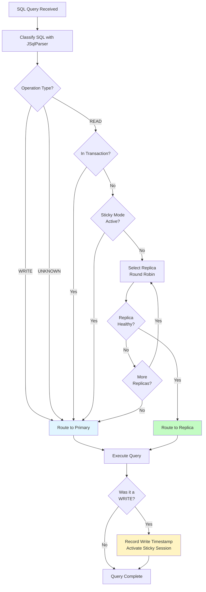

# Chapter 12b: Read/Write Traffic Splitting

Reading from replicas, writing to primary—all transparent to your application. This chapter explores OJP's intelligent read/write traffic splitting feature that automatically distributes database queries between primary and replica instances based on SQL operation types, enabling massive scalability improvements for read-heavy workloads while maintaining data consistency.

## The Replication Dilemma

Imagine running an e-commerce platform during Black Friday. Your database handles thousands of queries per second—product searches, inventory checks, user profile lookups, order history views. But here's the challenge: while 85% of these queries are reads (SELECT statements), your single primary database processes every single one of them, becoming a bottleneck even though it's only the write operations that truly need its full power.

You've set up database replication—your primary replicates to three read replicas with sub-second lag. The infrastructure is ready. But there's a problem: your application still sends everything to the primary because JDBC connection pooling doesn't understand the difference between reads and writes. The replicas sit idle, expensive hardware going to waste, while your primary database struggles under unnecessary read load.

This is where OJP's read/write traffic splitting changes the game.

## Transparent Intelligence

Picture this: you configure OJP with your primary database and three replicas. That's it—no application code changes, no complex routing logic in your codebase, no framework-specific interceptors. Your Java application continues using standard JDBC as it always has:

```java
Connection conn = DriverManager.getConnection(
    "jdbc:ojp://localhost:50051/mydb");

// This SELECT routes to a replica automatically
ResultSet products = conn.createStatement().executeQuery(
    "SELECT * FROM products WHERE category = 'electronics'");

// This INSERT routes to primary automatically  
conn.createStatement().executeUpdate(
    "INSERT INTO orders (user_id, total) VALUES (123, 299.99)");

// And you never had to think about routing
```

Behind the scenes, OJP is doing something remarkable. It's parsing every SQL statement using JSqlParser—the same production-grade parser used by major database tools—classifying queries as READ, WRITE, or UNKNOWN in under half a millisecond. READ queries flow to healthy replicas in round-robin fashion. WRITE queries go straight to primary. UNKNOWN statements (like stored procedure calls) default to primary for safety.

But it gets smarter. OJP knows when you're in a transaction. Even if you execute a SELECT, if it's within a transaction boundary (between BEGIN and COMMIT), it routes to primary. Why? Because transactions require consistency—all queries must see the same snapshot of data, and mixing datasources mid-transaction would violate ACID properties.

## The Sticky Session Pattern

Here's a subtle but critical scenario that OJP handles automatically: the read-after-write problem. You execute an UPDATE statement that modifies a user's profile, then immediately SELECT that same profile. In a naive read/write split system, the UPDATE goes to primary, but the SELECT might route to a replica that hasn't yet received the replication data—you'd read stale data, and your application would appear broken.

OJP solves this with sticky sessions. After any WRITE operation, OJP marks that session's timestamp and enters "sticky mode"—for the next 5 seconds (configurable), all READ queries route to primary instead of replicas. This prevents reading stale data during the brief replication lag window. Once the sticky period expires, reads resume routing to replicas.

Think of it as a temporary "write awareness" that automatically protects you from replication lag without requiring complex application logic:

```java
// Update user profile (routes to primary)
conn.createStatement().executeUpdate(
    "UPDATE users SET email = 'newemail@example.com' WHERE id = 123");

// Immediate read of same data (routes to primary via sticky session)
// This is within 5 seconds of the write, so OJP keeps us on primary
ResultSet user = conn.createStatement().executeQuery(
    "SELECT email FROM users WHERE id = 123");

// ... 6 seconds later ...
// This SELECT now routes to replica (sticky period expired)
ResultSet allUsers = conn.createStatement().executeQuery(
    "SELECT * FROM users WHERE active = true");
```

The sticky duration is configurable because you know your replication lag better than OJP does. If your PostgreSQL streaming replication typically lags 2 seconds, set `stickySessionSeconds=3` for a safety margin. If you're running MySQL with slower replication across datacenters, maybe `stickySessionSeconds=10` is more appropriate.

## Failover Without Panic

Production databases fail. Replicas go down for maintenance, network partitions occur, disks fill up. OJP's read/write splitting handles these scenarios with calm intelligence rather than catastrophic failures.

When OJP selects a replica for a READ query, it first validates the connection using JDBC's `isValid()` method—a 5-second health check. If that replica is unresponsive, OJP doesn't fail the query. Instead, it tries the next replica in rotation. And if that one fails? It tries the next. Only after exhausting all available replicas does OJP fall back to the primary database.

This means your application experiences zero errors during replica failures—queries simply shift to remaining healthy datasources automatically:

```
Timeline of replica failure:

T+0s:  Replica1 fails (network issue)
       OJP detects failure via isValid() timeout

T+5s:  Query attempts Replica1
       Health check fails
       OJP tries Replica2 
       Query succeeds on Replica2

T+5s:  All subsequent queries skip Replica1
       Distribute across Replica2 and Replica3
       
T+300s: Replica1 recovers
        OJP detects health on next connection borrow
        Replica1 rejoins rotation
        
Throughout: Zero application errors, zero manual intervention
```

If all replicas fail simultaneously (rare but possible in disaster scenarios), OJP falls back to primary for ALL queries. Your application keeps running—slower perhaps, as the primary handles full read+write load, but running. No downtime, no exceptions, no data loss.

## Configuration: Simpler Than You'd Expect

Setting up read/write splitting requires just a few additions to your existing OJP datasource configuration. Here's a complete example with PostgreSQL:

```properties
# Primary database (write-capable)
prod_primary.connection.name=prod_primary
prod_primary.connection.url=jdbc:postgresql://db-primary.example.com:5432/myapp
prod_primary.connection.user=app_user
prod_primary.connection.password=primary_secret
prod_primary.pool.maxPoolSize=25
prod_primary.pool.minIdle=5

# Enable read/write splitting
prod_primary.ojp.readwrite.enabled=true
prod_primary.ojp.readwrite.role=primary
prod_primary.ojp.readwrite.replicaSelectionStrategy=ROUND_ROBIN
prod_primary.ojp.readwrite.stickySessionSeconds=5
prod_primary.ojp.readwrite.replicaFailoverToPrimary=true

# First replica
prod_replica1.connection.name=prod_replica1
prod_replica1.connection.url=jdbc:postgresql://db-replica1.example.com:5432/myapp
prod_replica1.connection.user=readonly_user
prod_replica1.connection.password=readonly_secret
prod_replica1.pool.maxPoolSize=20
prod_replica1.pool.minIdle=3
prod_replica1.ojp.readwrite.role=replica
prod_replica1.ojp.readwrite.primary=prod_primary

# Second replica  
prod_replica2.connection.name=prod_replica2
prod_replica2.connection.url=jdbc:postgresql://db-replica2.example.com:5432/myapp
prod_replica2.connection.user=readonly_user
prod_replica2.connection.password=readonly_secret
prod_replica2.pool.maxPoolSize=20
prod_replica2.pool.minIdle=3
prod_replica2.ojp.readwrite.role=replica
prod_replica2.ojp.readwrite.primary=prod_primary
```

Notice the `readonly_user` for replicas—this is a critical best practice. Create database users with SELECT-only permissions for replica connections. This prevents accidental writes to replicas (which would fail anyway since replicas are read-only, but explicit permissions provide defense in depth).

For PostgreSQL:
```sql
CREATE USER readonly_user WITH PASSWORD 'readonly_secret';
GRANT CONNECT ON DATABASE myapp TO readonly_user;
GRANT USAGE ON SCHEMA public TO readonly_user;
GRANT SELECT ON ALL TABLES IN SCHEMA public TO readonly_user;
ALTER DEFAULT PRIVILEGES IN SCHEMA public 
    GRANT SELECT ON TABLES TO readonly_user;
```

For MySQL:
```sql
CREATE USER 'readonly_user'@'%' IDENTIFIED BY 'readonly_secret';
GRANT SELECT ON myapp.* TO 'readonly_user'@'%';
FLUSH PRIVILEGES;
```

## Performance Characteristics

SQL classification using JSqlParser adds latency—but remarkably little. In production testing, classification averages under 0.5 milliseconds per query, with p99 latency under 1 millisecond. For perspective, your typical network round-trip to a database is 1-5 milliseconds, and query execution time might be 10-100 milliseconds or more. Classification overhead is essentially noise in the overall query execution time.

The round-robin replica selection adds even less overhead—about 1-2 microseconds thanks to Java's AtomicInteger for thread-safe counter increments. No locks, no contention, just simple arithmetic.

Connection pool health checking uses JDBC's standard `isValid()` method with a 5-second timeout. This check only happens when borrowing connections from the pool, and HikariCP caches health status, so the overhead per query is negligible.

What you gain, however, is substantial. In a read-heavy workload (typical for most applications—think 80% reads, 20% writes), distributing those reads across three replicas can triple your effective read capacity. Your primary database suddenly only needs to handle write traffic plus the occasional sticky-session reads and failover scenarios.

## The Hidden Complexity

What makes this feature remarkable isn't what you see—it's what you don't have to think about. Behind that simple configuration and transparent routing lies sophisticated engineering:

**SQL Classification Edge Cases**: JSqlParser handles dozens of SQL dialects, but OJP adds a critical regex fallback for `SELECT FOR UPDATE` statements. Why? Because JSqlParser v4.9 has a broken API that fails to detect the FOR UPDATE clause, which would be catastrophic—routing a locking SELECT to a replica means the row lock never gets acquired on the primary, enabling concurrent writes that corrupt data. OJP catches this with a simple regex pattern and correctly routes it to primary.

**Transaction Boundary Detection**: JDBC transactions can start explicitly (BEGIN TRANSACTION) or implicitly (setAutoCommit(false) followed by the first SQL statement). OJP tracks both patterns, managing transaction state in session metadata to ensure consistent routing throughout the transaction lifecycle.

**Timestamp Precision**: Sticky sessions rely on precise timestamp tracking. OJP uses System.currentTimeMillis() for write operation recording and checks elapsed time on every subsequent query. The implementation is thread-safe using volatile fields, ensuring visibility across threads without locks.

**Connection Pool Integration**: Each datasource (primary plus each replica) maintains its own HikariCP connection pool with independent configuration. OJP coordinates these pools seamlessly, borrowing connections from the appropriate pool based on routing decisions while HikariCP handles all the low-level connection lifecycle management.

## Real-World Impact

Consider a SaaS analytics platform with 1 million users. Each user logs in daily to view dashboards—hundreds of SELECT queries rendering charts and metrics. Updates occur only when users modify settings or generate new reports—maybe 5% of total database operations.

Before read/write splitting, their primary PostgreSQL database handled everything, maxing out at 1,000 queries per second before latency became unacceptable. They scaled vertically—buying bigger hardware—until the costs became unsustainable.

After implementing OJP's read/write splitting with three replicas:
- Read queries (95% of traffic) distributed across replicas: ~950 queries/sec split three ways
- Each replica handled ~317 queries/sec—well within capacity
- Primary database handled only writes: ~50 queries/sec—barely breaking a sweat
- Total system capacity: effectively tripled without touching application code
- Cost: added three replica instances (commodity hardware) instead of one massive primary

The math is beautiful: instead of scaling vertically (expensive and limited), they scaled horizontally (cheap and unlimited). Add another replica, gain another increment of read capacity. Replication lag stayed under 1 second, sticky sessions prevented stale reads, and the application never knew the difference.

## Observability and Debugging

When you enable read/write splitting, understanding what's happening becomes crucial. OJP provides detailed logging at DEBUG level:

```properties
# In your log configuration
logger.readwrite.name=org.openjproxy.grpc.server.readwrite
logger.readwrite.level=DEBUG
```

This produces logs like:
```
[SqlClassifier] Classifying SQL: SELECT * FROM products WHERE category = ?
[SqlClassifier] Classification result: READ
[ReadWriteRouter] Session not in transaction
[ReadWriteRouter] Sticky mode inactive (last write: 7 seconds ago)
[ReadWriteRouter] Routing READ query to replica: prod_replica2
[ReplicaSelector] Round-robin selection: attempt 1, replica index: 1

[SqlClassifier] Classifying SQL: UPDATE users SET last_login = NOW() WHERE id = ?
[SqlClassifier] Classification result: WRITE
[ReadWriteRouter] Routing WRITE query to primary: prod_primary
[Session] Recording write operation at timestamp: 1731846320154

[SqlClassifier] Classifying SQL: SELECT email FROM users WHERE id = ?
[SqlClassifier] Classification result: READ
[ReadWriteRouter] Sticky mode ACTIVE (last write: 0.5 seconds ago, threshold: 5 seconds)
[ReadWriteRouter] Routing READ query to primary due to sticky session: prod_primary
```

This verbose logging helps you understand routing decisions, diagnose unexpected behavior, and verify configuration is working as intended. In production, you'd typically run at INFO level (logging only warnings and errors), but DEBUG mode is invaluable during setup and troubleshooting.

## Future Enhancements

The current implementation provides a robust foundation—SQL classification, round-robin distribution, health-aware failover, transaction awareness, and sticky sessions. But several enhancements are planned:

**Additional Selection Strategies**: Beyond round-robin, support for:
- Random selection (useful for very large replica pools)
- Least-connections (route to replica with fewest active connections)
- Weighted distribution (70% to powerful replicas, 30% to smaller ones)
- Geography-aware (route to replicas in same datacenter/region)

**SQL Routing Hints**: Allow applications to override automatic routing via SQL comments:
```sql
-- Force primary even for SELECT
SELECT /* ojp:route=primary */ * FROM users WHERE id = 123;

-- Force specific replica
SELECT /* ojp:route=replica2 */ * FROM analytics_data;
```

**Prometheus Metrics**: Export routing distribution metrics:
```
ojp_read_write_queries_total{datasource="prod_primary",type="read"} 127000
ojp_read_write_queries_total{datasource="prod_replica1",type="read"} 256000
ojp_read_write_queries_total{datasource="prod_replica2",type="read"} 251000
ojp_read_write_failover_events_total{from="prod_replica1",to="prod_primary"} 3
```

**OpenTelemetry Spans**: Distributed tracing for routing decisions:
```
Trace: user_dashboard_load
  Span: ojp.query.classify (0.3ms)
  Span: ojp.route.select_replica (0.002ms)  
  Span: database.query.execute (45ms)
```

**Replication Lag Monitoring**: Automatically adjust sticky session duration based on measured replication lag, queried directly from database replication status tables.

**Connection Management Refactoring**: Currently, routing infrastructure is complete but actual per-query routing requires future connection management enhancements to support borrowing different connections mid-session.

## Limitations and Gotchas

Read/write splitting is powerful but not a silver bullet. Be aware of these limitations:

**Replication Lag**: If your replication lag exceeds the sticky session duration, you might read stale data after writes. Monitor replication lag and set conservative sticky session values.

**Schema Changes**: DDL statements (CREATE TABLE, ALTER TABLE, etc.) route to primary but schema changes don't automatically propagate through OJP. Your replication setup must handle schema replication independently.

**Application Assumptions**: Some applications assume single-datasource behavior—like obtaining the last inserted ID via `SELECT LASTVAL()` in PostgreSQL. These patterns might break if the INSERT went to primary but the SELECT routes to a replica.

**Transaction Complexity**: Distributed transactions (XA) always route entirely to primary. The complexity of coordinating XA across multiple datasources is beyond the scope of read/write splitting.

**Hot Standby vs Read Replica**: Not all database replicas support queries. PostgreSQL hot standby can serve queries, but warm standby cannot. MySQL replication allows queries on slaves. Verify your replication setup actually supports reads.

**Failover Management**: If primary database fails over to become a replica (and vice versa), you must update OJP configuration and restart. Automatic topology detection is not currently supported.

## When to Use Read/Write Splitting

**Perfect fit:**
- Read-heavy workloads (75%+ SELECT queries)
- Existing database replication infrastructure
- Need to scale read capacity without expensive primary upgrades
- Applications tolerant of eventual consistency (with sticky sessions)

**Poor fit:**
- Write-heavy workloads (primary becomes bottleneck anyway)
- No database replication (requires replication setup first)
- Applications requiring strict read-after-write consistency (use transactions instead)
- Very low-latency requirements where milliseconds matter (classification adds minimal but nonzero overhead)

## Operational Considerations

Running read/write splitting in production requires thoughtful operational practices:

**Monitoring**: Track replica health, replication lag, failover events, and routing distribution. Set up alerts when replicas fall behind or go unhealthy.

**Capacity Planning**: Ensure your primary can handle full read+write load during replica failures. Size replica pools to handle expected read traffic distributed evenly.

**Testing**: Regularly test failover scenarios by stopping replicas and verifying traffic routes correctly. Test replication lag scenarios with delayed replicas.

**Documentation**: Document your replica topology, sticky session configuration, and failover procedures for your operations team.

**Gradual Rollout**: Deploy read/write splitting to non-critical environments first (staging, dev). Monitor for a week before production deployment. Enable on production gradually—maybe 10% of connections initially, increasing as confidence builds.

## The Big Picture

Read/write traffic splitting represents a fundamental shift in how we think about database scaling. Instead of vertical scaling (bigger, more expensive hardware), we leverage horizontal scaling (more commodity instances) through intelligent routing. Instead of complex application-level routing logic scattered across codebases, we centralize it in infrastructure where it belongs.

OJP makes this pattern accessible. No framework-specific interceptors. No application rewrites. No brittle configuration spread across dozens of service files. Just a handful of datasource properties and your application automatically benefits from replica distribution, sticky sessions, and graceful failover.

For the SaaS platform handling millions of dashboard views, this meant tripling capacity without touching code. For the e-commerce site during Black Friday, it meant serving product searches from six replicas instead of hammering one primary. For the fintech app with strict audit requirements, it meant routing critical transaction queries to primary while letting report queries flow to replicas.

The underlying implementation—JSqlParser classification, round-robin selection, health checking, sticky sessions, failover logic—is sophisticated. But the user experience is simple: configure datasources, enable the feature, and watch your read capacity multiply.

This is infrastructure automation at its finest: taking a complex distributed systems problem (how do we efficiently distribute queries across multiple databases while maintaining consistency and availability?) and reducing it to a configuration checkbox. OJP handles the complexity so you can focus on building features instead of routing logic.

In the next chapter, we'll explore another advanced feature: distributed tracing and telemetry that helps you understand not just where queries route, but how they perform across your entire infrastructure stack.

---

**Chapter Summary**

Read/write traffic splitting in OJP provides:
- Automatic SQL classification (READ/WRITE/UNKNOWN) using JSqlParser
- Transparent routing with zero application code changes
- Transaction awareness (all in-transaction queries route to primary)
- Sticky sessions preventing stale reads after writes
- Health-aware failover across multiple replicas
- Round-robin load distribution
- Graceful degradation to primary when replicas fail

**Key Configuration**: Enable per datasource, configure primary and replicas, set sticky session duration, and let OJP handle the rest.

**Performance**: <0.5ms classification overhead, negligible routing overhead, massive capacity gains for read-heavy workloads.

**Best Practice**: Use read-only database users for replicas, monitor replication lag, size sticky sessions appropriately, test failover scenarios regularly.

---

**AI Image Prompt for Chapter Illustration:**

"Technical architectural diagram showing read/write traffic splitting in database infrastructure: center shows an application server with JDBC connections, arrows branching left to a robust primary database (glowing blue, labeled 'WRITE' with icons for INSERT/UPDATE/DELETE) and arrows branching right to three replica databases (softer green glow, labeled 'READ' with SELECT icons). Between application and databases, show a semitransparent routing layer with traffic flow percentages (20% to primary, 80% distributed to replicas). Include small timestamp indicator showing 'sticky session active' flowing from primary. Background: subtle network topology with health check pulses. Style: clean technical infographic with modern color palette, professional lighting, emphasis on intelligent traffic flow distribution."

**Mermaid Diagram: Routing Decision Flow**


