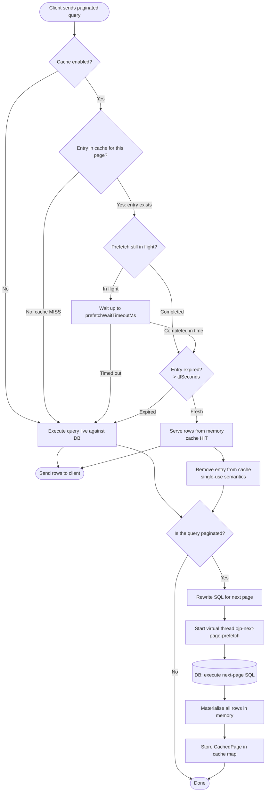
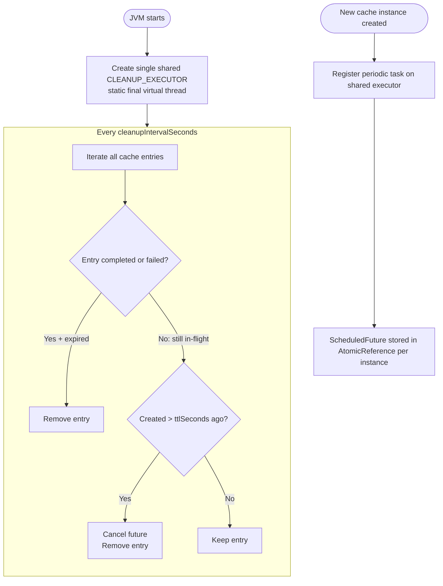

# Next-Page Prefetch Cache

The **Next-Page Prefetch Cache** transparently pre-executes the next page query in the background while the current page is being streamed to the client. When the client requests the next page, OJP serves it from memory instead of making a round-trip to the database, eliminating the latency of sequential pagination.

## How It Works

### Request Flow



### Background Cleanup



Only **one** cleanup thread exists per JVM (`ojp-prefetch-cache-cleanup`), shared across all cache instances. It runs as a virtual thread.

## Pagination Pattern Detection

OJP automatically detects the following SQL pagination patterns:

| Pattern | Example |
|---|---|
| `LIMIT n OFFSET m` | `SELECT * FROM t LIMIT 100 OFFSET 200` |
| `OFFSET m ROWS FETCH NEXT n ROWS ONLY` | SQL Server, Oracle |
| `OFFSET m ROWS FETCH FIRST n ROWS ONLY` | DB2, Oracle |
| `FETCH FIRST n ROWS ONLY` (no offset) | First page |
| `FETCH NEXT n ROWS ONLY` (no offset) | First page |
| `LIMIT m, n` | MySQL shorthand |
| `LIMIT n` (no offset) | First page |

## Cache Isolation

Each cache entry is keyed by **datasource identifier + normalised SQL**. Two datasources running the same query never share cached data, preventing data leakage between tenants or connections.

## Configuration Reference

### Server-Side Settings (`ojp-server.properties` / JVM system properties)

| Property | Default | Description |
|---|---|---|
| `ojp.server.nextPageCache.enabled` | `false` | Enable the feature globally (opt-in) |
| `ojp.server.nextPageCache.ttlSeconds` | `60` | Maximum age of a cached page before eviction |
| `ojp.server.nextPageCache.maxEntries` | `100` | Maximum cache entries across all datasources |
| `ojp.server.nextPageCache.prefetchWaitTimeoutMs` | `5000` | Maximum wait (ms) for an in-flight prefetch before falling back to a live query |
| `ojp.server.nextPageCache.cleanupIntervalSeconds` | `60` | Interval (seconds) between background eviction scans |
| `ojp.server.nextPageCache.datasource.<name>.prefetchWaitTimeoutMs` | *(global)* | Per-datasource override for `prefetchWaitTimeoutMs`; `<name>` matches `ojp.datasource.name` sent by the client |

### Client-Side Settings (`ojp.properties` in the client application)

| Property | Default | Description |
|---|---|---|
| `ojp.nextPageCache.enabled` | *(server global)* | Per-datasource opt-in/out; when `false` the cache is disabled for this datasource even if the server has it globally enabled |

The `enabled` flag is set in the client's `ojp.properties` file and is sent to the server at
connection time. When absent, the server's global `ojp.server.nextPageCache.enabled` value applies.

### Per-Datasource Configuration

Each datasource in the client application can independently opt in or out of the prefetch cache:

```properties
# ojp.properties — client application

# Default datasource: explicitly enable the cache
ojp.nextPageCache.enabled=true

# "olap" datasource: disable the prefetch cache for random-access workloads
olap.ojp.nextPageCache.enabled=false
```

The server-side `prefetchWaitTimeoutMs` can also be overridden per datasource (server configuration):

```properties
# ojp-server.properties or JVM system properties
ojp.server.nextPageCache.datasource.analytics.prefetchWaitTimeoutMs=10000
ojp.server.nextPageCache.datasource.oltp.prefetchWaitTimeoutMs=1000
```

## Quick Start

**Enable with defaults:**
```bash
java -Duser.timezone=UTC \
     -Dojp.server.nextPageCache.enabled=true \
     -jar ojp-server.jar
```

**Tuned for a reporting workload:**
```bash
java -Duser.timezone=UTC \
     -Dojp.server.nextPageCache.enabled=true \
     -Dojp.server.nextPageCache.ttlSeconds=120 \
     -Dojp.server.nextPageCache.maxEntries=200 \
     -Dojp.server.nextPageCache.prefetchWaitTimeoutMs=8000 \
     -jar ojp-server.jar
```

**Via environment variables:**
```bash
export OJP_SERVER_NEXTPAGECACHE_ENABLED=true
export OJP_SERVER_NEXTPAGECACHE_TTLSECONDS=60
export OJP_SERVER_NEXTPAGECACHE_PREFETCHWAITTIMEOUTMS=5000
export OJP_SERVER_NEXTPAGECACHE_CLEANUPINTERVALSECONDS=60
java -Duser.timezone=UTC -jar ojp-server.jar
```

## Interaction with gRPC Row Streaming

OJP already streams query results to the client in blocks of 100 rows per gRPC message (the intrinsic transport-layer pagination). The prefetch cache operates at a higher level and is completely independent:

| Layer | What it does |
|---|---|
| **gRPC row streaming** | Slices any single query result into 100-row gRPC messages for efficient transport |
| **Prefetch cache (this feature)** | Pre-executes the *next SQL page query* in the background; the returned rows are then delivered via the same 100-row gRPC streaming |

The two mechanisms complement each other — the cache eliminates database round-trips, while the gRPC streaming ensures large results are transferred efficiently.

## When to Use It

**Best fit:**
- Applications that page through results sequentially (page 1 → 2 → 3 …).
- Database round-trip latency is noticeable (> 50 ms per page).
- Page sizes are consistent across subsequent requests for the same query.

**Minimal benefit:**
- Queries that jump to arbitrary offsets (random access pagination).
- All rows fit on a single page.
- The database responds faster than the client can consume pages.
