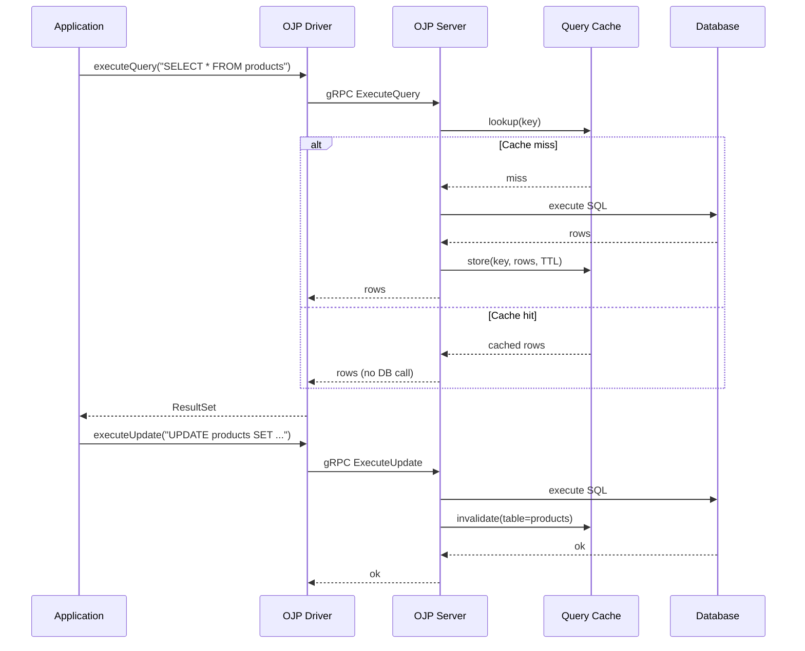
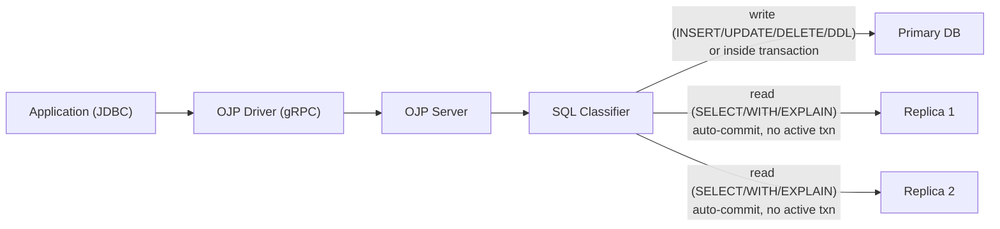

# Open J Proxy 0.5.0-beta — The Caching and Read/Write Splitting Release

When we shipped 0.4.0-beta, the core value of Open J Proxy was already clear: a database control plane for Java applications that lets you scale dozens of application instances without overwhelming your database, because the server — not the application — owns and controls the real connection pools. What 0.5.0-beta adds on top of that foundation is two features that take the pressure off the database even further. The first is query result caching: the ability to answer repeated SELECT queries directly from memory without touching the database at all. The second is read/write splitting: the ability to automatically route reads to replica databases and leave the primary free for writes. Together, they advance OJP's role as a full database control plane — governing not just connections but query results, routing decisions, and admission under load.

This article walks through both of those features in depth, and then covers the rest of what changed since 0.4.0-beta.

---

## Query Result Caching

The idea is simple: if your application asks for the same rows over and over, why go to the database every time? Open J Proxy 0.5.0-beta introduces a server-side query result cache that intercepts SELECT results before they are sent back to the driver, stores them in memory using [Caffeine](https://github.com/ben-manes/caffeine), and serves subsequent identical queries from the cache without touching the pool at all.

The cache lives inside the Open J Proxy server. This is a deliberate choice. Because the server is the single choke point for all SQL traffic from every application instance, it can see every write and immediately invalidate any affected cache entries. An application-level cache cannot do this — it only knows about writes that it made itself, which means stale reads from other application instances are a constant problem. The OJP cache does not have that limitation.



Cache configuration is expressed as a set of rules in `ojp.properties`, the same file you already use to configure connection pools. Each rule specifies a regex pattern to match SQL queries, a TTL, and an optional list of table names whose modification should trigger invalidation of matching entries:

```properties
mydb.ojp.cache.enabled=true

# Cache all product lookups for 10 minutes; invalidate when the products table changes
mydb.ojp.cache.queries.1.pattern=SELECT .* FROM products.*
mydb.ojp.cache.queries.1.ttl=600s
mydb.ojp.cache.queries.1.invalidateOn=products

# Cache the user profile query for 5 minutes; invalidate on user writes
mydb.ojp.cache.queries.2.pattern=SELECT .* FROM users WHERE id = \?
mydb.ojp.cache.queries.2.ttl=300s
mydb.ojp.cache.queries.2.invalidateOn=users
```

The invalidation mechanism is worth explaining. Open J Proxy already sees every SQL statement that passes through it. When the server executes an INSERT, UPDATE, DELETE, or DDL statement, the cache inspects which tables are involved — using the embedded JSqlParser library — and evicts all entries whose `invalidateOn` list includes any of those tables. No polling, no events, no external broker. The write visibility is immediate.

The underlying Caffeine cache is bounded. You can configure a maximum number of entries, a maximum total size in bytes, and a default TTL. Large result sets that would push the cache over its size budget are silently rejected (they still flow to the application, they just are not stored). This prevents runaway memory usage from one unexpectedly large query polluting the cache for everything else.

Cache metrics are fully integrated with OpenTelemetry. The following instruments are published per datasource: `ojp.cache.hits`, `ojp.cache.misses`, `ojp.cache.hit_rate`, `ojp.cache.evictions`, `ojp.cache.invalidations`, `ojp.cache.rejections`, `ojp.cache.size.entries`, and `ojp.cache.size.bytes`. Query execution time is split by source (`cache` vs `database`), so you can directly see the latency savings in Grafana without any extra instrumentation on your side.

---

## Read/Write Splitting

Even with caching, some queries cannot be cached — either because they are too specific, or because freshness requirements are strict. For those cases, 0.5.0-beta introduces read/write splitting: a mechanism that routes read traffic to one or more replica databases while sending all writes to the primary.

The architecture fits naturally with how Open J Proxy already works. The server already manages multiple datasource pools (you can have dozens of them in one `ojp.properties` file). Read/write splitting extends that: you declare one pool as a primary and associate one or more pools as its replicas. The server then inspects every SQL statement and decides which pool to use.



The SQL classifier recognises SELECT, WITH (CTEs), EXPLAIN, SHOW, DESCRIBE, and DESC as reads. Everything else — including all DDL — is treated as a write and always goes to the primary. Crucially, any statement executed inside an explicit transaction also always goes to the primary, regardless of its type. This guarantees that transactional read-your-writes works without any configuration.

Replica selection supports two strategies out of the box: round-robin and random. A third strategy, `LEAST_CONNECTIONS`, is accepted in configuration but currently falls back to round-robin; metrics-based selection is planned for a future release.

When replicas become unavailable, the server falls back to the primary by default. This behaviour is configurable per primary datasource.

One feature that deserves careful mention is sticky sessions. If your application writes a row and then immediately queries for it outside of a transaction — a pattern common in some background jobs — the write might not yet have replicated to the replica by the time the read arrives. Sticky sessions solve this by keeping reads on the primary for a configurable window after every write. However, this is opt-in and defaults to zero (disabled) because it reduces the effectiveness of read distribution and is simply unnecessary when the application correctly wraps related reads and writes in a transaction. Do not enable it unless you have a specific reason.

Configuration lives entirely on the client side in `ojp.properties`:

```properties
# Primary: read/write splitting enabled, round-robin replicas, no sticky session
mydb.ojp.readwrite.role=primary
mydb.ojp.readwrite.enabled=true
mydb.ojp.readwrite.replicaSelectionStrategy=ROUND_ROBIN

# Replica 1
replica1.ojp.readwrite.role=replica
replica1.ojp.readwrite.primary=mydb
replica1.ojp.connection.url=jdbc:postgresql://replica1-host:5432/mydb
replica1.ojp.connection.user=app_ro
replica1.ojp.connection.pass=<your-replica-pass>
replica1.ojp.pool.maxPoolSize=15

# Replica 2
replica2.ojp.readwrite.role=replica
replica2.ojp.readwrite.primary=mydb
replica2.ojp.connection.url=jdbc:postgresql://replica2-host:5432/mydb
replica2.ojp.connection.user=app_ro
replica2.ojp.connection.pass=<your-replica-pass>
replica2.ojp.pool.maxPoolSize=15
```

No server restart is required to enable read/write splitting for the first time. The server creates the replica pools on the first connection from a client that includes the configuration. Note that if you later change an existing replica configuration — updating URLs, pool sizes, or adding replicas — a server restart is required, because the server caches the first-connection setup per datasource.

---

## Client-Side Throttling, Hardened

0.4.x introduced the concept of client-side throttling — the JDBC driver limiting its own concurrent in-flight requests to a fair share of the server's pool capacity, preventing thundering-herd overloads. In 0.5.0-beta that mechanism has been significantly hardened.

The default throttle mode is now REACTIVE. In this mode the driver starts with a generous limit, and when the server responds with `RESOURCE_EXHAUSTED` it halves the limit using AIMD (the same additive-increase / multiplicative-decrease algorithm that TCP uses for congestion control). The limit recovers gradually, one step at a time, as successful operations accumulate. A cooldown period and a hard floor prevent the limit from thrashing during brief overload spikes or from being driven down to zero.

To give the driver better information about how to compute its fair share, the server now stamps `totalSlots` (the actual pool size), `clientCount` (the number of distinct JVM processes connected to this datasource on this node), and `observedPeak` (an adaptive effective-capacity estimate) onto every gRPC response — not just the initial connection handshake. This means the driver continuously updates its limit as cluster membership changes, without any extra round trips.

A subtle bug was also fixed in this area: the `ResultSet` streaming path now correctly propagates `RESOURCE_EXHAUSTED` through the client throttle manager. Previously, overload signals received during row streaming were silently dropped, which meant the throttle could not adapt to server pressure that manifested at result-fetch time rather than at query-submit time.

---

## Slow Query Segregation Gets a Better Default

The slow query segregation (SQS) feature, which keeps slow queries in their own connection lane so they cannot starve fast queries, has a new default classification mode in 0.5.0-beta: `RELATIVE_FAST_BASELINE`.

The previous default, `RELATIVE_AVERAGE`, computed the slow threshold against the average execution time of all queries. This had an unpleasant property: when a burst of slow queries arrived, the average would rise, which would reclassify some of those queries as fast, which would lower the average again, causing the classification to flicker. The result was instability rather than clear segregation.

`RELATIVE_FAST_BASELINE` fixes this by computing the threshold only from queries that are currently classified as fast, and adding a configurable hysteresis band: a query must comfortably exceed the fast baseline to be promoted to the slow lane, and it must comfortably fall back below it to be demoted. This prevents mode-flapping during workload transitions. A companion mode, `ABSOLUTE_THRESHOLD`, was also added for teams that prefer a fixed millisecond cutoff over a relative one.

---

## StatementServiceImpl Refactored into Action Classes

This one is primarily an internal improvement, but it matters if you contribute to OJP or want to understand how the server handles SQL. The old `StatementServiceImpl` had grown to over 2,500 lines across 21 methods covering connection management, SQL execution, transaction handling, XA, and LOB streaming. It was effectively a God class: hard to test in isolation, prone to merge conflicts when multiple contributors worked on it simultaneously, and difficult to review because any change required navigating unrelated logic.

In 0.5.0-beta, `StatementServiceImpl` becomes a thin delegator. Every gRPC method is now handled by its own stateless, singleton Action class that receives all shared infrastructure through an `ActionContext` object. Stateless singletons are inherently thread-safe and carry zero per-request allocation overhead. The tradeoff is more source files (30+), but each file is between 75 and 150 lines and has a single, clear purpose.

---

## Docker Image Pipeline

Open J Proxy 0.5.0-beta ships with a redesigned Docker build pipeline. The previous approach used the JIB Gradle plugin to assemble images; the new approach uses a standard `Dockerfile` and shell scripts, which gives full control over the image layering and makes the build process easier to understand and customise. The new build uses `jlink` to produce a minimal custom JRE containing only the JVM modules the server actually needs, which reduced the Docker image size by approximately 40% and shrinks the attack surface by excluding unused runtime components.

The Open J Proxy server image runs as a non-root `ojp` system user for better container security. The UTC timezone is baked in at build time (`-Duser.timezone=UTC`). As before, JDBC drivers are not bundled — place whichever JDBC drivers your application already uses into the `ojp-libs` directory and mount it into the container at runtime. The `download-drivers.sh` script is a convenience that downloads all free and open-source drivers in one step, but you can populate `ojp-libs` however you prefer. CI integration tests now build and exercise a fresh Docker image rather than running the executable JAR directly, which means the image itself is covered by the test suite on every push.

---

## Other Bug Fixes and Improvements

Several smaller but meaningful fixes landed in the 0.5.0-beta window. `PreparedStatement.getGeneratedKeys()` now works correctly for auto-increment IDENTITY columns — previously, the conversion of int and String arrays to the PropertyEntry transport type was broken, which caused generated key retrieval to fail silently. A related fix resolved a null pointer exception in `PreparedStatement.getWarnings()` that appeared when using Spring Data JDBC, which calls this method on every statement even when the application does not.

Boolean and TINYINT(1) handling was fixed in the ResultSet getter methods. Several databases (MySQL, MariaDB) represent boolean columns as TINYINT(1), and the driver was not converting these correctly in all paths.

`OjpDataSource` — a proper `javax.sql.DataSource` implementation — was added to the JDBC driver module. This makes Open J Proxy easier to use with frameworks that discover DataSources through the standard interface rather than through raw `DriverManager` registration.

Virtual threads are now disabled by default in the Open J Proxy server. They were enabled by default in 0.4.x, but interaction with certain JVM-level lock implementations caused subtle reliability issues under high concurrency. They remain available as an opt-in for teams that want to experiment with them on Java 21+.

A session permit optimisation was added to the admission control path: when a session already holds a slow or fast slot, subsequent statements within that session skip the slot acquisition step entirely. This avoids unnecessary semaphore contention on the hot path for sessions that execute multiple statements in a row.

The project moved to Java 25 LTS as the development and server runtime baseline, while the JDBC driver remains compiled for Java 11 to maximise compatibility with application servers and older environments. CI now tests the driver against Java 11, 17, 21, and 25.

---

## Upgrading

If you are running 0.4.x, upgrading the server JAR or Docker image is sufficient. The gRPC protocol is backward compatible and the driver does not need to be updated to take advantage of the server-side improvements. However, to use query result caching or read/write splitting, you will need to add the appropriate `ojp.properties` entries and restart your application (not the server).

The full configuration reference for caching is in [documents/guides/CACHE_USER_GUIDE.md](../guides/CACHE_USER_GUIDE.md). The full configuration reference for read/write splitting is in [documents/configuration/ojp-jdbc-configuration.md](../configuration/ojp-jdbc-configuration.md). Docker deployment instructions are in [documents/configuration/DOCKER_DEPLOYMENT.md](../configuration/DOCKER_DEPLOYMENT.md).

As always, the roadmap lives in [ROADMAP.md](../../ROADMAP.md) and the Discord server ([discord.gg/J5DdHpaUzu](https://discord.gg/J5DdHpaUzu)) is the best place to ask questions, report issues, or share feedback on what you would like to see in 0.6.0-beta.
